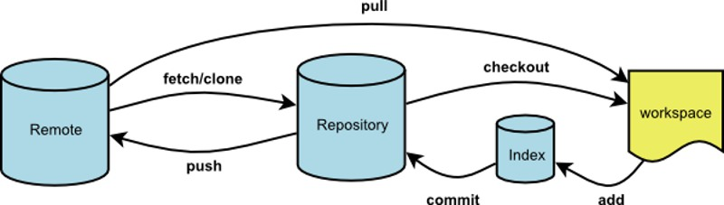
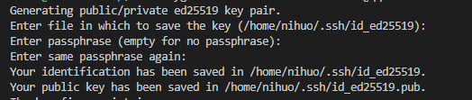
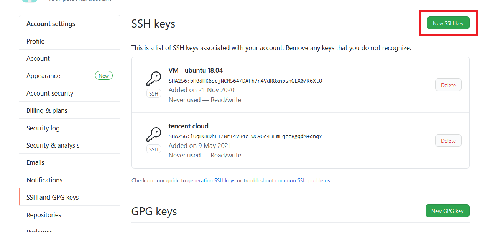
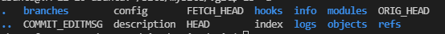

Git教程
<!--more-->

## 简介
Git是一个开源的分布式版本控制系统，可以有效、高速地处理从很小到非常大的项目版本管理。

### 工作流程


作为开发者基本的工作流程是  
1. 修改文件、添加文件等操作
2. 把所有改动的文件添加的暂存区
3. 检查改动
4. 提交暂存区文件到本地Git仓库
5. 推送到远程仓库

## 安装

yum：  
```shell
sudo yum install git
```
apt-get:
```shell
sudo apt-get install git
```

## 配置
Git可以通过git config命令来管理配置。git的配置文件存在在三个位置  
/etc/gitconfig：包含系统上每一个用户及他们仓库的通用配置。如果使用带有`--system`选项的 git config时，它会从此文件读写配置变量。  
~/.gitconfig;~/.config/git/：只针对当前用户。可以传递`--global`来读写该文件  
./.git/config：针对该仓库

### 用户信息
```shell
git config --global user.name "username"
git config --global user.email "xxx@xxx"
```
用户信息在提交更改时要用到。

### 查看配置
```shell
git config --get key
```

### 设置文本编辑器
```shell
git config --global core.editor vim
```

### 获取帮助
```shell
git config --help
git help config
```

### 设置代理
取消代理 
```shell
git config --gloabl --unset http.proxy
git config --gloabl --unset https.proxy
```
使用代理以7890端口为例
```shell
git config --global http.https://github.com.proxy http://127.0.0.1:7890
git config --global https.https://github.com.proxy https://127.0.0.1:7890
```

socket协议
```shell
git config --global http.proxy 'socks5://127.0.0.1:1080'
git config --global https.proxy 'socks5://127.0.0.1:1080'
git config --global http.https://github.com.proxy socks5://127.0.0.1:1080
#取消代理
git config --global --unset http.https://github.com.proxy
```

## 快速开始
这里远程仓库以github为例子  
1. 先在本地生成个密钥
   ```shell
   ssh-keygen -t ed25519 -C "xxx@xxx"
   ```
   完成后如下图所示：  
     
   记住公钥位置等等要用
2. 设置ssh认证代理
   ```shell
   eval $(ssh-agent -s)
   ```
3. 将第一步生成的密钥添加到ssh代理中
   ```shell
   ssh-add ~/.ssh/id_ed25519
   ```
4. 将公钥复制到github的设置中
   
5. 用下面的命令测试下是否能认证成功
   ```shell
   ssh -T git@github.com
   ```
6. 把远程的仓库克隆到本地
   ```shell
   git clone https://github.com/nihuo9/hello-world
   ```
7. 新添加一个文件
   ```shell
   touch HelloWorld.go
   ```
8. 把文件保存到暂存区
   ```shell
   git add HelloWorld.go
   ```
9. 提交暂存区中的文件
   ```shell
   git commit -m "test"
   ```
10. 推送到远程的main分支
    ```shell
    git push origin main
    ```


## git init
创建一个空的Git仓库或重新初始化一个现有仓库
```shell
git init [-q | --quiet] [--bare] [--template=<template_directory>]
      [--separate-git-dir <git dir>]
      [--shared[=<permissions>]] [directory]
```
该命令创建一个空的Git仓库，一个名为.git的目录，目录结构如下：  
  
现有存储库中运行git init命令是安全的。它不会覆盖已经存在的东西。重新运行git init的主要原因是拾取新添加的模板(或者如果给出了--separate-git-dir，则将存储库移动到另一个地方)。

## git add
将文件添加到暂存区
```shell
git add [--verbose | -v] [--dry-run | -n] [--force | -f] [--interactive | -i] [--patch | -p]
      [--edit | -e] [--[no-]all | --[no-]ignore-removal | [--update | -u]]
      [--intent-to-add | -N] [--refresh] [--ignore-errors] [--ignore-missing]
      [--chmod=(+|-)x] [--] [<pathspec>…​]
```
此命令将要提交的文件的信息添加到索引库中(将修改添加到暂存区)，以准备为下一次提交分段的内容。它通常将现有路径的当前内容作为一个整体添加，但是通过一些选项，它也可以用于添加内容，只对所应用的工作树文件进行一些更改，或删除工作树中不存在的路径了。  
“索引”保存工作树内容的快照，并且将该快照作为下一个提交的内容。因此，在对工作树进行任何更改之后，并且在运行[git commit](#git-commit)命令之前，必须使用git add命令将任何新的或修改的文件添加到索引。  
该命令可以在提交之前多次执行。它只在运行`git add`命令时添加指定文件的内容; 如果希望随后的更改包含在下一个提交中，那么必须再次运行`git add`将新的内容添加到索引。  
[git status](#git-status)命令可用于获取哪些文件具有为下一次提交分段的更改的摘要。
默认情况下，`git add`命令不会添加忽略的文件。 如果在命令行上显式指定了任何忽略的文件，`git add`命令都将失败，并显示一个忽略的文件列表。由Git执行的目录递归或文件名遍历所导致的忽略文件将被默认忽略。`git add`命令可以用`-f(force)`选项添加被忽略的文件。  

**常用选项**  
`git add -u <path>`：把`<path>`中所有跟踪文件中被修改或删除的文件信息添加到暂存区。  
`git add -A`：表示把当前目录所有文件添加到暂存区。  
`git add -i <path>`：查看所有修改或者删除但没有提交的文件。

## git clone
将存储库克隆到新目录中。
```shell
git clone [--template=<template_directory>]
      [-l] [-s] [--no-hardlinks] [-q] [-n] [--bare] [--mirror]
      [-o <name>] [-b <name>] [-u <upload-pack>] [--reference <repository>]
      [--dissociate] [--separate-git-dir <git dir>]
      [--depth <depth>] [--[no-]single-branch]
      [--recurse-submodules] [--[no-]shallow-submodules]
      [--jobs <n>] [--] <repository> [<directory>]
```
将存储库克隆到新创建的目录中，为克隆的存储库中的每个分支创建远程跟踪分支(使用`git branch -r`可见)，并从克隆检出的存储库作为当前活动分支的初始分支。  
在克隆之后，没有参数的普通git提取将更新所有远程跟踪分支，并且没有参数的`git pull`将另外将远程主分支合并到当前主分支(如果有的话)。  
此默认配置通过在`refs/remotes/origin`下创建对远程分支头的引用，并通过初始化`remote.origin.url`和`remote.origin.fetch`配置变量来实现。  
执行远程操作的第一步，通常是从远程主机克隆一个版本库，这时就要用到[git clone](#git-clone)命令。

**示例**  
```shell
git clone https://github.com/go-redis/redis
git clone https://github.com/go-redis/redis.git localPath
```

**常用选项**  
`-l`：从本地克隆仓库  
`-s`：从本地克隆仓库是不使用硬链接而是设置.git/objects/info/与源存储库共享对象  
`-n`：不进行检出

## git status
用于查看工作目录和暂存区的状态
```shell
git status [<options>…​] [--] [<pathspec>…​]
```
显示索引文件和当前`HEAD`提交之间的差异，在工作树和索引文件之间有差异的路径以及工作树中没有被Git跟踪的路径。第一个是通过运行[git commit](#git-commit)来提交的; 第二个和第三个是你可以通过在运行[git commit](#git-commit)之前运行[git add](#git-add)来提交的。

**常用选项**  
`-u[<mode>]`：显示未跟踪文件  
mode有以下取值  
* no - 不显示未跟踪文件
* normal - 显示未跟踪的文件和目录
* all - 还显示了未跟踪目录中的单个文件

## git diff
用于显示提交和工作树等之间的更改。此命令比较的是工作目录中当前文件和暂存区域快照之间的差异,也就是修改之后还没有暂存起来的变化内容。
```shell
git diff [options] [<commit>] [--] [<path>…​]
git diff [options] --cached [<commit>] [--] [<path>…​]
git diff [options] <commit> <commit> [--] [<path>…​]
git diff [options] <blob> <blob>
git diff [options] [--no-index] [--] <path> <path>
```
在工作树和索引或树之间显示更改，索引和树之间的更改，两个树之间的更改，两个blob对象之间的更改或两个文件在磁盘上的更改。

**示例**  
```shell
git diff <file> # 比较当前文件和暂存区文件差异 git diff
git diff <id1><id1><id2> # 比较两次提交之间的差异
git diff <branch1> <branch2> # 在两个分支之间比较
git diff --staged # 比较暂存区和版本库差异
git diff --cached # 比较暂存区和版本库差异
git diff --stat # 仅仅比较统计信息
git diff HEAD # 自上次提交以来工作树中的更改
```

## git commit
将暂存的当前内容与描述更改的用户和日志消息一起存储在新的提交中。
```shell
git commit [-a | --interactive | --patch] [-s] [-v] [-u<mode>] [--amend]
       [--dry-run] [(-c | -C | --fixup | --squash) <commit>]
       [-F <file> | -m <msg>] [--reset-author] [--allow-empty]
       [--allow-empty-message] [--no-verify] [-e] [--author=<author>]
       [--date=<date>] [--cleanup=<mode>] [--[no-]status]
       [-i | -o] [-S[<keyid>]] [--] [<file>…​]
```
要添加的内容可以通过以下几种方式指定：

* 在使用`git commit`命令之前，通过使用[git add](#git-add)对索引进行递增的“添加”更改(注意：修改后的文件的状态必须为“added”);  
* 通过使用git rm从工作树和索引中删除文件，再次使用`git commit`命令;  
* 通过将文件作为参数列出到`git commit`命令(不使用`--interactive`或`--patch`选项)，在这种情况下，提交将忽略索引中分段的更改，而是记录列出的文件的当前内容(必须已知到Git的内容) ;  
* 通过使用带有`-a`选项的`git commit`命令来自动从所有已知文件(即所有已经在索引中列出的文件)中添加“更改”，并自动从已从工作树中删除索引中的“rm”文件 ，然后执行实际提交;  
* 通过使用`--interactive`或`--patch`选项与git commit命令一起确定除了索引中的内容之外哪些文件或hunks应该是提交的一部分，然后才能完成操作。

如果提交后，然后立即发现错误，可以使用 [git reset](#git-reset) 命令恢复。

**示例**  
```shell
git add newfile.txt
git commit -m "the commit message"
git commit -a # 会先把所有已经track的文件的改动`git add`进来，然后提交。对于没有track的文件,还是需要执行`git add <file>` 命令。
git commit --amend # 增补提交，会使用与当前提交节点相同的父节点进行一次新的提交，旧的提交将会被取消。
git commit -C <commit> # 获取一个现有的提交对象，并在创建提交时重用日志消息和作者信息(包括时间戳)。
git commit -c <commit> # 同-C不过会打开编辑器，可以进一步编辑
```

## git reset
用于将当前HEAD复位到指定状态。一般用于撤消之前的一些操作(如：`git add`,`git commit`等)。  

与[git revert](#git-revert)不同在于：`git revert`的作用通过反做创建一个新的版本，这个版本的内容与我们要回退到的目标版本一样，但是HEAD指针是指向这个新生成的版本，而不是目标版本。
```shell
git reset [-q] [<tree-ish>] [--] <paths>…​
git reset (--patch | -p) [<tree-ish>] [--] [<paths>…​]
git reset [--soft | --mixed [-N] | --hard | --merge | --keep] [-q] [<commit>]
```

**示例**  
在git的一般使用中，如果发现错误的将不想暂存的文件被git add进入索引之后，想回退取消，则可以使用命令：`git reset HEAD <file>`。

* `--hard <commit>`
  重设(reset) 索引和工作目录，自从`<commit>`以来在工作目录中的任何改变都被丢弃，并把HEAD指向`<commit>`
  ```shell
  git reset --hard HEAD~n
  ```
  ~n表示HEAD的前n次提交，~1回到前一次提交

* 回滚添加操作
  ```shell
  touch    file1.c file2.c 
  git add file1.c file1.c                  
  git reset 
  ```
  也可以单独回滚一个文件  
* 回滚最近一次提交
  ```shell
  git commit -a -m "msg"
  git reset --soft HEAD^
  vim 1.txt
  git commit -a -c ORIG_HEAD
  ```
  ^表示之前最近的一次提交  
* 回滚最近的几次提交，并把这几次提交放到指定分支中
  ```shell
  git branch topic/wip     
  git reset --hard HEAD~3  
  git checkout topic/wip 
  ```
* 回滚merge和pull操作
  ```shell
  git pull             
  git reset --hard     
  git pull . topic/branch 
  git reset --hard ORIG_HEAD 
  ```
  执行`reset`、`pull`、`merge`操作时，git会把执行前的HEAD放入ORIG_HEAD中。

## git revert
恢复一些已经存在的提交
```shell
git revert [--[no-]edit] [-n] [-m parent-number] [-s] [-S[<keyid>]] <commit>...
git revert --continue
git revert --quit
git revert --abort
```
**例子**  
* 恢复HEAD中最近的第四个提交所指定的更改，并使用已恢复的更改创建一个新的提交
  ```shell
  git revert HEAD~3
  ```
* 恢复master分支从最近的第五次提交到第三次提交，但是不创造任何新的提交(`-n`)。只修改工作树和索引
  ```shell
  git revert -n master~5..master~2
  ```

## git rm
用于从工作区和索引中删除文件。
```shell
git rm [-f | --force] [-n] [-r] [--cached] [--ignore-unmatch] [--quiet] [--] <file>…
```
**示例**  
* 将文件从暂存区和工作区删除
  ```shell
  git rm <file>
  ```
  如果删除前修改过暂存区文件的话，必须使用强制删除选项`-f`
* 将文件从暂存区删除
  ```shell
  git rm --cached <file>
  ```
* 递归删除
  ```shell
  git rm -r dir/*
  ```

## git mv
  用于移动或重命名文件，目录或符号链接
  ```shell
  git mv <options>… <args>…
  ```

  git mv file dir
  = mv file dir;git rm file;git add dir

## git branch
用于列出，创建或删除分支。
```shell
git branch [--color[=<when>] | --no-color] [-r | -a]
    [--list] [-v [--abbrev=<length> | --no-abbrev]]
    [--column[=<options>] | --no-column] [--sort=<key>]
    [(--merged | --no-merged) [<commit>]]
    [--contains [<commit]] [--no-contains [<commit>]]
    [--points-at <object>] [--format=<format>] [<pattern>…​]
git branch [--set-upstream | --track | --no-track] [-l] [-f] <branchname> [<start-point>]
git branch (--set-upstream-to=<upstream> | -u <upstream>) [<branchname>]
git branch --unset-upstream [<branchname>]
git branch (-m | -M) [<oldbranch>] <newbranch>
git branch (-d | -D) [-r] <branchname>…
git branch --edit-description [<branchname>]
```
如果给出了`--list`，或者如果没有非选项参数，则列出现有的分支; 当前分支将以星号突出显示。 选项`-r`导致远程跟踪分支被列出，而选项`-a`显示本地和远程分支。 如果给出了一个`<pattern>`，它将被用作一个shell通配符，将输出限制为匹配的分支。 如果给出多个模式，如果匹配任何模式，则显示分支。 请注意，提供`<pattern>`时，必须使用`--list`; 否则命令被解释为分支创建。  

使用`--contains`，仅显示包含命名提交的分支(换句话说，提示提交的分支是指定的提交的后代)，`--no-contains`会反转它。 随着已经有了，只有分支合并到命名提交(即从提交提交可以提前提交的分支)将被列出。 使用`--no`合并只会将未合并到命名提交中的分支列出。 如果缺少`<commit>`参数，则默认为`HEAD`(即当前分支的提示)。

**示例**  
* 查看当前有哪些分支
  ```shell
  git branch
  ```
* 新建一个分支
  ```shell
  git branch new_branch
  ```
* 切换到指定分支
  ```shell
  git checkout new_branch
  ```
* 查看本地和远程分支
  ```shell
  git branch -a
  ```
* 将更改添加到新分支上
  ```shell
  git add newfile.txt
  git commit newfile.txt -m "commit a newfile"
  git push origin new_branch
  ```
* 修改分支名字
  ```shell
  git branch -m oldName newName
  ```
* 删除远程分支
  ```shell
  git push origin --delete branchName
  ```
* 合并某个分支到当前分支
  ```shell
  git checkout main
  git merge otherBranch
  ```

## git checkout
用于切换分支或恢复工作树文件。
```shell
git checkout [-q] [-f] [-m] [<branch>]
git checkout [-q] [-f] [-m] --detach [<branch>]
git checkout [-q] [-f] [-m] [--detach] <commit>
git checkout [-q] [-f] [-m] [[-b|-B|--orphan] <new_branch>] [<start_point>]
git checkout [-f|--ours|--theirs|-m|--conflict=<style>] [<tree-ish>] [--] <paths>…​
git checkout [-p|--patch] [<tree-ish>] [--] [<paths>…]
```

**示例**  
* 检查主分支，将`file.1`还原为两个版本之前，并将错误删除的文件`hello.go`恢复  
```shell
git checkout main
git checkout main~2 file.1
rm -f hello.go
git checkout hello.go
```
* 切换分支
```shell
git checkout branch
```

当两个分支在本地修改的文件有所不同时，会出现错误：  
`error: You have local changes to 'frotz'; not switching branches.`  
可以使用`-m`选项尝试合并。


## git merge
用于将两个或两个以上的开发历史合并在一起
```shell
git merge [-n] [--stat] [--no-commit] [--squash] [--[no-]edit]
    [-s <strategy>] [-X <strategy-option>] [-S[<keyid>]]
    [--[no-]allow-unrelated-histories]
    [--[no-]rerere-autoupdate] [-m <msg>] [<commit>…​]
git merge --abort
git merge --continue
```

**示例**  
* 合并分支`fixes`和`enhancements`在当前分支顶部  
  ```shell
  git merge fixes enhancements
  ```
* 合并分支`obsolete`到当前分支，使用`ours`策略  
  ```shell
  git merge -s ours obsolete
  ```
  ours策略是默认的会忽略其他分支的所有更改。
* 将分支`maint`合并到当前分支中，但不要自动提交  
  ```shell
  git merge --no-commit maint
  ```

## git mergetool
运行合并冲突解决工具来解决合并冲突
```shell
git mergetool [--tool=<tool>] [-y | --[no-]prompt] [<file>…]
```

## git stash
将更改储藏在脏目录中
```shell
git stash list [<options>]
git stash show [<stash>]
git stash drop [-q|--quiet] [<stash>]
git stash ( pop | apply ) [--index] [-q|--quiet] [<stash>]
git stash branch <branchname> [<stash>]
git stash save [-p|--patch] [-k|--[no-]keep-index] [-q|--quiet]
         [-u|--include-untracked] [-a|--all] [<message>]
git stash [push [-p|--patch] [-k|--[no-]keep-index] [-q|--quiet]
         [-u|--include-untracked] [-a|--all] [-m|--message <message>]]
         [--] [<pathspec>…​]]
git stash clear
git stash create [<message>]
git stash store [-m|--message <message>] [-q|--quiet] <commit>
```
**示例**  
* 拉取到一颗肮脏的树  
  当你使用pull拉去文件时，有可能本地的更改与上游相冲突，这种情况下可以将更改储藏起来，然后再执行pull操作，最后解决冲突后在还原更改。
  ```shell
  git stash
  git pull
  resolve the conflicts
  git stash pop
  ```

## git tag
用于创建，列出，删除或验证使用GPG签名的标签对象。
```shell
git tag [-a | -s | -u <keyid>] [-f] [-m <msg> | -F <file>]
    <tagname> [<commit> | <object>]
git tag -d <tagname>…
git tag [-n[<num>]] -l [--contains <commit>] [--no-contains <commit>]
    [--points-at <object>] [--column[=<options>] | --no-column]
    [--create-reflog] [--sort=<key>] [--format=<format>]
    [--[no-]merged [<commit>]] [<pattern>…]
git tag -v [--format=<format>] <tagname>…
```
在`refs/tags/`中添加标签引用，除非提供了`-d/-l/-v`来删除，列出或验证标签。tag用于创建一个标签 用于在开发阶段，某个阶段的完成，创建一个版本，在开发中都会使用到, 可以创建一个tag来指向软件开发中的一个关键时期，比如版本号更新的时候可以建一个`version1.0`, `version1.2`之类的标签，这样在以后回顾的时候会比较方便。tag的使用很简单。 

除非指定`-f`选项，否则不能创建已经存在的标签。  

如果传递了`-a`，`-s`或`-u <keyid>`中的一个，该命令将创建一个标签对象，并且需要一个标签消息。 除非`-m <msg>`或`-F <file>`，否则将启动一个编辑器，供用户输入标签消息。

**示例**  
* 列出已有标签   
  ```shell
  git tag
  ```
* 创建标签  
  Git 使用的标签有两种类型：轻量级的(lightweight)和含附注的(annotated)。轻量级标签就像是个不会变化的分支，实际上它就是个指向特定提交对象的引用。而含附注标签，实际上是存储在仓库中的一个独立对象，它有自身的校验和信息，包含着标签的名字，电子邮件地址和日期，以及标签说明，标签本身也允许使用GNU Privacy Guard (GPG)来签署或验证。一般我们都建议使用含附注型的标签，以便保留相关信息。
  ```shell
  git tag -a v1.4 -m "my version 1.4"
  ```
  可以使用`git show`命令查看相应标签的版本信息，并连同显示打标签时的提交对象。
  ```shell
  git show v1.4
  ```
* 签署标签
  如果你有自己的私钥，还可以用 GPG 来签署标签，只需要把之前的选项`-a`改为`-s`
  ```shell
  git tag -s v1.5 -m "my signed 1.5 tag"
  ```
* 删除标签
  ```shell
  git tag -d v1.0
  ```
* 轻量级标签  
  轻量级标签实际上就是一个保存着对应提交对象的校验和信息的文件。要创建这样的标签，一个 `-a`，`-s`或`-m`项都不用，直接给出标签名字即可。
  ```shell
  git tag v1.4-lw
  ```
* 分享标签  
  默认情况下，`git push`并不会把标签传送到远端服务器上，只有通过显式命令才能分享标签到远端仓库。其命令格式如同推送分支，运行`git push origin [tagname]`
  ```shell
  git push origin v1.5
  ```
  如果要一次推送所有本地新增的标签上去，可以使用`--tags`选项  
  ```shell
  git push origin --tags
  ```

## git fetch
从另一个存储库下载对象和引用。
```shell
git fetch [<options>] [<repository> [<refspec>…]]
git fetch [<options>] <group>
git fetch --multiple [<options>] [(<repository> | <group>)…]
git fetch --all [<options>]
```
**示例**  
* 跟新远程跟踪分支
  ```shell
  git fetch origin
  ```
  上述命令从远程`refs/heads/`命名空间复制所有分支，并将它们存储到本地的`refs/remotes/origin/`命名空间中，除非使用分支`.<name>.fetch`选项来指定非默认的`refspec`
* 明确使用refspec
  ```shell
  git fetch origin +pu:pu maint:tmp
  ```
  此更新(或根据需要创建)通过从远程存储库的分支`pu`和`maint`提取来分支本地存储库中的`pu`和`tmp`。  
  `+`的作用是即使没有fast-forward，`pu`分支也将被更新。
* 在远程分支上窥视，无需在本地存储库中配置远程
  ```shell
  git fetch git://kernel.org/pub/scm/git/git.git maint
  git log FETCH_HEAD
  ```
  第一个命令从`git://git.kernel.org/pub/scm/git/git.git`从存储库中获取maint分支，第二个命令使用`FETCH_HEAD`来检查具有`git-log`的分支。

## git pull
用于从另一个存储库或本地分支获取并集成(整合)。git pull命令的作用是：取回远程主机某个分支的更新，再与本地的指定分支合并。
```shell
git pull [options] [<repository> [<refspec>…]]
```
默认情况下，`git pull` = `git fetch` + `git merge FETCH_HEAD`，使用`--rebase`，它运行`git rebase`而不是`git merge`

**示例**  
* 取回`origin`主机的`next`分支，与本地的`master`分支合并
  ```shell
  git pull origin next:master
  ```
  如果远程分支要与当前分支合并，则冒号后面的部分可以省略  
  在某些场合，Git会自动在本地分支与远程分支之间，建立一种追踪关系(tracking)。比如，在`git clone`的时候，所有本地分支默认与远程主机的同名分支，建立追踪关系，也就是说，本地的`master`分支自动追踪`origin/master`分支。  
  手动建立追踪关系：
  ```shell
  git branch --set-upstream master origin/next
  ```
  上面命令指定`master`分支追踪`origin/next`分支。  
  如果当前分支与远程分支存在追踪关系，`git pull`就可以省略远程分支名。

## git push
用于将本地分支的更新，推送到远程主机。它的格式与[git pull](#git-pull)命令相似。
```shell
git push [--all | --mirror | --tags] [--follow-tags] [--atomic] [-n | --dry-run] [--receive-pack=<git-receive-pack>]
       [--repo=<repository>] [-f | --force] [-d | --delete] [--prune] [-v | --verbose]
       [-u | --set-upstream] [--push-option=<string>]
       [--[no-]signed|--sign=(true|false|if-asked)]
       [--force-with-lease[=<refname>[:<expect>]]]
       [--no-verify] [<repository> [<refspec>…]]
```

**示例**  
* 将本地`master`分支推送到`origin`主机的`master`分支。如果`master`不存在则会被新建
  ```shell
  git push origin master
  ```
  如果省略本地分支名，则表示删除指定的远程分支，因为这等同于推送一个空的本地分支到远程分支。
  ```shell
  git push origin :master
  =
  git push origin --delete master
  ```
  如果当前分支与多个主机存在追踪关系，则可以使用`-u`选项指定一个默认主机，这样后面就可以不加任何参数使用`git push`。

* 将当前分支推送到源存储库中的远程引用匹配主机
  ```shell
  git push origin HEAD:master
  ```
* 推送本地分支`lbranch-1`到远程分支`rbranch-1`
  ```shell
  git push origin lbranch-1:refs/rbranch-1
  ```
* 推送本地分支`lbranch-2`到已有的`rbranch-1`
  ```shell
  git checkout lbranch-2
  git rebase rbranch-1
  git push origin lbranch-2:refs/rbranch-1
  ```
* 用本地分支`lbranch-3`覆盖远程分支`rbranch-1`
  ```shell
  git push -f origin lbranch-3:refs/rbranch-1
  ```
  或者  
  ```shell
  git push origin :refs/rbranch-1
  git push origin lbranch-3:refs/rbranch-1
  ```

## git remote
管理一组跟踪的存储库。管理远程仓库的工作，包括添加远程库，移除废弃的远程库，管理各式远程库分支，定义是否跟踪这些分支等等。
```shell
git remote [-v | --verbose]
git remote add [-t <branch>] [-m <master>] [-f] [--[no-]tags] [--mirror=<fetch|push>] <name> <url>
git remote rename <old> <new>
git remote remove <name>
git remote set-head <name> (-a | --auto | -d | --delete | <branch>)
git remote set-branches [--add] <name> <branch>…​
git remote get-url [--push] [--all] <name>
git remote set-url [--push] <name> <newurl> [<oldurl>]
git remote set-url --add [--push] <name> <newurl>
git remote set-url --delete [--push] <name> <url>
git remote [-v | --verbose] show [-n] <name>…​
git remote prune [-n | --dry-run] <name>…​
git remote [-v | --verbose] update [-p | --prune] [(<group> | <remote>)…​]
```

**示例**  
* 查看当前的远程库
  ```shell
  git remote
  ```
  `-v`选项列出详细信息
* 添加一个新的远程库，并从它检出一个分支
  ```shell
  git remote add staging git://git.kernel.org/.../gregkh/staging.git
  git checkout -b staging staging/master
  ```
* 模仿`git clone`，但只跟踪选定分支
  ```shell
  mkdir project
  cd project
  git init
  git remote add -f -t master -m master origin git://example.com/git.git/
  git merge origin
  ```
  `-f`：远程信息建立完成后立即运行`git fetch <name>`  
  `-t <branch>`：只跟踪`<branch>`分支  
  `-m <master>`：一个符号引用`refs/remotes/<name>/HEAD`是建立指向远程的`<master>`分支

## git submodule
用于初始化，更新或检查子模块
```shell
git submodule [--quiet] add [<options>] [--] <repository> [<path>]
git submodule [--quiet] status [--cached] [--recursive] [--] [<path>…​]
git submodule [--quiet] init [--] [<path>…​]
git submodule [--quiet] deinit [-f|--force] (--all|[--] <path>…​)
git submodule [--quiet] update [<options>] [--] [<path>…​]
git submodule [--quiet] summary [<options>] [--] [<path>…​]
git submodule [--quiet] foreach [--recursive] <command>
git submodule [--quiet] sync [--recursive] [--] [<path>…​]
git submodule [--quiet] absorbgitdirs [--] [<path>…​]
```
`git submodule`是一个很好的多项目使用共同类库的工具，它允许类库项目做为repository,子项目做为一个单独的git项目存在父项目中，子项目可以有自己的独立的`commit`，`push`，`pull`。而父项目以Submodule的形式包含子项目，父项目可以指定子项目header，父项目中会的提交信息包含Submodule的信息，再clone父项目的时候可以把Submodule初始化。

**示例**  
* 添加子模块
  ```shell
  git submodule add https://github.com/nihuo9/module.git module
  ```
  如果这时运行`git status`，你会注意到几个东西
  ```shell
  $ git status
  On branch main
  Your branch is behind 'origin/main' by 1 commit, and can be fast-forwarded.
  (use "git pull" to update your local branch)

  Changes to be committed:
  (use "git reset HEAD <file>..." to unstage)

        new file:   .gitmodules
        new file:   moduled
  ```
  首先应当注意到新的 .gitmodules 文件。 该置文件保存了项目URL与已经拉取的本地目录之间的映射：
  ```shell
  $ cat .gitmodules
  [submodule "module"]
        path = module
        url = https://github.com/nihuo9/module.git
  ```
  如果你运行`git diff`，会看到类似下面的信息：
  ```shell
  $git diff --cached module
  diff --git a/module b/module
  new file mode 160000
  index 0000000..609ac27
  --- /dev/null
  +++ b/module
  @@ -0,0 +1 @@
  +Subproject commit 609ac27eaf2bf24a2c975258a74410c56ba8cafa
  ```
  虽然module是工作目录中的一个子目录，但Git还是会将它视作一个子模块。当你不在那个目录中时，Git并不会跟踪它的内容， 而是将它看作该仓库中的一个特殊提交。  
  如果你想看到更漂亮的差异输出，可以给`git diff`传递`--submodule`选项。

* 克隆含有子模块的项目
  ```shell
  git clone https://github.com/nihuo9/hello-world
  cd hello-world
  git submodule init
  git submodule update
  ```
  或者
  ```shell
  git clone --recursive https://github.com/nihuo9/hello-world
  ```
* 删除submodule
  git不支持直接删除submodule，需要手动删除对应的文件：
  ```shell
  git rm --cached module
  rm -rf module
  rm .gitmodules
  vim .git/config
  ```
  可以看到submodule的配置信息：
  ```shell
  [submodule "module"]
        active = true
        url = https://github.com/nihuo9/module.git
  ```
  删除submodule相关信息，这一步也可以使用`git submodule deinit <path>`来代替
  ```shell
  git submodule deinit module
  ```

## git shortlog
用于汇总git日志输出。
`-s` 参数省略每次commit的注释，仅仅返回一个简单的统计
`-n` 参数按照commit数量从多到少的顺利对用户进行排序

## git rebase
在另一个分支基础之上重新应用，用于把一个分支的修改合并到当前分支。
```shell
git rebase [-i | --interactive] [options] [--exec <cmd>] [--onto <newbase>]
    [<upstream> [<branch>]]
git rebase [-i | --interactive] [options] [--exec <cmd>] [--onto <newbase>]
    --root [<branch>]
git rebase --continue | --skip | --abort | --quit | --edit-todo
```
**示例**
* 合并分支
  假如下图的历史存在并且当前的分支是"topic":
  ```
      A---B---C topic
      /
  D---E---F---G master
  ```
  如果此时使用`git merge`命令来合并分支的话，结果如下：
  ```
      A---B---C--H topic
      /         /
  D---E---F---G master
  ```
  如果你不想在分支中看到这样的合并结构，可以使用下面两个命令中的一个：
  ```shell
  git rebase master
  git rebase master topic
  ```
  结果将会：
  ```
                A'--B'--C' topic
              /
  D---E---F---G master
  ```
  
  后一个命令是在`git rebase master`后执行`git checkout topic`的简写
  
  如果上游分支已经包含了你所做的更改（比如，因为你邮寄了一个应用于上游的补丁）,那么这个提交将会被跳过。如下
  ```
        A---B---C topic
      /
  D---E---A'---F master
  ```
  然后`git rebase master`:
  ```
                B'---C' topic
              /
  D---E---A'---F master
  ```

* 使用`--onto`如何基于一个分支的topic分支移植到另一个，以假装topic分支是从后一个分支分叉的。
  首先假设我们的topic是基于next分支。在topic开发的一些特性依赖于next中的一些功能。
  ```
  o---o---o---o---o  master
      \
        o---o---o---o---o  next
                        \
                          o---o---o  topic
  ```
  我们想使得topic从master分支分叉出来；举个例子，因为topic所依赖的功能被合并到更稳定的master分支中。我们想要我们的树看起来像这样：
  ```
  o---o---o---o---o  master
      |            \
      |             o'--o'--o'  topic
      \
        o---o---o---o---o  next
  ```
  我们能使用下面这个命令：
  ```shell
  git rebase --onto master next topic
  ```
  `--onto`选项的另一个例子是`rebase`分支的一部分。
  ```
                          H---I---J topicB
                        /
                E---F---G  topicA
              /
  A---B---C---D  master
  ```
  使用下面这个命令：
  ```shell
  git rebase --onto master topicA topicB
  ```
  将会：
  ```
              H'--I'--J'  topicB
              /
              | E---F---G  topicA
              |/
  A---B---C---D  master
  ```

* 通过`rebase`移除一部分的commits。
  ```
  E---F---G---H---I---J  topicA
  ```
  运行下面的命令：
  ```shell
  git rebase --onto topicA~5 topicA~3 topicA
  ```
  得到结果：
  ```
  E---H'---I'---J'  topicA
  ```

* 解决冲突
  发生冲突时，`git rebase`将会在第一个有问题的commit处停止并在树上留下冲突标记。你可以使用`git diff`去定位标记并且编辑文件解决冲突。之后你需要告诉git冲突已被解决，典型的可以使用`git add` 命令。之后你可以使用`git rebase --continue`命令继续，或者你也可以使用`git rebase --abort`放弃`git rebase`

## git describe
该命令产生版本号，如果符合条件的tag指向最新提交则只是显示tag的名字否则会有相关的后缀来描述该tag之后有多少次提交以及最新的提交commit id。不加任何参数的情况下，git describe 只会列出带有注释的tag
```shell
$ git describe
v1.0.3-6-g0c2b1cf
```
其中：
* 6:表示自打tag v1.0.3以来有6次提交
* g0c2b1cf：g 为git的缩写
* 0c2b1cf：7位字符表示为最新提交的commit id 前7位

另外可以加参数
```shell
$ git describe --tags --always --dirty="-dev"
v1.0.3-6-g0c2b1cf-dev
```
其中：
* --tags：如果当前版本已经有tag则直接输出此tag名：v1.0.3
* --always: 如果不是，则显示缩写的提交名称
* --dirty：如果本地仓库有修改，则认为是dirty的，则追加-dev