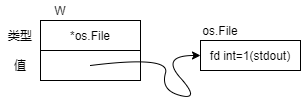
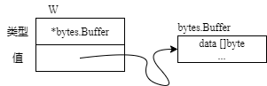

本文基本上是摘录了Go程序设计语言，介绍了Go语言的基本内容。
<!--more-->

## 程序结构
### 名称
Go中函数、变量、常量、类型、语句标签和包的名称遵循一个简单的规则：名称的开头是一个字母或下划线，
后面可以跟任意数量的字符、数字和下划线，并区分大小写。  
Go有25个关键字，不能作为名称： 
|   |   | | | |
| :---:  | :---:  | :---: | :---: | :---: |
|break  |default |func |interface| select | 
|case  |defer | go|  map | struct | 
|chan  |else | goto | package |switch  |
|const |fallthrough| if |range| type|
|continue| for| import |return |var  |

如果一个实体在函数中声明，它只能在函数局部有效。如果声明在函数外，它将对包里面的所有源文件可见。
实体的第一个字母的大小写决定其可见性是否可以跨包。如果名称以大写开头那么它是导出的，意味着它对包外是可见
和可访问的。  

GO的编程风格倾向于使用短名称，名称的作用域越大，就使用越长而且更具意义的名称。并且通常是以"驼峰"的风格存在的。
### 声明
声明给一个程序实体命名，并且设定其部分或全部的属性。有4个主要的声明：变量声明（var）、常量声明（const）、类型声明（type）、
函数声明（func）。  
下面的程序声明了一个常量、一个函数和一对变量：
```Go
package main
import "fmt"

const boilingF = 212.0

func main() {
  var f = boilingF
  var c = (f - 32) * 5 / 9
  fmt.Printf("boiling point = %g℉ or %g℃", f, c)
  // 输出：boiling point = 212℉ or 100℃
}
```
常量boilingF是一个包级别的声明，f和c是属于main函数的局部变量。包级别的实体名称不仅对于包含其声明的源文件可见，
而且对于同一个包里面的所有源文件都可见。另一方面，局部声明仅仅是在声明的函数内容可见。  
函数的声明包含一个名字、一个参数列表、一个可选的返回值列表以及函数体。

### 类型声明type
变量或表达式的类型定义了这些值应有的特性，例如大小（多少位或多少个元素）、在内部如何表达、可以对其进行何种操作以及它们所关联的方法。  
任何程序中，都有一些变量使用相同的表示方式，但是其含义又有非常大的差距。例如，int类型可以表示循环的索引、时间戳、文件描述符或者月份。  
type声明定义了一个新的命名类型，它与某个已有类型使用相同的底层类型。命令类型提供了一种方式来区分底层类型的不同或者不兼容使用，这样
它们就不会在无意中混用。  
`type name underlying-type`  
见如下例子：
```Go
package tempconv
import "fmt"

type Celsius float64
type Fahrenheit float64
const (
  AbsoluteZeroC Celsius = -273.15
  FreezingC     Celsius = 0
  BoilingC      Celsius = 100 
)

func CToF(c Celsius) Fahrenheit { return Fahrenheit(c * 9 / 5 + 32) }
func FToC(f Fahrenheit) Celsius { return Celsius((f - 32) * 5 / 9) }
```
这个包定义了两个类型——Celsius和Fahrenheit，它们分别对应两种温度计量单位。即使它们使用相同的底层类型float64，它们也不能使用算术
表达式进行比较和合并。Celsius(t)和Fahrenheit(t)是类型转换，而不是函数调用。它们不会改变值和表达方式，但改变了显示意义。  

对于每个类型T，都有一个对应的类型转换操作T(x)将值转换为T。如果两个类型具有相同的底层类型或者两个都是指向相同底层类型变量的
未命名指针类型，则二者是可以相互转换的。<u>类型转换不改变类型值的表达方式</u>，仅改变类型。如果x对于类型T是可赋值的，类型转换也是允许的。  
数字类型间的转换，字符串和一些slice类型间的转换是允许的。<u>这些转换会改变值的表达方式</u>。例如，从浮点数转换为整数会丢失小数部分，从字符串
转换成字节slice会分配一份字符串数据副本。  

命令类型的底层类型决定了它的结构和表达方式，以及它支持的内部操作集合。
```Go
fmt.Printf("%g\n", BoilingC - FreezingC) // 100
boilingF := CToF(BoilingC)
fmt.Printf("%g\n", BoilingF - CToF(FreezingC)) // 180
fmt.Printf("%g\n", BoilingF - FreezingC) // error:类型不匹配
```
下面的声明中，Celsius参数出现在函数名字前面，名字叫string的方法关联到Celsius类型。  
`func (c Celius)String() string { return fmt.Sprintf("%g℃", c) }`  
很多类型都声明了这样一个String方法，在变量通过fmt包作为字符串输出时，它可以控制类型值的显示方式。
```Go
c := FToC(212.0)
fmt.Println(c.String()) // "100℃"
fmt.Printf("%v\n", c) // "100℃"
fmt.Printf("%s\n", c) // "100℃"
fmt.Printf("%g\n", c) // "100"
```

### 变量
`var`声明创建一个具体类型的变量，然后给它附加一个名字，设置初始值。  
> var name type = expression  
类型和表达式部分可以省略一个，但是不能都省略。如果类型省略，它的类型将由初始化表达式决定；如果表达式省略，
其初始值为对应类型的零值——数字是0，布尔值false，对于字符串是""，对于接口和引用类型（slice、指针、map、
通道、函数）是nil。对于一个像数组或结构体这样的复合类型，零值是其所有元素的零值。  
可以声明一个变量列表，并选择对应的表达式列表对其初始化。  
```Go
var i, j, k int
var b, f, s = true, 2.3, "four"
```
包级别的初始化发生在main开始之前，局部变量的初始化和声明一样在函数执行期间进行。

**短变量声明**  
短变量声明适合用来声明和初始化局部变量。它使用`name := expression`的形式name的类型由expression的类型决定。
短变量声明不需要声明所有在左边的变量。如果一些变量在同一个词法块声明，那么对于这些变量，短变量声明等同于赋值。

**指针**  
指针的值是一个变量的地址。不是所有的值都有地址，但是所有的变量都有。  
如果一个变量声明为`var x int`，表达式`&x`获取一个指向该变量的指针，它的类型是整型指针（*int）。如果该指针
叫作p，我们说p指向x。表达式`*p`获取获取指向的变量x的值。因为`*p`代表一个变量所以它也能出现在等式左边。  
指针的零值是nil，两个指针当且仅当指向同一个变量或者两者都是nil的情况下才相等。

**new 函数**  
表达式`new(T)`创建一个未命名的T类型变量，初始化为T类型的零值，并返回其地址（类型为*T）  
每一次调用new返回一个具有唯一地址的不同变量，除了一些例外：struct{}或是[0]int

**变量的生命周期**  
包级别变量的生命周期是整个程序的执行时间。局部变量的生命周期是动态的，局部变量一直生存到它变得不可访问。函数的参数和
返回值也是局部变量，它们在其闭包函数被调用时创建。  
编译器可以选择在堆上还是栈上来为变量分配空间。
```Go
var global *int
func f() {
  var x int
  x = 1
  global = &x
}

func g() {
  y := new(int)
  *y = 1
}
```
在上面这个例子里x一定使用堆空间，因为它在f函数返回后还可以通过global变量访问。这种情况我们称x从f中<u>逃逸</u>。
相反g函数返回时变量`*y`变得不可访问看，因此编译器可以安全地在栈上分配`*y`
### 赋值
赋值语句用来更新变量所指的值：
```Go
x = 1
*p = true
count[x] = count[x] * scale
```
每个算术和二进制位操作都有一个对应的赋值操作符：
```Go
count[x] *= scale
// = count[x] = count[x] * scale
```
数字变量可以通过++和--进行递增和递减：
```Go
v := 1
v++ // = v = v + 1
v-- // = v = v - 1
```

**多重赋值**  
允许几个变量一次性被赋值。在更新变量前，右边所有表达式被推演。  
交换两个变量：
```Go
x, y = y, x
```
计算两个整数的最大公约数：
```Go
func gcd(x, y int) int {
  for y != 0 {
    x, y = y, x % y
  }
  return x
}
```
另外有些函数会通过额外的返回值来指示错误情况，例如os.Open的error类型，或者一个通常叫ok的bool类型。
```Go
v, ok = m[key]  // map查询
v, ok = x.(T)   // 类型断言
v, ok = <-ch    // 通道接收
```

**可赋值性**  
类型必须精确匹配，nil可以被赋值给任何接口变量或引用类型。  
两个值使用==和!=进行比较与可赋值性相关：任何比较中，第一个操作数相对于第二个操作数的类型必须是可赋值的，
或者反过来可赋值。

### 控制流
**分支控制**  
```Go
if condition1 {
} else if condition2 {
} else {
}
```
或是
```Go
if expression; condition {
}
```
还可以使用switch语句
```Go
switch coinflip() {
  case "heads":
    heads++
  case "tails":
    tails++
  default:
    fmt.Println("landed on edge!")
}
```
coioflip的调用结果会和每一个条件的值进行比较，case语句从上到下进行推演，所以第一个匹配的case语句将被执行。
如果没有case语句符合条件，那么默认的语句将被执行。默认case语句可以放在任何地方。case语句不像C语言那样从上
到下贯穿执行（可以用fallthrough语句改写成这个行为）  
另外switch不需要操作数，它就像一个case语句列表，每条case语句都是一个布尔表达式：
```Go
switch {
  case x > 0:
    x++
  case x < 0:
    x--
}
```
这种形式被称为无标签选择，等价于switch true  
与if语句类似，switch可以包含一个可选的简单语句用于在判断条件前设置一个值。

**循环控制**  
for是Go里唯一的循环语句。
```Go
for initialization; condition; post {
  // 语句
}
```
初始化语句中的变量作用域在循环内部变量作用域的外面一层，我们可以在循环内部定义一个同名的变量来覆盖初始化语句中的变量：
```Go
for i := 0; i < 2; i++ {
  i := i
  i++
  fmt.Println(i) // 1 2
}
```
for循环也可以只有条件语句：
```Go
for condition {
  // 语句
}
```
当迭代slice、字符串或是map时可以用关键字range，例如
```Go
package main

import (
  "fmt"
  "os"
)

func main () j{
  s, sep := "", ""
  for _, arg := range os.Args[1:] {
    s += sep + arg
    sep = " "
  }
  fmt.Println(s)
}
```
每次迭代，rnage产生一对值：索引和这个索引处元素的值。

break和continue语句可以改变控制流。break可以打断for、switch或select的最内层调用，continue可以让for的
内层循环开始新的迭代。语句可以标签化，这样方便break和continue引用它们来跳出多层嵌套的循环。


### 包和文件
**包的初始化**  
包的初始化从初始化包级别的变量开始，这些变量按照声明顺序初始化，在依赖已解析完毕的情况下，根据依赖的顺序进行。
```Go
var a = b + c   // 最后把a初始化为3
var b = f()     // 通过调用f接着把b初始化为2
var c = 1       // 首先初始化为1
```

任何文件可以包含任意数量的init()函数：`func init() { }`  
这个init函数不能被调用和被引用，另一方面，它也是普通的函数。在每一个文件里，当程序启动的时候，init函数按照它们
声明的顺序自动执行。  
包的初始化顺序按照在程序中导入的顺序进行，依赖顺序优先。

在init函数中初始化一个数据表：
```Go
// 得到一个数字被置位的个数
package popcount

// 用于保存8位数据的置位个数
var pc [256]byte

func init() {
  for i := range pc {
    // 一个数字被置位的个数 = 这个数字右移一位的数字被置位的个数 + 这个数字最低位
    pc[i] = pc[i / 2] + byte(i & 1)
  }

  func PopCount(x uint64) int {
    return int(pc[byte(x>>(0 * 8))]) +
      pc[byte(x>>(1 * 8))] + 
      pc[byte(x>>(2 * 8))] + 
      pc[byte(x>>(3 * 8))] + 
      pc[byte(x>>(4 * 8))] + 
      pc[byte(x>>(5 * 8))] + 
      pc[byte(x>>(6 * 8))] + 
      pc[byte(x>>(7 * 8))]) 
  }
}
```

### 作用域
**注意**  
短变量声明依赖一个明确的作用域。因为cwd和err在init函数块内的内部都尚未声明，所以`:=`语句将它们都声明为
局部变量，内部的cwd声明让外部的声明不可见。
```Go
var cwd string
func init() {
  cwd, err := os.Getwd() // 编译错误：未使用cwd
  if err != nil {
    log.Fatalf("os.Getwd failed: %v", err)
  }
}
```
解决办法：
```Go
var cwd string
func init() {
  var err error
  cwd, err = os.Getwd()
  if err != nil {
    log.Fatalf("os.Getwd failed: %v", err)
  }
}
```

## 数据类型
### 整数
| | 有符号 | 无符号 |
| :---: | :---: | :---: |
| 8位 | int8 | uint8/byte | 
| 16位 | int16 | uint16 | 
| 32位 | int32/rune | uint32 | 
| 64位 | int64 | uint64 | 
| 与平台相关 | int | uint | 
| 足以存放指针 | / | uintptr | 

rune类型是int32类型的同义词，常常用于指明一个值是Unicode码点。同样，byte是uint8的同义词，强调一个值是原始数据，而非量值。  
uintptr大小不明确，但足以存放指针。  
有符号整数以补码表示，保留最高位作为符号位，n位的数字取值范围是$-2^{n-1}$~$2^{n-1}-1$。无符号整数由全部位构成非负值，
范围是0~${2^n}-1$。
 
### 操作符
Go的二元操作符有算术、逻辑和比较等运算。按优先级的降序排列如下：
```Go
*   /   %  <<  >>  &   &^
+   -   |   ^
==  !=  <  <=   >  >=
&&
||
```
二元运算符分为五大优先级。同级别的运算符满足左结合律，上面的前两行都有对应的赋值运算符（如+=）。  
算术运算符`+`、`-`、`*`、`/`可应用于整数、浮点数和复数，而取模运算符`%`仅能用于整数。在Go中取模余数
的正负号总是与被除数一致，于是`-5%3`和`-5%-3`都得-2。除法运算`/`的行为取决于操作数是否都为整型，整数相除，商会舍弃
小数部分。  
不论是有符号数还是无符号数，若表示算术运算结果所需的位超出该类型的范围，就称为<u>溢出</u>。溢出的高位部分会丢弃。假如原本计算
结果是有符号类型，且最左侧位是1，则会形成负值：
```Go
var u uint8 = 255
fmt.Println(u, u+1, u*u) // 255 0 1

var i int8 = 127
fmt.Println(i, i+1, i*i) // 127 -128 1
```
**位操作符**  
```Go
&   // 位运算AND
|   // 位运算OR
^   // 位运算XOR
&^  // 位清空(AND NOT)
<<  // 左移
>>  // 右移
```
`^`作为一元前缀运算符时表示按位取反或按位取补，运算结果就是操作数逐位取反。  
`&^`是按位清除，表达式`z=x&^y`中，若y的某位为1，则z的对应位为0，否则z的对应位等于x的对应位  
移位运算`x<<n`、`x>>n`中，操作数n决定位移量，而且n必须为无符号型。左移以0填补右边空位，无符号右移补0，
有符号右移补符号位。  

**字符**  
源码中文字符号的形式是字符写在一对单引号内，最简单的例子就是ASCII字符，如'a'，但也可以直接使用Unicode码点（codepoint）
或码值转义。

### 浮点数
GO具有两种大小的浮点数`float32`和`float64`。十进制下`float64`的有效数字大约是15位，`float32`的有效数字大约是6位。绝大多数
的情况下应该使用`float64`。  
小数点前面和后面的数字都可以省去。非常大或非常小的数字最好使用科学计数法表示：
```Go
const Avogadro = 6.02214129e23
const Planck = 6.62606957e-34
```
浮点值能够方便地通过`Printf`的谓词`%g`输出，对于数据表，`%e`（有指数）或`%f`（无指数）的形式可能更合适。  
math包中有函数用于创建和判断IEEE 754标准定义的特殊值：正无穷大和负无穷大，它表示超出最大许可值的数和除以零
的商；以及`NaN`（Not a Number），它表示数学上无意义的运算结果（如`0/0`或`Sqrt(-1)`）。
```Go
var z float64
fmt.Println(z, -z, 1/z, -1/z, z/z) // 0 -0 +Inf -Inf NaN
```
math.IsNaN函数判断其参数是否是非数值，math.NaN函数返回非数值（NaN）。在数字运算中，我们倾向于将NaN当作信号值（sentinel value），
但直接判断具体的计算结果是否为NaN可能导致潜在错误，因为与NaN的比较总不成立（除了!=，它总是与==相反）
```Go
nan := math.NaN()
fmt.Println(nan == nan, nan < nan, nan > nan) // false false false
```
### 复数
### 布尔值
bool型的值只有两种可能：真（true）或假（false）。  
布尔值可以由运算符`&&`以及`||`组合运算，这可能引起短路行为：如果运算符左边的操作数已经能直接得出总体结果，则右边的操作数不会计算。  
布尔值无法隐式转换成数值，反之也不行。

### 字符串
字符串是不可变的字节序列，它可以包含任意数据，包括0值字节。习惯上，文本字符串被解读成按UTF-8编码的Unicode码点序列。  
内置的len函数返回字符串的字节数（并非文字符号的数目）,下标访问操作`s[i]`则取得第i个字符，其中0 $\le$i$\lt$len(s)。
```Go
s := "hello,world"
fmt.Println(len(s))   // 12
fmt.Println(s[0], s[7])   // 104 118 ('h' 'w')
```
字串生成操作`s[0:5]`产生一个新字符串，内容取自原字符串的字节，下标从i直到j。操作数i和j的默认值分别是0和len(s)。  
加号运算符可以连接两个字符串而生成一个新字符串：
```Go
fmt.Println("goodbye" + s[5:]) // "goodbye, world"
```
字符串可以通过比较运算符做比较，如==和<; 比较运算按字节进行，结果服从本身的字典排序。  
尽管肯定可以将新值赋予字符串变量，但是字符串值无法改变：字符串值本身所包含的字节序列永不可变。  
要在一个字符串后面添加另一个字符串，可以这样：
```Go
s := "left foot"
t := s
s += ", right foot"
```
这并不改变s原有的字符串值，只是将+=语句生成的新字符串赋予s。同时t仍然持有旧的字符串值。  
因为字符串不可改变，所以字符串内部的数据不允许修改：
```Go
s[0] = 'L'  // 编译错误
```
不可变意味着两个字符串能安全地共用同一段底层内存，使得复制任何长度字符串的开销都很低廉。类似地，字符串及其子串也可以安全地共用数据。

**字符串字面量**  
字符串的值可以直接写成字符串字面量，形式上就是带双引号的字节序列："Hello, World"  
因为Go的源代码总是按UTF-8编码，并且习惯上Go的字符串会按UTF-8解读，所以在源码中我们可以将Unicode码点写入字符串字面量。  
在带双引号的字符串字面量中，转义序列以反斜杆`\`开始，可以将任意值的字节插入字符串中。  
源码中的字符串也可以包含十六进制或八进制的任意字节。十六进制的转义字符写成`\xhh`的形式，h是十六进制数字，且必须是两位。
八进制的转义字符写成`\ooo`的形式，必须使用3位8进制数字，且不能超过\377。这两者都表示单个字节，内容是给定值。  
原生的字符串字面量书写形式是``，使用反引号而不是双引号。原生的字符串字面量内，转义序列不起作用。唯一的特殊处理是回车符会被删除（
换行符会保留），使得同一字符串在所有平台上的值都相同。  

**Unicode**  
Unicode对于世界上所有的文书体系的字符都赋予一个叫Unicode码点的标准数字。在Go的术语中，这些字符记号称为文字符号（rune）。  
在Go中Unicode码点用rune（int32）表示。我们可以将文字符号的序列表示成int32值序列，这种表示方法被称作UTF-32.每个Unicode
码点的编码长度相同，这种编码简单划一，可是大多数面向计算机的可读文本是ASCII码，每个字符只需8位，导致了不必要的存储空间消耗。
因此GO中采用UTF-8编码。

**UTF-8**  
UTF-8以字节为单位对Unicode码点作边长编码。每个文字符号用1~4个字节表示。ASCII字符的编码仅占1字节，而其它常用的文书字符的编码只是
2个或3个字节。一个文字符号编码的首字节的高位指明了后面还有多少字节。若最高位为0，则标识着它是7位的ASCII码，若最高几位是110，则文字
符号的编码占用2个字节，第二个字节以10开始，更长的编码以此类推。
```
0xxxxxxx                              文字符号0 - 127
110xxxxx 10xxxxxx                     128 - 2047
1110xxxx 10xxxxxx 10xxxxxx            2048 - 65535
11110xxx 10xxxxxx 10xxxxxx 10xxxxxx   65536 - 0x10ffff
```
变长编码的字符串无法按下标直接访问第n个字符，然而有失有得，UTF-8换来许多有用的特性。UTF-8编码紧凑，兼容ASCII，并且自同步：最多追溯3字节，就能
定位一个字符的起始位置。文字符号的字典字节顺序与Unicode码点顺序一致，因此按UTF-8编码排序自然就是对文字符号排序。  
Go的源文件总是以UTF-8编码，同时，需要用Go程序操作的文本字符串也优先采用UTF-8编码。unicode包具备针对单个文字符号的函数，而unicode/utf8包则
提供了按UTF-8编码和解码文字符号的函数。  
许多Unicode字符难以直接从键盘输入。Go语言中，字符串字面量的转义让我们得以用码点的值来指明Unicode字符。有两种形式，`\uhhhh`表示16位码点值，
`\Uhhhhhhhh`表示32位码点值，每个h表示一个十六进制数字；32位形式的码点值几乎不需要用到。
```Go
"世界"
"\xe4\xb8\x96\xe7\x95\x8c"
"\u3e16\u754c"
"\U00004e16\U0000754c"
```
后面三行的转义序列都表示第一行的字符串。  
Unicode转义符也能用于文字符号。
`'世'   '\u4e16'    '\U00004e16'`  
码点值小于256的文字符号可以写成单个十六进制数转义的形式，如'A'写成'\x41'，而更高的码点值必须使用\u或\U转义。  

Unicode字符处理
```Go
import "unicode/utf8"

// "Hello, 世界" 
// = h | e | l | l | o | , |  | E4 | E8 | 96 | E7 | 95 | 8C |

s := "Hello, 世界"
fmt.Println(len(s))       // 13
fmt.Println(utf8.RuneCountInString(s))    // 9

for i := 0; i < len(s); {
  r, size := utf8.DecodeRuneInString(s[i:])
  fmt.Printf("%d\t%c\n", i, r)
  i += size
}
```
每次DecodeRuneInString的调用都返回r（文字符号）和一个值（表示r按UTF-8编码所占的字节数）。用这个值来跟新下标i，定位下一个字符。
Go的range循环也适用于字符串，按UTF-8隐式解码。
```Go
for i, r := range "Hello, 世界" {
  fmt.Printf("%d\t%q\t%d\n", i, r, r)
}
```
我们可以用简单的range循环统计字符串中文字符号的数目：
```Go
n := 0
for range s {
  n++
}
```
如果UTF-8解码器读入一个不合理的字节，都会产生一个专门的Unicode字符`\uFFFD`替换它。  
当[]rune转换作用于UTF-8编码的字符串时，返回改字符串的Unicode码点序列。

**字符串和字节slice**  
4个标准包对字符串操作特别重要：bytes、strings、strconv和unicode。  
strings包用于搜索、替换、比较、修整、切分与连接字符串。  
bytes包用于操作字节slice。由于字符串不可变，因此按增量方式构建字符串会导致多次内存分配和复制。在这种情况下，
使用bytes.Buffer类型会更高效。  
strconv包用于转换布尔值、整数、浮点数为与之对应的字符串形式，或者相反的操作。  
unicode包具备有判别文字符号值特性的函数，如IsDigit、IsLetter、IsUpper和IsLower。  

字符串可以和字节slice相互转换：
```Go
s := "abc"
b := []byte(s)
s2 := string(b)
```
概念上，`[]byte(s)`转换操作会分配新的字节数组，拷贝填入s含有的字节，并生成一个slice引用，指向这个数组。
反之，用`string(b)`将字节slice转换成字符串也会产生一份副本，保证s2不可变。  
bytes包为高效处理字节slice提供了`Buffer`类型。`Buffer`起初为空，其大小随着各种类型数据的写入而增长。
```Go
func intsToString(values []int) string {
  var buf bytes.Buffer
  buf.WriteByte('[')
  for i, v := range values {
    if i > 0 {
      buf.WriteString(", ")
    }
    fmt.FPrintf(&buf, "%d", v)
  }
  buf.WriteByte(']')
  return buf.String()
}

func main() {
  fmt.Println(intsToString([]int{1, 2, 3})) // "[1, 2, 3]"
}
```
若要在`bytes.Buffer`变量后添加任意文字符号的UTF-8编码，最好使用`bytes.Buffer`的`WriteRune`方法。

### 常量
常量是一种表达式，其可以保证在编译阶段就可以计算出表达式的值。所有常量本质上都属于基本类型：布尔型、字符串和数字。  
使用`const`关键字就可以定义一个常量：
```Go
const pi = 3.14159
```
对于常量操作数，所有数学运算、逻辑运算和比较运算的结果仍然是常量，常量的类型转换结果和某些内置函数的返回值，例如len、
cap、real、imag、complex和unsafe.Sizeof，同样是常量。  
常量声明可以同时指定类型和值，如果没有显示指定类型，则类型根据右边的表达式推断。下例中，`time.Duration`是一种具名类型，其
基本类型是`int64`，`time.Minute`也是基于`int64`的常量。
```Go
const noDelay time.Duration = 0
const timeout = 5 * time.Minute
fmt.Printf("%T %[1]v\n", noDelay)       // time.Duration  0
fmt.Printf("%T %[1]v\n", timeout)       // time.Duration  5m0s
fmt.Printf("%T %[1]v\n", time.Minute)   // time.Duration  1m0s
```

若同时声明一组常量，除第一项外，其它项在等号右侧的表达式都可以省略，这意味着会复用前面一项的表达式和类型。
**常量生成器iota**  
常量声明中，`iota`从0开始取值，逐项加1.  
```Go
type Weekday int
const (
  Sunday Weekday = iota
  Monday
  Tuesday
  Wednesday
  Thursday
  Friday
  Saturday
)
```

更复杂的表达式也可以使用iota，如net包中的代码：
```Go
type Flags uint
const (
  FlagUp Flags = 1 << iota
  FlagBroadcast
  FlagLoopback
  FlagPointToPoint
  FlagMulticast
)
```
随着iota递增，每个常量1都按`1<<iota`赋值，这等价于2的连续次幂

**无类型常量**  
许多常量并不从属于某一个具体类型。编译器将这些从属类型待定的常量表示成某些值，这些值比基本类型的数字精度更高，
且算术精度高于原生的机器精度。可以认为它们的精度至少达到256位。从属类型待定的常量共有6种：无类型布尔、无类型
整数、无类型文字符号、无类型浮点数、无类型复数、无类型字符串。  
只有常量才可以是无类型的。若将无类型常量声明为变量或在类型明确的变量赋值的右方出现无类型常量，则常量会被隐式转换
为该变量类型。
```Go
var f float64 = 3 + 0i  // 无类型复数 -> float64
f = 2   // 无类型整数 -> float64
f = 1e123   // 无类型浮点数 -> float64
```
变量声明中，假如没有显示指定类型，无类型常量会隐式转换成该变量的默认类型，如下所示
```Go
i := 0      // 无类型整数；隐式int(0)
r := '\000' // 无类型文字符号；隐式rune('\000')
f := 0.0    // 无类型浮点数；隐式float64(0.0)
c := 0i     // 无类型整数；隐式complex128(0i)
```

### 数组
数组是具有固定长度且拥有零个或者多个相同数据类型元素的序列。由于数组的长度固定，所以在Go里面很少直接使用。
数组中每个元素是通过索引访问的，索引从0到len(x)-1。  
默认情况下一个新数组中的元素初始值为元素类型的零值，也可以使用数组字面量来初始化一个数组。
```Go
var q [3]int = [3]int{1, 2, 3}
var r [3]int = [3]int{1, 2}
fmt.Println(r[2])   // 0
```
在数组字面量中，如果省略号`...`作为数组长度，那么数组长度由初始化数组的元素个数决定。
```Go
q := [...]int{1, 2, 3}
```
数组的长度是数组类型的一部分，也就是说[2]int与[3]int并不是同一个类型。另外数组的长度必须是常量表达式。  
初始化数组时索引可以按照任意顺序出现，并且有的时候还可以省略。没有指定值的索引位置被赋予元素类型的默认值。
```Go
r := [...]int{88: -1}
```
定义了一个拥有100个元素的数组r，除了最后一个元素是-1外，其它元素都是0.  
  
如果一个数组的元素类型是可比较的，那么这个数组也是可以比较的。  
注意在GO中当调用一个函数的时候，每个传入的参数都会创建一个副本然后赋值给对应的函数变量，所以函数接受的是一个副本。
也就是说Go把数组何其他类型都看成值传递。

### slice
slice表示一个拥有相同类型元素的可变长度的序列。通常写成`[]T`，其中元素的类型都是`T`。  
数组和slice是紧密关联的。slice是一种轻量级的数据结构，可以用来访问数组的部分或全部元素，而这个数组称为slice的
底层元素。slice有三个属性：指针、长度和容量。指针指向数组的第一个可以从slice访问的元素，长度是指slice中的元素个数，
容量的大小通常是从slice的起始元素到底层数组的最后一个元素间的元素个数。Go的内置函数`len`和`cap`用来返回slice的长度
和容量。  
一个底层数组可以对应多个slice，这些slice可以引用数组的任何位置，彼此之间的元素还可以重叠。  
slice操作符`s[i:j]`（其中0$\le$i$\le$j$le$cap(s)）创建了一个新的slice，这个新的slice引用了序列s从i到j-1索引位置的元素，
这里的s既可以是数组也可以是指向数组的指针，还可以是slice。i的默认值是0，j的默认值是`len(s)`。  
因为slice包含了指向数组元素的指针，因此将一个slice传给函数的时候可以在函数内部修改底层数组的元素。  
和数组不同的是，slice无法做比较。标准库提供了高度优化的函数`bytes.Equal`来比较两个字节slice（[]byte）。对于其它类型的slice
我们必须自己写函数来比较。
```Go
func equal(x, y[]string) bool {
  if len(x) != len(y) {
    return false
  }
  for i := range x {
    if x[i] != y[i] {
      return false
    }
  }
  return true
}
```
slice不可比较的原因有二，一是和数组元素不同，slice的元素是非直接的，有可能slice可以包含它自身。二是如果底层元素改变，同一个slice在
不同的时间会拥有不同的元素。由于散列表仅对元素的键做浅拷贝，这就要求散列表里面的键在散列表的生命周期内必须保持不变。因为slice需要深度
比较，所以就不能用slice作为map的键。对于引用类型，操作符`==`检查的是引用相等性，即它们是否指向相同的元素。如果有一个相似的slice相等性比较
功能，它或许能解决问题，但是如果操作符`==`对slice和数组的行为不一致，会带来困扰。所以最安全的做法是不允许直接比较slice。
slice唯一允许做比较操作的是和nil做比较。
内置函数make可以创建一个具有指定元素类型、长度何容量的slice。容量参数如果省略则与长度相同
```Go
make([]T, len)
make([]T, len, cap)
```
其实make创建了一个无名数组并返回了它的一个slice。

**append函数**  
内置函数append用来将元素追加到slice的后面。
```Go
var runes []rune
for _, r := range "hello, 世界" {
  runes = append(runes, r)
}
fmt.Printf("%q\n", runes)
```
我们可以通过下面这个例子来理解append函数的原理
```Go
func appendInt(x []int, y int) []int {
  var z []int
  zlen := len(x) + 1
  if zlen <= cap(x) {
    // slice 仍有增长空间，扩展slice内容
    z = x[:zlen]
  } else {
    // slice 以无空间，为它分配一个新的底层数组
    zcap := zlen
    if zcap < 2 * len(x) {
      zcap = 2 * len(x)
    }
    z = make([]int, zlen, zcap)
    copy(z, x)  // 内置copy函数
  }
  z[len(x)] = y
  return z
}
```
内置的append的函数使用了比这里appendInt更复杂的增长策略，通常情况下，我们并不清楚一次append调用会不会导致一次新
的内存分配，所以我们不能假设原始的slice和调用append后的结果slice指向同一个底层数组。所以通常我们将append的调用
结果再次赋值给传入append函数的slice：`runes = append(runes, r)`。实际上任何情况下只要可能改变slice的长度或者
容量，亦或者使得slice指向不同的底层数组，都需要更新slice变量。

### map
在Go中map是散列表的引用，map的类型是`map[k]v`, 其中k和v是字典的键和值对应的数据类型。键的类型k，<u>必须是可以通过操作符
`==`来进行比较的数据类型</u>，所以map可以检测某一个键是否已经存在。虽然浮点型是可以比较的，但是比较浮点型的相等性不是一个
好主意。  
内置函数make可以用来创建一个map：
```Go
ages := make(map[string]int)
```
也可以使用map的字面量来新建一个带初始化键值对元素的字典：
```Go
ages := map[string]int {
  "alice": 31,
  "charlie": 34,
}
```
map的元素访问也是通过下标的方式，例如`ages["alice"] = 32`  
可以使用内置函数delete来从字典中根据键移除一个元素：
```Go
delete(ages, "alice")
```
即使键不在map中，上面的操作也是安全的。map使用给定的键来查找元素，如果对应的元素不存在，就返回值类型的零值。map元素不是一个
变量，不可以获取它的地址，比如`_ = &ages["bob"]`就是不对的，不能的原因是map的增长可能会导致已有元素被重新散列到新的存储位置，
这样就有可能使得获取的地址无效。  
可以使用`for range`循环来遍历map中所有的键和对应的值，map中元素的迭代顺序是不固定的，如果需要按照某种顺序来遍历map中的元素，
我们必须显示地来给键排序。
```Go
import "sort"
var names []string
for name := range ages {
  names = append(names, name)
}
sort.Strings(names)
for _, name := range names {
  fmt.Printf("%s\t%d\n", name, ages[name])
}
```
map类型的零值是nil，也就是说没有任何散列表。
```Go
var ages map[string]int
fmt.Println(ages == nil)  // true
fmt.Println(len(ages) == 0) // true
```
大多数的map操作都可以安全地在map的零值nil上执行，包括查找元素，删除元素，获取map元素个数（len），执行range循环，因为这和空
map的行为一致。但是向零值map中设置元素会导致错误。  
通过下标的方式访问map中的元素总是会有值。有时候需要知道一个元素是否在map中，可以这样做：
```Go
if age, ok := ages["bob"]; !ok { /*"bob"不是字典的键*/ }
```
和slice一样，map不可比较，唯一合法的比较就是和nil做比较。要判断两个map是否有相同的键和值，必须写一个循环：
```Go
func equal(x, y map[string]int) bool {
  if len(x) != len(y) {
    return false
  }
  for k, xv := range x {
    if yv, ok := y[k]; !ok || yv != xv {
      return false
    }
  }
  return true
}
```

### 结构体
结构体是将零个或者多个任意类型的命名变量组合在一起的聚合数据类型。下面的语句定义了一个叫Employee的结构体
和一个结构体变量dilbert：
```Go
type Employ struct {
  ID      int
  Name    string
  Address string
}

var dilbert Employee
```
dilbert的成员可以通过点号的方式来访问，就像`dilbert.Name`和`dilbert.ID`这样。点号同样可以用在结构体指针上：
```Go
var employeeOfTheMonth *Employee = &dilbert
employeeOfTheMonth.Address += "xxx"
```
后面一条语句等价于`(*employeeOfTheMonth).Address += "xxx"`  
结构体的成员变量通常一行写一个，变量的名称在类型的前面，但是相同类型的成员可以写在一行上：
```Go
type Employ struct {
  ID      int
  Name, Address string
}
```
成员变量的顺序对于结构体的同一性很重要。如果我们将`Name`和`Address`组合在一起或者交换顺序，那么我们就在定义一个不同的结构体类型。  
如果一个结构体的成员变量名是首字母大写的，那么这个变量是可导出的，一个结构体可以同时包含可导出和不可导出的变量。  
没有任何成员变量的结构体称为空结构体，写作`struct{}`。它没有长度，也不携带任何信息。我们可以用它来作为当作集合使用的map中的值。

**结构体字面量**  
结构体类型的值可以通过结构体字面量来设置
```Go
type Point struct{ X, Y int }
p := Point{1, 2}
```
如上所示p被声明为Point类型，并且成员变量X，y被分别设置为1，2。另外我们也可以在初始化时指定成员变量的名称
```Go
p := Point {
  X: 1,
  Y: 2,
}
```
这两种初始化方式不可以混合使用，也不可以使用第一种初始化方式来绕过不可导出的变量无法在其它包使用的规则。  
由于通常结构体都通过指针的方式使用，因此可以使用一种简单的方式来创建、初始化一个struct类型的变量并
获取它的地址：
```Go
pp := &Point{1, 2}
// 等价于
pp := new(Point)
*pp = Point{1, 2}
```

**结构体嵌套和匿名成员**  
结构体的嵌套机制可以让我们将一个命名结构体当作另一个结构体类型的匿名成员使用；并且提供了一种方便的语法，使用
简单的表达式（比如`x.f`）就可以代表连续的成员（比如`x.d.e.f`）。  
举个例子，2D绘图程序中会提供的关于形状的库，比如矩形、椭圆、车轮型等。这里定义了其中两个类型：
```Go
type Circle struct {
  X, Y, Radius  int
}

type Wheel struct {
  X, Y, Radius, Spokes  int
}
```
Circle类型定义了圆心的坐标X和Y，另外还有半径Radius。Wheel类型拥有Circle类型的所有属性，另外还有一个Spokes属性，
即车轮中条辐的数量。我们很明显发现关于圆心坐标X，Y和半径Radius在两个类型中是重复的，因此我们考虑重构相同的部分：
```Go
type Point struct {
  X, Y  int
}

type Circle struct {
  Center  Point
  Radius  int
}

type Wheel struct {
  Circle  Circle
  Spokes  int
}
```
这个程序看上去变得更清晰，但是访问Wheel的成员变量时却变得麻烦了：
```Go
var w Wheel
w.Circle.Center.X = 8
w.Circle.Center.Y = 8
w.Circle.Radius = 5
w.Spokes = 20
```
Go允许我们定义不带名称的结构体成员，只需要指定类型即可；这种结构体成员称作*匿名成员*。这个结构体成员的类型
必须是一个命名类型或者指向命名类型的指针。
```Go
type Circle Struct {
  Point
  Radius  int
}

type Wheel struct {
  Circle
  Spokes  int
}
```
使用了这种结构体嵌套的功能，我们就能直接访问到我们需要的变量：
```Go
var w Wheel
w.X = 8
w.Y = 8
w.Radius = 5
w.Spokes = 20
```
使用结构体字面量初始化有嵌套结构的结构体时，结构体字面量必须遵循形状类型的定义：
```Go
w = Wheel{Circle{Point{8, 8}, 5}, 20}
// 等价于
w = Wheel{
  Circle: Circle{
    Point: Point{X: 8, Y:8},
    Radius: 5,
  },
  Spokes: 20,
}
```
因为匿名成员拥有隐式的名字，所以不能在一个结构体里面定义两个相同类型的匿名成员。由于匿名成员的名字是由它们的类型决定的，
因此它们的可导出性也是由它们的类型决定的。在上面的例子中，Point和Circle是可导出的。即使它们不可导出（point和circle），
我们仍然可以使用快键方式：`w.X = 8 // 等价于w.circle.point.X = 8`，但是注释中那种显式指定中间匿名成员的方式在包外是
不允许的。  
实际上匿名成员不一定是结构体类型，任何命名类型或者指向命名类型的指针都可以。以快键方式访问匿名成员的内部变量同样适用于
访问匿名成员的方法。这个机制就是从简单类型对象组合成复杂的复合类型的主要方式。<u>在GO中，组合是面向对象编程方式的核心</u>。

### JSON
JSON是JavaScript值的Unicode编码，这些值包括字符串、数字、布尔值、数组和对象。JSON是基本数据类型和复合数据类型的一种高效的、
可读性强的表示方法。  
JSON最基本的类型是数字、布尔值和字符串。JSON里面`\uhhh`数字转义得到的是UTF-16编码，而不是Go里面的字符。这些基础类型可以通过
JSON的数组和对象进行组合。JSON的数组是一个有序的元素序列，每个元素之间用逗号分隔，两边使用方括号。JSON的数组用来编码Go里面的
数组和slice。JSON的对象是一个从字符串到值的映射，写成`name:value`对的序列，每个元素之间用逗号分隔，两边使用花括号。JSON的对象
用来编码Go里面的map（键为string）和结构体。例如：
```
boolean     true
number      -273.15
string      "she said \"Hello, 世界\""
array       ["gold", "silver", "bronze"]
object      {"year": 1980,
             "event": "archery",
             "medals": ["gold", "silver", "bronze"]}
```
假如一个程序需要收集电影的观看次数并提供推荐。这个程序的Movie类型何典型的元素列表如下所示：
```Go
type Movie struct {
  Title   string
  Year    int  `json:"released"` 
  Color   bool  `json:"color,omitempty"`
  Actors  []string
}

var movies = []Movie {
  {Title: "Casablanca", Year: 1942, Color: false,
    Actors: []string{"Humphrey Bogart", "Ingrid Bergman"}},
  {Title: "Cool Hand Luke", Year: 1967, Color: true,
    Actors: []string{"Paul Newman"}},
  //...
}
```
把Go的数据结构转换为JSON称为marshal。marshal是通过`json.Marshal`来实现的：
```Go
data, err := json.Marshal(movies)
if err != nil {
  log.Fatalf("JSON marshaling failed:%s", err)
}
fmt.Printf("%s\n", data)
```
Marshal生成了一个字节slice，其中包含一个不带有任何多余空白字符的字符串。另外我们也可以使用`json.MarshalIndet`
来格式化输出。这个函数有两个参数，一个是定义每行输出的前缀字符串，另一个是定义缩进的字符串。
```Go
data, err := json.MarshalIndent(movies, "", " ")
if err != nil {
  log.Fatalf("JSON marshaling failed:%s", err)
}
fmt.Printf("%s\n", data)
```
marshal使用Go结构体成员的名称作为JSON对象里面字段的名称。只有可导出的成员可以转换为JSON字段。另外我们可以通过
成员标签定义（field tag）来自定义转换为JSON时的名称。
```Go
Year  int `json:"released"`
Color bool  `json:"color,omitempty"`
```
键json控制包`encoding/json`的行为。标签第一部分指定了Go结构体成员对应JSON中字段的名字。Color的标签还有一个额外的选项omitempty
表示如果这个成员的值是零值或为空，则不输出这个成员到JSON中。  
marshal的逆操作是将JSON字符串解码为Go数据结构，这个过程叫做unmarshal，这个是由`json.Unmarshal`完成的。下面的代码将电影的
JSON数据转换到结构体slice中，这个结构体唯一的成员就是Title。通过合理地定义Go的数据结构，我们可以选择将哪部分JSON数据解码到
结构体对象中。
```Go
var titles []struct{ Title string }
if rr := json.unmarshal(data, &titles); err != nil {
  log.Fatalf("JSON unmarshaling failed:%s", err)
}
fmt.Println(titles)
```
很多Web服务器都提供了JSON接口，通过发送HTTP请求来获取想要得到的JSON信息。我们通过查询GitHub提供的issue跟踪接口来演示下。
```Go
// 详细查看 https://developer.github.com/v3/search/#search-issues
package github
import "time"

const IssuesURL = "https://api.github.com/search/issues"

type IssuesSearchResult struct {
  TotalCount    int `json:"total_count"`
  Items   []*Issue
}

type Issue struct {
  Number    int
  HTMLURL   string  `json:"html_url"`
  Title     string
  State     string
  User      *User
  CreateAt  time.Time `json:"created_at"`
  Body      string
}

type User struct {
  Login   string
  HTMLURL string  `json:"html_url"`
}
```
函数SearchIssues发送HTTP请求并将回复解析成JSON。由于用户的查询请求参数可能存在一些特殊字符，比如`?`或者`&`，因此使用`url.QueryEscape`
函数来确保它们拥有正确的含义。
```Go
package github

import (
  "encoding/json"
  "fmt"
  "net/http"
  "net/url"
  "strings"
)

func SearchIssues(terms []string) (*IssuesSearchResult, error) {
  q := url.QueryEscape(strings.Join(terms, " "))
  resp, err := http.Get(IssuesURL + "?q=" + q)
  if err != nil {
    return nil, err
  }
  defer resp.Body.Close()
  if resp.StatusCode != http.StatusOK {
    return nil, fmt.Errorf("search query failed: %s", resp.Status)
  }

  var result IssuesSearchResult
  if err := json.NewDecoder(resp.Body).Decode(&result); err != nil {
    return nil, err
  }
  return &result, nil
}
```
这里解码使用的是流解码器（即json.Decoder），可以利用它来依此从字节流里面解码出多个JSON实体。

### 模板
Go通过text/template包和html/template包来实现格式化输出和代码的分离。这两个包提供了一种机制，可以将程序变量的
值代入到文本或html模板中。  
模板是一个字符串或文件，它包含一个或者多个用双大括号包围的单元——{{...}}，这称为操作。大多数字符串是直接输出的，
但是操作可以引发其它行为，包括有输出值、选择结构体成员，调用函数和方法、描述控制逻辑，实例化其它模板等。下面是
一个简单的字符串模板：
```Go
const templ = `{{.TotalCount}} issues:
{{range .Items}}------------------
Number: {{.Number}}
User: {{.User.Login}}
Title: {{.Title | printf "%.64s"}}
Age: {{.CreateAt | daysAgo}} days
{{end}}`
```
`{{.TotalCount}}`：表示输出传入模板变量的TotalCount成员变量的值
`{{range .Items}}`：如果Items是数组或者map则会遍历数组元素，循环内部的`.`表示当前的元素
`{{.Title | printf "%.64s"}}`：`|`操作符叫做管道，它会把前面语句的输出作为后面语句的输入，printf函数是模板中内置的函数
`{{.CreateAt | daysAgo}}`：这个daysAgo函数是我们自己传入的函数，函数定义如下
```Go
func daysAgo(t time.Time) int {
  return int(time.Since(t).Hours() / 24)
}
```
通过模板输出结果需要两个步骤。首先，需要解析模板并转换为内部的表示方法，然后在指定的输入上面执行。解析模板只需要执行一次。
下面的代码创建并解析上面定义的文本模板templ。注意方法的链式调用：template.New创建并返回一个新的模板，Funcs添加daysAgo到
模板内部可以访问的函数列表中，然后返回这个模板对象；最后调用Parse方法。
```Go
report, err := template.New("report").
  Funcs(template.FuncMap{"daysAgo": daysAgo}).
  Parse(templ)
if err != nil {
  log.Fatal(err)
}
```
由于模板通常是在编译期间就固定下来的，因此无法解析模板将是程序中的一个严重的BUG。帮助函数`template.Must`提供了一种便捷的
错误处理方式，它接受一个模板和错误作为参数，检查错误是否为nil（如果不是nil，则宕机），然后返回这个模板。  
一旦创建了模板，添加了内部可调用的函数daysAgo，然后解析，再检查，就可以使用`github.IssuesSearchResult`作为数据源，输出模板
```Go
var report = template.Must(template.New("issuelist").
  Funcs(templae.FuncMap{"daysAgo": daysAgo}).
  Parse(templ))

func main() {
  result, err := github.SearchInsue(os.Args[1:])
  if err != nil {
    log.Fatal(err)
  }
  if err := report.Execute(os.Stdout, result); err != nil {
    log.Falal(err)
  }
}
```
html/template包使用方法同text/template一样，并且额外地对出现在HTML、JavaScript、CSS和URL中的字符串进行自动转义。这些功能
可以避免生成的HTML引发的安全问题，比如注入攻击，对方利用issue的标题来包含不安全的代码，在模板中如果没有合理地进行转义，会让它们
能够控制整个页面。  
我们可以通过使用命名的字符串类型`template.HTML`类型而不是字符串类型避免模板自动转义受信任的HTML数据。同样的命名类型适用与受信任的
JavaScript、CSS和URL。下面的程序演示了相同数据在不同类型下的效果
```Go
func main() {
  const templ = `<p>A: {{.A}}</p><p>B: {{.B}}</p>`
  t := template.Must(template.New("escape").Parse(templ))
  var data struct {
    A string
    B template.HTML
  }
  data.A = "<b>Hello!</b>"
  data.B = "<b>Hello!</b>"
  if err := t.Execute(os.Stdout, data); err != nil {
    log.Fatal(err)
  }
}
```
<!--makep-->

## 函数
### 函数声明
每个函数声明都包含一个名字、一个形参列表、一个可选的返回列表以及函数体：
```Go
func name(parameter-list) (result-list) {
  body
}
```
形参列表指定了一组变量的参数名和参数类型，这些局部变量都由调用者提供的实参传递而来。返回列表指定了函数返回值的类型。当函数返回一个未命名的返回值或者没有返回值的时候，返回列表的圆括号可以省略。在下面的hypot函数中：
```Go
func hypot(x, y float64) float64 {
  return math.Sqrt(x*x + y*y)
}
fmt.PrintLn(hypot(3, 4)) // 5
```
x和y是函数声明中的形参，3和4是调用函数时的实参，并且函数返回一个类型为float64的值。返回值也可以像形参一样命名。这个时候每一个命名的返回值会声明为一个局部变量，并根据变量类型初始化为相应的0值。  
当函数存在返回列表时，必须显式地以return语句结束，除非函数明确不会走完整个执行流程，比如在函数中抛出宕机异常或者函数体内存在一个没有break退出条件的无限循环。  
在hypot函数中使用到一种简写，如果几个形参或者返回值类型相同，那么类型只要写一次。  
函数的类型称作函数签名。当两个函数拥有相同的形参列表和返回列表时，认为这两个函数的类型或签名是相同的。而形参和返回值的名字不会影响到函数类型，采用简写同样也不会影响到函数的类型。  
实参是按值传递的，所以函数接收到的是每个实参的副本；修改函数的形参变量并不会影响到调用者提供的实参。然而，如果提供的实参包含引用类型，比如指针、slice、map、函数或者通道，那么当函数使用形参变量时就有可能会间接地修改实参变量。  
有些函数只有声明没有函数体，那么说明这个函数使用了Go以外的语言实现。这样的声明定义了该函数的签名。
```Go
package math

func Sin(x float64) float64 // 使用汇编语言实现
```
### 递归
函数可以递归调用，这意味着函数可以直接或间接地调用自己。递归是一种实用的技术，可以处理许多带有递归特性的数据结构。  
下面的代码示例使用了一个非标准的包`golang.org/x/net/html`，它提供了解析HTML的功能。函数`html.Parse`读入一段字节序列，解析它们，然后返回HTML文档树的根节点`html.Node`。HTML有多种节点，比如文本、注释等。但这里我们只关心表单的元素节点`<name key='value'>`。  
```Go
// golang.org/x/net/html
package html
type Node struct {
  Type    NodeType
  Data    string
  Attr    []Attribute
  FirstChild, NextSlibling    *Node
}

type Attribute struct {
  Key, Val  string
}

func Parse(r io.Reader) (*Node, error)
```
主函数从标准输入中读入HTML，使用递归的visit函数获取HTML文本的超链接，并且把所有的超链接输出。
```Go
package main

import (
  "fmt"
  "os"
  "golang.org/x/net/html"
)

func main() {
  doc, err := html.Parse(os.Stdin)
  if err != nil {
    log.Fatal(err)
  }
  for _, link := range visit(nil, doc) {
    fmt.Println(link)
  }
}

func visit(links []string, n *html.Node) []string {
  if n.Type == html.ElementNode && n.Data == "a" {
    for _, a := range n.Attr {
      if a.Key == "href" {
        links = append(links, a.Val)
      }
    }
  }

  for c := n.FirstChild; c != nil; c = c.NextSlibling {
    links = visit(links, c)
  }
  return links
}
```
visit函数遍历HTML树上的所有节点，从HTML锚元素`<a href='...'>`中得到href属性的内容，将获取到的链接内容添加到字符串slice，最后返回这个slice。  
许多编程语言使用固定长度的函数调用栈：大小在64KB到2MB之间。递归的深度会受限于固定长度的栈大小，所以当进行深度递归调用时必须谨防栈溢出。固定长度的栈甚至会造成一定的安全隐患。相比固定长的栈。Go语言的实现使用了可变长度的栈，栈的大小会随着使用而增长，可达到1GB左右的上限。

### 多返回值
### 错误
有一些函数总是成功返回的。比如，`strings.Contains`和`strconv.FormatBool`对所有可能的参数变量都有定义好的返回结果，不会调用失败——尽管还有灾难性的和不可预知的场景，像内存耗尽，这类错误的表现和起因相差甚远而且恢复的希望也很渺茫。  
对于其它函数，即使在高质量代码中也不能保证一定都能成功返回，因为有些因素并不受程序设计者的掌控。比如任何操作I/O的函数都一定会面对可能的错误，只有没有经验的程序员会认为一个简单的读或写不会失败。  
如果当函数调用发送错误时返回一个附加的结果作为错误值，习惯上将错误值作为最后一个结果返回。如果错误只有一种情况，结果通常设置为布尔类型，更多时候错误原因可能多种多样，在这种情况下结果类型往往是error。

**错误处理策略**  
当一个函数调用返回一个错误时，调用者应当负责检查错误并采取合适的处理应对。
1. 将错误传递下去  
```Go
func findLinks(url string) ([]string, error) {
  ...
  resp, err := http.Get(url)
  if err != nil {
    return nil, err
  }
  ...
}
```
有的情况下，我们可能需要在原本错误上返回更多的信息：
```Go
...
doc, err := html.Parse(resp.body)
resp.Body.Close()
if err != nil {
  return nil, fmt.Errorf("parsing &s as HTML: %v", url, err)
}
...
```
`fmt.Errorf`使用`fmt.Sprintf`函数格式化一条错误消息并且返回一个新的错误值。我们为原始的错误消息不断地添加额外的上下文信息来建立一个可读的错误描述。当错误最终被程序的main函数处理时，它应当能够提供一个从最根本问题到总体故障的清晰因果链。一般，`f(x)`调用只负责报告函数本身的行为和参数值，因为它们和错误的上下文相关。
2. 重试  
对于不固定或者不可预测的错误，在短暂的间隔后对操作进行重试是合乎情理的，超出一定的重试次数和限定时间后再报错退出。
```Go
// WaitForServer 尝试连接URL对应的服务器
// 在一分钟内使用指数退避策略进行重试
// 所有的尝试失败后返回错误
func WaitForServer(url string) error {
  const timeout = 1 * time.Minute
  deadline := time.Now().Add(timeout)
  for tries := 0; time.Now().Before(deadline); tries++ {
    _, err := http.Head(url)
    if err == nil {
      return nil
    }
    log.Printf("server not responding (%s); retrying...", err)
    time.Sleep(time.Second << uint(tries))  // 指数退避
  }
  return fmt.Errorf("server %s failed to respond after %s", url, timeout)
}
```
3. 停止程序  
重试后依旧不能进行下去，调用者能够输出错误然后优雅地停止程序，但一般这样的处理应该留给主程序部分。
```Go
if err := WaitForServer(url); err != nil {
  fmt.Fprintf(os.Stderr, "Site is down: %v\n", err)
  os.Exit(1)
}
```
4. 记录错误，继续运行  
```Go
if err := Ping(); err != nil {
  log.Printf("ping failed: %v; networking disabled", err)
}
```
5. 忽略掉整个日志  
```Go
dir, err := ioutil.TempDir("", "scratch")
if err != nil {
  return fmt.Errorf("failed to create temp dir: %v", err)
}

// ...使用临时目录...
os.RemoveAll(dir) // 忽略错误，$TMPDIR会被周期性删除
```
调用`os.RemoveAll`可能会失败，但程序忽略了这个错误，原因是操作系统会周期性地清理临时目录。

**文件结束标识**  
通常，最终用户会对函数返回的多种错误感兴趣而不是中间涉及的程序逻辑。考虑如果要从一个文件读取n个字节的数据。如果n是文件本身的长度，任何错误都代表操作失败。另一方面，如果调用者反复地尝试读取固定大小的块直到文件耗尽，调用者必须把读取到文件尾的情况区别于遇到其他错误的操作。为此，io包保证任何由文件结束引起的读取错误，始终都会得到一个错误——`io.EOF`，它的定义如下：
```Go
package io
import "errors"

var EOF = errors.New("EOF")
```
调用者可以使用一个简单的比较操作来检测这种情况，在下面的循环中，不断从标准输入中读取字符。
```Go
in := bufio.NewReader(os.Stdin)
for {
  r, _, err := in.ReadRune()
  if err == io.EOF {
    break
  }
  if err != nil {
    return fmt.Errorf("read failed: %v", err)
  }
  ...
}
```

### 函数变量
函数在Go语言中是第一类值：就像其它值一样，函数变量也有类型，而且它们可以赋给变量或者传递或者从其它函数中返回。同样，函数变量也可以进行函数调用。
```Go
func square(n int) int { return n * n }
func negative(n int) int { return -n }
func product(m, n int) int { return m * n }

f := square
fmt.Println(f(3)) // "9"

f = negative
fmt.Println(f(3)) // "-3"
fmt.Printf("%T\n", f) // "func(int) int"

f = product // 编译错误：不能把类型func(int, int) int 赋给 func(int) int
```
函数类型的零值是nil，调用一个空的函数变量会导致宕机。函数变量可以和nil比较，但是本身是不可比较的，所以同样不能作为键值出现在map中。

### 匿名函数
命名函数只能在包级别的作用域进行声明，但我们能够使用函数字面量在任何表达式内指定函数变量。函数字面量就像函数声明，但在func关键字后面没有函数的名称。它是一个表达式，它的值称作匿名函数。
```Go
strings.Map(func(r rune) rune {
   return r + 1
   }, "HAL-9000")
```
以这种方式定义的函数能够获取到整个词法环境，因此里层的函数可以使用外层函数中的变量，如下面这个示例：
```Go
func squares() func() int {
  var x int
  return func() int {
    x++
    return x * x
  }
}

func main() {
  f := squares()
  fmt.Println(f()) // "1"
  fmt.Println(f()) // "4"
  fmt.Println(f()) // "9"
  fmt.Println(f()) // "16"
}
```
从这个例子中，我们可以看到里层匿名函数能够获取和更新外层squares函数的局部变量。这些隐藏的变量引用就是我们把函数归类为引用类型而且函数变量无法进行比较的原因。函数变量类似于闭包（closure）方法实现的变量。

**捕获迭代变量**  
假设一个程序必须创建一系列的目录之后又会删除它们。可以使用一个包含函数变量的slice进行清理操作。
```Go
var rmdirs []func()
for _, d := range tempDirs() {
  dir := d      // 注意这一行是必需的
  os.MkdirAll(dir, 0755)
  rmdirs = append(rmdirs, func() {
    os.RemoveAll(dr)
  })
}

// ......

for _, rmdir := range rmdirs {
  rmdir() // 清理
}
```
如果没有在循环内部声明一个新的变量dir而是用循环变量d，那么循环里创建的所有函数变量都是共享同一个变量d
当清理的时候只会清理最后一次迭代的值，因此我们需要这个内部变量dir。

### 变长函数
边长函数被调用的时候可以有可变的参数个数。在参数列表最后的类型名称之前使用省略号“...”表示声明一个边长函数，调用这个函数的时候可以传递该类型任意数目的参数。
```Go
func sum(vals ...int) int {
  total := 0
  for _, val := range vals {
    total += val
  }
  return total
}
```
上面这个sum函数返回零个或者多个int参数。在函数体内，vals是一个int类型的slice。调用sum的时候任何数量的参数都将提供给vals参数。
```Go
fmt.Println(sum())      // "0"
fmt.Println(sum(3))     // "3"
fmt.Println(sum(1, 2, 3, 4)) // "10"
```
调用者显示地申请一个数组，将实参复制给这个数组，并把一个数组slice传递给函数。上面的最后一个调用和下面的调用的作用是一样的，它展示了当实参已经存在于一个slice中的时候如何调用一个变长函数。
```Go
values := []int{1, 2, 3, 4}
fmt.Println(sum(values...)) // "10"
```
尽管`..int`参数就像函数体内的slice，但变长函数的类型和一个带有普通slice参数的函数的类型不相同。
```Go
func f(...int) {}
func g([]int) {}
fmt.Printf("%T\n", f) // "func(...int)"
fmt.Printf("%T\n", g) // "func([]int)"
```

### 延迟函数
语法上，一个defer语句就是一个普通的函数或[方法](#方法)调用，在调用之前加上关键字`defer`。函数和参数表达式会在语句执行时求值，但是无论是正常情况下，执行return语句或函数执行完毕，还是在不正常情况下，比如发生宕机，实际的调用推迟到包含defer语句的函数结束后才执行。执行的时候以调用defer语句顺序的倒序进行。  
defer语句常常用于成对的操作，比如打开和关闭，连接和断开，加锁和解锁，即使是再复杂的控制流，资源在任何情况下都能正确释放。
```Go
func title(url string) error {
  resp, err := http.Get(url)
  if err != nil {
    return err
  }
  defer resp.Body.Close()

  ct := resp.Header.Get("Content-Type")
  if ct != "text/html" && !strings.HasPrefix(ct, "text/html;") {
    return fmt.Errorf("%s has type %s, not text/html", url, ct)
  }

  doc, err := html.Parse(resp.Body)
  if err != nil {
    return fmt.Errorf("parsing %s as HTML: %v", url, err)
  }

  // ...
  return nil
}
```
defer语句也可以用来调试一个复杂的函数，即在函数的“入口”和“出口”处设置调试行为。下面的bigslowOperation函数在开头调用trace函数，trace函数刚进入的时候执行输出，然后返回一个函数变量，当其被调用的时候执行退出函数的操作。以这种方式推迟返回函数的调用，我们可以使用一个语句在函数入口和所有出口添加处理，甚至可以传递一些有用的值，比如每个操作开始时间。
```Go
func bigSlowOperation() {
  defer trace("bigSlowOperation")()
  // ...
  time.Sleep(10 * time.Second)
}

func trace(msg string) func() {
  start := time.Now()
  log.Printf("enter %s", msg)
  return func() {
    log.Printf("exit %s (%s)", msg, time.Since(start))
  }
}
```
因为延迟函数不到函数的最后一刻是不会执行的。要注意循环里的defer语句的使用。下面这段代码可能会用尽所有的文件描述符。
```Go
for _, filename := range filenames {
  f, err := os.Open(filename)
  if err != nil {
    return err
  }
  defer f.Close()
  // ...
}
```
一种解决的方式是将循环体放到另一个函数里，每次循环迭代完都会调用文件关闭函数。
```Go
for _, filename := range filenames {
  if err := doFile(filename); err != nil {
    return err
  }
}

func doFile(filename string) error {
  f, err := os.Opne(filename)
  if err != nil {
    return err
  }
  defer f.Close()
  // ...
}
```
### 宕机和恢复
Go语言的类型系统会捕获许多编译时错误，但有些其他的错误（比如数组越界或解引用空指针）都需要在运行时进行检查。当Go语言运行时检测到这些错误，它就会发送宕机。  
一个典型的宕机发送时，正常的程序执行会终止，goroutine中的所有延迟函数会执行，然后程序会异常退出并留下一条日志消息。日志消息包括宕机的值，这往往代表某种错误消息，每一个goroutine都会在宕机的时候显示一个函数调用的栈跟踪消息。通常可以借助这条消息来诊断问题的原因。  
并不是所有宕机都是在运行时发生的。可以直接调用内置的宕机函数。如果碰到“不可能发生”的状况，宕机是最好的处理方式，比如语句执行到逻辑上不可能到达的地方时：
```Go
switch s := suit(drawCard()); s {
  case "Spades": //...
  case "Hearts": //...
  case "Diamonds": //...
  default:
    panic(fmt.Sprintf("invalid suit %q", s))
}
```
设置函数断言是一个良好的习惯，但是这也会带来多余的检查。除非你能够提供有效的错误消息或者能够很快地检测出错误，否则在运行时检查断言条件就毫无意义。
```Go
func Reset(x *Buffer) {
  if x == nil {
    panic("x is nil")   // 没必要
  }
  x.elements = nil
}
```
由于宕机会引起程序异常退出，因此只有在发送严重的错误时才会使用宕机，比如遇到与预想的逻辑不一致的代码。
考虑函数`regexp.Compile`，它编译了一个高效的正则表达式。如果调用时给的模式参数不合法则会报错，但是检查这个错误本身没有必要，因为调用者知道这个特定的调用是不会失败的。在此情况下，使用宕机来处理这种不可能发送的错误是比较合理的。
```Go
packae regexp

func Compile(expr string) (*Regexp, error) { /*....*/ }
func MustCompile(expr string) *Regexp {
  re, err := Compile(expr)
  if err != nil {
    panic(err)
  }
  return re
}
```
当宕机发生时，所有的延迟函数以倒序执行，从栈最上面的函数开始一直返回至main函数，如下面的程序所示：
```Go
func main() {
  f(3)
}

func f(x int) {
  fmt.Print("f(%d)\n", x+0/x) // panics if x == 0
  defer fmt.Printf("defer %d\n", x)
  f(x - 1)
}
```
运行时，程序会输出下面的内容：
```
f(3)
f(2)
f(1)
defer 1
defer 2
defer 3
panic: runtime error: integer divide by zero

goroutine 1 [running]:
main.f(0x0)
        /home/ubuntu/GO/workspace/test/bookTest/main.go:14 +0x1e5
main.f(0x1)
        /home/ubuntu/GO/workspace/test/bookTest/main.go:16 +0x185
main.f(0x2)
        /home/ubuntu/GO/workspace/test/bookTest/main.go:16 +0x185
main.f(0x3)
        /home/ubuntu/GO/workspace/test/bookTest/main.go:16 +0x185
main.main()
        /home/ubuntu/GO/workspace/test/bookTest/main.go:20 +0x2a
```
当调用f(0)的时候会发送宕机，执行三个延迟的函数后，运行时终止了这个程序，并将宕机信息与一个栈转储信息到标准错误流。  
runtime包提供了转储栈的方法使程序员可以诊断错误。下面的代码在main函数中延迟printStack函数的执行：
```Go
func main() {
  defer printStack()
  f(3)
}

func printStack() {
  var buf [4096]byte
  n := runtime.Stack(buf[:], false)
  os.Stdout.Write(buf[:n])
}
```
额外输出：
```
goroutine 1 [running]:
main.f(0x0)
        /home/ubuntu/GO/workspace/test/bookTest/main.go:18 +0x1e5
main.f(0x1)
        /home/ubuntu/GO/workspace/test/bookTest/main.go:20 +0x185
main.f(0x2)
        /home/ubuntu/GO/workspace/test/bookTest/main.go:20 +0x185
main.f(0x3)
        /home/ubuntu/GO/workspace/test/bookTest/main.go:20 +0x185
main.main()
        /home/ubuntu/GO/workspace/test/bookTest/main.go:31 +0x4c
```
Go语言的宕机机制让延迟执行的函数在栈清理之前调用。  

**恢复**   
退出程序通常是正确处理宕机的方式，但也有例外。在一定情况下是可以进行恢复的，至少有时候可以在退出前清理当前混乱的情况。比如，当Web服务器遇到一个未知错误时，可以先关闭所有连接，这总比让客户端阻塞在哪里要好，而在开发过程中，也可以向客户端汇报当前遇到的错误。  
如果内置的recover函数在延迟函数的内部调用，而且这个包含defer语句的函数发送宕机，recover会终止当前的宕机状态并且返回宕机的值。函数不会从之前宕机的地方继续运行而是会正常返回。如果recover在任何其它情况下运行则它没有任何效果并且返回nil。  
假设我们开发一种语言的解析器。即使它看起来运行正常，但考虑到工作的复杂性，还是会存在只在特殊情况下发生的bug。我们在这时会更喜欢将本该宕机的错误看作一个解析错误，不要立即终止运行，而是将一些有用的附加信息提供给用户来报告这个bug。
```Go
func Parse(input string) (s *Syntax, err error) {
  defer func() {
    if p := recover(); p != nil {
      err = fmt.Errorf("internal error: %v", p)
    }
  }()
  // ...解析器...
}
```
Parse函数中的延迟函数会从宕机状态恢复，并使用宕机值组成一条错误消息；理想的写法是使用`runtime.Stack`将整个调用栈包含进来。延迟函数则将错误赋给err结果变量。  
对于宕机采用无差别的恢复措施是不可靠的，因为宕机后包内变量的状态往往没有清晰的定义和解释。可能是对某个关键数据结构的更新错误，文件或网络连接打开而未关闭，或者获得了锁却没有释放。长此以往，把异常退出变为简单地输出一条日志会使真正的bug难以发现。  
从同一个包内发生的宕机进行恢复有助于简化处理复杂和未知的错误，但一般的原则是，你不应该尝试去恢复从另一个包内发生的宕机。公共API应当直接报告错误。同样，你也不应该恢复一个宕机，而这段代码却不是由你来维护的。  
可以通过使用一个明确的、非导出类型作为宕机值，之后检测recover的返回值是否是这个类型。如果是这个类型，可以像普通的error那样处理宕机；如果不是，使用同一个参数调用panic以继续触发宕机。  
下面的例子，如果HTML文档包含多个`<title>`元素则会报错。如果这样，程序会通过panic传递一个特殊的类型bailout作为参数退出递归。
```Go
func soleTitle(doc *html.Node) (title string, err error) {
  type bailout struct{}

  defer func() {
    switch p := recover(); p {
      case nil :
      case bailout{}:
        err = fmt.Errorf("multiple title elements")
      default:
        panic(p)
    }
  }()

  forEachNode(doc, func(n *html.Node) {
    if n.Type == html.ElementNode && n.Data == "title" &&
      n.FirstChild != nil {
        if title != "" {
          panic(bailout{})
        }
        title = n.FirstChild.Data
      }
  }, nil)
  if title == "" {
    return "", fmt.Errorf("no title element")
  }
  return title, nil
}
```
有些情况下是没有恢复动作的。比如，内存耗尽使得Go运行时发送严重错误而直接终止进程。

## 方法
### 方法声明
方法的声明和普通函数的声明类似，只是在函数前面多了一个参数。这个参数把这个方法绑定到这个参数对应的类型上。让我们现在尝试在一个平面几何相关的包中写第一个方法：
```Go
package geometry

import "math"

type Point struct { X, Y float64 }

// 普通的函数
func Distance(p, q Point) float64 {
  return math.Hypot(q.X-p.X, q.Y-p.Y)
}

// Point 类型的方法
func (p Point)Distance(q Point) float64 {
  return math.Hypot(q.X-p.X, q.Y-p.Y)
}
```
附加的参数p称为方法的接收者，用来描述主调方法就像向对象发送消息。Go中，接收者不使用特殊名；而是我们自己选择接收者名字。  
调用方法时，接受者在方法名前面。
```Go
p := Point{1, 2}
q := Point{4, 6}
fmt.Println(Distance(p, q))
fmt.Println(p.Distance(q))
```
表达式`p.Distance`称作选择子，因为它为接受者p选择合适的Distance方法。选择子也用于选择结构体类型中的某些字段值，就像`p.X`的字段值。每个类型都有自己的命名空间，所以我们能够在其它不同的类型中使用Distance作为方法名。  
Go可以将方法绑定在除了指针和接口的其它类型上，可以很方便地为简单的类型（如数字、字符串slice、map、函数等）定义附加行为。

### 指针接收者的方法
由于主调函数会复制每一个实参变量，如果函数需要更新一个变量，或者如果一个实参太大而我们希望避免复制整个实参，可以使用指针来传递变量的地址。这同样适用于更新接受者。
```Go
func (p *Point) ScaleBy(factor float64) {
  p.X *= factor
  p.Y *= factor
}
```
这个方法的名字是`(*Point).ScaleBy`。圆括号是必须的；没有圆括号表达式会被解析为`*(Point.ScaleBy)`。  
在真实的程序中，习惯上遵循如果Point的任何一个方法使用指针接收者，那么所有的Point方法都应该使用指针接收者，即使有些方法并不一定需要。  
命名类型与指向它们的指针是唯一可以出现在接收者声明处的类型。而且为防止混淆，不允许本身是指针的类型进行方法声明。  
通过提供`*Point`能够调用`(*Point).ScaleBy`方法，
```Go
r := &Point{1, 2}
r.ScaleBy(2)
// or
p := Point{1, 2}
pptr := &p
pptr.ScaleBy(2)
// or
p := Point{1, 2}
(&p).ScaleBy(2)
```
实际上面我们也可以直接用Point类型的变量来调用`(*Point)`的方法，因为编译器会对变量进行`&p`的隐式转换。只有变量才能这么做。不能对一个不能取地址的Point接收者参数调用`*Point`方法。
```Go
Point{1, 2}.ScaleBy(2)    // 编译错误：不能获得Point类型字面量的地址
```
但是如果实参接收者是`*Point`类型，以`Point.Distance`的方式调用Point类型的方法是合法的，因为我们有办法从地址中获取Point的值；只要解引用指向接收者的指针即可。编译器会自动插入一个隐式的`*`操作符。
```Go
pptr.Distance(q)
(*pptr).Distance(q)
```
如果类型T所有方法的接收者都是T自己（而非`*T`），那么复制它的实例是安全的。相反如果所有方法的接收者是指针的情况下，应该避免复制T的实例，因为这么做可能会破坏内部原本的数据。比如，复制`bytes.Buffer`实例只会得到相当于原来bytes数组的一个别名。

**nil是一个合法的接收者**  
就像一些函数允许nil指针作为实参，方法的接收者也一样，尤其是当nil是类型中有意义的零值（map、slice）时。在这个简单的整型数链表中，nil代表空链表：
```Go
// *IntList的类型nil代表空列表
type IntList struct {
  Value int
  Tail *IntList
}

func (list *IntList) Sum() int {
  if list == nil {
    return 0
  }
  return list.Value + list.Tail.Sum()
}
```
当定义一个类型允许nil作为接收者时，应当在文档注释中显示标明。

### 通过结构体内嵌组成类型
```Go
import "image/color"

type Point struct { X, Y float64 }

type ColoredPoint struct {
  Point
  Color color.RGBA
}
```
在上面的代码中我们通过内嵌一个Point类型，获得了字段X和Y，同时该结构体也获得了Point类型的所有方法。
```Go
red := color.RGBA(255, 0, 0, 255)
blue := color.RGBA(0, 0, 255, 255)
var p = ColoredPoint(Point{1, 1}, red)
var q = ColoredPoint(Point{5, 4}, blue)
fmt.Println(p.Distance(q.Point)) // "5"
p.ScaleBy(2)
q.ScaleBy(2)
fmt.Println(p.Distance(q.Point)) // "10"
```
以这种方式，内嵌允许构成复杂的类型，该类型由许多字段构成，每个字段提供一些方法。  
注意不能简单地把ColoredPoint作为Point子类或派生类，注意到调用Distance函数时，我们需要去显示地使用Point字段，如果尝试直接传递q作为参数会报错。  
实际上，内嵌的字段会告诉编译器生成额外的包装方法来调用Point声明的方法：
```Go
func (p ColoredPoint) Distance(q Point) float64 {
  return p.Point.Distance(q)
}

func (p *ColoredPoint) ScaleBy(factor float64) {
  p.Point.ScaleBy(factor)
}
```
当`Point.Distance`调用时，接收者的值是`p.Point`而不是p，而且这个方法是不能访问ColoredPoint类型的。

匿名字段类型可以是指向命名类型的指针，这个时候，字段和方法间接地来自于所指向的对象。这可以让我们共享通用的结构以及使对象之间的关系更加动态、多样化。下面的ColoredPoint声明内嵌了`*Point`：
```Go
type ColoredPoint struct {
  *Point
  Color color.RGBA
}

p := ColoredPoint(&Point{1, 1}, red)
q = ColoredPoint(&Point{5, 4}, blue)
fmt.Println(p.Distance(*q.Point)) // "5"
q.Point = p.Point   // p和q共享同一个Point
p.ScaleBy(2)
fmt.Println(*p.Point, *q.Point) // "{2 2} {2 2}"
```
结构体类型可以拥有多个匿名字段。
```Go
type ColoredPoint struct {
  Point
  color.RGBA
}
```
当编译器处理选择子的时候，首先，它先查找到直接声明的方法ScaleBy，之后再从来自ColoredPoint的内嵌字段的方法中进行查找，再之后从Point和RGBA中内嵌字段的方法中进行查找，以此类推。当同一个查找级别中有同名方法时，编译器会报告选择子不明确的错误。
方法只能在命名的类型和指向它们的指针中声明，但内嵌帮助我们能够在未命名的结构体类型中声明方法。
```Go
var cache = struct {
  sync.Mutex
  mapping map[string]string
} {
  mapping: make(map[string]string),
}

func Lookup(key string) string {
  cache.Lock()
  v := cache.mapping[key]
  cache.Unlock()
  return v
}
```

### 方法变量与表达式
通常我们都在相同的表达式里使用和调用方法，就像在`p.Distance()`中，但是把两个操作分开也是可以的。选择子`p.Distance`可以赋予一个方法变量，它是一个函数，把方法绑定到一个接收者p上。函数只需要提供实参而不需要提供接收者就能够调用。
```Go
p := Point{1, 2}
q := Point{4, 6}
distanceFromP := p.Distance   // 方法变量
fmt.Println(distanceFromP(q))     // "5"
var origin Point
fmt.Println(distanceFromP(origin))    // "2.236..."

scaleP := p.ScaleBy   // 方法变量
scaleP(2)
scaleP(3)
scaleP(10)
```
如果包内的API调用一个函数值，并且使用者期望这个函数的行为是调用一个特定接收者的方法，方法变量就非常有用。比如，函数`time.AfterFunc`会在指定的延迟后调用一个函数值。这个程序使用`time.AfterFunc`在10s后启动火箭：
```Go
type Rocket struct { /*... */}
func (r *Rocket) Launch() { /*...*/ }

r := new(Rocket)
time.AfterFunc(10 * time.Second, func() { r.Launch() })

// 使用方法变量
time.AfterFunc(10 * time.Second, r.Launch)
```
与方法变量相关的是方法表达式。和调用一个普通的函数不同，在调用方法的时候必须提供接收者，并且按照选择子的语法进行调用。而方法表达式写成`T.f`或者`(*T).f`，其中<u>T是类型</u>，是一种函数变量，把原来方法的接收者替换成函数的第一个形参，因此它可以像平常的函数一样调用。
```Go
p := Point{1, 2}
q := Point{4, 6}

distance := Point.Distance  // 方法表达式
fmt.Println(distance(p, q))
fmt.Printf("%T\n", distance)    // "func(Point, Point) float64"

scale := (*Point).Scaleby // 方法表达式
scale(&p, 2)
fmt.Println(p)     // "{2 4}"
fmt.Printf("%T\n", scale)     // "func(*Point, float64)"
```
如果你需要用一个值来代表多个方法中的一个，而方法都属于<u>同一个类型</u>，方法变量可以帮助你调用这个值对应的方法来处理不同的接收者。在下面这个例子中，变量op代表加法或减法，二者都属于Point类型的方法。`Path.TranslateBy`调用了它计算路径上的每一个点：
```Go
type Point struct {X, Y float64}

func (p Point) Add(q Point) Point { return Point{p.X + q.X, p.Y + q.Y} }
func (p Point) Sub(q Point) Point { return Point{p.X - q.X, p.Y - q.Y} }

type Path []Point

func (path Path) TranslateBy(offset Point, add bool) {
  var op func(p, q Point) Point

  if add {
    op = Point.Add
  } else {
    op = Point.Sub
  }

  for i := range path {
    path[i] = op(path[i], offset)
  }
}
```
### 封装
如果变量或者方法是不能通过对象访问到的，这称作封装的变量或者方法。封装（有时候称作数据隐藏）是面向对象编程中重要的一方面  
Go语言只有一种方式控制命名的可见性：定义的时候，首字母大写的标识符是可以从包中导出的，而首字母没有大写的则不导出。同样的机制也作用于结构体内的字段和类型中的方法。结论就是要封装一个对象，必须使用结构体。
另一个结论就是Go语言封装的单元是包而不是类型。无论是在函数内的代码还是方法内的代码，结构体类型内的字段对于同一个包中的所有代码都是可见的。  
封装提供了三个优点。第一，因为使用方不能直接修改对象的变量，所以不需要更多的语句来检查变量的值。第二，隐藏实现细节可以防止使用方依赖的属性发生改变，使得设计者可以更加灵活地改变API的实现而不破坏兼容性。第三，防止使用者肆意地改变对象内的变量。因为对象的变量只能被同一个包内的函数修改，所以包的作者能够保证所有的函数都可以维护对象内部的资源。  
下面的Counter类型允许使用者递增或重置计数器，但是不能够随意地设置当前计数器的值：
```Go
type Counter struct { n int }
func (c *Counter) N() int { return c.n }
func (c *Counter) Increment() { c.n++ }
func (c *Counter) Reset() { c.n = 0 }
```
仅仅用来获得或者修改内部变量的函数称为`getter`和`setter`，就像log包里的Logger类型。然而，命名getter方法的时候，通常将Get前缀省略。这个简洁的命名习惯也同样适用在其它冗余的前缀上，比如Fetch、Find和Lookup。
```Go
package log

type Logger struct {
  flags   int
  prefix  string
  // ...
}
func (l *Logger) Flags() int
func (l *Logger) SetFlags(flag int)
func (l *Logger) Prefix() string
func (l *Logger) SetPrefix(prefix string)
```
Go语言也允许导出的字段。当然，一旦导出就必须要面对API的兼容问题，因此最初的决定需要慎重，要考虑到之后维护的复杂程度，将来发生变化的可能性，以及变化对原本代码质量的影响等。  
封装并不总是必须的。`time.Duration`对外暴露int64的整型数用于获得微妙，这使得我们能够对其进行通常的数学运算和比较操作，甚至定义常数：
```Go
const day = 24 * time.Hour
fmt.Println(day.Seconds())  // "84600"
```

## 接口
### 接口即约定
具体类型指定了它所含有数据的精确布局，还暴露了基于这个精确布局的内部操作。比如对于数值有算术操作，对于slice类型我们有索引、append、range等操作。具体类型还会通过其它方法来提供额外的能力。  
Go语言中还有另外一种类型称为接口类型。接口是一种抽象类型，它并没有暴露所含数据的布局或者内部结构，当然也没有那些数据的基本操作，它所提供的仅仅是一些方法而已。如果你拿到一个接口类型的值，你无从知道它是什么，你仅仅知道它能做什么，或者更精确地讲是它提供了哪些方法。  
字符串格式化函数：`fmt.Printf`和`fmt.Sprintf`，前者把结果发到标准输出，后者把结果以string类型返回。格式化是两个函数中最复杂的部分，如果仅仅因为两个函数在输出方式上的轻微差异，就需要把格式化部分在两个函数中重复一遍，那么就太糟糕了。幸运的是，通过接口机制可以解决这个问题。实际上，两个函数都封装了第三个函数`fmt.Fprintf`，而这个函数对结果实际输出到哪里毫不关心：
```Go
package fmt
func Fprintf(w io.Writer, format string, args ...interface{}) (int, error)

func Printf(format string, args ...interface{}) (int, error) {
  return Fprintf(os.Stdout, format, args...)
}

func Sprintf(format string, args ...interface{}) string {
  var buf bytes.Buffer
  Fprintf(&buf, format, args...)
  return buf.String()
}
```
Fprintf的前缀F指文件，表示格式化的输出会写入第一个实参所指代的文件。对于Printf，第一个实参就是`os.Stdout`，它属于`*os.File`类型。对于Sprintf，尽管第一个实参不是文件，但它模拟了一个文件：&buf就是一个指向内存缓冲区的指针，与文件类似，这个缓冲区也可以写入多个字节。  
其实Fprintf的第一个形参也不是文件类型，而是`io.Writer`接口类型，其声明如下：
```Go
package io

type Writer interface {
  // Write 从p向底层数据流写入len(p)个字节的数据
  // 返回实际写入的字节数(0 <= n <= len(p))
  // 如果没有写完，那么会返回遇到的错误
  // 在Write返回n < len(p)时，err必须为非nil
  // Write不允许修改p的数据，即使是临时修改
  // 实现时不允许残留p的引用
  Write(p []byte) (n int, err error)
}
```
io.Writer接口定义了Fprintf和调用者之间的约定。一方面，这个约定要求调用者提供的具体类型（比如`*os.File`或者`*bytes.Buffer`）包含一个与其签名和行为一致的Write方法。另一方面，这个约定保证了Fprintf能使用任何满足`io.Writer`接口的参数。Fprintf只需要能调用参数的Write函数，无须假设它写入的是一个文件还是一段内存。  
让我们创建一个新类型来测试这个特性。如下所示的`*Byteounter`类型的Write方法仅仅统计传入数据的字节数。
```Go
type ByteCounter int

func (c *ByteCounter) Write(p [] byte) (int, error) {
  *c += ByteCounter(len(p)) // 转换int为ByteCounter类型
  return len(p), nil
}
```
因为`*ByteCounter`满足`io.Writer`接口的约定，所以可以在Fprintf中使用它，Fprintf察觉不到这种类型差异，ByteCounter也能正确地累积格式化后结果的长度。  
```Go
var c ByteCounter
c.Write([]byte("hello"))
fmt.Println(c)  // "5"

c = 0
var name = "Dolly"
fmt.Fprintf(&c, "hello, %s", name)
fmt.Println(c)    // "12"
```
除了`io.Writer`之外，fmt包还有另一个重要的接口，Fprintf和Fprintln提供了一个让类型控制如何输出自己的机制。那就是Stringer接口：
```Go
package fmt

// 在字符串格式化时如果需要一个字符串
// 那么就调用这个方法来把当前值转化为字符串
// Print这种不带格式化参数的输出方式也是调用这个方法
type Stringer interface {
  String() string
}
```

### 接口类型
一个接口类型定义了一套方法，如果一个具体类型要实现该接口，那么必须实现接口类型定义中的所有方法。  
`io.Writer`是一个广泛使用的接口，它负责所有可以写入字节的类型的抽象，包括文件、内存缓冲区、网络连接、HTTP客户端、打包器、散列器等。io包还定义了很多有用的接口。Reader就抽象了所有可以读取字节的类型，Closer抽象了所有可以关闭的类型，比如文件或者网络连接。
```Go
package io

type Reader interface {
  Read(p []byte) (n int, err error)
}
type Closer interface {
  Close() error
}
```
另外，我们还可以发现通过组合已有接口得到新接口，比如下面的例子：
```Go
type ReadWriter interface {
  Reader
  Writer
}

type ReadWriteCloser interface {
  Reader
  Writer
  Closer
}
```
如上的语法称为嵌入式接口，与嵌入式结构类似，让我们可以直接使用一个接口，而不用逐一写出这个接口所包含的方法。如下所示，尽管不够简洁，但是可以不用嵌入式来声明`io.ReadWriter`:
```Go
type ReadWriter interface {
  Read(p []byte) (n int, err error)
  Write(p []byte) (n int, err error)
}
```
也可以混合使用两种方式：
```Go
type ReadWriter interface {
  Read(p []byte) (n int, err error)
  Writer
}
```
方法定义的顺序也是无意义的，真正有意义的只有接口的方法集合。

### 实现接口
如果一个类型实现了一个接口要求的所有方法，那么这个类型就实现了这个接口。比如`*os.File`类型实现了`io.Reader`、`Writer`、`Closer`和`ReadWriter`接口。为了简化表述，Go程序员通常说一个具体类型“是一个”（is-a）特定的接口类型，这其实代表着该具体类型实现了该接口。比如说`*os.File`是一个`io.ReadWriter`。
接口的赋值规则很简单，仅当一个表达式实现了一个接口时，这个表达式才可以赋给该接口。所以：
```Go
var w io.Writer
w = os.Stdout   // ok
w = new(bytes.Buffer)   // ok
w = time.Second   // 编译错误：time.Duration缺少Write方法

var rwc io.ReadWriteCloser
rwc = os.Stdout   // ok
rwc = new(bytes.Buffer) // 编译错误：io.Writer缺少Close方法

w = rwc   // ok
rwc = w   // 编译错误：io.Writer缺少Close方法
```
因为ReadWriter和ReadWriteCloser接口包含了Writer的所有方法，所以任何实现了ReadWriter或ReadWriteCloser类型的方法都必然实现了Writer。  
对于每一个具体类型T，部分方法的接收者就是T，而其它方法的接收者是`*T`指针。同时我们对类型T的变量直接调用`*T`的方法也可以说是合法的，只要可以取得变量地址，那么编译器就是隐式地帮你完成取地址操作。但是这仅仅是一个语法糖，类型T的方法没有对应的指针`*T`多，所以实现的接口也可能比对应的指针少。
```Go
type IntSet struct { /* ... */}
func (*IntSet) String() string

var _ = IntSet{}.String()   // 编译错误：String方法需要*IntSet接收者

var s IntSet
var _ = s.String()    // ok

// 因为只有*IntSet有String方法，所以也只有*IntSet实现了fmt.Stringer接口
var _ fmt.Stringer = &s   //ok
var _ fmt.Stringer = s    // 编译错误：IntSet缺少String方法
```
interface{}被称为空接口类型，我们可以把任何值赋给空接口类型。
```Go
var any interface{}
any = true
any = 12.34
any = "hello"
any = map[string]int{"one": 1}
any = new(bytes.Buffer)
```
我们不能直接使用空接口中的值，我们需要一个方法从空接口中还原出实际值，可以用[类型断言](#类型断言)来实现该功能。  
判定是否实现接口只需要比较具体类型和接口类型的方法，所以没有必要在具体类型的定义中声明这种关系。  
非空的接口类型（比如`io.Writer`）通常由一个指针类型来实现，特别是当接口类型的一个或多个方法暗示会修改接收者的情形。一个指向结构的指针才是最常见的方法接收者。指针类型肯定不是实现接口的唯一类型，即使是那些包含了会改变接收者方法的接口类型，也可以由Go的其它引用类型来实现。
### 接口值
从概念上来讲，一个接口类型的值(简称接口值)其实有两部分：一个具体类型和该类型的一个值。二者称为接口的动态类型和动态值。  
对于像Go这样的静态类型语言，类型仅仅是一个编译时的概念，所以类型不是一个值。在我们的概念模型中，用类型描述符来提供每个类型的具体信息，比如它的名字和方法。对于一个接口值，类型部分就用对应的类型描述符来表述。  
如下四个语句中，变量w有三个不同的值：
```Go
var w io.Writer
w = os.Stdout
w = new(bytes.Buffer)
w = nil
```
接下来让我们详细地查看一下在每个语句之后w的值和相关的动态行为。第一个语句声明了w，接口的零值就是把它的动态类型和值都设置为nil。  
一个接口值是否是nil取决于它的动态类型，所以现在这是一个nil接口值。可以用`w == nil`来检测一个接口值是否是nil。调用一个nil接口的任何方法都会导致奔溃：
```Go
w.Write([]byte("hello"))  // 奔溃：对空指针取引用值
```
第二个语句把一个`*os.File`类型的值赋给了w，这次赋值把一个具体类型隐式转换为一个接口类型，它与对应的显式转换`io.Writer(os.Stdout)`等价。不管这种类型的转换是隐式的还是显式的，它都可以转换操作数的类型和值。接口值的动态类型会设置为指针类型`*os.File`的类型描述符，它的动态值会设置为`os.Stdout`的副本，即一个指向代表进程的标准输出的`os.File`类型的指针,如下图所示：  
<div style="text-align:center">


</div>

调用该接口值的Write方法，会实际调用`(*os.File).Write`方法，即输出“hello”。
```Go
w.Write([]byte("hello"))  // "hello"
```
一般来说，在编译时我们无法知道一个接口值的动态类型会是什么，所以通过接口来做调用必然需要使用动态分发。编译器必须生成一段代码来从类型描述符拿到名为Write的方法地址，再间接调用该方法地址。调用的接收者就是接口值的动态值，即`os.Stdout`，所以实际效果与直接调用等价：
```Go
os.Stdout.Write([]byte("hello"))  // "hello"
```
第三个语句把一个`*bytes.Buffer`类型的值赋给了接口值，动态类型现在是`*bytes.Buffer`，动态值现在则是一个指向新分配的缓冲区指针，如下图所示：
<div style="text-align: center;">


</div>

调用Write方法的机制也跟第二个语句一致：
```Go
w.Write([]byte("hello"))  // 把"hello"写入bytes.Buffer
```
最后，第四个语句把nil赋给了接口值，这个语句把动态类型和动态值都设置为nil。

接口值可以用==和!=操作符来做比较。如果两个接口值都是nil或者二者的动态类型完全一致且二者动态值相等，那么两个接口值相等。因为接口值是可以比较的，所以它们可以作为map的键，也可以作为switch语句的操作数。  
需要注意的是，在比较两个接口值时，如果两个接口值的动态类型一致，但对应的动态值是不可比较的（比如slice），那么这个比较会以崩溃的方式失败：
```Go
var x interface{} = []int{1, 2, 3}
fmt.println(x == x) // 宕机：试图比较不可比较的类型[]int
```
从这点来看，接口类型是非平凡的。其它类型要么是可以安全比较的，要么是完全不可比较的，但当比较接口值或者其中包含接口值的聚合类型时，我们必须小心崩溃的可能性。  
当处理错误或者调试时，能拿到接口值的动态类型是很有帮助的。可以使用fmt包的`%T`来实现这个需求：
```Go
var w io.writer
fmt.Printf("%T\n", w)   // "<nil>"

w = os.Stdout
fmt.Printf("%T\n", w)    // "*os.File"

w = new(bytes.Buffer)
fmt.Printf("%T\n", w)   // "*bytes.Buffer"
```
在内部实现中，fmt用反射来拿到接口动态类型的名字。

**含有空指针的非空接口**  
空的接口值与仅仅动态值为nil的接口值是不一样的。考虑如下程序，当debug设置为true时，主函数收集函数f的输出到一个缓冲区中：
```Go
const debug = true

func main() {
  var buf *bytes.Buffer
  if debug {
    buf = new(bytes.Buffer) // 启用输出收集
  }
  f(buf)  // 注意：微妙的错误
  if debug {
    // ...
  }
}

func f(out io.Writer) {
  // ...
  if out != nil {
    out.Write([]byte("done!\n"))
  }
}
```
当设置debug为false时，我们觉得仅仅是不在收集输出，但实际上会导致程序在调用`out.Write`时奔溃：
```Go
if out != nil {
  out.Write([]byte("donw!\n")) // 宕机：对空指针取引用值
}
```
当main函数调用f时，它把一个类型为`*bytes.Buffer`的空指针赋给了out参数，所以out的动态值确实为空，但它的动态类型是`*bytes.Buffer`，这表示out是一个包含空指针的非空接口，所以`out != nil`仍然是true。  
问题在于，尽管一个空的`*bytes.Buffer`指针拥有的方法满足了该接口，但它并不满足该接口所需的一些行为。特别是，这个调用违背了`(*bytes.Buffer).Write`的一个隐式的前置条件，即接收者不能为空，所以把空指针赋给这个接口就是一个错误。解决方案是把main函数的buf类型修改为`io.Writer`，从而避免在最开始就把一个功能不完整的值赋给一个接口。
```Go
var buf io.Writer
if debug {
  buf = new(bytes.Buffer)
}
f(buf)   // ok
```

### 使用sort.Interface来排序
Go中sort包提供了针对任意序列根据排序函数原地排序的功能。这样的设计其实并不常见。在很多语言中，排序算法跟序列数据类型绑定，Go语言的`sort.Sort`函数对序列和其中元素的布局无任何要求，它使用`sort.Interface`接口来指定通用排序算法和每个具体的序列类型之间的协议。这个接口的实现确定了序列的具体布局（通常是一个slice），以及元素期望的排序方法。  
一个原地排序算法需要知道三个信息：序列长度、比较两个元素的含义以及如何交换两个元素，所以`sort.Interface`接口就有三个方法：
```Go
package sort

type Interface interface {
  Len() int
  Less(i, j int) bool // i, j 是序列元素的下标
  Swap(i, j int)
}
```
要对序列排序，需要先确定一个实现了如上三个方法的类型，接着把`sort.Sort`函数应用到上面这类方法的实例上。我们先考虑一个字符串slice的例子：
```Go
type StringSlice []string
func (p StringSlice) Len() int { return len(p) }
func (p StringSlice) Less(i, j int) bool { return p[i] < p[j] }
func (p StringSlice) Swap(i, j int) { p[i], p[j] = p[j], p[i] }
```
现在就可以对一个字符串slice进行排序，只须简单地把一个slice转换为StringSlice类型即可。类型转换生成了一个新的slice，与原始的names有同样的长度、容量和底层数组，不同的就是额外增加了三个用于排序的方法。  
字符串slice的排序太常用了，所以sort包提供了StringSlice类型，已经一个直接排序的Strings函数。  
这种技术可以方便地复用到其它排序方式，比如，忽略大小写或者特殊字符。这里的排序示例将是一个以表格方式显示的音乐播放列表。每个字段都是这首音乐的一个属性。考虑使用图形用户界面展示一个表，单击列头会按照该列对应的属性进行排序，再次单击会逆序排列。
```Go
type Track struct {
  Title    string
  Artist   string
  Album    string
  Year     int
  Length   time.Duration
}

var tracks = []*Track {
  {"Go", "Delilah", "From the Roots Up", 2012, length("3m38s")},
  {"Go", "Moby", "Moby", 1992, length("3m37s")},
  {"Go Ahead", "Alicia Keys", "As I Am", 2007 , length("4m36s")},
}

func length(s string) time.Duration {
  d, err := time.ParseDuration(s)
  if err != nil {
    panic(s)
  }
  return d
}
```
printTracks函数将播放列表输出为一个表格。例程使用`text/tabwriter`包生成一个干净整洁的表格。注意，`*tabwriter.Writer`满足`io.Writer`接口，它先收集所有写入的数据，在Flush方法调用时才格式化整个表格并且输出到`os.Stdout`。
```Go
func printTracks(tracks []*Track) {
  const format = "%v\t%v\t%v\t%v\t%v\t\n"
  tw := new(tabwriter.Writer).Init(os.Stdout, 0, 8, 2, ' ', 0)
  fmt.Fprintf(tw, format, "Title", "Artist", "Album", "Year", "Length")
  fmt.Fprintf(tw, format, "-----", "-----", "-----", "----", "------")
  for _, t := range tracks {
    fmt.Fprintf(tw, format, t.Title, t.Artist, t.Album, t.Year, t.Length)
  }
  tw.Flush()
}
```
要按照Artist字段来对播放列表排序，需要先定义一个新的slice类型，以及必需的Len、Less和Swap方法：
```Go
type byArtist []*Track

func (x byArtist) Len() int { return len(x) }
func (x byArtist) Less(i, j int) bool { return x[i].Artist < x[j].Artist }
func (x byArtist) Swap(i, j int) { x[i], x[j] = x[j], x[i] }
```
排序后，用printTracks输出如下：
```
Title     Artist       Album              Year  Length  
-----     -----        -----              ----  ------  
Go Ahead  Alicia Keys  As I Am            2007  4m36s   
Go        Delilah      From the Roots Up  2012  3m38s   
Go        Moby         Moby               1992  3m37s 
```
如果用户第二次请求按照艺术家排序，就需要把这些音乐反向排序。我们不需要定义一个新的byReverseArtist类型和对应的反向Less方法，因为sort包提供了一个Reverse函数，它可以把任意的排序反向。  
`sort.Reverse`函数值得仔细看一下，因为它使用了一个重要概念：组合。sort包定义了一个未导出的类型reverse，这个类型是一个嵌入了`sort.Interface`的结构。reverse的Less方法直接调用了内嵌的`sort.Interface`的Less方法，但只交换传入的下标，就可以颠倒排序的结果。
```Go
package sort
type reverse struct { Interface }
func (r reverse) Less(i, j int) bool { return r.Interface.Less(j, i) }
func Reverse(data Interface) Interface { return reverse{data} }
```
下面这个例子，具体类型customSort组合了一个slice和一个函数，让我们只写一个比较函数就可以定义一个新的排序：
```Go
type customSort struct {
  t     []*Track
  less  func(x, y *Track) bool
}

func (x customSort) Len() int { return len(x.t) }
func (x customSort) Less(i, j int) bool { return x.less(x.t[i], x.t[j]) }
func (x customSort) Swap(i, j int) { x.t[i], x.t[j] = x.t[j], x.t[i] }
```
让我们定义一个多层的比较函数，先按照标题排序，接着是年份，最后是时长。
```Go
sort.Sort(customSort{tracks, func(x, y *Track) bool {
  if x.Title != y.Title {
    return x.Title < y.Title
  }
  if x.Year != y.Year {
    return x.Year < y.Year
  }
  if x.Length != y.Length {
    return x.Length < y.Length
  }
  return false
}})
```
输出结果如下：
```
Title     Artist       Album              Year  Length  
-----     -----        -----              ----  ------  
Go        Moby         Moby               1992  3m37s   
Go        Delilah      From the Roots Up  2012  3m38s   
Go Ahead  Alicia Keys  As I Am            2007  4m36s  
```

### 类型断言
类型断言是一个作用在接口值上的操作，写出来类似于`x.(T)`，其中x是一个接口类型的表达式，而T是一个类型。类型断言会检查作为操作数的动态类型是否满足指定的断言类型。  
这有两种可能。首先，如果断言类型T是一个具体类型，那么类型断言会检查x的动态类型是否就是T。如果检查成功，类型断言的结果就是x的动态值，类型当然就是T。换句话说，类型断言就是用来从它的操作数中把具体类型的值提取出来的操作。如果检查失败，那么操作崩溃。比如：
```Go
vr w io.Writer
w = os.Stdout
f := w.(*os.Filr)   // 成功
c := w.(*bytes.Buffer)    // 奔溃
```
其次，如果断言类型T是一个接口类型，那么类型断言检查x的动态类型是否满足T。如果检查成功，动态值并没有提取出来，结果仍然是一个接口值，接口值的类型和值部分也没有变更，只是结果的类型为接口类型T。换句话说，类型断言是一个接口值表达式，从一个接口类型变为拥有另外一套方法的接口类型，但保留了接口值中的动态类型和动态值部分。  
如下类型断言代码中，w和rw都持有`os.Stdout`，于是所有对应的动态类型都是`*os.File`，但w作为`io.Writer`仅暴露了文件的Write方法，而rw还暴露了它的Read方法。
```Go
var w io.Writer
w = os.Stdout
rw := w.(io.ReadWriter) // 成功

w = new(ByteCounter)
rw = w.(io.ReadWriter)  // 奔溃：*ByteCounter 没有Read方法
```
无论那种类型作为类型断言，如果操作数是一个空接口值，类型断言都失败。很少需要从一个接口类型向一个要求更宽松的类型做类型断言，该宽松类型的接口方法比原类型的少，而且是其子集。因为除了在操作nil之外的情况下，在其它情况下这种操作与赋值一致。
```Go
w = rw  // io.ReadWriter可以赋给io.Writer
w = rw.(io.Writer)  // 仅当 rw == nil 时失败
```
我们经常无法确定一个接口值的动态类型，这时就需要检测它是否是某一个特定类型。如果类型断言出现在需要两个结果的表达式中，那么断言不会在失败时崩溃，而是会多返回一个布尔型的返回值来指示断言是否成功。
```Go
var w io.Writer = os.Stdout
f, ok := w.(*os.File)   // 成功：ok，f == os.Stdout
b, ok := w.(*bytes.Buffer)  // 失败：!ok, b == nil
```
按照惯例，一般把第二个返回值赋给一个名为ok的变量。如果操作失败，ok为false，而第一个返回值为断言类型的零值。

**使用类型断言来识别错误**  
考虑以下os包中的文件操作返回的错误集合，I/O会因为很多原因失败，但有三类原因通常必须单独处理：文件以存储，文件没找到以及权限不足。os包提供了三个帮助函数用来对错误进行分类：
```Go
package os

func IsExist(err error) bool
func IsNotExist(err error) bool
func IsPermission(err error) bool
```
一个幼稚的实现会通过检查错误消息是否包含特定的字符串来做判断：
```Go
func IsNotExist(err error) bool {
  // 注意：不健壮
  return strings.Contains(err.Error(), "file does not exist")
}
```
由于处理I/O错误的逻辑会随着平台的变化而变化，因此这种方法很不健壮，同样的错误可能会用完全不同的错误消息来报告。检查错误消息是否包含特定的字符串，这种方法在单元测试中还算够用，但对于生产级的代码则远远不够。  
一个更可靠的方法是用专门的类型来表示结构化的错误值。os包定义了一个PathError类型来表示在与一个文件路径相关的操作上发生错误（比如Open或者Delete），一个类似的LinkError用来表示在与两个文件路径相关的操作上发生错误（比如Symlink和Rename）。
```Go
package os

// PathError 记录了错误以及错误相关的操作和文件路径
typePathError struct {
  Op    string
  Path  string
  Err   error
}

func (e *PathError) Error() string {
  return e.Op + " " + e.Path + ": " + e.Err.Error()
}
```
很多客户端忽略了PathError，改用一种统一的方法来处理所有的错误，即调用Error方法。PathError的Error方法知识拼接了所有的字段，而PathError的结构则保留了错误的所有底层信息，对于那些需要区分错误的客户端，可以使用类型断言来检查错误的特定类型，这些类型包含的细节远远多于一个简单的字符串。
```Go
_, err := os.Open("/no/such/file")
fmt.Println(err)  // "open /no/such/file: No such file or directory"
fmt.Printf("%#v\n", err)  // '&os.PathError{Op:"open", Path:"/no/such/file", Err:0x2}'
```
这也是之前三个帮助函数的工作方式。比如，如下所示的IsNotExist判断错误是否等于`syscall.ENOENT`，或者等于`os.ErrNotExist`，又或者是一个`*PathError`,并且底层的错误是上面二者之一。
```Go
import (
  "errors"
  "syscall"
)

var ErrNotExist = errors.New("file does not exist")

// IsNotExist返回一个布尔值，该值表明错误是否代表文件或目录不存在
// ErrNotExist 和其它一些系统调用错误会返回true
func IsNotExist(err error) bool {
  if pe, ok := err.(*PathError); ok {
    err = pe.Err
  }
  return err == syscall.ENOENT || err == ErrNotExist
}
```

**通过接口类型断言来查询特性**  
下面这段代码的逻辑类似于`net/http`包中的Web服务器像客户端响应诸如`Content-Type:text/html`这样的HTTP头字段。`w io.Writer`代表HTTP响应，写入的字节最终会发到某人的Web浏览器上。
```Go
func writeHeader(w io.Writer, contentType string) error {
  if _, err := w.Write([]byte("Content-Type: ")); err != nil {
    return err
  }
  if _, err := w.Write([]byte(contentType)); err != nil {
    return err
  }
  // ...
}
```
因为Write方法需要一个字节slice，而我们想写入的是一个字符串，所以`[]byte(...)`转换就是必需的。这种转换需要进行内存分配和内存复制，但复制后的内存又会被马上抛弃。让我们假装这是Web服务器的核心部分，而且性能分析表明这个内存分配导致性能下降。  
从`io.Writer`接口我们仅仅能知道w中具体类型的一个信息，那就是可以写入字节slice。但如果我们深入`net/http`包查看，可以看到w对应的动态类型还支持一个能高效写入字符串的WriteString方法，这个方法避免了临时的内存分配和复制。  
我们无法假定任意一个`io.Writer`也有WriteString方法。但可以定义一个新的接口，这个接口只包含WriteString方法，然后使用类型断言来判断w的动态类型是否满足这个新接口。
```Go
// WriteString将s写入w
// 如果w有WriteString方法，那么将直接调用该方法
func writeString(w io.Writer, s string) (n int, err error) {
  type stringWriter interface {
    WriteString(string) (n int, err error)
  }

  if sw, ok := w.(stringWriter); ok {
    return sw.WriteString(s)
  }
  return w.Write([]byte(s))
}

func writeHeader(w io.Writer, contentType string) error {
  if _, err := writeString(w, "Content-Type: "); err != nil {
    return err
  }
  if _, err := writeString(w, contentType); err != nil {
    return err
  }
  //...
}
```
为了避免代码重复，我们把检查挪到了工具函数writeString中，实际上，标准库提供了`io.WriteString`，而且这也是向`io.Writer`写入字符串的推荐方法。  
这个例子中比较古怪的地方是并没有一个标准的接口定义了WriteString方法并且指定它应满足的规范。进一步讲，一个具体的类型是否满足stringWriter接口仅仅由它拥有的方法来决定，而不是这个类型与一个接口类型之间的一个关系声明。这意味着上面的技术依赖于一个假定，即如果一个类型满足下面的接口，那么`WriteString(s)`必须与`Write([]byte(s))`等效。
```Go
interface {
  io.Writer
  WriteString(s string) (n int, err error)
}
```
尽管`io.WriteString`文档中提到了这个假定，但在调用它的函数的文档中就很少提到这个假定了。给一个特定类型多定义一个方法，就隐式地接受了一个特性约定。  
writeString函数使用类型断言来判定一个更普适接口类型的值是否满足一个更专用的接口类型，如果满足，则可以使用后者所定义的方法。

### 类型分支
接口有两种不同的风格。第一中风格下，典型的比如`io.Reader`、`io.Writer`、`fmt.Stringer`、`sort.Interface`、`http.Handler`和`error`，接口上的各种方法突出了满足这个接口的具体类型之间的相似性，但隐藏了各个具体类型的布局和各自特有的功能。这种风格强调了方法，而不是具体类型。  
第二种风格则充分利用了接口值能够容纳各种具体类型的能力，它把接口作为这些类型的联合来使用。类型断言用来在运行时区分这些类型并分别处理。在这种风格中，强调的是满足这个接口的具体类型，而不是这个接口的方法，也不注重信息隐藏。我们把这种风格的接口使用方式称为可识别联合。  
与其他语言一样，Go语言的数据库SQL查询API也允许我们干净地分离查询中的不变部分和可变部分。一个示例如下：
```Go
import "database/sql"

func listTracks(db sql.DB, artist string, minYear, maxYear int) {
  result, err := db.Exec(
    "SELECT * FROM tracks WHERE artist = ? AND ? <= year AND year <= ?",
    artist, minYear, maxYear)
    // ...
}
```
Exec方法把查询字符串中的每一个“?”都替换为与相应参数值对应的SQL字面量，这些参数可能是布尔型、数字、字符串或者nil。通过这种方法构造请求可以帮助避免SQL注入攻击。在Exec的实现代码中，可以发现一个类似如下的函数，将每个参数值转为对应的SQl字面量。
```Go
func sqlQuote(x interface{}) string {
  if x == nil {
    return "NULL"
  } else if _, ok := x.(int); ok {
    return fmt.Sprintf("%d", x)
  } else if _, ok := x.(uint); ok {
    return fmt.Sprintf("%d", x)
  } else if b, ok := x.(bool); ok {
    if b {
      return "TRUE"
    }
    return "FALSE"
  } else if s, ok := x.(string); ok {
    return sqlQuoteString(s)
  } else {
    panic(fmt.Sprintf("unexpected type %T: %v", x, x))
  }
}
```
一个switch语句可以把包含一长串值相等比较的if-else语句简化掉。一个相似的类型分支语句则可以用来简化一长串的类型判断if-else语句。  
类型分支的最简单形式与普通分支语句类似，两个的差别是操作数改为`x.(type)`，每个分支是一个或者多个类型。类型分支的分支判定基于接口值的动态类型，其中nil分支需要`x == nil`，而default分支则在其它分支没有满足时才运行。sqlQuote的类型分支会有如下几个：
```Go
switch x.(type) {
  case nil:
  case int, uint:
  case bool:
  case string:
  default:
}
```
与普通的switch类似，分支是按顺序来判定的，当一个分支符合时，对应的代码会执行。分支的顺序在一个或多个分支是接口类型时会变得重要，因为有可能两个分支都能满足。default分支的位置是无关紧要的。另外，类型分支不允许使用fallthrough。  
注意，在原来的代码中，bool和string分支的逻辑需要访问由类型断言提取出来的原始值。这个需求比较典型，所以类型分支也有一种扩展形式，它用来把每个分支中提取出来的原始值绑定到一个新的变量：
```Go
switch x := x.(type) { /* ... */}
```
这里把新的变量也命名为x，与类型断言类似，重用变量名也很普遍。与switch语句类似，类型分支也隐式创建了一个词法块，所以声明一个新变量叫x并不与外部块中的变量x冲突。每个分支也会隐式创建各自的词法块。  
用类型分支的扩展形式重写后的sqlQuote就更加清晰易读了：
```Go
func sqlQuote(x interface{}) string {
  switch x := x.(type) {
    case nil:
      return "NULL"
    case int, uint:
      return fmt.Sprintf("%d", x)
    case bool :
      if x {
        return "TRUE"
      }
      return "FALSE"
    case string:
      return sqlQuoteString(x)
    default:
      panic(fmt.Sprintf("unexpected type %T: %v", x, x))
  }
}
```

### 建议
当设计一个新包时，一个新手Go程序员会首先创建一系列接口，然后再定义满足这些接口的具体类型。这种方式会产生很多接口，但这些接口只有一个单独的实现。不要这样做，因为这种接口是不必要的抽象，还有运行时的成本。可以用导出机制来限制一个类型的那些方法或结构体的那些字段是对包外可见的。仅在有两个或者多个具体类型需要按同一方式处理时才需要接口。  
这个规则也有特例，如果接口和类型实现出于依赖的原因不能放在同一个包里，那么一个接口只有一个具体类型实现也是可以的。在这种情况下，接口是一种解耦两个包的好方式。  
因为接口仅在有两个或者多个类型满足的情况下存在，所以它就必然会抽象掉那些特有的实现细节。这种设计的结果就是出现了具有更简单和更少方法的接口，比如`io.Writer`和`fmt.Stringer`都只有一个方法。设计新类型时越小的接口越容易满足。一个不错的接口设计经验是仅要求你需要的。

## goroutine和channel
### goroutine
在Go里，每一个并发执行的活动称为goroutine。考虑一个程序，它有两个函数，一个做一些计算工作，另一个将结果输出，假设它们不互相调用。顺序程序可能调用一个函数，然后调用另一个，但是在两个或多个goroutine的并发程序中，两个函数可以同时执行。很快我们将看到这样的程序。  
当一个程序启动时，只有一个goroutine来调用main函数，称它为主goroutine。新的goroutine通过go语句进行创建。语法上，一个go语句是在普通的函数或者方法调用前加上go关键字前缀。go语句使函数在一个新创建的goroutine中调用。go语句本身的执行立即完成：
```Go
f()     //  调用f()；等待它返回
go f()  //  新建一个调用f()的goroutine，不用等待
```
下面的例子中，主goroutine计算第45个斐波那契数。因为它使用非常低效的递归算法，所以它需要大量的时间来执行，在此期间我们提供一个可见的提示，显示一个字符串“spinner”来指示程序依然在运行。
```Go
func main() {
  go spinner(100 * time.Millisecond)
  const n = 45
  fibN := fib(n)
  fmt.Printf("\rFibnacci(%d) = %d \n", n, fibN)
}

func spinner(delay time.Duration) {
  for {
    for _, r := range `-\|/` {
      fmt.Printf("\r%c", r)
      time.Sleep(delay)
    }
  }
}

func fib(x int) int {
  if x < 2 {
    return x
  }
  return fib(x - 1) + fib(x - 2)
}
```
若干秒后，fib(45)返回，main函数输出结果：`Fibonacci(45) = 1134903170`。然后main函数返回，当它发生时，所有的goroutine都暴力地直接终结，然后程序退出。除了从main返回或者退出程序外，没有程序化的方法让一个goroutine来停止另一个，但是像我们将要看到的那样，有办法和goroutine通信来要求它自己停止。  

### channel
如果说goroutine是Go程序并发的执行体，通道就是它们之间的连接。通道是可以让一个goroutine发送特定值到另一个goroutine的通信机制。每一个通道是一个具体类型的导管，叫作通道的元素类型。一个有int类型元素的通道写为`chan int`。使用内置的make函数来创建一个通道：`ch := make(chan int`。  
像map一样，通道是一个使用make创建的数据结构的引用。当复制或者作为参数传递到一个函数时，复制的是引用，这样调用者和被调用者都引起同一份数据结构。和其它引用类型一样通道的零值是nil。  
通道有两个主要操作：发送和接收，两者统称为通信。shend语句从一个goroutine传输一个值到另一个在执行接收表达式的goroutine。两个操作都使用`<-`操作符书写。发送语句中，通道和值分别在`<-`的左右两边。在接收表达式中，`<-`放在通道操作数前面。在接收表达式中，其结果未被使用也是合法的。
```Go
ch <- x     // 发送语句
x = <-ch    // 赋值语句中的接收表达式
<-ch        // 接收语句，丢弃结果
```
通道支持第三个操作：关闭，它设置一个标志位来指示值当前已经发送完毕，这个通道后面没有值了；关闭后的发送操作将导致宕机。在一个已经关闭的通道上进行接收操作，将获取所有已经发送的值，直到通道为空；这时任何接收操作会立即完成，同时获取到一个通道元素类型对应的零值。  
调用内置的close函数来关闭通道：`close(ch)`。  
使用简单的make调用创建的通道叫无缓冲通道，但make还可以接受第二个可选参数，一个表示通道容量的整数。如果容量是0，make创建一个无缓冲通道：
```Go
ch = make(chan int)       // 无缓冲通道
ch = make(chan int, 0)    // 无缓冲通道
ch = make(chan int, 3)    // 容量为3的缓冲通道
```

**无缓冲通道**  
无缓冲通道上的发送操作将会阻塞，直到另一个goroutine在对应的通道上执行接收操作，这时值传送完成，两个goroutine都可以继续执行。相反，如果接收操作先执行，接收方goroutine将阻塞，直到另一个goroutine在同一个通道上发送一个值。  
使用无缓冲通道进行的通信导致发送和接收goroutine同步化。因此，无缓冲通道也称为同步通道。当一个值在无缓冲通道上传递时，接收值后发送方goroutine才被再次唤醒。  
在讨论并发的时候，当我们说x早于y发生时，不仅仅是说x发送的时间早于y，而是说保证它是这样，并且是可预期的，比如更新变量，我们可以依赖这个机制。  
当x既不比y早也不比y晚时，我们说x和y并发。这不意味着，x和y一定同时发生，只说明我们不能假定它们的顺序。  
下面的客户端程序在主goroutine中将输入复制到服务器中，这样客户端在输入接收后立即退出，即使后台的goroutine还在继续。为了让程序等待后台的goroutine在完成后退出，使用一个通道来同步两个goroutine：
```Go
func main() {
  conn, err := net.Dial("tcp", "localhost:8080")
  if err != nil {
    log.Fatal(err)
  }
  done := make(chan struct)
  go func() {
    io.copy(os.Stdout, conn)
    log.Println("done")
    done <- struct{}{}
  }()
  mustCopy(conn, os.Stdin)
  conn.Close()
  <-done
}
```
当用户关闭标准输入流时，mustCopy返回，主goroutine调用`conn.Close()`来关闭两端网络连接。关闭写半边的连接会导致服务器看到EOF。关闭读半边的连接导致后台goroutine调用`io.Copy`返回“read from closed connection”错误，这也是我们去掉错误日志的原因。  
在它返回前，后台goroutine记录一条消息，然后发送一个值到done通道。主goroutine在退出前一直等待，直到它接收到这个值。最终效果是程序总在退出前记录“done”消息。  
通过通道发送消息有两个重要的方面需要考虑。每一条消息有一个值，但有时候通信本身以及通信发生的时间也很重要。当我们强调这方面的时候，把消息叫作事件。当事件没有携带额外的信息时，它单纯的目的是进行同步。我们通过使用一个`struct{}`元素类型的通道来强调它，尽管通常使用bool或int类型来做相同的事情，因为`done <-1`比`done <- sturct{}{}`要短。  

**管道**  
通道可以用来连接goroutine，这样的一个输出是另一个的输入，这个叫管道。下面的程序由三个goroutine组成，它们被两个通道连接起来。
<div style="text-align: center">

  
</div>
第一个goroutine是counter，产生一个0，1，2，...的整数序列，然后通过一个管道发送给第二个goroutine，计算数值的平方，然后把结果通过另一个通道发送给第三个goroutine，接受值并输出它们。
```Go
func main() {
  naturals := make(chan int)
  squares := make(chan int)

  go func() {
    for x := 0; ; x++ {
      naturals <- x
    }
  }()

  go func() {
    for {
      x := <- naturals
      squares <- x * x
    }
  }

  for {
    fmt.Println(<-squares)
  }
}
```
如果发送方知道没有更多的数据要发送，告诉接收者所在goroutine可以停止等待是很有用的。这可以通过调用内置的close函数来关闭通道。  
没有一个直接的方式来判断是否通道已经关闭，但是这里有接收操作的一个变种，它产生两个结果：接收到的通道元素，以及一个布尔值，它为true代表接收成功，false表示当前的接收操作在一个关闭的并且读完的通道上。使用这个特性，可以修改squarer的循环，当naturals通道读完后，关闭squarers通道。
```Go
go func() {
  for {
    x, ok := <- naturals
    if !ok {
      break
    }
    squares <- x * x
  }
  close(squares)
}()
```
Go也提供了range循环语法以在通道上迭代。下面的管道中，当counter goroutine在100个元素后结束循环，关闭naturals通道，导致squarer结束循环并关闭squares通道。最终，主goroutine结束，然后程序退出
```Go
func main() {
  naturals := make(chan int)
  squares := make(chan int)

  go func() {
    fur x := 0; x < 100; x++ {
      naturals <- x
    }
    close(naturals)
  }()

  go func() {
    for x := range naturals {
      squares <- x * x
    }
    close(squares)
  }()

  for x := range suqares {
    fmt.Println(x)
  }
}
```
结束时，关闭每一个通道不是必需的。只有在通知接收方goroutine所有的数据都发送完毕的时候才需要关闭通道。通道也是可以通过垃圾回收器根据它是否可以访问来决定是否回收它，而不是根据它是否关闭。  
试图关闭一个已经关闭的通道会导致宕机，就像关闭一个空通道一样。  

**单向通道类型**  
上一个例子中使用了三个goroutine，两个通道用来通信，它们都是main的局部变量。程序自然划分为三个函数：
```Go
func counter(out chan int)
func squarer(out, int chan int)
func (printer(in chan int))
```
squarer函数出于管道的中间，使用两个参数：输入通道和输出通道。它们有相同的类型，但是用途是相反的：in仅仅用来接收，out仅仅用来发送，in和out两个名字是特意使用的，但是没有什么东西阻碍squarer函数通过in来发送或者通过out来接收。Go的类型系统提供了单向通道类型，仅仅导出发送或接收操作。类型`chan<- int`是一个只能发送的通道，反之类型`<-chan int`是一个只能接收的int类型通道。  
因为close操作说明了通道上没有数据再发送，仅仅在发送方goroutine上才能调用它，所以试图关闭一个仅能接收的通道在编译时会报错。  
我们用单向通道重写上面的例子：
```Go
func counter(out chan<- int) {
  for x := 0; x < 100; x++ {
    out <- x
  }
  clsoe(out)
}

func squarer(out chan<- int, int <-chan int) {
  for v := range in {
    out <- v * v
  }
  close(out)
}

func printer(in <-chan int) {
  for v := range in {
    fmt.Println(v)
  }
}

func main() {
  naturals := make(chan int)
  squares := make(chan int)

  go counter(naturals)
  go squarer(squares, naturals)
  printer(squares)
}
```

**缓冲通道**  
缓冲通道有一个元素队列，队列的最大长度在创建的时候通过make的容量参数来设置。下面的语句创建一个可以容纳三个字符串的缓冲通道。
```Go
ch = make(chan string, 3)
```
缓冲通道上的发送操作在队列的尾部插入一个元素，接收操作从队列的头部移除一个元素。如果通道满了，发送操作会阻塞所在goroutine直到另一个goroutine对它进行接收操作来留出可用的空间。反过来，如果通道是空的，执行接收操作的goroutine阻塞，直到另一个goroutine在通道上发送数据。  
不太常见的一个情况是，程序需要知道通道缓冲区的容量，可以通过调用内置的cap函数获取它：`fmt.Println(cap(ch)) // "3" `  
当使用内置的len函数时，可以获取当前通道内元素个数。因为在并发程序中这个信息会随着检索操作很快过时，所以它的价值很低，但是它在错误诊断和性能优化的时候很有用。  
下面的例子展示一个使用缓冲通道的应用。它并发地向三个镜像地址发请求，镜像指相同但分布在不同地理区域的服务器。它将它们的响应通过一个缓冲通道进行发送，然后只接收第一个返回的响应，因为它是最早到达的。所以mirroredQuery函数甚至在两个较慢的服务器还没有响应之前返回了一个结果。
```Go
func mirroredQuery() string {
  responses := make(chan string, 3)
  go func() { responses <- request("asia.gopl.io") }()
  go func() { responses <- request("europe.gopl.io") }()
  go func() { responses <- request("americas.gopl.io") }()
  return <- responses
}

func request(hostname string) (response string) { /* ... */ }
```
如果使用一个无缓冲通道，两个比较慢的goroutine将被卡住，因为在它们发送响应结果到通道的时候没有goroutine来接收，这种情况叫作goroutine泄漏，它属于一个bug。不像回收变量，泄露的goroutine不会自动回收，所以确保goroutine在不需要的时候可以自动结束。  
无缓冲和缓冲通道的选择、缓冲通道容量大小的选择，都会对程序的正确性产生影响。无缓冲通道提供强同步保障，因为每一次发送都需要和一次对应的接收同步；对于缓冲通道，这些操作是解耦的。如果我们知道要发送的值数量的上限，通常会创建一个容量是使用上限的缓冲通道，在接收第一个值前就完成所有的发送。在内存无法提供缓冲容量的情况下，可能导致程序死锁。  
通道的缓冲也可能影响程序的性能。想象蛋糕店里的三个厨师，在生产线上，在把每一个蛋糕传递给下一个厨师之前，一个烤，一个加糖衣，一个雕刻。在空间比较小的厨房，每一个厨师完成一个蛋糕流程，必须等待下一个厨师准备好接受它；这个场景类似于使用无缓冲通道来通信。  
如果厨师之间有可以放一个蛋糕的位置，一个厨师就可以将制作好的蛋糕放到这里，然后立即开始制作下一个，这类似于使用一个容量为1的缓冲通道。只要厨师们以相同的速度工作，大多数工作就可以快速处理，消除他们各自之间的速率差异，如果在厨师之间有更多的空间就可以消除更大的暂态速率波动而不影响组装流水线，比如当一个厨师稍作休息时，后面再抓紧跟上进度。  
另一方面，如果生产线的上流持续比下游快，缓冲区满的时间占大多数，如果后续的流程更快，缓冲区通常是空的。这时缓冲区的存在是没有价值的。

### 并行循环
考虑生成一批全尺寸图像的缩略图的问题。gopl.io/ch8/thumbnail包提供了ImageFile函数，它可以缩放单个图像。这里不展示它的实现细节，可以从gopl.io进行下载。
```Go
package thumbnail

// ImageFile从infile中读取一幅图像并把它的缩略图写入同一目录中
// 它返回生成的文件名，比如"foo.thumb.jpg"
func ImageFile(infile string) (string, error)
```
下面的程序在一个图像文件名字列表上循环，然后给每一个图像产生一幅缩略图：
```Go
func makeThumbnails(filenames []string) {
  for _, f := range filenames {
    if _ err := thumbnail.ImageFile(f); err != nil {
      log>Println(err)
    }
  }
}
```
很明显，处理文件的顺序没有关系，因为每一个缩放操作和其它的操作独立。像这样由一些完全独立的子问题组成的问题称为高度并行。高度并行是最容易实现并行的。  
并行执行这些操作，忽略文件I/O的延迟和对同一文件使用多个CPU进行图像slice计算。第一个并行版本准备仅仅添加go关键字。
```Go
// 注意：不正确
func makeThumbnails2(filenames []string) {
  for _, f := range filenames {
    go thumbnail.ImageFile(f)
  }
}
```
这一版运行真的太快了，事实上，即使在文件名称slice中只有一个元素的情况下，它也比原始版本要快。如果这里完全没有并行机制，并发的版本怎么可能运行的更快？答案是该函数在没有完成的事情之前就返回了。它启动了所有的goroutine，但没有等它们执行完毕。  
没有一个直接的访问等待goroutine结束，但是可以修改内层goroutine，通过一个共享的通道发送事件事件来向外层goroutine报告它的完成。因为我们知道`len(filenames)`内层goroutine的确切个数，所以外层goroutine只需要在返回前对完成事件进行计数：
```Go
func makeThumbnails3(filenames []string) {
  ch := make(chan struct{})
  for _, f := range filenames {
    go func(f string) {
      thumbnail.ImageFile(f)
      ch <- struct{}{}
    }(f)
  }

  for range filenames {
    <-ch
  }
}
```
我们想让每一个工作goroutine中向主goroutine返回什么？如果调用`thumbnail.ImageFile`无法创建一个文件，它返回一个错误。下雨给版本的makeThumbnails返回第一个它从扩展的操作中接收到的错误：
```Go
func makeThumbnails4(filenames []string) error {
  errors := name(chan error)

  for _, f := range filenames {
    go func(f string) {
      _, err := thumbnail.ImageFile(f)
      errors<- err
    }(f)
  }
  
  for range filenames {
    if err := <-errors; err != nil {
      // 注意：不正确，goroutine泄露
      return err
    }
  }
  return nil
}
```
这个函数有一个微妙的缺陷，当遇到第一个非nil的错误时，它将错误返回给调用者，这样没有goroutine继续从errors返回通道上进行接收，直至读完。每一个现存的工作goroutine在试图发送值到此通道的时候永久阻塞，用不终止。这种情况下goroutine泄露可能导致整个程序卡住或者系统内存耗尽。  
最简单的方案是使用一个有足够容量的缓冲通道，这样没有goroutine在发送消息时候阻塞。另一个方案是在主goroutine返回第一个错误的同时，创建另一个goroutine来读完通道。  
下一个版本的makeThumbnails使用一个缓冲通道来返回生成的图像文件的名称以及任何错误消息：
```Go
func makeThumbnails5(filenames []string) (thumbfiles []string, err error) {
  type item struct {
    thumbfile string
    err       error
  }

  ch := make(chan item, len(filenames))
  for _, f := range filenames {
    go func(f string) {
      var it item
      it.thumbfile, it.err = thumbnail.ImageFile(f)
      ch <- it
    }(f)
  }

  for range filenames {
    it := <- ch
    if it.err != nil {
      return nil, it.err
    }
    thumbfiles = append(thumbfiles, it.thumbfile)
  }

  return thumbfiles, nil
}
```
makeThumbnails的终极版本返回新文件所占用的总字节数。不像前一个版本，它不是使用slice接收文件名，而是借助一个字符串通道，这样我们不能预测迭代的次数。  
为了知道什么时候最后一个goroutine结束，需要在没有给goroutine启动前递增计数，在没有给goroutine结束时递减计数，这需要一个特殊类型的计数器，它可以被多个goroutine安全地操作，然后有一个办法一直等待它变为0。这个计数器类型是`sync.WaitGroup`。
```Go
func makeThumbnails6(filenames <-chan string) int64 {
  sizes := make(chan int64)
  var wg sync.WaitGroup
  for f := range filenames {
    wg.Add(1)
    go func(f string) {
      defer wg.Done()
      thumb, err := thumbnail.ImageFile(f)
      if err != nil {
        log.Println(err)
        return
      }
      info, _ := os.Stat(thumb)
      sizes <- info.Size()
    }(f)
  }

  go func() {
    wg.Wait()
    close(sizes)
  }()

  var total int64
  for size := range sizes {
    total += size
  }
  return total
}
```
注意Add和Done方法的不对称性。Add递增计数器，它必须在工作goroutine开始之前执行，而不是在中间。另一方面，不能保证Add会在关闭者goroutine调用Wait之前发生。另外，Add有一个参数，但Done没有，它等价于`Add(-1)`。使用defer来确保在发送错误的情况下计数器可以递增。在不知道迭代次数的情况下，上面的代码结构是通用的，符合习惯的并行循环模式。

### select多路复用
下面的程序对火箭发射进行倒计时。`time.Tick`函数返回一个通道，它定期发送事件，像一个节拍器一样。每个事件的值是一个时间戳，但我们更感兴趣它能带来的东西：
```Go
func main() {
  fmt.Println("Commencing countdown.")
  tick := time.Tick(1 * time.Second)
  for countdown := 10; countdown > 0; countdown-- {
    fmt.Println(countdown)
    <-tick
  }
  launch()
}
```
让我们通过在倒计时进行时按下回车键来取消发射过程的能力。第一个，启动一个goroutine试图从标准输入中读取一个字符，如果成功，发送一个值到abort通道：
```Go
abort := make(chan struct{})
go func() {
  os.Stdin.Read(make([]byte, 1))  // 读取单个字节
  abort <- struct{}{}
}
```
现在每一次倒计时迭代需要等待事件到达两个通道中的一个：计时器通道，前提是一切顺利；或者终止事件前提是有异常。不能只从一个通道上接收，因为哪一个操作都会在完成前阻塞。所以需要多路复用那些操作过程，为了实现这个目的，需要一个select语句：
```Go
select {
  case <-ch1:
    // ...
  case x := <-ch2:
    // ...
  case ch3<- y :
    // ...
  default:
    // ...
}
```
上面展示的是select语句的通用形式。像switch语句一样，它有一系列的情况和一个可选的默认分支。每一个情况指定一次通信和关联的一段代码块。  
select一直等待，直到一次通信来告知有一些情况可以执行。然后，它进行这次通信，执行此情况对应的语句；其它通信将不会发生。对于没有对应的情况的select，将永远等待。  
让我们回到火箭发射程序。`time.After`函数立即返回一个通道，然后启动一个新的goroutine在间隔指定时间后，发送一个值到它上面。下面的select语句等两个事件中第一个到达的事件，中止事件或者指示事件过去10s的时间。
```Go
func main() {
  // ...创建中止通道...
  fmt.Println("Commencing countdown. Press return to abort.")
  select {
    case <-time.After(10 * time.Second):
    case <-abort:
      fmt.Println("Launch abort!")
      return
  }
  launch()
}
```
下面的例子更微妙一些。通道ch的缓冲区大小为1，它要么是空的，要么是满的，因此只有在其中一个状况下可以执行，要么在i是偶数时发送，要么在i是奇数时接收。它总是输出`0 2 4 6 0`:
```Go
ch := make(chan int, 1)
for i := 0; i < 10; i++ {
  select {
    case x := <-ch:
    fmt.Println(x)
    case ch<- i:
  }
}
```
如果多个情况下同时满足，select随机选择一个，这样保证每个通道有相同的机会被选中，在前一个例子中增加缓冲区的容量，会使输出变得不可确定，因为当缓冲既不空也不满的情况，相当于select语句在扔硬币做选择。  
让该发射程序输出倒计时。下面的select语句使每一次迭代使用1s来等待中止，但不会更长：
```Go
func main() {
  // ... 创建中止通道...
  fmt.Println("Commencing countdown. Press return to abort.")
  tick := time.Tick(1 * time.Second)
  for countdown := 10; countdown > 0; countdown-- {
    fmt.Println(countdown)
    select {
      case <-tick:
      case <-abort:
        fmt.Println("Launch aborted!")
        return
    }
  }
  launch()
}
```
time.Tick函数的行为很像创建一个goroutine在循环里面调用`time.Sleep`，然后在它每次醒来时发送事件。当上面的倒计时函数返回时，它停止从tick通道中接收事件，但是计时器goroutine还在运行，徒劳地向一个没有goroutine在接收的通道不断发送——发生goroutine泄露。  
Tick函数很方便使用，但是它仅仅在应用整个生命周期中都需要时才合适。否者，我们需要使用这个模式：
```Go
ticker := time.NewTicker(1 * time.Second)
<-ticker.C  // 从ticker的通道接收
ticker.Stop() // 造成ticker的goroutine终止
```
有时候我们试图在一个通道上发送或接收，但是不想在通道没有准备好的情况下被阻塞——非阻塞通信。这使用select语句也可以做到。select有一个默认情况，它用来指定在没有其它的通信发生时立即执行的动作。  
下面的select语句从尝试从abort通道中接收一个值，如果没有值，它什么也不做。这是一个非阻塞的接收操作；重复这个动作称为对通道轮询：
```Go
select {
  case <-abort:
    fmt.Printf("Launch aborted!\n")
    return
  default:
}
```
通道的零值是nil。令人惊讶的是，nil通道有时候很有用。因为在nil通道上发送和接收将永远阻塞，对于select语句中的情况，如果其通道是nil，它将永远不会被选择。

### 取消
有时候我们需要让一个goroutine停止它当前的任务，比如，一个Web服务器对客户请求处理到一半的时候客户端断开了。一个goroutine无法直接终止另一个，因为这样会让所有的共享变量状态处于不确定状态。在火箭发射程序中，我们给abort通道发送一个值，倒计时goroutine把它理解为停止自己的请求。但是怎样才能取消两个或者指定个数的goroutine呢？  
一个可能是给abort通道发送和要取消的goroutine同样多的事件。如果一些goroutine已经自己终止了，这样计数就多了，然后发送过程会卡住。如果那些goroutine可以自我繁殖，数量又会太少，其中一些goroutine依然不知道要取消。通常，任何时刻都很难知道有多少goroutine正在工作。更多情况下，当一个goroutine从abort通道接收到值时，它利用这个值，这样其它的goroutine接收不到这个值。对于取消操作，我们需要一个可靠的机制在一个通道上广播一个事件，这样很多goroutine可以认为它发生了，然后可以看到它已经发生。  
我们知道，当一个通道关闭且已取完所有发送的值之后，接下来的接收操作立即返回，得到零值。我们可以利用它创建一个广播机制：不在通道上发送值，而是关闭它。  
第一步，创建一个取消通道，在它上面不发送任何值，但是它的关闭表明程序需要停止它正在做的事情。也定义了一个工具函数cancelled，在它被调用的时候检测或轮询取消状态。
```Go
var done = make(chan struct{})

func cancelled() bool {
  select {
    case <-done:
      return true
    default:
      return false
  }
}
```
接下来，创建一个读取标准输入的goroutine，它通常连接到终端。一旦开始读取任何输入时，这个goroutine通过关闭done通道来广播取消事件。
```Go
go func() {
  os.Stdin.Read(make([]byte, 1))
  close(done)
}()
```
现在我们需要让goroutine来响应取消操作。在主goroutine中，添加第三个情况到select语句中，它尝试从done通道接收。如果选择这个情况，函数将返回，但是在返回之前它必须耗尽fileSizes通道，丢弃它所有的值，直到通道关闭。
```Go
for {
  select {
    case <-done:
      for range fileSizes {
      }
      return
    case size, ok := <-fileSizes:
      // ....
  }
}
```
walkDir goroutine在开始的时候轮询取消状态，如果设置状态，什么都不做立即返回。它让在取消后创建的goroutine什么都不做：
```Go
func walkDir(dir string, n *sync.WaitGroup, fileSizes chan<- int64) {
  defer n.Done()
  if cancelled() {
    return
  }
  for _, entry := range dirents(dir) {
    // ...
  }
}
```
在walkDir循环中来进行取消状态轮询也许是划算的，它避免在取消后创建新的goroutine。取消需要权衡：更快的响应通常需要更多的程序逻辑变更入侵。确保在取消事件以后没有更多昂贵的操作发生，可能需要更新代码中很多的地方，但通常我们可以通过在少量重要的地方检查取消状态来达到目的。  
现在，当取消事件发生时，所有的后台goroutine迅速停止，然后main函数返回。当然，当main返回时，程序随之退出，不过这里没有谁在后面通知main函数来进行清理。在测试中有一个技巧：如果在取消事件到来的时候main函数没有返回，执行一个panic调用，然后运行时将转储程序中所有goroutine的栈。如果主goroutine是最后一个剩下的goroutine，它需要自己清理。但如果还有其它的goroutine存活，它们可能还没有合适地取消，或者它们已经取消，可是需要的时间比较长；多一点调查总是值得的。崩溃转储信息通常含有足够的信息来分辨这些情况。

## 使用共享变量实现并发
### 竞态
在串行程序中（即一个程序只有一个goroutine），程序中各个步骤的执行顺序由程序逻辑来决定。比如，在一系列语句中，第一句在第二句之前执行，以此类推。当一个程序有两个或者多个goroutine时，每个goroutine内部的各个步骤也是顺序执行的，但我们无法确定一个goroutine中的事件x和另外一个goroutine中的事件y的先后顺序。如果我们无法自信地说一个事件肯定先于另一个事件，那么这两个事件就是并发的。  
考虑一个能在串行程序中正确工作的函数。如果这个函数在并发调用时仍然能正确工作，那么这个函数是并发安全的，在这里并发调用是指，在没有额外同步机制的情况下，从两个或多个goroutine同时调用这个函数。这个概念也可以推广到其它函数，比如方法或者作用于特定类型的一些操作。如果一个类型的所有可访问方法和操作都是并发安全的，那么可称它为并发安全的类型。  
让一个程序并发安全并不需要其中的每一个具体类型都是并发安全的。实际上，并发安全的类型其实是特例而不是普遍存在的，所以仅在文档指出类型是安全的情况下，才可以并发地访问一个变量。对于绝大部分变量，如要回避并发访问，要么限制变量只存在于一个goroutine内，要么维护一个更高层的互斥不变量。  
与之对应的是，导出的包级别函数通常可以认为是并发安全的。因为包级别的变量无法限制在一个goroutine内，所以那些修改这些变量的函数就必须采用互斥机制。  
函数并发调用时不能正常工作的情况很多，包括死锁、活锁以及资源耗尽。我们来重点讨论最重要的一种情形，即竞态。竞态是指多个goroutine按某些交错顺序执行时程序无法给出正确结果。竞态对于程序是致命的，因为它们可能会潜伏在程序中，出现频率很低，有可能仅在高负载环境或者使用特定的编译器、平台或架构时才出现。  
我们常用一个经济损失的隐喻来解释竞态的严重性，在这里先考虑一个简单的银行账户程序：
```Go
package bank

var balance int

func Deposit(amount int) { balance = balance + amount }
func Balance() { return balance }
```
对于一个如此简单的程序，我们一眼就可以看出，任意串行地调用Deposit和Balance都可以得到正确的结果。即Balance会输出之前存入的金额总数。但如果这些函数的调用顺序不是串行而是并行，Balance就不保证输出正确结果了。考虑如下两个goroutine，它们代表对一个共享账户的两笔交易：
```Go
// Alice:
go func() {
  bank.Deposit(200)         // A1
  fmt.Println("=", bank.Balance())  // A2
}()

// Bob:
go bank.Deposit(100)        // B
```
Alice存入200美元，然后查询她的余额，于此同时Bob存入了100美元。A1、A2两步与B是并发进行的，我们无法预测实际的执行顺序。列出所有情况：
| Alice先 | Bob先 | Alice/Bob/Alice |
| :---: | :---: | :---: |
|A1 - 200|B - 100|A1 - 200|
|A2 - "= 200"|A1 - 300|B - 300|
|B - 300|A2 - "= 300"|A2 - "= 300"|
在所有的情况下最终的账户余额都是300美元，唯一不同的是Alice看到的账户余额是否包含了Bob的交易，但客户对所有情况都不会有不满。  
实际上还有第四种可能，Bob的存款在Alice的存款操作中间执行，晚于账户余额读取，但早于余额更新，这会导致Bob存的钱消失了。因为Alice的存款操作A1实际上是串行的两个操作，读部分和写部分，我们称之为A1r和A1w。
```
数据静态
          0
A1r       0     ... = balance + amount
B       100
A1w     100     balance = ...
A2   "= 200"
```
在A1r之后，表达式`balance + amount`求值结果为200，这个值在A1w步骤中用于写入，完全没理会中间的存款操作。最终的余额仅有200美元！  
程序中的这种状况是竞态的一种，称为数据竞态。数据竞态发生于两个goroutine并发读写同一个变量并且至少其中一个是写入时。  
当发生数据竞态的变量类型是大于一个机器字长的类型时，事情就更复杂了。下面的代码并发把x更新为两个不同长度的slice。
```Go
var x []int
go func() { x = make([]int, 10) }()
go func() { x = make([]int, 1000000) }()
x[999999] = 1 // 未定义行为
```
最后一个表达式中的x的值是未定义的，它可能是nil、一个长度为10的slice或者一个长度为1000000的slice。回想以下slice的三个部分：指针、长度和容量。如果指针来自于第一个make调用而长度来自第二个make调用，那么x会变成一个嵌合体，它名义上长度为1000000但底层的数组只有10个元素。  
有三种方法来避免数据竞态。第一种方法是不要修改变量。考虑如下的map，它进行了延迟初始化，对于每个键，在第一次访问时才触发加载。如果Icon的调用是串行的，那么程序能正常工作，但如果Icon的调用是并发的，在访问map时就存在数据竞态。
```Go
var icons = make(map[string]image.Image)

func loadIcon(name string) image.Image

func Icon(name string) image.Image {
  icon, ok := icons[name]
  if !ok {
    icon = loadIcon(name)
    icons[name] = icon
  }
  return icon
}
```
如果在创建其它goroutine之前就用完整的数据来初始化map，并且不再修改。那么无论多少goroutine也可以安全地并发调用icon，因为每个goroutine都只读取这个map。  
第二种方法是避免从多个goroutine访问同一个变量。由于其它goroutine无法直接访问相关变量，因此它们就必须使用通道来向受限goroutine发送查询请求或者更新变量。这也是这句Go箴言的含义：“不要通过共享内存来通信，而应该通过通信来共享内存”。使用通道请求来代理一个受限变量的所有访问的goroutine称为该变量的监控goroutine。下面重写银行案例，用一个叫teller的监控goroutine限制balance变量：
```Go
package bank

var deposits = make(chan int)
var balances = make(chan int)

func Deposit(amount int) { deposits<- amount }
func Balance() int { return <-balances }

func teller() {
  var balance int

  for {
    select {
      case amount := <-deposits:
        balance += amount
      case balances<- balance:
    }
  }
}

func init() {
  go teller()
}
```
即使一个变量无法在整个生命周期受限于单个goroutine，加以限制仍然可以是解决并发访问的好方法。比如一个常用的场景，可以通过借助通道来把共享变量的地址从上一步传入到下一步，从而在流水线上的多个goroutine之间共享该变量。在流水线中的每一步，在把变量地址传给下一步后就不再访问该变量了，这样所有对这个变量的访问都是串行的。换个说法，这个变量先受限于流水线的一步，再受限于下一步。  
在下面的例子中，Cakes是串行受限的，首先受限于baker goroutine，然后受限于icer goroutine。
```Go
type Cake struct { state string }

func baker(cooked chan<- *Cake) {
  for {
    cake := new(Cake)
    cake.state = "cooked"
    cooked<- cake
  }
}

func icer(iced chan<- *Cake, cooked <-chan *Cake) {
  for cake := range cooked {
    cake.state = "iced"
    iiced<- cake
  }
}
```
第三种避免数据竞态的办法是允许多个goroutine访问同一个变量，但在同一时间只有一个goroutine可以访问。这种方法称为互斥机制。

### 互斥锁 Mutex
我们可以使用一个容量为1的通道来保证同一时间最多有一个goroutine能访问共享变量。一个计数上限为1的信号量称为二进制信号量。
```Go
var (
  sema    = make(chan struct{}, 1)
  balance int
)

func Deposit(amount int) {
  sema<-  struct{}{}    // 获取令牌
  balance = balance + amount
  <-sema    //释放令牌
}

func Balance() int {
  sema<- struct{}{}
  b := balance
  <-sema
  return b
}
```
互斥锁模式应用非常广泛，所以sync包有一个单独的Mutex类型来支持这种模式。它的Lock方法用于获取令牌，Unlock方法用于释放令牌：
```Go
import "sync"

var (
  mu      sync.Mutex
  balance int
)

func Deposit(amount int) {
  mu.Lock()
  balance = balance + amount
  mu.Unlock()
}

func Balance() int {
  mu.Lock()
  b := balance
  mu.Unlock()
  return b
}
```
一个goroutine在每次访问银行的变量之前，它都必须先调用互斥量的Lock方法来获取一个互斥锁。如果其它goroutine已经取走了互斥锁，那么操作会一直阻塞到其它goroutine调用Unlock之后。互斥量保护共享变量。按照惯例，被互斥量保护的变量声明应当紧接在互斥量的声明之后。  
在Lock和Unlock之间的代码，可以自由地读取和修改共享变量，这一部分称为临界区域。在锁的持有人调用Unlock之前，其它goroutine不能获取锁。所以很重要的一点是，goroutine在使用完成后就应当释放锁，另外，需要包括函数的所有分支，特别是错误分支。  
因为Deposit和Balance函数中的临界区很短，所以直接在函数结束调用Unlock也很方便，但很多情况下临界区有很复杂的逻辑，这时候很难保证在每个分支都能调用Unlock函数，这时候我们可以使用defer语句来解决这个问题。
```Go
func Balance() int {
  mu.Lock()
  defer mu.Unlock()
  return balance
}
```
考虑下面的Withdraw函数。当成功时，余额减少了指定的数量，并且返回true，但如果余额不足，无法完成交易，Withdraw恢复余额并且返回false。
```Go
// 注意： 不是原子操作
func Withdraw(amount int) bool {
  Deposit(-amount)
  if Balance() < 0 {
    Deposit(amount)
    return false
  }
  return true
}
```
这个函数最终能给出正确的结果，但它有一个不良的副作用。在尝试进行超额提款时，在某个瞬间余额会降到0以下。这有可能会导致一个小额的取款会不合逻辑地被拒绝掉。所以当Bob尝试购买一辆跑车时，却会导致Alice无法支付早上的咖啡。Withdraw的问题在于不是原子操作：它包含三个串行的操作，每个操作都申请并释放了互斥锁，但对于整个序列没有上锁。  
理想情况下，Withdraw应当为整个操作申请一次互斥锁。
```Go
// 注意：不正确的实现
func Withdraw(amount int) bool {
  mu.Lock()
  defer mu.Unlock()
  Deposit(-amount)
  if Balance() < 0 {
    Deposit(amount)
    return false
  }
  return true
}
```
Deposit会通过调用`mu.Lock()`来尝试再次获取互斥锁，但由于互斥锁是不能再入的，因此这会导致死锁，Withdraw会一直被卡住。  
Go语言的互斥量是不可再入的。互斥量的目的是在程序执行过程中维持基于共享变量的特定不变量（invariant）。其中一个不变量是“没有goroutine正在访问这个共享变量”，但有可能互斥量也保护针对数据结构的其他不变量。当goroutine获取一个互斥锁的时候，它可能会假定这些不变量是满足的。当它获取到互斥锁之后，它可能会更新共享变量的值，这样可能会临时不满足之前的不变量。当它释放互斥锁锁时，它必须保证之前的不变量已经还原且又能重新满足。尽管一个可重入的互斥量可以确保没有其他goroutine可以访问共享变量，但是无法保护这些变量的其他不变量。  
一个常见的解决方案是把Deposit这样的函数拆分为两部分：一个不导出的函数deposit，它假定已经获得互斥锁，并完成实际的业务逻辑；以及一个导出的函数Deposit，它用来获取锁并调用deposit。
```Go
func Withdraw(amount int) bool {
  mu.Lock()
  defer mu.Unlock()
  deposit(-amount)
  if balance < 0 {
    deposit(amount)
    return false
  }
  return true
}

func Deposit(amount int) {
  mu.Lock()
  defer mu.Unlock()
  deposit(amount)
}

func deposit(amount int) {
  balance += amount
}

func Balance() int {
  mu.Lock()
  defer mu.Unlock()
  return balance
}

```

### 读写互斥锁 RWMutex
Bob的100美元存款消失了，没有留下任何线索，Bob感到很焦虑，为了解决这个问题，Bob写了一个程序，每秒钟查询数百次他的账户余额。这个程序同时在他家里、公司里和他手机上运行。银行注意到快速增长的业务请求正在拖慢存款和取款操作，因为所有的Balance请求都是串行运行的，持有互斥锁并暂时妨碍了其它goroutine运行。  
因为Balance函数只须读取变量的状态，所以多个Balance请求其实可以安全地并发运行，只要Deposit和Withdraw请求没有同时运行即可。在这种场景下，我们需要一种特殊类型的锁，它允许只读操作可以并发执行，但写操作需要获得完全独享的访问权限。这种锁称为多读单写锁，Go语言中的`sync.RWMutex`可以提供这种功能：
```Go
var mu sync.RWMutex
var balance int

func Balance() int {
  mu.RLock()    // 读锁
  defer mu.RUnlock()
  return balance
}
```
Balance函数现在可以调用RLock和RUnlock方法来分别获取和释放一个读锁。经过上面的修改后，Bob的绝大部分Balance请求可以并发运行且能更快完成。因此，锁可用的时间比例会更大，Deposit请求也能得到更及时的响应。

RLock仅可用在临界区域对共享变量无写操作的情形。一般来讲，我们不应当假定那些逻辑上只读的函数和方法不会更新一些变量。仅在绝大部分goroutine都在获取读锁并且锁竞争比较激烈时，RWMutex才有优势。因为RWMutex需要更复杂的内部薄记工作，所以在竞争不激烈时它比普通的互斥锁慢。

### 内存同步
你可能会对Balance方法也需要互斥锁感到奇怪。毕竟就，与Deposit不一样，它只包含单个操作，所以并不存在另外一个goroutine插在中间执行的风险。其实需要互斥锁的原因有两个。第一个是防止Balance插到其他操作中间。第二个原因是，同步不仅涉及多个goroutine的执行顺序问题，同步还会影响到内存。  
现代的计算机一般都会有多个处理器，每个处理器都有内存的本地缓存。为了提高效率，对内存的写入是缓存在每个处理器中的，只在必要时才刷回内存。甚至刷回内存的顺序都可能与goroutine的写入顺序不一致。像通道通信或者互斥锁操作这样的同步原语都会导致处理器把累计的写操作刷回内存并提交，所以这个时刻之前goroutine的执行结果就保证了对运行在其它处理器的goroutine可见。  
考虑如下代码片段的可能输出：
```Go
var x, y int
go func() {
  x = 1   // A1
  fmt.Print("y:", y, " ") // A2
}()

go func() {
  y = 1   // B1
  fmt.Print("x:", x, " ") // B2
}()
```
由于这两个goroutine并发运行且在没使用互斥锁的情况下访问共享变量，所以这里会有数据竞态。于是我们对程序每次的输出不一样不应该感到奇怪。我们可以想象到结果会是下面中的一个：
```
y:0 x:1
x:0 y:1
x:1 y:1
y:1 x:1
```
但是，程序产生的如下两个输出就在我们的意料之外了：
```
x:0 y:0
y:0 x:0
```
但在某些特定的编译器、CPU或者其它情况下，这些确实可能发生。在单个goroutine内，每个语句的效果保证按照执行的顺序发生，也就是说，goroutine是串行一致的。但在缺乏使用通道或者互斥量来显示同步的情况下，并不能保证所有的goroutine看到的事件顺序都是一致的。尽管goroutine A肯定能在读取y之前能观察到x=1的效果，但它并不一定能观察到goroutine B对y写入的效果，所以A可能会输出y的一个过期值。  
尽管很容易把并发简单理解为多个goroutine中语句的某种交错执行方式，但正如上面例子所示，这并不是一个现代编译器和CPU的工作方式。因为赋值和Print对应不同的变量，所以编译器就可能会认为两个语句的执行顺序不会影响结果，然后就交换了这两个语句的执行顺序。CPU也有类似的问题，如果两个goroutine在不同的CPU上执行，每个CPU都有自己的缓存，那么一个goroutine的写入操作在同步到内存之前对另外一个goroutine的Print语句是不可见的。  
这些并发问题都可以通过简单、成熟的模式来避免，即在可能的情况下，把变量限制到单个goroutine中，对于其它变量，使用互斥锁。

### 延迟初始化：sync.Once
延迟一个昂贵的初始化步骤到有实际需求的时刻是一个很好的实践。预先初始化一个变量会增加程序的启动延时，并且如果实际执行时有可能根本用不上这个变量，那么初始化也不是必需的。
```Go
var icons map[string]image.Image

func loadIcons() {
  icons = map[string]image.Image {
    "spades.png": loadIcon("spades.png"),
    "hearts.png": loadIcon("hearts.png"),
    "diamonds.png": loadIcon("diamonds.png"),
    "clubs.png": loadIcon("clubs.png"),
  }
}

// 注意：并发不安全
func Icon(name string) image.Image {
  if icons == nil {
    loadIcons()
  }
  return icons[name]
}
```
对于那些只被一个goroutine访问的变量，上面的模式是没有问题的，但对于这个例子，在并发调用Icon时这个模式就是不安全的。类似于银行例子中最早版本的Deposit函数，Icon也包含多个步骤。直觉可能会告诉你，竞态带来的最严重的问题可能就是loadIcons函数会被调用多遍。当第一个goroutine正忙于加载图标时，其它goroutine进入Icon函数，会发现icons仍然是nil，所以仍然会调用loadIcons。但这个直觉并不准确，考虑在缺乏显式同步的情况下，编译器和CPU在能保证每个goroutine都满足串行一致性的基础上可以自由重排访问内存的顺序。loadIcons一个可能的语句重排结果如下所示。它在填充数据之前把一个空map赋给icons：
```Go
func loadIcons() {
  icons = make(map[string]image.Image)
  icons["spades.png"] = loadIcon("spades.png")
  icons["hearts.png"] = loadIcon("hearts.png")
  icons["diamonds.png"] = loadIcon("diamonds.png")
  icons["clubs.png"] = loadIcon("clubs.png")
}
```
因此，一个goroutine发现icons不是nil并不意味着变量的初始化肯定已经完成。保证所有goroutine都能观察到loadIcons效果最简单的方法就是用一个互斥锁来做同步：
```Go
var mu sync.Mutex   // 保护 icons
var icons map[string]image.Image

// 并发安全
func Icon(name string) image.Image {
  mu.Lock()
  defer mu.Unlock()
  if icons == nil {
    loadIcons()
  }
  return icons[name]
}
```
采用互斥锁访问icons的额外代价是两个goroutine不能并发访问这个变量，即使在变量已经安全完成初始化且不再做更改的情况下。使用一个可以并发读的锁就可以改善这个问题：
```Go
var mu sync.RWMutex
var icons map[string]image.Image

func Icon(name string) image.Image {
  mu.RLock()
  if icons != nil {
    icon := icons[name]
    mu.RUnlock()
    return icon
  }
  mu.RUnlock()

  mu.Lock()
  if icons == nil {
    loadIcons()
  }
  icon := icons[name]
  mu.Unlock()
  return icon
}
```
这里有两个临界区域。goroutine首先获取一个读锁，查阅map，然后释放这个锁。如果条目能找到就返回它。如果条目没找到，goroutine再获取一个写锁，由于不先释放一个共享锁就无法直接把它升级到互斥锁，为了避免在过渡期其它goroutine已经初始化了icons，所以我们必需重新检查nil值。  
上面的模式具有更好的并发性，但它更复杂并且容易出错。幸运的是，sync包提供针对一次性初始化问题的特化解决方案：`sync.Once`。从概念上来讲，Once包含一个布尔变量和一个互斥量，布尔变量记录初始化是否已经完成，互斥量则负责保护这个布尔变量和客户端的数据结构。Once唯一的方法Do以初始化函数作为它的参数。
```Go
var loadIconsOnce sync.Once
var icons map[string]image.Image

// 并发安全
func Icon(name string) image.Image {
  loadIconsOnce.Do(loadIcons)
  return icons[name]
}
```
每次调用`Do(loadIcons)`时会先锁定互斥量并检查里面的布尔变量。在第一调用时，这个布尔变量为假，Do会调用loadIcons然后把变量设置为真。后续的调用相当于空操作，只是通过互斥量的同步来保证loadIcons对内存产生的效果对所有的goroutine可见。以这种方式来使用`sync.Once`，可以避免变量在正确构造之前就被其它goroutine分享。

### 竞态检测器
即使以最大努力的仔细，仍然很容易在并发上犯错误。幸运的是，Go语言运行时和工具链装备了一个精致并易于使用的动态分析工具：竞态检测器。  
简单地把`-race`命令行参数加到`go build`、`go run`、`go test`命令里即可使用该功能。它会让编译器为你的应用或测试构建一个修改后的版本，这个版本有额外的手法用于高效记录在执行时对共享变量的所有访问，以及读写这些变量的goroutine标识。除此之外，修改后的版本还会记录所有的同步事件，包括go语句、通道操作、`(*sync.Mutex).Lock`调用、`(*sync.WaitGroup).Wait`调用等。  
竞态检测器会研究事件流，找到那些有问题的案例，即一个goroutine写入一个变量后，中间没有任何同步的操作，就有另外一个goroutine读写了该变量。这种案例表明有对共享变量的并发访问，即数据竟态。这个工具会输出一份报告，包括变量的标识以及读写goroutine当时的调用栈。  
竟态检测器报告所有实际运行了的数据竟态。然而，他只能检测到那些正在运行时发生的竟态，无法用来保证肯定不会发生竟态。为了获得最佳效果，请确保你的测试包含了并发使用包的场景。  
由于存在额外的薄记工作，带竟态检测功能的程序在执行时需要更长的时间和更多的内存，但即使对于很多生产环境的任务，这种额外开支也是可以接受的。对于那些不常发生的竟态，使用竟态检测器可以帮你节省数小时甚至数天的调试时间。

### 示例：并发非阻塞缓存
我们创建一个并发非阻塞的缓存系统，它能解决在并发实战很常见但已有的库也不能很好解决的一个问题：函数记忆（memorizing）问题，即缓存函数的结果，达到多次调用但只须计算一次的效果。我们的解决方案将是并发安全的，并且要避免简单地对整个缓存使用单个锁而带来的锁争夺问题。  
我们使用下面的httpGetBody函数作为示例。它会发起一个HTTP GET请求并读取响应体。调用这个函数相当昂贵，所以我们希望避免不必要的重复调用。
```Go
func httpGetBody(url string) (interface{}, error) {
  resp, err := http.Get(url)
  if err != nil {
    return nil, err
  }
  defer resp.Body.Close()
  return ioutil.ReadAll(resp.Body)
}
```
最后一行略有一些微妙，ReadAll返回两个结果，一个\[\]byte和一个error，因为它们分别可以直接赋给httpGetBody声明的结果类型interface\{\}和一个error，所以我们可以直接返回这个结果而不用做额外的处理。httpGetBody选择这样的结果类型是为了满足我们要做的缓存系统的设计。  
初始版本：
```Go
package memo

// Memo 缓存了调用Func的结果
type Memo struct {
  f     Func
  cache map[string]result
}

// Func 是用于记忆化的函数类型
type Func func(key string) (interface{}, error)

type result struct {
  value interface{}
  err error
}

func New(f Func) *Memo {
  return &Memo{f: f, cache: make(map[string]result)}
}

// 注意：并发不安全
func (memo *Memo) Get(key string) (interface{}, error) {
  res, ok := memo.cache[key]
  if !ok {
    res.value, res.err = memo.f(key)
    memo.cache[key] = res
  }
  return res.value, res.err
}
```
一个Memo实例包含了被记忆的函数f，以及缓存，类型为从字符串到result的一个映射表。每个result都是调用f产生的结果对。  
下面的例子展示如何使用Memo。对于一串请求URL中的每个元素，首先调用Get，记录延时和它返回的数据长度：
```Go
m := memo.New(httpGetBody)
for url := range incomingURLs() {
  start := time.Now()
  value, err := m.Get(url)
  if err != nil {
    log.Print(err)
  }
  fmt.Printf("%s, %s, %d bytes\n", 
    url, time.Since(start), len(value.([]byte)))
}
```
我们可以使用testing包来系统地调查一下记忆的效果:
```shell
$ go test -v
=== RUN   TestMemo
https://golang.google.cn/, 521.513193ms, 6268 bytes
https://pkg.go.dev/, 932.270008ms, 11367 bytes
https://zh.cppreference.com/, 1.29850611s, 41566 bytes
https://golang.google.cn/, 862ns, 6268 bytes
https://pkg.go.dev/, 606ns, 11367 bytes
https://zh.cppreference.com/, 548ns, 41566 bytes
--- PASS: TestMemo (2.76s)
PASS
ok      memo/memo       2.766s
```
这次测试中所有的Get都是串行运行的。  
因为HTTP请求用并发来改善的空间很大，所以我们修改测试来让所有请求并发进行。这个测试使用`sync.WaitGroup`来做到等最后一个请求完成后再返回的效果。
```Go
m := memo.New(httpGetBody)
var n sync.WaitGroup
for url := range incomingURLs() {
  n.Add(1)
  go func(url string) {
    start := time.Now()
    value, err := m.Get(url)
    if err != nil {
      log.Print(err)
    }
    fmt.Printf("%s, %s, %d bytes\n", 
      url, time.Since(start), len(value.([]byte)))
    n.Done()
  }
}
b.Wait()
```
这次的测试运行起来快很多，但是它并不是每一次都能正常运行。我们可能能注意到意料之外的缓存无效，以及缓存命中后返回错误的结果，甚至崩溃。  
让缓存并发安全最简单的方法就是用一个基于监控的同步机制。我们需要的是给Memo加一个互斥量，并在Get函数的开头获取互斥锁，在返回前释放互斥锁：
```Go
type Memo struct {
  f     Func
  cache map[string]result
  mu    sync.Mutex
}

// 并发安全
func (memo *Memo) Get(key string) (interface{}, error) {
  memo.mu.Lock()
  res, ok := memo.cache[key]
  if !ok {
    res.value, res.err = memo.f(key)
    memo.cache[key] = res
  }
  memo.mu.Unlock()
  return res.value, res.err
}
```
现在并发运行没问题了。但是这次对Memo的修改让我们之前对性能的优化失效了。由于每次调用f时都上锁，因此Get把我们希望并行的I/O操作串行化了。我们需要的是一个非阻塞的缓存。  
下面的一个版本的Get实现中，主调goroutine会分两次获取锁：第一次用于查询，第二次用于在查询无返回结果时进行更新。在两次之间，其它goroutine也可以使用缓存。
```Go
func (memo *Memo) Get(key string) (interface{}, error) {
  memo.mu.Lock()
  res, ok := memo.cache[key]
  memo.mu.Unlock()
  if !ok {
    res.value, res.err = memo.f(key)
    
    // 在两个临界区之前，可能会有多个goroutine来计算f(key) 并且更新map
    memo.mu.Lock()
    memo.cache[key] = res
    memo.mu.Unlock()
  }
  return res.value, res.err
}
```
性能再度得到提升，但我们注意到某些URL被获取了两次。在两个或者多个goroutine几乎同时调用Get来获取同一个URL时就会出现这个问题。在理想情况下我们应该避免这种额外的处理。这个功能有时称为重复抑制。在下面的Memo版本中，map的每个元素是一个指向entry结构的指针。除了与之前一样包含一个已经记住的函数f调用结果之外，每个entry还新加了一个通道ready。在设置entry的result字段后，通道会关闭，正在等待的goroutine会收到广播，然后就可以从entry读取结果了。
```Go
type entry struct {
  res result
  ready chan struct {}
}

type Memo struct {
  f     Func
  cache map[string]*entry
  mu    sync.Mutex
}

func New(f Func) *Memo {
  return &Memo{f: f, cache: make(map[string]*entry)}
}

func (memo *Memo) Get(key string) (interface{}, error) {
  memo.mu.Lock()
  e := memo.cache[key]
  if e == nil {
    // 对key的第一次访问，这个goroutine负责计算数据和广播数据
    e = &entry{ ready: make(chan struct{}{}) }
    memo.cache[key] = e
    memo.mu.Unlock()

    e.res.value, e.res.err = memo.f(key)
    close(e.ready)  // 广播数据已经准备完毕
  } else {
    memo.mu.Unlock()

    <-e.ready   // 等待数据准备完毕
  }

  return e.res.value, e.res.err
}
```
现在调用Get会先获取保护缓存的互斥锁，再从map中查询一个指向已有entry的指针，如果没有查找到，就分配并插入一个新的entry，最后释放锁。如果要查询的entry存在，那么它的值可能还没有准备好，所以主调goroutine就需要等待entry准备好才能读取entry中的result数据，具体的实现方法就是从ready通道读取数据，这个操作会一直阻塞到通道关闭。  
如果要查询的entry不存在，那么当前的goroutine就需要新插入一个没有准备好的entry到map里，并负责调用慢函数f，更新entry，最后向其它正在等待的goroutine广播数据已准备完毕的消息。  
注意，entry中的变量`e.res.value`和`e.res.err`被多个goroutine共享。创建entry的goroutine设置了这两个变量的值，其他goroutine在收到数据准备完毕的广播后开始读这两个变量。尽管变量被多个goroutine访问，但此处不需要加上互斥锁。ready通道的关闭先于其它goroutine收到广播事件，所以第一个goroutine的变量写入事件也先于后续多个goroutine的读取事件。  
上面的Memo代码使用一个互斥量来保护被多个调用Get的goroutine访问的map变量。接下来会对比另外一种设计，在新的设计中，map变量限制在一个监控goroutine中，而Get的调用者则不得不改为发送消息。  
Func、result、entry的声明与之前一致  
```Go

type Func func(key string) (interface{}, error)

type result struct {
  value interface{}
  err error
}

type entry struct {
  res result
  ready chan struct{} // 当res准备好后关闭该通道
}
```
尽管Get的调用者通过这个通道来与监控goroutine通信，但是Memo类型现在包含一个通道requests。该通道的元素类型是request。通过这种数据结构，Get的调用者向监控goroutine发送被记忆函数的参数、以及一个通道response，结果在准备好后就通过response通道发回。
```Go
type request struct {
  key       string
  response  chan<- result
}

type Memo struct { requests chan request }

func New(f Func) *Memo {
  memo := &Memo{ requests: make(chan request) }
  go memo.server(f)
  return memo
}

func (memo *Memo) Get(key string) (interface{}, error) {
  response := make(chan result)
  memo.requests<- request{key, response}
  res := <-response
  return res.value, res.err
}

func (memo *Memo) Close() {
  close(memo.requests)
}
```
上面的Get方法创建了一个响应通道，放在了请求里边，然后把它发送给监控goroutine，再马上从响应通道中读取。  
如下所示，cache变量被限制在监控goroutine中。监控goroutine从request通道中循环读取，直到该通道被Close方法关闭。对于每个请求，它先查询缓存，如果没找到则创建并插入一个新的entry。
```Go
func (memo *Memo) server(f func) {
  cache := make(map[string]*entry)
  for req := range memo.requests {
    e := cahce[req.key]
    if e == nil {
      // 对这个key的第一次请求
      e = &entry{ready: make(chan struct{})}
      cache[req.key] = e
      go e.call(f, req.key)
    }
    go e.deliver(req.response)
  }
}

func (e *entry) call(f Func, key string) {
  e.res.val, e.res.err = f(key)
  close(e.ready)
}

func (e *entry) deliver(response chan<- result) {
  <-e.ready
  response<- e.res
}
```
与基于互斥锁的版本类似，对于指定键的一次请求负责在该键上调用函数f，保存结果到entry中，最后通过关闭ready通道来广播准备完毕状态。  
对同一个键的后续请求会在map中找到已有的entry，然后等待结果准备好，最后通过响应通道把结果发回给调用Get的客户端goroutine。其中call和deliver方法都需要在独立的goroutine中运行，以确保监控goroutine能持续处理新请求。

### goroutine与线程

**可增长的栈**  
每个OS线程都有一个固定大小的栈内存（通常是2MB），栈内存区域用于保存在其他函数调用期间那些正在执行或临时暂停的函数中的局部变量。这个固定大小的栈既太大又太小。对一个小的goroutine，2MB的栈是一个巨大的浪费，比如有的goroutine仅仅等待一个WaitGroup再关闭一个通道。在Go程序中，一次创建十万左右的goroutine也不罕见，对于这种情况，栈就太大了。另外，对于复杂和深度递归的函数，固定大小的栈始终不够大。改变这个固定大小可以提高空间效率并允许创建更多的线程，或者也可以容许更深的递归函数，但无法同时做到上面的两点。  

作为对比，一个goroutine在生命周期开始时只有一个很小的栈，典型情况下为2KB。与OS线程类似，goroutine的栈也用于存放那些正在执行或临时暂停的函数中的局部变量。但与OS线程不同的是，goroutine的栈不是固定大小的，它可以按需增大或缩小。goroutine的栈大小限制可以达到1GB，比线程典型的固定大小栈高几个数量级。

**goroutine调度**  
OS线程由OS内核来调度。每隔几毫秒，一个硬件时钟中断发到CPU，CPU调用一个叫调度器的内核函数。这个函数暂停当前正在运行的线程，把它的寄存器信息保存到内存，查看线程列表并决定接下来运行哪一个线程，再从内存恢复线程的寄存器信息，最后继续执行选中的线程。因为OS线程由内核来调度，所以控制权限从一个线程到另外一个线程需要一个完整的上下文切换：即保存一个线程的状态到内存，再恢复另外一个线程的状态，最后更新调度器的数据结构。考虑这个操作涉及的内存局域性以及涉及的内存访问数量，还有访问内存所需的CPU周期数量的增加，这个操作其实是很慢的。  
Go运行时包含一个自己的调度器，这个调度器与使用一个称为m：n调度的技术（因为它可以复用/调度m个goroutine到n个OS线程）.Go 调度器与内核调度器的工作类似，但Go调度器只需关心单个Go程序的goroutine调度问题。  
与操作系统的线程调度器不同的是，Go调度器不是由硬件时钟来定期触发的，而是由特定的Go语言结构来触发的。比如当一个goroutine调用`time.Sleep`或被通道阻塞或对互斥量操作时，调度器就会将这个goroutine设为休眠模式，并运行其它goroutine直到前一个可重新唤醒为止。因为它不需要切换到内核语境，所以调用一个goroutine比调度一个线程成本低很多。

**GOMAXPROCS**  
Go调度器使用GOMAXPROCS参数来确定需要使用多少个OS线程来同时执行Go代码。默认值是机器上的CPU数量，所以在一个有8个CPU的机器上，调度器会把Go代码同时调度到8个OS线程上。（GOMAXPROCS是m：n调度中的n）正在休眠或者正被通道通信阻塞的goroutine不需要占用线程。阻塞在I/O和其它系统调用中或调用非Go语言写的函数的goroutine需要一个独立的OS线程，但这个线程不计算在GOMAXPROCS内。  
可以用GOMAXPROCS环境变量或者`runtime.GOMAXPROCS`函数来显式控制这个参数。可以用一个小程序来看看GOMAXPROCS的效果，这个程序无止境地输出0和1：
```Go
for {
  go fmt.Print(0)
  fmt.Print(1)
}
```
我们分别用不同的GOMAXPROCS来运行：
```shell
$ GOMAXPROCS=1 go run main.go
111111111111111111111000000000000000000000111...

$ GOMAXPROCS=2 go run main.go
010101010101010101011001100101011010010100110...
```
在第一次运行时，每次最多只能有一个goroutine运行。最开始是主goroutine，它输出1。在一段时间时间以后，Go调度器让主goroutine休眠。并且唤醒另一个输出0的goroutine，让它有机会执行。在第二次运行时，这里有两个可用的OS线程，所以两个goroutine可以同时运行，以一个差不多的速率输出两个数字。

<!--
## 测试
### go test工具
### Test函数
### 覆盖率
### Benchmark函数
### 性能剖析

## 反射
### reflect.Type和reflect.Value
### Display：一个递归的值显示器
### 示例：编码S表达式
### 使用reflect.value来设置值
### 示例：解码S表达式
### 访问结构体字段标签
### 显示类型的方法
### 注意事项

## CGO
详情请看：[CGO编程](https://oshirisu.site/posts/cgo编程/)
-->