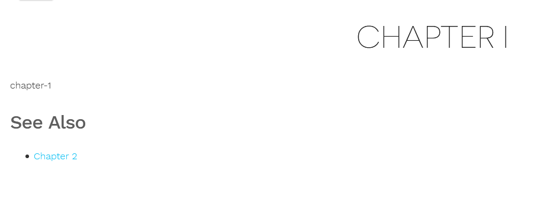

本文主要介绍了content文件夹下的内容管理
<!--more-->
## 内容资源的组织
```
└── content
    └── about
    |   └── index.md  // <- https://example.com/about/
    ├── posts
    |   ├── firstpost.md   // <- https://example.com/posts/firstpost/
    |   ├── happy
    |   |   └── ness.md  // <- https://example.com/posts/happy/ness/
    |   └── secondpost.md  // <- https://example.com/posts/secondpost/
    └── quote
        ├── first.md       // <- https://example.com/quote/first/
        └── second.md      // <- https://example.com/quote/second/
``` 
content文件夹下的内容和URL的关系由上所示，可以分为两种，一种是索引页，一种是单页。  
**索引页：_index.md**  
  该页面比较特殊可以通过添加front matter和内容然后使用列表模板进行处理。列表模板包括有section templates、taxonomy templates、taxonomy terms templates和homepage template。

  在对应模板中可以使用 .Site.GetPage函数获取该页面的内容和元数据


```
.         url
.       ⊢--^-⊣
.        path    slug
.       ⊢--^-⊣⊢---^---⊣
.           filepath
.       ⊢------^------⊣
content/posts/_index.md
```
当你构建你的网站后，内容文件将可以通过下面的URL进行访问：
```
                    url ("/posts/")
                    ⊢-^-⊣
       baseurl      section ("posts")
⊢--------^---------⊣⊢-^-⊣
        permalink
⊢----------^-------------⊣
https://example.com/posts/index.html
```

**单页**  
每个section中的单个内容文件将被呈现一个单独的页面。下面是一个posts目录下单独文件的例子:
```
                   path ("posts/my-first-hugo-post.md")
.       ⊢-----------^------------⊣
.      section        slug
.       ⊢-^-⊣⊢--------^----------⊣
content/posts/my-first-hugo-post.md
```
当你构建你的网站后，内容文件将可以通过下面的URL进行访问：
```
                               url ("/posts/my-first-hugo-post/")
                   ⊢------------^----------⊣
       baseurl     section     slug
⊢--------^--------⊣⊢-^--⊣⊢-------^---------⊣
                 permalink
⊢--------------------^---------------------⊣
https://example.com/posts/my-first-hugo-post/index.html
```

路径解释：  
section：默认的内容类型由内容的section决定的。section是由项目内容目录中的位置决定的。section不能在front matter中被指定或者重写。通常content目录下的一级目录被作为一个section。  
slug：一个内容的slug要么是name.extension要么是name/。slug的值是取决于内容文件的名字或者是通过front matter 重写。

通过front matter重写目标路径：  
```yaml
---
title: A new post with the filename old-post.md
slug: "new-post"
---
```
将生成目标路径example.com/posts/new-post/

```yaml
---
title: Old URL
url: /blog/new-url/
---
```
将生成目标路径example.com/blog/new-url/

## 页面资源包 
Content文件夹下组织页面的形式是页包（page bundles），一个页包就是一个页面的所需资源。  
page bundles分为两种：  
叶包：在这个页面下没有其他的子节点了  
分支包：包括了（home page，section，taxonomy terms，taxonomy list）

|| 叶包 | 分支包 |
| :---: | :---: | :---: |
|使用 |内容集合和单页面的附件 |章节页面的附件集合|
|索引文件名 |index.md | _index.md|
|允许资源 |页面和非页面类型（image，pdf，等等）| 只能是非页面类型|
|资源允许存放位置 |在叶包所在目录层次中 | 只能与分支包在相同层次|
|布局类型 |single | list|
|嵌套 |不允许 |允许在它下面嵌套叶包或者分支包|
|非索引文件的内容| 仅作为页面资源访问| 仅作为常规页面访问|

## 内容格式
支持HTML和Markdown

## Front Matter
是以yaml、toml、json格式位于内容文件头部的一些元数据  
在这里定义的变量会覆盖在主站配置config.toml里`[params.page]`中的变量
```toml
categories = ["Development", "VIM"]
date = "2012-04-06"
description = "spf13-vim is a cross platform distribution of vim plugins and resources for Vim."
slug = "spf13-vim-3-0-release-and-new-website"
tags = [".vimrc", "plugins", "spf13-vim", "vim"]
title = "spf13-vim 3.0 release and new website"
```

**用户自定义**  
用户自定义的front matter可以通过在模板中使用.Param变量获得
**级联传递**  
通过级联可以传递变量给目标文件
```toml
[[cascade]]
  background = "yosemite.jpg"
  [cascade._target]
    kind = "page"
    lang = "en"
    path = "/blog/**"

[[cascade]]
  background = "goldenbridge.jpg"
  [cascade._target]
    kind = "section"
```

## 页面资源
页面资源只能从页面包中访问，就是根目录下的index.md或者_index.md。页面资源只对与它们捆绑在一起的页面可用。  
主要属性：  
Name: 默认值是文件名，可以通过front matter设置  
Title：同Name一样  
Permalink：绝对URL  
RelPermalink：相对URL  
Content：资源的内容，对于大多数资源该值返回一个文件内容的字符串。

主要方法：
ByType 通过给定类型返回页资源  
{{ .Resources.ByType "image" }}

Match 通过通配符模式匹配返回页资源slice  
{{ .Resources.Match "images/*" }}  
GetMatch 同Match一样但只返回第一个匹配

```
// Using Match/GetMatch to find this images/sunset.jpg ?
.Resources.Match "images/sun*" ✅
.Resources.Match "**/sunset.jpg" ✅
.Resources.Match "images/*.jpg" ✅
.Resources.Match "**.jpg" ✅
.Resources.Match "*" 🚫
.Resources.Match "sunset.jpg" 🚫
.Resources.Match "*sunset.jpg" 🚫
```

在front matter中设置资源属性
```toml
date = "2018-01-25"
title = "Application"
[[resources]]
  name = "header"
  #资源的新名词叫header，可以用.GetMatch "header"找到资源
  src = "images/sunset.jpg" 
[[resources]]
  src = "documents/photo_specs.pdf"
  title = "Photo Specifications"
  [resources.params]
    icon = "photo"
[[resources]]
  src = "documents/guide.pdf"
  title = "Instruction Guide"
[[resources]]
  src = "documents/checklist.pdf"
  title = "Document Checklist"

[[resources]]
  src = "documents/payment.docx"
  title = "Proof of Payment"
[[resources]]
  # pdf文件将得到名字pdf-file-1,pdf-file-2,pdf-file-3
  # :counter 是计数占位符号
  name = "pdf-file-:counter"
  src = "**.pdf"
  # 所有的pdf将得到一个pdf图标,除了photo_specs.pdf
  # 只有第一个设置的标题，名字和paramskeys 会被使用。
  # 只有未设置的参数才会设置连续的参数。
  [resources.params]
    icon = "pdf"
[[resources]]
  src = "**.docx"
  [resources.params]
    icon = "word"
```

## Shortcodes
Shortcodes可以在内容文件中使用调用内建或者自定义的模板。  
使用方式：  
```markdown
{}content{}或者
content
```
 使用<>号时表示内容不会再进行进一步的渲染。


## 关联页面内容
hugo根据页面front matters中的（tags，keywords，date）来关联各个页面。  
layouts/partials/related.html
```html
{{ $related := .Site.RegularPages.Related . | first 5 }}
{{ with $related }}
<h3>See Also</h3>
<ul>
	{{ range . }}
	<li><a href="{{ .RelPermalink }}">{{ .Title }}</a></li>
	{{ end }}
</ul>
{{ end }}
```
在页面加入{{ partial "related.html" . }}后显示如下:  


## Section
Section是基于content/目录下的组织结构定义的页面集合。  
默认情况下，content/下的所有第一级目录都有自己的sections(根节点)。  
如果需要定义更深层次的section foo，可以需要创建一个名为foo的目录，并带有_index.md文件

**嵌套section**
```
content
└── blog        <-- Section, because first-level dir under content/
    ├── funny-cats
    │   ├── mypost.md
    │   └── kittens         <-- Section, because contains _index.md
    │       └── _index.md
    └── tech                <-- Section, because contains _index.md
        └── _index.md
```

**页变量和方法**
.CurrentSection：页面当前的section。如果页面本身就是一个section，那就获得它自己  
.FirstSection：根节点下的第一个section  
.InSection $page：给定的页面是否在当前的section中  
.IsAncestor $page：当前页面是否是给定页面的祖先  
.IsDescendant $page：当前页面是否是给定页面的后代  
.Parent：section的父节点或者是一个页面的section  
.Section：此页面所属的section  

对于嵌套sections，这是在目录中的第一个路径元素。例如： /blog/funny/mypost/ => blog

.Sections：这个内容下的sections  

**利用.Parent做一个访问记录导航栏**
```html
{{define "breadcrumb"}}
  {{$parent := .page.Parent }}
  {{ if $parent }}
    {{ $value := (printf "<a href='%s'>%s</a> > %s" $parent.RelPermalink $parent.Title .value) }}
    {{ template "breadcrumb" dict "page" $parent "value" $value }}
  {{else}}
    {{.value|safeHTML}}
  {{end}}
{{end}}

{{ template "breadcrumb" dict "page" . "value" .Title }}
```

## Archetypes(模板原型)
原型是创造一个新内容时的模板文件。  
但使用 hugo new命令创造内容时会在archetypes目录下查找模板。

hugo new posts/my-first-post.md，查找顺序如下：
1. archetypes/posts.md
2. archetypes/default.md
3. themes/my-theme/archetypes/posts.md
4. themes/my-theme/archetypes/default.md

模板示例：
```markdown
---
title: "{{ replace .Name "-" " " | title }}"
date: {{ .Date }}
draft: true
---

**Insert Lead paragraph here.**

## New Cool Posts

{{ range first 10 ( where .Site.RegularPages "Type" "cool" ) }}
* {{ .Title }}
{{ end }}
```

## Taxonomies(分类)
taxonomies是内容之间的逻辑关系的分类  
定义：  
Taxonomy：内容分类  
Term：分类中的一个键  
Value：Term对应的一块内容  
例如：  
一个电影网站进行分类
```
Actor                    <- Taxonomy
    Bruce Willis         <- Term
        The Sixth Sense  <- Value
        Unbreakable      <- Value
        Moonrise Kingdom <- Value
    Samuel L. Jackson    <- Term
        Unbreakable      <- Value
        The Avengers     <- Value
        xXx              <- Value
```
根据内容的不同，关系也会发生变化
```
Unbreakable                 <- Value
    Actors                  <- Taxonomy
        Bruce Willis        <- Term
        Samuel L. Jackson   <- Term
    Director                <- Taxonomy
        M. Night Shyamalan  <- Term
```

**配置**  
默认配置：
```toml
[taxonomies]
  category = "categories"
  tag = "tags"
```
如果不需要分类可以在配置中添加：
```toml
disableKinds = ["taxonomy", "term"]
```
添加一个自定义叫series的分类
```
[taxonomies]
  category = "categories"
  series = "series"
  tag = "tags"
```
分类工作是hugo自己进行的，我们只需要编写分类模板就行。

## 链接和引用
链接可以使用简码ref或者relref
```markdown



```
如果参数没带 / 开头就会从相对于当前页的位置解析。

使用markdown写标题 ## reference会产生如下HTML
```html
<h2 id="reference">Reference</h2>
```
使用ref或者relref时就可以通过id来创造指向这个id的链接
```markdown


```

## URL管理
默认HUGO会把你的网站放在public/下面，不过你可以在配置文件中指定一个`publishDir`。在配置中的`permalinks`选项可以用来调整content下目录的URL路径。  
配置举例：
```yaml
permalinks:
  posts: /:year/:month/:title/
```
该配置会影响到content/posts目录下的文件输出URL。并且输出格式是按照"/年/月/日"。

Permalink配置值：
|配置|作用|
| :---: | :---: |
| :year | 4位数字的年份 |
| :month | 2位的月份 |
| :monthname | 月份的名称 |
| :day | 两位的天数 |
| :weekday | 一位的星期（星期天是0） |
| :yearday | 1到3位的一年中的某一天 |
| :section | 章节名称 |
| :title | 文章的标题 |
| :slug | 可以在front matter配置 |
| :filename | 文件名称 |


## 菜单
可以把一些链接加入菜单，然后在导航栏页面显示出来。
直接在内容文件的front matter中加入
```toml
+++
[menu]
  [menu.shortcuts]
    identifier = "chapter"
    name = "chapter1"
    weight = -110
+++
```
也可以在配置文件config.toml中加入
```toml
[menu]
  [[menu.main]]
    identifier = "about"
    name = "about hugo"
    pre = "<i class='fa fa-heart'></i>"
    url = "/about/"
    weight = -110
```
现在就可以在模板文件中通过 .Site.Menus.shortcuts来使用菜单变量

## Table of Contents
Hugo 自动解析你的md文件并创造能在模板中使用的内容表格TOC
文件：layout/_default/single.html
```html
{{ define "main" }}
<main>
    <article>
    <header>
        <h1>{{ .Title }}</h1>
    </header>
        {{ .Content }}
    </article>
    <aside>
        {{ .TableOfContents }}
    </aside>
</main>
{{ end }}
```