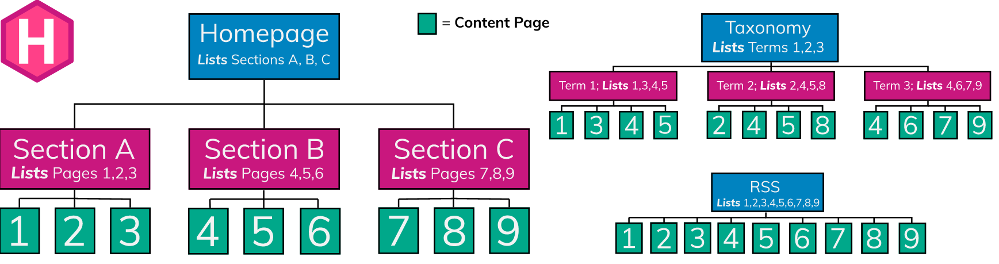
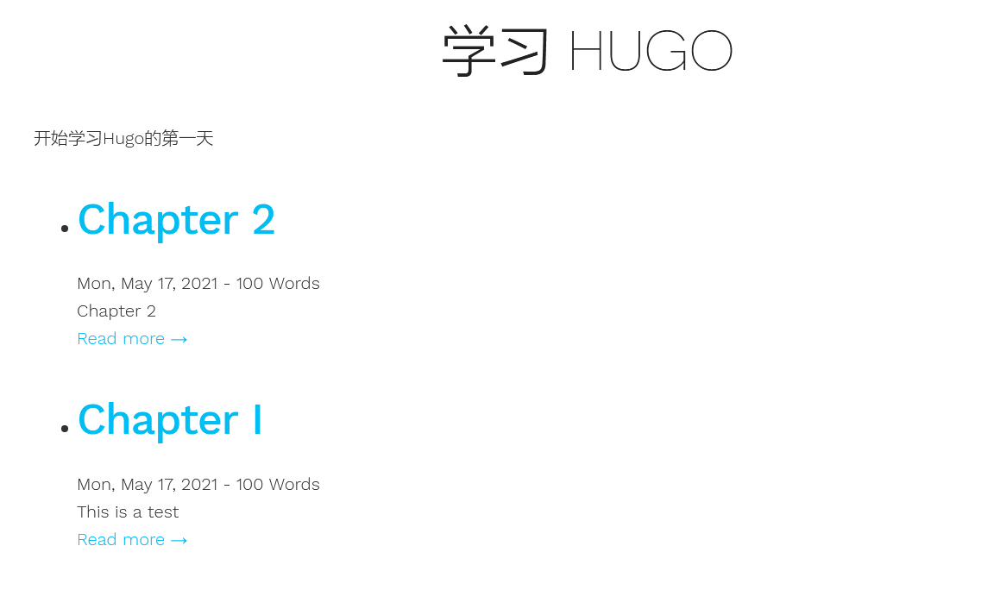

hugo使用的是go语言自带的模板引擎, 本文简单介绍下go模板规则和hugo中的几个特殊模板
<!--more-->

## 模板动作
动作分为两种类型  
* 数据求值
* 控制结构
求值的结果会直接输出到模板中, 控制结构主要包含条件, 循环, 函数调用等.  

### 访问变量
{{.}}  
点`.`代表传递给模板的数据, 表示当前模板的上下文, 他可以是go语言中的任何类型, 如: 字符串, 数组, 结构体等.  

### 注释
{{/* comment */}}

### 空格处理
```html
// 清除 pipeline 前后的空格
{{- pipeline -}}

// 清除 pipeline 前面的空格
{{- pipeline }}

// 清除 pipeline 后面的空格
{{ pipeline -}}
```

### 变量
```html
{{$变量名 := "值"}}
```
使用$.访问全局变量
```html
<ul>
{{ range .Params.tags }}
    <li>
        <a href="/tags/{{ . | urlize }}">{{ . }} </a>
            - {{ $.site.Title }}
    </li>
{{ end }}
</ul>
```

使用front matter中的变量
```yaml
---
title: Roadmap
notoc: true
---
```
在模板中使用：  
```html
{{ if not .Params.notoc }}
<aside>
    <header>
        <a href="#{{.Title | urlize}}">
        <h3>{{.Title}}</h3>
        </a>
    </header>
    {{.TableOfContents}}
</aside>
<a href="#" id="toc-toggle"></a>
{{ end }}
```

使用网站配置参数  
```toml
[params]
  copyrighthtml = "Copyright &#xA9; 2017 John Doe. All Rights Reserved."
  sidebarrecentlimit = 5
  twitteruser = "spf13"
```
在模板中使用：  
```html
{{ if .Site.Params.copyrighthtml }}
    <footer>
        <div class="text-center">{{.Site.Params.CopyrightHTML | safeHTML}}</div>
    </footer>
{{ end }}
```

### 条件判断
```html
{{if pipeline}} T1 {{end}} 
如果pipeline为空则不会输出任何结果, 否则输出T1.
下面这些情况pipeline的值为空, false, 0, 值为nil的指针或接口, 长度为0的数组, 切片, map和字符串

{{if pipeline}} T1 {{else}} T0 {{end}}
如果不为空则输出T1, 否则输出T0

{{if pipeline}} T1 {{else if pipeline}} T0 {{end}}

{{if or (pipeline1) (pipeline2) }} {{ end }}

{{if and (pipeline1) (pipeline2) }} {{ end }}
```

### 循环语句
```html
{{range pipeline}} T1 {{end}}
pipeline的值必须是数组, 切片, map, channel. 
如果pipeline的长度为0则不会输出任何结果. 否则设置点`.`为数组, 切片, map的遍历值, 输出T1.
```
eg 1：使用'.'  
```html
{{ range $array }}
{{ .  }}
{{ end }}
```
eg 2：为数组元素声明一个变量名
```html
{{ range $elem_val := $array }}
{{ $elem_val }}
{{ end }}
```
eg 3：为数组元素或者map元素的索引和值都声明一个变量名
```html
{{ range $elem_index, $elem_val := $array }}
{{ $elem_index }} -- {{ $elem_val }}
{{ end }}
```

### with
```html
{{with pipeline}} T1 {{end}}
如果pipeline的值为空, 点`.`的值不受影响,不输出任何结果
否则点`.`的值设置成pipeline的值, 输出T1

{{with pipeline}} T1 {{else}} T0 {{end}}
如果pipeline的值为空, 点`.`的值不受影响,输出T1
否则点`.`的值设置成pipeline的值, 输出T0
```
这就相当于重新创建了新的上下文环境. 在{{with}}内的点(.)的值为新的值, 也就是{{with pipeline}}传进来的值.

### 管道
似与unix的管道，可以将一个命令的输出作为另一个命令的输入，有一个限制是只能处理单个值。
eg 1：shuffle
```html
{{ shuffle (seq 1 5) }}
= {{ (seq 1 5) | shuffle }}
```

eg 2：index
```html
{{ index .Params "disqus_url" | html }}
```

eg 3：or
```html
{{ if or (or (isset .Params "title") (isset .Params "caption")) (isset .Params "attr")}}
Stuff Here
{{ end }}
=
{{ if isset .Params "caption" | or isset .Params "title" | or isset .Params "attr" }}
Stuff Here
{{ end }}
```

## 模板的嵌套
在编写模板的时候, 常常将公用的部分单独做成一个模板, 如每一个页面都有导航栏, 页首, 页脚等, 然后在需要的地方导入这些模板,一般会先编写一个基础模板, 然后在基础模板中引入子模板, hugo默认的基础模板页是_default/baseof.html.

### define
```html
{{define "name"}} T1 {{end}}
定义一个特定名称的模板
```

### template
```html
{{template "name"}}
引入指定名称的模板, 不传入任何数据.

{{template "name" pipeline}}
引入指定名称的模板, 设置模板上下文点`.`的值为pipeline的值
```

### block
```html
{{block "name" pipeline}} T1 {{end}}
= {{ define "name" }} T1 {{end}} {{ template "name" pipeline }}
定义特定名称的模板, 并在当前位置引入该名称的模板, 模板的上下文点`.`的值为pipline的值, 
如果该名称的模板未实现(不存在), 则输出T1
就相当于在基础模板页中定义了一个子模板占位符.
```

### hugo中模板嵌套规则
hugo中引入模板改用partial, template只用来引入内部模板. partial通过路径的方式引入模板, 被引入的子模板不在需要定义模板名.  
如果模板页面通过define定义了模板名称, 则该子模板会输出到基础模板页baseof.html中block定义的对应名称的位置.
```html
{{ partial "<PATH>/<PARTIAL>.html" . }}   // 语法
partial引入模板时的查找路径只会在下面两个地方
layouts/partials/*<PARTIALNAME>.html
themes/<THEME>/layouts/partials/*<PARTIALNAME>.html
```

## HUGO模板
hugo使用多个不同的模板来渲染不同的页面，有基础模板，主页模板，单页模板，分类模板，列表模板，部分模板，菜单模板等等。一个页面可能能被多个模板渲染，比如下面列表页模板的例子也能被章节页模板渲染，但是实际上hugo是有一个[查找规则](https://gohugo.io/templates/lookup-order/)
，只会使用优先级在前面的模板渲染页面。

### 基础模板
baseof.html为hugo的默认基础模板页, 主要用于block语法. baseof.html存放在以下两个位置
>layouts/_default/baseof.html  
>themes/<THEME>/layouts/_default/baseof.html

hugo先找到需要解析的模板, 如果模板中有{{define "name"}} T1 {{end}}, 则再去加载baseof.html基础模板, 并对比baseof.html中的{{block "name" pipeline}} T1 {{end}}, 如果找到相同的名称则在block处输出define中的T1, 如果没有找到相同的名称, 则在block处输出block中的T1

### 列表页模板
一个列表页模板可以应用于以下几个内容
* 分类项目页
* 分类列表页
* 章节列表页
* RSS



默认模板位置：  
`/layouts/_default/list.html`
`themes/<THEME>/layouts/_default/list.html`

示例：  
content文件夹内容：
```
├── content
|   ├── posts
|   |   ├── _index.md
|   |   ├── chapter-1.md
|   |   └── chapter-1.md
```
---
/content/posts/_index.md
```markdown
---
title: 学习 Hugo
date: 2021-05-17
publishdate: 2021-05-17
---

开始学习Hugo的第一天
```
---
layouts/_default/list.html
```html
{{ if eq .Kind "section" }}
	<article>
         {{ .Content }}
	</article>
	<ul>
        {{ range .Pages }}
            <li>
                <a href="{{ .Permalink }}">{{ .Date.Format "2006-01-02" }} | {{ .Title }}</a>
            </li>
        {{ end }}
	</ul>
{{end}}
```
运行hugo生成站点后可以在浏览器看到


### 章节页模板
章节页模板属于列表因此有列表页的所有变量和方法  

使用.site.GetPage方法获取页面
GetPage方法可以直接获取给定路径上的页面，也可以给定一个类型
eg :
* `{{ .Site.GetPage "section" "posts" }}`
* `{{ .Site.GetPage "page" "search" }}`  
创建一个默认的章节模板，文件内容同列表页模板中的例子  
---
layout/_default/section.html
```html
{{ partial "header.html" . }}
<article>
    {{ .Content }}
</article>
<ul class="contents">
    {{ range .Pages }}
        <li>
            {{ .Render "summary" }}
        </li>
    {{ end }}
</ul>
{{ partial "footer.html" . }}
```
其中{{ .Render "summary" }}是使用hugo的模板方法配合summary模板渲染页面，该方法会将整个页变量传给summary模板，summary模板如下：
```html
<article class="post">
  <header>
    <h2><a href='{{ .Permalink }}'> {{ .Title }}</a> </h2>
    <div class="post-meta">{{ .Date.Format "Mon, Jan 2, 2006" }} - {{ .FuzzyWordCount }} Words </div>
  </header>
  {{ .Summary }}
  <footer>
  <a href='{{ .Permalink }}'><nobr>Read more →</nobr></a>
  </footer>
</article>
```html
<article class="post">
  <header>
    <h2><a href='{{ .Permalink }}'> {{ .Title }}</a> </h2>
    <div class="post-meta">{{ .Date.Format "Mon, Jan 2, 2006" }} - {{ .FuzzyWordCount }} Words </div>
  </header>
  {{ .Summary }}
  <footer>
  <a href='{{ .Permalink }}'><nobr>Read more →</nobr></a>
  </footer>
</article>
```
运行hugo生成站点后打开浏览器，见下：
