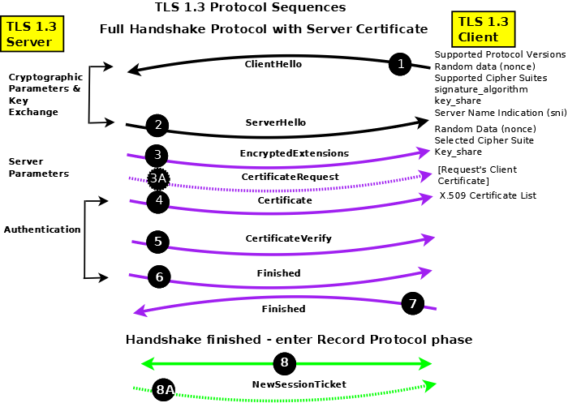

借鉴原文：https://segmentfault.com/a/1190000002554673
<!--more-->

## 简介
* SSL：（Secure Socket Layer，安全套接字层），为Netscape所研发，用以保障在Internet上数据传输之安全，利用数据加密(Encryption)技术，可确保数据在网络上之传输过程中不会被截取。它已被广泛地用于Web浏览器与服务器之间的身份认证和加密数据传输。
SSL协议位于TCP/IP协议与各种应用层协议之间，为数据通讯提供安全支持。SSL协议可分为两层： SSL记录协议（SSL Record Protocol）：它建立在可靠的传输协议（如TCP）之上，为高层协议提供数据封装、压缩、加密等基本功能的支持。 SSL握手协议（SSL Handshake Protocol）：它建立在SSL记录协议之上，用于在实际的数据传输开始前，通讯双方进行身份认证、协商加密算法、交换加密密钥等。
* TLS：(Transport Layer Security，传输层安全协议)，用于两个应用程序之间提供保密性和数据完整性。
TLS 1.0是IETF（Internet Engineering Task Force，Internet工程任务组）制定的一种新的协议，它建立在SSL 3.0协议规范之上，是SSL 3.0的后续版本，可以理解为SSL 3.1，它是写入了[RFC](https://datatracker.ietf.org/doc/html/rfc5246) 的。该协议由两层组成： TLS 记录协议（TLS Record）和 TLS 握手协议（TLS Handshake）。较低的层为 TLS 记录协议，位于某个可靠的传输协议（例如 TCP）上面。   

SSL/TLS协议提供的服务主要有：
1. 认证用户和服务器，确保数据发送到正确的客户机和服务器；
2. 加密数据以防止数据中途被窃取；
3. 维护数据的完整性，确保数据在传输过程中不被改变。

## TLS与SSL的差异
1. 版本号：TLS记录格式与SSL记录格式相同，但版本号的值不同，TLS的版本1.0使用的版本号为SSLv3.1。
2. 报文鉴别码：SSLv3.0和TLS的MAC算法及MAC计算的范围不同。TLS使用了RFC-2104定义的HMAC算法。SSLv3.0使用了相似的算法，两者差别在于SSLv3.0中，填充字节与密钥之间采用的是连接运算，而HMAC算法采用的是异或运算。但是两者的安全程度是相同的。
3. 伪随机函数：TLS使用了称为PRF的伪随机函数来将密钥扩展成数据块，是更安全的方式。
4. 报警代码：TLS支持几乎所有的SSLv3.0报警代码，而且TLS还补充定义了很多报警代码，如解密失败（decryption_failed）、记录溢出（record_overflow）、未知CA（unknown_ca）、拒绝访问（access_denied）等。
5. 密文族和客户证书：SSLv3.0和TLS存在少量差别，即TLS不支持Fortezza密钥交换、加密算法和客户证书。
6. certificate_verify和finished消息：SSLv3.0和TLS在用certificate_verify和finished消息计算MD5和SHA-1散列码时，计算的输入有少许差别，但安全性相当。
7. 加密计算：TLS与SSLv3.0在计算主密值（master secret）时采用的方式不同。
8. 填充：用户数据加密之前需要增加的填充字节。在SSL中，填充后的数据长度要达到密文块长度的最小整数倍。而在TLS中，填充后的数据长度可以是密文块长度的任意整数倍（但填充的最大长度为255字节），这种方式可以防止基于对报文长度进行分析的攻击。

**TLS的主要增强内容**  
TLS的主要目标是使SSL更安全，并使协议的规范更精确和完善。TLS 在SSL v3.0 的基础上，提供了以下增强内容：
1. 更安全的MAC算法
2. 更严密的警报
3. “灰色区域”规范的更明确的定义

**TLS对于安全性的改进**   
1. 对于消息认证使用密钥散列法：TLS 使用“消息认证代码的密钥散列法”（HMAC），当记录在开放的网络（如因特网）上传送时，该代码确保记录不会被变更。SSLv3.0还提供键控消息认证，但HMAC比SSLv3.0使用的（消息认证代码）MAC 功能更安全。
2. 增强的伪随机功能（PRF）：PRF生成密钥数据。在TLS中，HMAC定义PRF。PRF使用两种散列算法保证其安全性。如果任一算法暴露了，只要第二种算法未暴露，则数据仍然是安全的。
3. 改进的已完成消息验证：TLS和SSLv3.0都对两个端点提供已完成的消息，该消息认证交换的消息没有被变更。然而，TLS将此已完成消息基于PRF和HMAC值之上，这也比SSLv3.0更安全。
4. 一致证书处理：与SSLv3.0不同，TLS试图指定必须在TLS之间实现交换的证书类型。
5. 特定警报消息：TLS提供更多的特定和附加警报，以指示任一会话端点检测到的问题。TLS还对何时应该发送某些警报进行记录。

## 密钥协商过程——TLS握手
SSL协议分为两部分：Handshake Protocol和Record Protocol。其中Handshake Protocol用来协商密钥，协议的大部分内容就是通信双方如何利用它来安全的协商出一份密钥。 Record Protocol传输加密的数据流例如HTTP，SMTP或者IMAP。

由于非对称加密的速度比较慢，所以它一般用于密钥交换，双方通过公钥算法协商出一份密钥，然后通过对称加密来通信，当然，为了保证数据的完整性，在加密前要先经过HMAC的处理。  

SSL缺省只进行server端的认证，客户端的认证是可选的。以下是其流程图:
<div style="text-align: center">


</div>

### 客户端发出请求（ClientHello）
由于客户端(如浏览器)对一些加解密算法的支持程度不一样，但是在TLS协议传输过程中必须使用同一套加解密算法才能保证数据能够正常的加解密。在TLS握手阶段，客户端首先要告知服务端，自己支持哪些加密算法，所以客户端需要将本地支持的加密套件(Cipher Suite)的列表传送给服务端。除此之外，客户端还要产生一个随机数，这个随机数一方面需要在客户端保存，另一方面需要传送给服务端，客户端的随机数需要跟服务端产生的随机数结合起来产生后面要讲到的 Master Secret 。

综上，在这一步，客户端主要向服务器提供以下信息：

1. 支持的协议版本，比如TLS 1.0版
2. 一个客户端生成的随机数，稍后用于生成"对话密钥"
3. 支持的加密方法，比如RSA公钥加密
4. 支持的压缩方法

### 服务器回应（ServerHello）
从流程图中可以看到，从Server Hello到Server Done，有些服务端的实现是每条单独发送，有服务端实现是合并到一起发送。Sever Hello和Server Done都是只有头没有内容的数据。  

服务端在接收到客户端的Client Hello之后，服务端需要将自己的证书发送给客户端。这个证书是对于服务端的一种认证。例如，客户端收到了一个来自于称自己是www.alipay.com的数据，但是如何证明对方是合法的alipay支付宝呢？这就是证书的作用，支付宝的证书可以证明它是alipay，而不是财付通。证书是需要申请，并由专门的数字证书认证机构(CA)通过非常严格的审核之后颁发的电子证书。颁发证书的同时会产生一个私钥和公钥。私钥由服务端自己保存，不可泄漏。公钥则是附带在证书的信息中，可以公开的。证书本身也附带一个证书电子签名，这个签名用来验证证书的完整性和真实性，可以防止证书被串改。另外，证书还有个有效期。  

在服务端向客户端发送的证书中没有提供足够的信息（证书公钥）的时候，还可以向客户端发送一个 Server Key Exchange。  

此外，对于非常重要的保密数据，服务端还需要对客户端进行验证，以保证数据传送给了安全的合法的客户端。服务端可以向客户端发出 Cerficate Request 消息，要求客户端发送证书对客户端的合法性进行验证。比如，金融机构往往只允许认证客户连入自己的网络，就会向正式客户提供USB密钥，里面就包含了一张客户端证书。  

跟客户端一样，服务端也需要产生一个随机数发送给客户端。客户端和服务端都需要使用这两个随机数来产生Master Secret。  

最后服务端会发送一个Server Hello Done消息给客户端，表示Server Hello消息结束了。  

综上，在这一步，服务器的回应包含以下内容：

1.  确认使用的加密通信协议版本，比如TLS 1.0版本。如果浏览器与服务器支持的版本不一致，服务器关闭加密通信
2.  一个服务器生成的随机数，稍后用于生成"对话密钥"
3.  确认使用的加密方法，比如RSA公钥加密
4.  服务器证书

### 客户端回应（Certificate Verify）
**Client Key Exchange**  
如果服务端需要对客户端进行验证，在客户端收到服务端的 Server Hello 消息之后，首先需要向服务端发送客户端的证书，让服务端来验证客户端的合法性。

**Certificate Verify**  
接着，客户端需要对服务端的证书进行检查，如果证书不是可信机构颁布、或者证书中的域名与实际域名不一致、或者证书已经过期，就会向访问者显示一个警告，由其选择是否还要继续通信。如果证书没有问题，客户端就会从服务器证书中取出服务器的公钥。然后，向服务器发送下面三项信息：

1.  一个随机数。该随机数用服务器公钥加密，防止被窃听
2.  编码改变通知，表示随后的信息都将用双方商定的加密方法和密钥发送
3.  客户端握手结束通知，表示客户端的握手阶段已经结束。这一项同时也是前面发送的所有内容的hash值，用来供服务器校验

上面第一项的随机数，是整个握手阶段出现的第三个随机数，它是客户端使用一些加密算法(例如：RSA, Diffie-Hellman)产生一个48个字节的Key，这个Key叫 PreMaster Secret，很多材料上也被称作 Pre-main secret。它可以同之前的客户端随机数和服务端随机数结合使用"pseudorandom function"生成Session Secret（Session key）。

**ChangeCipherSpec**  
ChangeCipherSpec是一个独立的协议，体现在数据包中就是一个字节的数据，用于告知服务端，客户端已经切换到之前协商好的加密套件（Cipher Suite）的状态，准备使用之前协商好的加密套件加密数据并传输了。  

在ChangecipherSpec传输完毕之后，客户端会使用之前协商好的加密套件和Session Secret加密一段 Finish 的数据传送给服务端，此数据是为了在正式传输应用数据之前对刚刚握手建立起来的加解密通道进行验证。  

### 服务器最后回应（Server Finish）
服务端在接收到客户端传过来的 PreMaster 加密数据之后，使用私钥对这段加密数据进行解密，并对数据进行验证，也会使用跟客户端同样的方式生成 Session Secret，一切准备好之后，会给客户端发送一个 ChangeCipherSpec，告知客户端已经切换到协商过的加密套件状态，准备使用加密套件和 Session Secret加密数据了。之后，服务端也会使用 Session Secret 加密一段 Finish 消息发送给客户端，以验证之前通过握手建立起来的加解密通道是否成功。  

根据之前的握手信息，如果客户端和服务端都能对Finish信息进行正常加解密且消息正确的被验证，则说明握手通道已经建立成功，接下来，双方可以使用上面产生的Session Secret对数据进行加密传输了。  

### 使用OpenSSL生成自签名SAN证书
SAN(Subject Alternative Name) 是 SSL 标准 x509 中定义的一个扩展。使用了 SAN 字段的 SSL 证书，可以扩展此证书支持的域名，使得一个证书可以支持多个不同域名的解析。使用OpenSSL生成步骤如下：
1. 生成CA
```shell
$ openssl req -x509 -newkey rsa:2048 -keyout ca.key -subj "/CN=example.ca.com" -days 5000 -out ca.crt
```
如果出现`Can't load /root/.rnd into RNG`错误，执行
```shell
$ cd ~;openssl rand -writerand .rnd
```

2. 生成私钥
```shell
$ openssl genrsa -out server.key 2048
```

3. 生成签名请求文件
```shell
$ openssl req -new -subj "/C=FJ/L=China/O=server/CN=example.site" -key server.key -out server.csr -config ./openssl.cnf -extensions v3_req
```
其中配置文件openssl.cnf，从`/etc/ssl/openssl.cnf`复制到当前文件夹下，并且需要做以下修改
```shell
#1：把openssl.cfg 拷贝到当前目录
#2：找到 [ CA_default ],打开 copy_extensions = copy
#3：找到[ req ],打开 req_extensions = v3_req # The extensions to add to a certificate request
#4：找到[ v3_req ],添加 subjectAltName = "DNS:example1.site, DNS:example2.site"
#或者subjectAltName = @alt_names，然后在文件中添加新的标签 [ alt_names ] , 和标签字段  
#DNS.1 = example1.site
#DNS.2 = example2.site
```

4. 签名SAN证书
```shell
openssl x509 -req -sha256 -CA ca.crt -CAkey ca.key -CAcreateserial -days 365 -in server.csr -out server.crt -extfile ./openssl.cnf -extensions v3_req
```
配置文件同上一步。