本文根据论文`In Search of an Understandable Consensus Algorithm(Extended Version)`及mit 6.824课程相关内容编写
<!--more-->

## 论文内容
### 简介
共识算法允许一个由多个机器组成的集合作为一个共识组去工作，并能在它的一些成员失败的情况下正常工作。Raft与其它共识算法相比有以下几个特征：  
* 强领导者：Raft使用一个比其他共识算法更强的领导关系。举个例子，日志条目仅从领导者流向其他的服务器。这简化了复制日志管理并且使得Raft更易于理解。
* 领导者选举：Raft使用随机化的定时器去选举领导者。这只在共识算法要求的心跳上增加了少量机制，简单且迅速地解决了冲突。
* 成员关系改变：Raft的机制在集群中对于服务的设置改变使用一种新的联合共识方式，在这种方式中两个不同的配置的大部分在转换过程中重叠。这允许集群在配置改变的过程中继续正常的工作。

### 复制状态机
共识算法通常出现在复制状态机的环境中。在这种方式，状态机在服务器集合上计算一样状态的相同拷贝并且即使一些服务器宕机也能继续操作。复制状态机被用来在分布式系统中解决多种错误容忍问题。举个例子，大型系统有一个单独的集群领导者，例如GFS，HDFS和RAMCloud，典型地使用一个单独的复制状态机去管理领导者选举和存储必须在领导者奔溃时保存的配置信息。复制状态机的例子包括Chubby和ZooKeeper。
<div class="illustration">
<div class="picture">

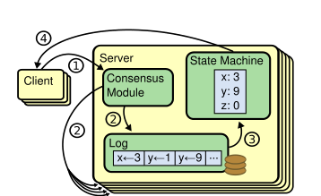
</div>
<div class="comment">图1：复制状态机架构。共识算法管理一个复制日志包含了从客户端的状态机命令。状态机从日志的同一命令序列处理，因此他们产生相同的输出。</div>
</div>

保持复制日志持久是共识算法的工作。在一台服务器上的共识模块收到从客户端传来的命令并且添加他们进日志。它和另一台服务器上的共识模块通信去确保每个日志最后都以相同顺序包含相同请求，即使一些服务器失败。一旦正确地复制了命令，每个服务器的状态机会以日志顺序处理他们。因此服务器集群可以看成形成了一个单独的，高可靠状态机。

实际系统的共识算法通常有以下属性：  
* 他们在所有的非拜占庭条件下确保安全性（绝不返回一个不正确的结果），包括网络延迟，分块，丢包，重复和重排序。
* 它们只要服务器中的大多数是可操作的并且能相互之间和客户端通信就具有完全功能（可用性）。因此一个典型的五台服务器集群能够忍受任意两台服务器的错误。假设服务器失败而停止；他们可能在之后从稳定存储上的状态恢复并且重新接入集群。
* 它们没有依靠定时去确保日志的一致性；会出现错误的时钟和额外的消息延迟，最糟的是，导致可用性问题。
* 在通常情况下，一条命令可以在集群中的大多数服务器响应一个RPC的单独轮询后立即完成；少部分的慢服务器不影响整个系统性能。

### Raft共识算法
Raft实现一致性通过选举一个突出的领导者，之后给与领导者完整的管理复制日志的责任。领导者接收来自客户端的日志条目，将它们复制到别的服务器上，并告诉服务器何时将日志条目应用到它们的状态机是安全的。只有一个领导者简化了复制日志的管理。举个例子，领导者能够不咨询其他的服务器决定在日志中何处放置新条目。并且数据以一种简单的方式从领导者流向其它的服务器。一个领导者会因某种原因失效或者与其他服务器失去连接，在这种情况下一个新的领导者将被选举。

考虑到领导者的方式，Raft分解一致性问题为三个相对独立的子问题，这些被讨论在接下来的子节：  
* 领导者选举：当存在领导者失效时必须选择一个新的领导者。
* 日志复制：领导者必须从客户机接收日志条目并且通过集群复制它们，强迫其它服务器的日志和它的一致。
* 安全性：如果任一服务器已经应用了一个指定的日志条目给它的状态机，那么任何其他服务器没有可能在一样的日志索引上是不同的命令 

#### State
*所有服务器上的持久化状态：*
|||
| :---: | :---: |
| currentTerm | 服务器上看到的最新期限（第一次启动初始化为0，单调递增） |
| votedFor | 在当前期限内获得投票的候选者（如果没有就为null）|
| log[] | 日志条目；每个条目中包含了给状态机的命令，和领导者收到条目的期限。（第一个索引是1） |

*所有服务器上的不稳定状态：*  
|||
| :---: | :---: |
| commitIndex | 知道日志条目中被提交的最高索引（初始化为0，单调递增）|
| lastApplied | 日志条目中被状态机实施的最高索引（初始化为0，单调递增）|

*领导者上的不稳定状态：*  
|||
| :---: | :---: |
| nextIndex[] | 对于每个服务器，发送给它们的下一条日志条目的索引（初始化为领导者最后日志索引+1） |
| matchIndex[] | 对于每个服务器，知道要在它们上复制的日志条目的最高索引。（初始化为0，单调递增） |

#### AppendEntries RPC
由领导者调用去复制日志条目到从机上；也用作发送心跳

*参数：*  
|||
| :---: | :---: |
| term | 领导者的任期 |
| leaderId | 这使得从机能够重定向到客户机 |
| prevLogIndex | 新的日志条目的前一个条目的索引 |
| prevLogTerm | preLogIndex的任期号 |
| entries[] | 新的日志条目(发送心跳时为空) |
| leaderCommit | 领导者的提交索引 |

*结果：*  
|||
| :---: | :---: |
| term | 服务器知道的当前任期号，以便领导者更新 |
| success | 如果从机包含的条目匹配prevLogIndex和prevLogTerm就为true |

*接收机实现：*  
1. 如果term < currentTerm 时回复false
2. 如果日志在prevLogIndex上的条目的term不匹配prevLogterm时回复false
3. 如果新的条目和已经存在的条目冲突（一样的索引但是不一样的期限），删除已经存在的条目和它之后的所有条目。
4. 添加日志中尚未添加的任何条目。
5. 如果leaderCommit > commitIndex, 设置 commitIndex = min（leaderCommit，最新条目的索引）

#### RequestVote RPC
候选者调用来收集投票

*参数：*  
|||
| :---: | :---: |
| term | 候选者的任期号 |
| candidateId | 候选者的ID |
| lastLogIndex | 候选者最后一个日志条目的索引 |
| lastLogTerm | 候选者最后一个日志条目的任期号 |

*结果：*  
|||
| :---: | :---: |
| term | 服务器知道的当前任期号，以便候选者更新 |
| voteGranted | 为true时说明收到投票 |

*接收机实现：*  
1. 如果term < currentTerm回复false
2. 如果votedFor为空或者candidateId存在，并且候选者的日志至少和接收机的日志一样新，授予投票

#### Rules for Servers

*所有服务器 :*  
* 如果commitIndex > lastApplied: 增加 lastApplied，使用状态机应用log[lastApplied]（ξ5.3）
* 如果RPC请求或响应中包含的term T > currentTerm: 设置currentTerm = T，转化为从机（ξ5.1）

*从机：*  
* 响应候选者和领导者的RPCs
* 如果选举超时而没有从当前领导者收到 AppendEnteries RPC或者没有授予候选者投票：转化为候选者

*候选者：*  
* 转化为候选者后开始选举：
* 增加currentTerm
* 投票给自己
* 重置选举定时器
* 发送RequestVote RPCs 给所有其他服务器
* 如果从大多数服务器收到投票：变为领导者
* 如果从新的领导者收到AppendEntriesRPC：转化为从机
* 如果选举已经超时：开始新一轮选举

*领导者：*  
* 选举后：发送初始化的空AppendEntries RPCs（heartbeat）给每个服务器；在每个空闲周期内重复发送以防止选举过时。
* 如果从客户机收到命令：附加一个条目到本地日志中，在条目被状态机实施后进行回复。
* 如果最后一个条日志索引 ≥ nextIndex 即下个发送给从机的条目索引：发送带着从nextIndex开始后的日志条目的AppendEntries RPC
* 如果成功：为从机更新nextIndex和matchIndex
* 如果因为日志不一致AppendEntries失败了：递减nextIndex并且重试
* 如果存在一个N，使得N > commitIndex，matchIndex[i]大部分 ≥ N，并且log[N].term == currentTerm: 设置commitIndex = N。

#### 关键属性
* 选举的安全性：在给定的期限内最多只有一位领导者能被选举。  
* 领导者仅附加：领导者绝不重写或者删除在日志中的条目。它仅仅附加新的条目。  
* 日志匹配：如果两个日志包含有一样期限和索引的条目，那么，日志中到给定索引为止的所有条目都是相同的。  
* 领导者完整性：如果在一个给定的期限提交了一个日志条目，那么那个条目将出现在所有更高编号term的领导者日志中。  
* 状态机的安全性：如果服务器已经将给定索引上的日志项应用到其状态机，那么任何其他服务器都不会有同一索引应用不同的日志项的情况。  

### Raft基础
一个Raft集群包含数台服务器；一个典型的数量是五，这允许系统能容忍两台失败。在任一给定的时间内每台服务器都在三个状态中的一个：领导者、从机或者候选者。在正常情况下有确切的一个领导者并且所有的其他服务器都是从机。从机是被动的：他们自己不提出请求但是简单的回应从领导者和候选者的请求。领导者处理所有的客户端请求（如果一个客户端联系了一个从机，从机会重定向到领导者）。第三个状态候选者是被用来选举一个新的领导者。图2展示了那个状态和它们的转换；接下来我们讨论这个转换。
<div class="illustration">
<div class="picture">

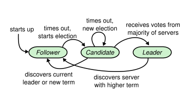
</div>
<div class="comment">图2：服务器状态。从机仅仅响应从其他服务器来的请求。如果一个从机没收到通信，它将成为一个候选者并且初始化一个选举。候选者接收从整个集群中大部分的投票成为新的领导者。领导者通常会工作到它们失败为止。</div>
</div>

Raft分割时间成任意数量的term(一个任期) ，如图3所示。任期是以连贯整数作为编号。每个任期开始一个选举，在选举中有一个或者多个候选者尝试去成为领导者。如果一个候选者赢得了选举，那么它将作为一个领导者在任期中的剩余时间进行服务。在一些情况下一个选举将导致选票割裂。在这个例子中任期结束时没有领导者产生；一个新的任期（伴随着一个新的选举）将立刻开始。Raft确保在大部分给定的任期中有一个领导者。
<div class="illustration">
<div class="picture">

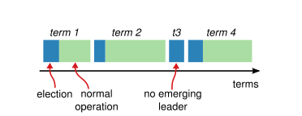
</div>
<div class="comment">图3：时间被分割成为多个任期，并且每个任期开始时产生一个选举。一个成功的选举后，单个领导者会管理集群直到任期结束。一些选举失败了，在这种情况下任期结束时没有选出一个领导者。任期之中的转变可能在不同服务器上的不同时间观察到。</div>
</div>

不同的服务器可能在不同时间观察到任期中的转变，并且在一些情况下一个服务器可能没有观察到一次选举甚至整个任期。任期在raft作为一个逻辑时钟，并且他们允许服务器去察觉过时的信息例如过期的领导者。每个服务器存储了一个`currentTerm`号，这个编号是随着时间单调递增的。无论何时服务器通信当前的任期都被相互交换；如果一个服务器的当前任期是比其它服务器的小，那么它会更新它的当前任期为更大的值。如果一个候选者或者领导者发现它的任期是过期了，它会立即返回这个过期的任期号，同时拒绝请求。

Raft服务器使用RPC进行通信，并且基本的共识算法要求只有两种RPC类型。RequestVote RPCs由候选者在选举期间初始化，AppendEntries RPCs由领导者复制日志条目和提供心跳数据的形成初始化。之后加入了第三个RPC在服务器之间传输快照。如果服务器没有在一个及时的方式内收到一个快照就会重新尝试RPCs，并且他们提出为了更好的性能使用并行RPCs。

### 领导者选举
Raft使用一个心跳机制去触发领导者选举。当服务器开始运行，它们开始作为一个从机。一个服务器只要它从其它候选者或者领导者收到有效的RPC就会保持它的从机身份。领导者定期地发送心跳（AppendEntries RPCs 不带日志条目）给所有的从机为了去维持他们的身份。如果一个从机在一个被称为election timeout的时间周期内没收到通信，那么它会猜想领导者失效了并且开始一个选举去选出一个新的领导者。

开始选举后，一个从机会递增它的`currentTerm`并且发送出候选者状态。它会在那时为自己投票并且并行发布RequestVote RPCs给集群中其他每个服务器。一个候选者一直保持这种状态直到下面三件事发送了一件：（a）它赢得了选举，（b）另一个服务器建立了他自己作为领机，（c）周期时间已经过了仍然没有选出赢家。接下来的段落分开地讨论这几点。

一个候选者如果收到了在任期内整个集群中大部分服务器的投票就赢得了选举。每个服务器将在一个给定任期内投票给最多的一个候选者，以一个先到先服务的原则。这个主要规则确保了为一个特定任期让最多得票的候选者可以赢得选举。一旦一个候选者赢得了选举，它成为领导者。它会在那时给所有其它服务器发送一个心跳消息去建立它的领导者权威防止产生新的选举。

等待投票的同时，一个候选者可能从其它自称为领导者的服务器收到一个AppendEntries RPC。如果领导者的任期（包括这个RPC）至少和候选者的任期一样大，那么候选者会意识到领导者是合法的并且返回一个从机的状态。如果RPC中的任期是小于候选者当前的任期，那么候选者拒绝该RPC并且继续一个选举状态。

第三种可能的结果是没有任何一个候选者赢得选举：如果很多从机在同一时间成为候选者，投票将被分散开这使得没有候选者能够获得大部分投票。当这发生时，每个候选者将超时并通过递增它的任期并初始化另一个RequestVote RPCs周期开始一轮新的选举。然而，没有额外的措施，分散的投票将永远地重复。

Raft使用随机化的选举超时设置去确保分散的投票情况是罕见的并且这种情况会被很快地解决。为了从一开始就防止分散投票，选举超时设置被随机化地从一个固定的间隔内（e.g：150-300ms）选择。这将分散服务器使得大多数情况下仅有单个服务器将超时；获胜的服务器会在任何意其他服务器超时前发送一个心跳。这样的机制被用来处理分散投票。每个候选者重新开始在一个选举开始时随机化它的选举超时设置，并且它会在下个选举开始前等待设置的超时时间的流逝；这减少了在新的选举开始后又发生分散投票的可能性。

### 日志复制
一旦一个领导者被选出，它开始服务客户端的请求。每个客户端请求包含一个命令被复制状态机执行。领导者附加这个命令在它的日志作为一个新的条目，之后并行地发布AppendEntries RPCs给其它服务器去复制这个条目。当这个条目已经被安全地复制好（下面有描述），领导者采用这个条目给它的状态机并且返回了执行结果给客户端。如果从机奔溃或者运行缓慢，也可能是网络包丢失，领导者无限地重试AppendEntries RPCs直到所有的从机最终都存储了所有的日志条目。

日志被组织如图4所示。当领导者收到一个条目时，每个日志条目顺着任期号存储了一个状态机命令。在日志中的任期号被用来察觉在日志间的不一致。每个日志条目有一个整数索引在日志中标识它的位置。
<div class="illustration">
<div class="picture">

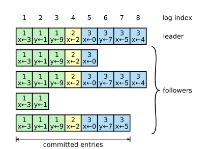
</div>
<div class="comment">图4：日志由条目组成，条目被连续地标号。每个条目包含了它被创造的任期（在每个盒子里的数字）还有一个给状态机的命令。 </div>
</div>

领导者决定何时对状态机应用日志条目是安全的；这样的一个条目被称作提交（committed）。Raft保证被提交的条目是可持久的并且最终将被所有可用的状态机执行。一旦领导者创造的条目被大多数服务器复制，这个日志条目就会被提交（e.g 图4的条目7）.也会提交在领导者日志所有之前的条目，包括被之前领导者创建的条目。前面讨论了领导者改变后应用这条规则的一些细节，并且也展示了提交的定义是安全的。领导者保持了对它自动被提交的最高索引的追踪，并将它包含在未来的AppendEntries RPCs（包括心跳）中，这使得其它的服务器最终也能发现。一旦一个从机知道了一个日志条目被提交，它会应用这个日志条目去本地状态机（以日志的顺序）。

我们设计Raft日志机制维持一个在不同服务器上日志的高相关性。不仅仅简化了服务器的行为也使得它更加可预测，而且确保安全性的重要组件。Raft维持了从机的属性，这个属性在一起构成了日志匹配属性 （Log Matching Property）：   
* 如果两个不同日志中的条目有一样的索引和term，那么他们保存一样的命令
* 如果两个不同日志中的条目有一样的索引和term，那么日志中所有之前的条目都是相同的。

第一条属性源于这样一个事实，一个领导者在给定的任期中用给定的最大日志索引创造一个条目，并且日志条目绝不改变它们在日志中的位置。第二条属性通过表现在AppendEntries简单的一致性检查来保证。当发送一个AppendEntries RPC时，领导者在它的日志中包含了条目的索引和任期，并立即处理新的条目。如果从机没在它的日志中找到一样索引和任期的条目，那么它会拒绝新的条目。一致性检查行为作为一个归纳步骤：日志初始化为空的状态以满足日志匹配属性，一致性检查在任何日志被扩展的时候都保护了日志匹配属性。因此，无论何时AppendEntries返回成功，领导者都会知道从机的日志与它自己的日志到最新的条目为止都是相同的。

在一般操作间，领导者和从机的日志都保持一致，因此AppendEntries的一致性检查绝不会失败。然而领导者奔溃会使得日志不一致（旧领导者的所有在它日志里的条目没有被完全复制）。这些不一致会产生一系列的领导者和从机奔溃。图5阐述了从机的日志可能不同于一个新领导者的方式。一个从机可能丢失在领导者上出现的条目，它可能有不在领导者上出现的额外的条目，或者两者都有。在日志中丢失和额外的条目可能跨越数个任期。
<div class="illustration">
<div class="picture">

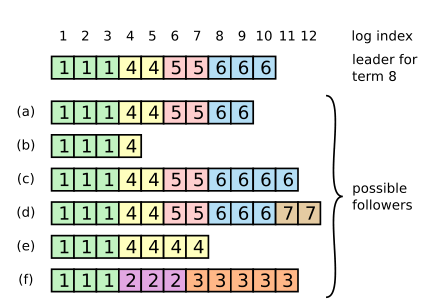
</div>
<div class="comment">图5：当在顶上的领导者掌权时，可能会在从机日志中发生（a-f）的任何一种情况。每个方块表示一个日志条目；方块上的数字表示它的任期。一个从机可能丢失条目（a-b），可能有额外的未提交的条目（c-d），或者两者都有（e-f）。举个例子，情况（f）会发生在如果服务器在任期2是领机添加了数个条目进它的日志，在任何一个提交之前奔溃；它很快就重启了，在任期3成为了领机并且添加了一些条目进它的日志；在任何一个任期2或者任期3中条目被提交之前，服务器再一次奔溃，并维持了了数个任期的宕机。 </div>
</div>

在Raft中，领机通过强制从机自己去复制日志来处理不一致。这意味着从机日志中冲突的条目将被来自领机的日志重写。

为了让从机自己给日志提供一致性，领机必须找到两个日志都认同的最后日志条目，删除在那之后从机日志中任何一个条目，并且发送领机在那之后的所有条目给从机。所有的这些行为都发生在AppendEntries RPCs 的一致性检查上。领机为每一个从机维持了一个nextIndex，这个nextIndex是将要发送给从机的下一条日志条目的索引。当一个领机第一次掌权，它会初始化所有的nextIndex 值为它日志中最后一个索引之后的索引（图5中的11）。如果一个从机的日志与主机的不一致，接下来的AppendEntries RPC中的AppendEntries一致性检测将失败。在拒绝后，领机递减nextIndex并重新尝试AppendEntries RPC。最终nextIndex到达主机和从机日志匹配的位置。当这发生时，AppendEntries将成功，这将删除任何一个从机日志中有冲突的条目并附加从领机日志来的条目（如果有）。一旦AppendEntries成功，从机的日志将与领机保持一致，并且它将在这个任期的剩余时间内保持这种方式。

如果想要，协议能够被优化以减少AppendEntries RPCs的拒绝次数。举个例子，当拒绝了一个AppendEntries请求时，从机可以包含冲突的term和它在这个任期存储的第一个索引。使用这个信息，领机可以递减nextIndex去避免在那个任期中所有冲突的条目；一次AppendEntries RPC被要求携带该任期中每个有冲突条目，而不是每个条目一个RPC。实际上，我们怀疑这个优化是不需要的，因为失败的发生不频繁并且不太可能出现很多不一致条目。

使用这个机制，领机掌权时不需要花费什么特殊的行为去恢复日志的一致性。它仅仅做一些通用的操作，并且日志通过AppendEntries 一致性检查的失败自动化地汇聚。领机绝不重写或者删除它自己的日志条目（Leader Append-Only 属性）。

### 安全性
先前的章节描述了Raft如何选举领机和复制日志条目。然而，该对该机制的描述没有确保每个状态机准确地以一定顺序执行一样的命令。举个例子，一个从机可能在领机提交了数个日志条目的同时不可用了，那么它能被选举为领机并且用新的重写这些条目；因此，不同的状态机可能执行不同的命令序列。

接下来通过在服务器被选举为领机添加一个限制条件完整Raft算法。这个限制确保了领机对于任一个给定的任期包含了之前任期所有被提交过的条目（Leader Completeness Property）。给定选举限制条件，使得提交日志项更加准确。最终，我们为Leader Completeness Property呈现了一个证明梗概和它是如何领导复制状态机的正确行为。

#### 选举限制
在任何一个基于领机的共识算法中，领机必须最终储存所有的被提交的日志条目。在一些共识算法中，例如Viewstamped Replication，一个领机即使它没初始化包含所有的提交条目也能被选举。这些算法包含了额外的机制去识别丢失条目并且传输它们给新的领机，在选举过程中或之后的片刻。不幸的是，导致了相当大的额外机制和复杂性。Raft使用一个简单的方式，它保证了所有从先前任期被提交的条目能存在每个来自选举时刻的新领机上，不需要传输这些条目给领机。这意味着日志项仅以一个方向流动，从领机到从机，并且领机绝不重写他们日志上已经存在的条目。

Raft使用投票过程防止没有包含所有提交过的项的候选者赢得选举。一个候选者为了被选中必须联系集群中的大多数，这意味着每一个被提交的条目必须在这些服务器上至少存在一个。如果候选者的日志至少和集群中的大多数服务器上的任何一个日志一样新（“up-to-date”在下面被定义地更加精确），那么它将拥有所有提交过的条目。RequestVote RPC实现了这个限制条件：RPC包含有关于候选者日志的信息，如果它自己的日志比候选者的日志更加新投票者会拒绝投票给它。

Raft通过比较日志中最后项的索引和任期来判断两个日志中那个更加新。**如果两个日志最后一项的任期号不同，那么带有更迟任期号的日志是更加新，如果两个日志以一样的任期号结尾，那么更长的日志是更加新**。

#### 提交之前任期中的条目
一旦条目被服务器的大部分服务器储存领机知道来自它的当前任期的该条目是被提交了。如果一个领机在提交一个条目之前奔溃了，将来的领机将尝试去结束复制该条目。然而，一个领机不能立即断定有个来自先前任期的条目曾经被大多数服务器存储而被提交。图6阐述了这样一种情况，一个旧的日志条目被储存在大多数服务器上，但仍然能被未来的领机重写。  
<div class="illustration">
<div class="picture">

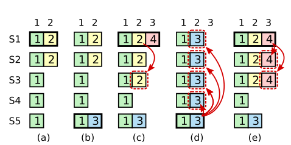
</div>
<div class="comment">图 6：一个时序展示了为何一个领机不能使用来自更旧的任期的日志项决定提交条目。（a）中S1是领机并且在索引2上进行了部分复制。（b）中S1奔溃了；S5从S3、S4和它自己获得投票被选举为任期3的领机，并且接受了一个不同的日志索引为2的条目。（c）中S5奔溃了；S1重启，被选举为领机，并且继续复制。在这个时刻，来自任期2的日志项已经被复制在大多数服务器上，但是它没被提交。如果S1奔溃，如（d），S5能被选举为领机（获得S2、S3、S4的投票）并且用它自己任期3 的条目来重写条目。然而，如果S1在奔溃之前从它当前任期复制了一个条目在大多数服务器上，如（e）所示，此时这个条目被提交（S5 不能赢得选举）。在这个时刻所有在日志中的先前条目一样被提交了。</div>
</div>

为了消除如图6中的问题，Raft绝不通过计算复制数量提交从先前任期中来的日志项。只有来自领机的当前任期的日志项才通过计算复制数量来提交；一旦在这种方式中有来自当前任期的条目已经被提交，那么所有先前的条目由于Log Matching Property也被间接地提交。有一些情况下一个领机能够安全地判断一个更久的日志项被提交了（举个例子，如果条目被储存在每个服务器上），但是Raft为了简单采用一个更加保守的方式。

Raft在提交规则上引入了额外的复杂性，因为当一个领机从先前的任期复制条目时日志条目维持了它们的原始任期号。在其它的一致性算法上，如果一个新的领机从早期的“terms”复制，它必须使用它的新“term number”。Raft的方式使得对日志条目的推理更加容易，因为它们在一段时间内和日志间保持了相同的任期号。另外，Raft上的新领机比其它算法发送更少的从先前任期来的日志项（其他算法必须在它们能被提交前发送冗余的日志项去重新编号）。

### 从机和候选者奔溃
到这里为止我们都关注了领机的失败。从机和候选者奔溃比处理领机更加简单，并且它们都以一样的方式处理。如果一个从机或者候选机奔溃，那么将来发送给它的RequestVote和AppendEntries RPCs会失败。Raft通过无限地重试来处理这些失败；如果奔溃的服务器重启，那么RPC将成功完成。如果一个服务器在完成一个RPC之后但在回复之前奔溃了，那么它将在它重启后收到一样的RPC。Raft RPCs 是幂等的，因此这种情况不会导致任何不良效果。举个例子，如果一个从机受到一个包含已经存在它日志中的日志条目的AppendEntries请求，它会忽略这个新请求。

### 时序和可用性
我们有个对Rat的需求是安全性必须不能依赖时序：系统不能仅仅因为某些事件比预期的更快或者更慢就产生不正确的结果。然而，可用性（系统以及时的方式给客户机响应）不可避免地依赖于时序。举个例子，如果交换消息比服务器奔溃间的典型时间花费更长，候选机将不能停留足够的时间去赢得选举；没有一个稳定的领机，Raft不能取得进展。

领机的选举是Raft时序最关键的一个方面。Raft 将能够选出并维持一个稳定的领机只要系统满足下面的时序要求：
$$ broadcastTime \ll electionTimeout \ll MTBF $$  

在这个不等式中BroadcastTime是让一个服务器并行发送RPCs给集群中的每个服务器并收到它们的响应的平均时间；electionTimeout是选举超时时间；MTBF是单个服务器失败之间的平均时间。广播时间应该比选举超时时间少一个数量级这使得领机能够可靠地发送心跳消息去阻止开始选举的从机；给定随机化的方式用来设置选举超时时间，这个不等式也能使得分散投票不太可能。选举超时时间应该比MTBF少一个数量级这使得系统取得稳定的进展。当领机奔溃时，该系统将在大致的选举超时时间期间内不可用；我们希望这存在于所有时间的一小部分。

广播时间和MTBF是潜在系统的属性，而选举超时时间是我们必须选择设置的。Raft的RPCs通常要求接收者去持久化信息到稳定的存储中，因此广播时间可能在0.5ms到20ms的范围内，依赖于存储技术。因此，选举超时时间接近10ms到500ms的某个位置。典型的服务器MTBFs是数个月或者更多，这很容易满足时序要求。

### 集群成员关系变更
到目前为止我们假设集群的配置（参与一致性算法的服务器集合）是固定的。实际上，偶尔需要去改变这配置，举个例子当它们失败或者改变复制的程度时替换服务器。尽管这些能够在整个集群离线，更新配置文件，之后重启集群完成，这将使得集群在改变完成的期间变得不可用。另外，如果有任何手动操作，那将会有风险操作错误。为了避免这些问题，我们决定自动化配置改变并包含它们进入Raft共识算法中。

要让配置改变机制变得安全，在过渡期间，绝不能出现在一个任期中有两个领机被选举的可能。不幸的是，任何一个服务器直接从旧的配置切换到新的配置的方式都是不安全的。没有可能在一次操作中自动化切换所有的服务器，因此集群在过渡期间能被潜在地分成两个相互独立的多数服务器组。
<div class="illustration">
<div class="picture">

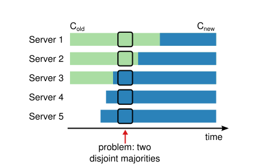
</div>
<div class="comment">图7：直接地从一个配置切换到另一个是不安全的因为不同的服务器将在不同时间切换。在这个例子中，集群从三台服务器扩展成五台。不幸的是在某个时间点在一个任期内有两个不同的领机能被选举，旧配置（$ C_{old} $）的大多数选出的一个和新配置（$ C_{new} $）中的大多数选出的另一个。</div>
</div>

为了确保安全性，配置改变必须使用一个two-phase（两阶段）方式。有多种方式去实现这个两阶段。举个例子，一些系统使用第一个阶段去使旧配置失去作用这样它不能处理客户端请求；之后第二阶段使能新配置。在Raft集群中首先切换切换到一个我们称为joint consensus（连接一致）的过渡配置；一旦连接一致已经被提交，系统那时过渡到新的配置。连接一致结合了旧配置和新配置两者：  
* 日志条目被复制到两个配置的所有 服务器上。
* 从任一个配置中的任何服务器都可能作为领机
* 协议（选举和条目提交）要求旧的和新的配置的各自占多数服务器。

连接一致允许让单个的服务器在不同时间在配置间转换而不影响安全性。进一步说，连接一致允许集群在配置改变期间至始至终地继续服务客户机请求。

集群配置通过在复制日志中的特殊条目储存并通信；图8阐述了配置改变过程。当领机收到请求去改变配置从$C_{old}$到$C_{new}$，它为连接的一致（$C_{old,new}$）储存了配置作为一个日志条目并且使用之前描述的机制复制条目。一旦一个给定的服务器添加了新的配置条目进它的日志，它使用这个配置为未来的决策做决定（一个服务器总是使用日志中最新的配置，不管这一项是否被提交了）。这意味着领机当$C_{old,new}$的日志项被提交时将使用$C_{old,new}$的规则去做决定。如果一个领机奔溃，一个新的领机可能在$C_{old}$或者$C_{old,new}$的作用下被选举，取决于胜利的候选者是否收到了$C_{old,new}$。在任一个例子中，$C_{new}$在这个时期内不能做单方面的决策。

一旦$C_{old,new}$已经被提交，在没有其它的认可下$C_{old}$或者$C_{new}$都不能做出决策，并且Leader Completeness Property 确保只有有$C_{old,new}$日志项的服务器能被选举作为领机。现在领机可以安全地创造一个描述$C_{new}$的日志项并且复制它到集群中。再一次，一旦这个配置在服务器上被看到就发生作用。当新的配置已经被提交，在$C_{new}$的规则下，旧配置是不相关的并且没有新配置的服务器可以被关机。如图8所示，$C_{old}$和$C_{new}$能共同做出单边决策的时间根本没有；这保证了安全性。
<div class="illustration">
<div class="picture">

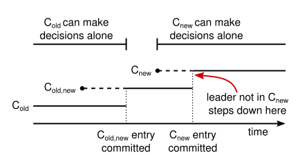
</div>
<div class="comment">图8：配置改变的时间线。虚线表示配置项已经被创造但是还没有被提交并且实线表示最新被提交的配置项。领机首先创造了$C_{old,new}$配置项在它的日志中并且提交$C_{old,new}$（$C_{old}$中的大多数服务器和$C_{new}$中的大多数服务器）。那时它将创造$C_{new}$项并提交它到$C_{new}$的大多数服务器中。在时间中没有一刻是$C_{old}$和$C_{new}$两者能独立地做出决策的。</div>
</div>

为重配置寻址还有三个问题。第一个问题是新服务器可能没有初始化存储任一个日志项。如果他们以这种状态添加进集群，它将花费相当一会儿为它们追赶进度，在这时间内没有可能去提交新的日志项。为了避免可用性间隔，Raft在配置改变前引入了一个额外的阶段，在这个阶段加入集群的新服务器作为非投票成员（领机复制日志项给它们，但是它们不被”大多数“考虑）。一旦新的服务器已经赶上了集群中其他服务器的进度，那么重配置就能处理上面描述的问题了。

第二个问题是集群领机可能不是新配置的一部分。在这种情况下，领机一旦提交了$C_{new}$日志项就会退出（返回给从机状态）。这意味着会有一段时间，领机管理的集群没有包含它自己（同时它提交$C_{new}$）；它复制日志条目但是没把它自己算在“大多数”中。领机转化发送在$C_{new}$提交时，因为这是新配置能够独立运行的第一刻（从$C_{new}$中总是有可能选出一个领机）。在这一刻之前，可能是这样的情况只有一个来自$C_{old}$的服务器能被选为领机。

第三个问题是被移除的服务器（不在$C_{new}$中）能够破坏集群。这些服务器将不能收到心跳，因此他们将超时并开始新的选举。那时它们将使用新任期号发送RequestVote RPCs，并且这将导致当前的领机转化为从机状态。一个新的领机最终将被选出，但是被移除的服务器将再一次超时并将重复这个过程，导致很差的可用性。

为了防止这个问题，服务器当它认为当前领机存活时将忽视RequestVote RPCs。特别的，如果一个服务器在从当前领机听到的一个最小选举超时时间内收到一个RequestVote RPC，它不会更新它的任期或者授予它投票。这不影响正常的选举，正常选举每个服务器在开始选举前等待至少一个最小选举超时时间。然而，这将帮助避免来自移除的服务器的干扰：如果一个领机能够发送心跳给它的集群，那么它将在任期时间结束后不被免职。

### 日志压缩
Raft的日志在正常操作去合并更多的客户机请求中不断变大，但是在一个实际系统中，它不能没有边界的变大。随着日志变长，将占据更多的空间并花费更多的时间去回应。没有抛弃在日志中已经被计算的过期信息的机制将最终导致可用性问题。

快照是压缩的最简单的方式。在快照中，整个当前系统状态是被写进固定存储上的一个snapshot（快照）中，那时整个日志到当前节点为止都被丢弃。

渐进的压缩方式，例如清理和日志结构化归并树都是可能的。这些操作一次只对数据的一部分作用，因此它们将压缩的负载均匀的扩展到所有时间上。它们首先选出一个数据区，这个数据区已经积累了许多删除和重写对象，然后它们更加紧致地重写来自这区域的有效对象并释放这区域。这要求比拍快照更显著的额外机制和复杂性，拍快照通过总是操作整个数据集来简化这问题。与此同时日志清理需要做些修改加进Raft中，状态机能通过使用同拍快照一样的接口实现LSM树。

图9展示了Raft中拍快照的基本思路。每个服务器独立地取得快照，快照覆盖了日志中被提交的条目。状态机的大部分工作是写入它当前的状态进快照。Raft在快照中也包含了数量很少的元数据：last included index 是快照替换（状态机已经应用的最新条目）的日志中最新条目的索引，并且last incuded term 是这个条目中的任期。这些被保存以支持为快照之后的第一条日志条目进行AppendEntries 一致性检查，因为条目需要一个之前的日志条目和任期。为了使集群成员关系变更起作用，快照也包括了日志中最新的配置作为最后被包含的索引。一旦一个服务器完成了快照的写入，它可能删除到最新被包含的索引之前的所有日志条目，任何先前的快照也一样。
<div class="illustration">
<div class="picture">

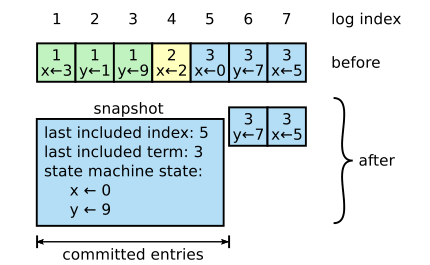
</div>
<div class="comment">图9：一个服务器用一个新的快照替换它日志中已经提交的条目（索引1到5），这个快照仅仅储存当前状态（例子中的变量x和y）。快照最后包含的索引和任期用于定位快照中日志条目6之前的条目。</div>
</div>

尽管服务器通常独立地取得快照，领机必须不定期地发送快照给滞后的从机。这发生在领机已经丢弃了下一条它需要发送给从机的日志条目时。进一步说，这种情况在正常操作中不太可能：一个已经跟上了领机的从机将已经有该条目。然而一个异常的慢从机或者一个新服务器加入集群将没有。一个方法让这样的从机更新是领机在网络上发送它的快照。

领机使用一个新的被称为InstallSnapshot的RPC去发送快照给落后太多的从机；当一个从机用这个RPC收到一个快照时，它必须决定根据它已经在存在的日志条目如何去做。通常快照将包含不在接收者日志中的信息。在这种情况下，从机抛弃它整个日志；它将完全被快照取代并且可能有与快照冲突的未提交的条目。相反如果从机收到一个描述它的日志前缀的快照（由于重传或者错误），那么快照所覆盖的日志项被删除，但是跟着快照后面的条目是仍然有效并且必须被保存。

**InstallSnapshot RPC**  
领机调用发送快照块给从机。领机总是顺序发送块。
*参数*  
|||
| :---: | :---: |
| term | 领导者的任期 |
| leaderId | 这使得从机能够重定向到客户机 |
| lastIncudedIndex   | 快照包含的最后一个条目的索引 |
| lastIncludedTerm | lastIncudedIndex的任期号 |
| offset | 定位快照文件中的字节偏移 |
| data[] | 快照块的原始字节，从offset开始 |
| done | 如果为true说明这是最后一个块 |

*结果*  
|||
| :---: | :---: |
| term | 服务器知道的当前任期号，以便领导者更新 |

*接收机实现*  
1. 如果term < currentTerm 立即回应
2. 如果是第一个块（offset是0）创造新的快照
3. 在给定的偏移位置处写入数据进快照
4. 如果done是false响应并等待更多的数据块
5. 保存快照文件，抛弃任一已经存在或者部分带着更小索引的快照
6. 如果已经存在的日志项有一样的索引并且term与快照最新包含的条目一样，保持它之后的日志项并回复
7. 抛弃整个日志
8. 使用快照内容重置状态机（加载快照的集群配置）

这个快照方式与Raft的强领机原则相违背，因为从机没有领机的参与也能取得快照。然而，我们认为这个违背是合理的。当拍快照时已经达到了一致性，因此没有决策冲突。数据仍然仅从领机流向从机，只是从机现在能整理它的数据。

我们考虑一个基于领机的替选方式，在这种方式中仅仅领机会创造快照，那么它将发送这个快照给每个它的从机。然而，这有两个缺点。首先发送快照给每个从机将浪费网路带宽并且减慢拍快照的处理。每个从机已经有需要去生成它自己快照的信息，并且它通常一个服务器从它自己本地状态去产生快照比它在网络上发送和接收一个快照成本更低。第二，领机的实现将更加复杂。举个例子，领机将需要并行地发送一个带着复制的新日志项快照给从机，以便不去阻塞新的客户端请求。

有两个问题影响拍快照的性能。第一，服务器必须决定何时去拍快照。如果一个服务器拍快照太频繁，这将浪费带宽和精力；如果拍快照不太频繁，这有耗尽存储容量的风险，并且它增加了重启期间重现日志所需要的时间。一个简单的策略是当日志达到一个固定的字节大小时取得快照。如果这个大小是设置地比期望的快照大小还要大的多，那么硬盘为拍快照的带宽开销将很小。

第二个性能问题是写一个快照需要花费大量的时间，并且我们不想这会耽误正常操作。解决办法是使用copy-on-write（写时拷贝）技术这使得新的更新可以被接收而不影响正在写入的快照。举个例子，状态机带着基本数据结构的建造自然地支持这个。另外，操作系统也有copy-on-write（eg。linux的fork）能够被用来创造一个整个状态机in-memory的快照（我们的实现使用这个方式）。

### 客户机交互
这一节描述了Raft和客户机如何交互，包括客户机如何找到集群的领机和Raft如何支持可线性化语义。这些问题应用与所有基于一致性的系统，并且Raft的解决方案是与其它系统相似。

Raft的客户机发送它们的所有请求给领机。当一个客户机首次启动，它随机地选择一个服务器。如果客户机的首次选择不是领机，那个服务器将拒绝客户机的请求并提供关于最近它听到的领机（ApeendEntries 请求包含了领机的网络地址）的信息。如果领机奔溃，客户机请求将超时；客户机然后重写选择一个服务器尝试。

我们的目标为了Raft实现可线性化语义（在调用和响应的某个时刻，每个操作似乎都瞬间地执行并且仅仅一次）。然而，正如我们目前的描述Raft能够多次执行一个命令，如果领机在提交日志项之后但是在响应客户端之前奔溃，客户机将与一个新的领机重试那个命令，导致命令被执行两次。解决办法是个客户机的每个命令赋予一个独一的序列号。那时，状态机为每个客户机追踪最新的序列号处理，以及相关响应。如果它收到一个命令，它的序列号已经被执行了，它不会重新执行请求立即响应。

可以没有写入任何东西进日志处理只读操作。然而，没有额外操作这将有返回过期数据的风险，因此领机响应请求时，这个领机可能已经被一个不知道的新领机取代。线性化的读一定不能返回过期的数据，并且Raft需要两项额外的预防措施去保证这不需要使用日志。首先，一个领机在已经提交的条目上一定有最新的信息。Leader Completeness Property 保证了领机已经有所有的日志条目，但是在它的任期开始时，它可能不知道日志中那个是，为了找出来，它必须提交一个来自它的条目。Raft通过每个领机在它的任期开始时提交一个空的 no-op 条目进日志来处理这问题。其次，一个领机必须在处理一个只读请求之前检查它是否被免职（如果一个最近的领机已经被选举它的信息可能过期）。Raft通过在响应只读请求之前发送心跳消息给集群中的大部分服务器来处理这个问题。另外，领机能过依赖心跳机制去提供一个租约的形成，但这为了安全性依赖于时序（它假设界定的时钟偏差）

## 一个简单的Raft实现
接下来我们根据前文所述来完成mit 6.824的[lab2](http://nil.csail.mit.edu/6.824/2020/labs/lab-raft.html)中要求的Raft实现。

按照说明下载了6.824的实验源文件后，我们打开其中的raft目录作为我们的项目，其中我们只需要实现raft.go这个文件即可， persister.go是用来模拟稳定存储的其它文件用来测试的。

打开raft.go后我们可以看到一些基本的框架和很多注释，这里的Raft使用的rpc方式是实验用的labrpc，方便测试的时候模拟复杂的网络环境，关于一个基本的rpc如何实现可以看文章[解析Go语言rpc库](https://oshirisu.site/posts/%E8%A7%A3%E6%9E%90go%E8%AF%AD%E8%A8%80rpc%E5%BA%93/)。

### 状态机
我的设计思路是，因为服务器处于(从机、领导者、候选者)这三种状态，所以运行时根据当前服务器所处的状态执行对应的逻辑即可，因此在Run方法这样实现：
```Go
func (rf *Raft) Run() {
	state := STATE_FOLLOWER
	for {
		if state == STATE_FOLLOWER {
			state = rf.convertFollower()
		} else if state == STATE_CANDIDATE {
			state = rf.convertCandidate()
		} else if state == STATE_LEADER {
			state = rf.convertLeader()
		} else {
			break
		}
	}
	rf.tc.Stop()
}
```
服务器开始作为从机进入到`convertFollower`方法中：
```Go
func (rf *Raft) convertFollower() int {
	for {
		select {
		case <-rf.tc.C:
			rf.mu.Lock()
			if time.Since(rf.connectTime) > TIMEOUT_MIN*time.Millisecond {
				rf.state = STATE_CANDIDATE
				rf.mu.Unlock()
				return STATE_CANDIDATE
			}
			rf.mu.Unlock()
		case <-rf.done:
			return STATE_EXIT
		default:
			if !rf.tryApply() {
				time.Sleep(time.Millisecond * SLEEP_TIME)
			}
		}
	}
}
```
该方法主体是一个循环，在循环中我们接收事件，默认情况下我们让服务器尝试应用状态机，如果一个选举超时时间到了，而这台服务器在一个最小选举超时的时间内没有收到任何的从领导者发来的消息，我们就可以转变状态为候选者了。称为候选者进入到`convertCandidate`方法中：
```Go
func (rf *Raft) convertCandidate() int {
	var waits = make([]waitInfo, len(rf.peers))
	var sendTimes = make([]time.Time, len(rf.peers))
	var requestVoteResC = make(chan *callRequestVoteResult)
	var remain = len(rf.peers) - 1

	defer func() {
		go func() {
			for _, w := range waits {
				for i := 0; i < w.times[WAIT_VOTE]; i++ {
					<-requestVoteResC
				}
			}
		}()
	}()

	resetRand(rf.tc)
	rf.mu.Lock()
	if rf.state == STATE_CANDIDATE {
		rf.currentTerm++
		rf.votedFor = rf.me
		rf.votes = 1
		rf.persist()

		for i := 0; i < len(rf.peers); i++ {
			if i == rf.me {
				continue
			}
			waits[i].typ = WAIT_VOTE
			waits[i].times[WAIT_VOTE] = 1
			sendTimes[i] = time.Now()
			rf.sendRequestVote(i, requestVoteResC)
		}
		rf.mu.Unlock()
	} else {
		defer rf.mu.Unlock()
		return rf.state
	}

	for {
		select {
		case rsp := <-requestVoteResC:
			waits[rsp.id].times[WAIT_VOTE]--
			if waits[rsp.id].typ == WAIT_VOTE {
				remain--
				waits[rsp.id].typ = WAIT_NULL
				state := rf.tackleRequestVoteResult(rsp)
				if state != STATE_CANDIDATE {
					return state
				}
			}
		case <-rf.tc.C:
			return STATE_CANDIDATE
		case <-rf.done:
			return STATE_EXIT
		default:
			rf.mu.Lock()
			if rf.state != STATE_CANDIDATE {
				defer rf.mu.Unlock()
				return rf.state
			}
			if remain + rf.votes > len(rf.peers) / 2 {
				for i := 0; i < len(rf.peers); i++ {
					if i == rf.me {
						continue
					}
					if waits[i].typ == WAIT_VOTE &&
						time.Since(sendTimes[i]) > MINIMUM_RETRY_INTERVAL * time.Millisecond {
						// retry
						waits[i].times[WAIT_VOTE]++
						sendTimes[i] = time.Now()
						rf.sendRequestVote(i, requestVoteResC)
					}
				}
			}
			rf.mu.Unlock()

			if !rf.tryApply() {
				time.Sleep(time.Millisecond * SLEEP_TIME)
			}
		}
	}
}
```
开始选举时我们使用`resetRand`函数重置下选举超时定时器，接着递增自己的任期号然后给自己投票并向其它服务器发送请求投票的rpc请求，接着也进入到一个循环中，在循环中，我们从`requestVoteResC`通道中接收rpc的响应如果响应有效我们执行`tackleRequestVoteResult`方法：
```Go
func (rf *Raft) tackleRequestVoteResult(res *callRequestVoteResult) int {
	rf.mu.Lock()
	defer rf.mu.Unlock()

	if rf.state != STATE_CANDIDATE {
		return rf.state
	}
	if res.ok {
		rf.available[res.id] = true
		if res.rsp.VoteGranted || res.rsp.VoteFor == rf.me {
			rf.votes++
			// If more than half of the votes are received, the server is switched to the lead
			if rf.votes > (len(rf.peers) / 2) {
				if rf.state != STATE_LEADER {
					rf.state = STATE_LEADER
					return STATE_LEADER
				}
			}
		} else if res.rsp.Term > rf.currentTerm {
			rf.currentTerm = res.rsp.Term
			rf.votedFor = -1
			rf.persist()
			if rf.state != STATE_FOLLOWER {
				rf.state = STATE_FOLLOWER
				return STATE_FOLLOWER
			}
		}
	} else {
		delete(rf.available, res.id)
		/* if len(rf.available) <= len(rf.peers)/2 {
			rf.state = STATE_FOLLOWER
			return STATE_FOLLOWER
		}*/
	}
	return STATE_CANDIDATE
}
```
如果收到了投票，我们就看看是否当前获取票数已经超过了一半，是的话这台服务器就准备转变为领导者了。另外如果收到的响应中包含的任期号比自己的大，那么就转变为从机。回到`convertCandidate`方法中，在默认情况下，我们尝试对已经发出去很久的消息进行重发，当然如果剩余的票数不足以获取大多数的话我们就不用管了。该方法退出时不要忘记了开启一个goroutine来接收`requestVoteResC`中还没处理的响应。在服务器获取到大多数投票后我们会执行到`convertLeader`方法中：
```Go
func (rf *Raft) convertLeader() int {
	rf.mu.Lock()
	if rf.state != STATE_LEADER {
		defer rf.mu.Unlock()
		return rf.state
	}
	for i := 0; i < len(rf.nextIndex); i++ {
		rf.nextIndex[i] = rf.logIndex(len(rf.log))
	}
	for i := 0; i < len(rf.matchIndex); i++ {
		rf.matchIndex[i] = 0
	}
	rf.matchIndex[rf.me] = rf.logIndex(len(rf.log) - 1)
	rf.nCheckCommit = 1
	rf.connectTime = time.Now()
	// insert no-op
	rf.insertEntry(&Entry{
		Term: rf.currentTerm,
		Command: ApplyMsg{
			CommandValid: false,
		},
	})
	rf.mu.Unlock()

	var sendTimes = make([]time.Time, len(rf.peers))
	var waits = make([]waitInfo, len(rf.peers))
	var appendEntriesResC = make(chan *callAppendEntriesResult)
	var snapshotResC = make(chan *callInstallSnapshotResult)
	var seq = 1

	defer func() {
		go func() {
			for _, w := range waits {
				for i := 0; i < w.times[WAIT_APPEND]+w.times[WAIT_HEARTBEAT]; i++ {
					<-appendEntriesResC
				}
				for i := 0; i < w.times[WAIT_SNAP]; i++ {
					<-snapshotResC
				}
			}
		}()
	}()

	for {
		select {
		case rsp := <-appendEntriesResC:
			needTackle := false
			if rsp.isHb {
				waits[rsp.id].times[WAIT_HEARTBEAT]--
				if waits[rsp.id].typ == WAIT_HEARTBEAT &&
					rsp.seq > waits[rsp.id].seqs[WAIT_HEARTBEAT] {
					waits[rsp.id].seqs[WAIT_HEARTBEAT] = rsp.seq
					needTackle = true
				}
			} else {
				waits[rsp.id].times[WAIT_APPEND]--
				if waits[rsp.id].typ == WAIT_APPEND &&
					rsp.seq > waits[rsp.id].seqs[WAIT_APPEND] {
					waits[rsp.id].seqs[WAIT_APPEND] = rsp.seq
					needTackle = true
				}
			}
			if needTackle {
				waits[rsp.id].typ = WAIT_NULL
				seq++
				state := rf.tackleAppendEntriesResult(rsp)
				if state != STATE_LEADER {
					return state
				}
			}
		case rsp := <-snapshotResC:
			waits[rsp.id].times[WAIT_SNAP]--
			if waits[rsp.id].typ == WAIT_SNAP &&
				rsp.seq > waits[rsp.id].seqs[WAIT_SNAP] {
				waits[rsp.id].seqs[WAIT_SNAP] = rsp.seq
				waits[rsp.id].typ = WAIT_NULL
				seq++
				state := rf.tackleInstallSnapshotResult(rsp)
				if state != STATE_LEADER {
					return state
				}
			}
		case <-rf.done:
			return STATE_EXIT
		default:
			rf.mu.Lock()
			if rf.state != STATE_LEADER {
				defer rf.mu.Unlock()
				return rf.state
			}
			for i := 0; i < len(waits); i++ {
				if i == rf.me {
					continue
				}
				if waits[i].typ == WAIT_NULL || time.Since(sendTimes[i]) > MINIMUM_RETRY_INTERVAL*time.Millisecond {
					if rf.nextIndex[i] <= rf.snapshot.LastIncludeIndex {
						sendTimes[i] = time.Now()
						waits[i].typ = WAIT_SNAP
						waits[i].times[WAIT_SNAP]++
						rf.sendSnapshot(i, seq, snapshotResC)
					} else if rf.realIndex(rf.nextIndex[i]) < len(rf.log) {
						sendTimes[i] = time.Now()
						waits[i].typ = WAIT_APPEND
						waits[i].times[WAIT_APPEND]++
						rf.sendAppendEntries(i, seq, appendEntriesResC)
					}
					if waits[i].typ == WAIT_NULL && time.Since(sendTimes[i]) > HEARTBEAT_TIME*time.Millisecond {
						sendTimes[i] = time.Now()
						waits[i].typ = WAIT_HEARTBEAT
						waits[i].times[WAIT_HEARTBEAT]++
						rf.sendHeartbeat(i, seq, appendEntriesResC)
					}
				}
			}
			rf.mu.Unlock()

			if rf.nCheckCommit > 0 {
				rf.calCommit()
				rf.nCheckCommit = 0
			}

			if !rf.tryApply() {
				time.Sleep(time.Millisecond * SLEEP_TIME)
			}
		}
	}
}
```
成为领导者后服务器首先需要初始化`nextIndex`切片为本地日志的最后一项的下个索引，切片中的元素意思为领导者认为下个要发给对应索引服务器的日志条目索引，`matchIndex`存储的是领导者知道对应索引服务器上将会储存的日志索引，这里初始化为0。刚称为领导者我们还需要往日志中插入一个空条目，具体原因见论文中的第8章。

做完初始化工作后就进入到工作循环中，在默认情况下领导者会更具对应服务器的`nextIndex`切片中索引的情况，决定是发送快照还是发送条目，如果其中索引小于等于`rf.snapshot.LastIncludeIndex`时，说明对面服务器需要的条目已经被本地保存到快照中去了这时我们只能发送快照，其它情况如果本地还有条目未发送给对方时就发送条目，如果发送后很久没收到回复我们就尝试重新发送，另外如果超过了心跳时间我们都没有发送给对面服务器任何消息就发送一个心跳过去。在默认情况下领导者还会跟具`matchIndex`切片数据有变动的情况检查是否能够更改提交索引。计算提交索引的方法如下：
```Go
func (rf *Raft) calCommit() bool {
	rf.mu.Lock()
	defer rf.mu.Unlock()

	news := make([]int, len(rf.matchIndex))
	copy(news, rf.matchIndex)
	sort.Ints(news)
	for i := len(news) / 2; i >= 0; i-- {
		if news[i] > rf.commitIndex {
			if rf.log[rf.realIndex(news[i])].Term != rf.currentTerm && i != 0 {
				continue
			}
			rf.commitIndex = news[i]
			return true
		}
	}
	return false
}
```
我们对`matchIndex`切片按照从小到大的顺序排序，然后从一半开始往前找，这样找到的索引一定是超过大多数的，当`matchIndex`中的索引比提交索引大的时候并且日志中的该项是领导者在当前任期加入的就可以设置新的提交索引了，当然如果所有服务器上都存在该条目即使不是领导者当前任期加入的也可以提交。

领导者从`appendEntriesResC`通道接收发送条目和心跳的回复，如果收到的响应的序列号比当前等待的序列号大，我们就可以进行处理了，处理过程如下：
```Go
func (rf *Raft) tackleAppendEntriesResult(res *callAppendEntriesResult) int {
	rf.mu.Lock()
	defer rf.mu.Unlock()
	if rf.state != STATE_LEADER {
		return rf.state
	}
	if res.ok {
		id := res.id
		rf.available[id] = true
		if res.rsp.Success {
			if !res.isHb {
				rf.matchIndex[id] = rf.nextIndex[id] + res.q - 1
				rf.nextIndex[id] = rf.matchIndex[id] + 1
				rf.nCheckCommit++
			} else {
				if rf.matchIndex[id] < rf.nextIndex[id]-1 {
					rf.matchIndex[id] = rf.nextIndex[id] - 1
					rf.nCheckCommit++
				}
			}
		} else {
			if res.rsp.Term > rf.currentTerm {
				rf.currentTerm = res.rsp.Term
				rf.votedFor = -1
				rf.persist()
				if rf.state != STATE_FOLLOWER {
					rf.state = STATE_FOLLOWER
					return STATE_FOLLOWER
				}
			}

			id := res.id
			var i int
			for i = res.rsp.XIndex; i > 0; i-- {
				if rf.realIndex(i) <= 0 || rf.log[rf.realIndex(i)].Term <= res.rsp.XTerm {
					break
				}
			}
			rf.nextIndex[id] = i + 1
		}

		if len(rf.available) > len(rf.peers)/2 {
			rf.connectTime = time.Now()
		}
	} else {
		delete(rf.available, res.id)
		if len(rf.available) <= len(rf.peers)/2 {
			if time.Since(rf.connectTime) > TIMEOUT_MIN {
				rf.state = STATE_FOLLOWER
				return STATE_FOLLOWER
			}
		}
	}
	return STATE_LEADER
}
```
对于响应是ok的并且对面回复的是成功的情况下，如果是附加条目的回复，我们就改变`nextIndex`和`matchIndex`中对应的数据，如果是心跳的回复，在`matchIndex`中对应的索引小于`nextIndex`的情况我们改变`matchIndex`中的索引。如果对面回复的是失败，我们检查回复中的任期号，比自己的大那么就转变为从机，其它情况需要重设`nextIndex`中对应的索引，我们的方法是找到一个小于等于回复的条目任期号的一个本地日志索引，然后将`nextIndex`中对应的索引设置为该索引的下一个。(to do: 设置插图)另外领导者如果在最小选举超时的时间内没有能与大多数通信成功，就退出领导者状态，这保证了领导者在被分区之后能很快发现，并且使得一个台服务器在明确知道有领导者的情况下能拒绝一个更大任期号的投票请求。

领导者从`snapshotResC`通道中接收发送快照的回复，对应的处理步骤如下：
```Go
func (rf *Raft) tackleInstallSnapshotResult(res *callInstallSnapshotResult) int {
	rf.mu.Lock()
	defer rf.mu.Unlock()
	if rf.state != STATE_LEADER {
		return rf.state
	}
	if res.ok {
		rf.available[res.id] = true
		if res.rsp.Term > rf.currentTerm {
			rf.currentTerm = res.rsp.Term
			rf.votedFor = -1
			rf.persist()
			if rf.state != STATE_FOLLOWER {
				rf.state = STATE_FOLLOWER
				return STATE_FOLLOWER
			}
		}

		id := res.id
		rf.matchIndex[id] = res.last
		rf.nextIndex[id] = rf.logIndex(len(rf.log))

		if len(rf.available) > len(rf.peers)/2 {
			rf.connectTime = time.Now()
		}
	} else {
		delete(rf.available, res.id)
		if len(rf.available) <= len(rf.peers)/2 {
			if time.Since(rf.connectTime) > TIMEOUT_MIN {
				rf.state = STATE_FOLLOWER
				return STATE_FOLLOWER
			}
		}
	}
	return STATE_LEADER
}
```
同样在回复是成功的情况下我们需要重设`matchIndex`索引为快照最后包含的索引，而`nextIndex`可以设置为日志中的最后一项（这里或许可以设置为快照最后包含索引的下一项）。

### 几个RPC方法
#### 请求投票
```Go
func (rf *Raft) RequestVote(args *RequestVoteArgs, reply *RequestVoteReply) {
	reply.VoteGranted = false
	var bPersist = false
	rf.mu.Lock()
	defer func() {
		if bPersist {
			rf.persist()
		}
		rf.mu.Unlock()
	}()
	rf.available[args.CandidateID] = true
	reply.Term = rf.currentTerm
	reply.VoteFor = rf.votedFor

	if time.Since(rf.connectTime) < TIMEOUT_MIN*time.Millisecond {
		return
	}

	// convert to follower if the term of args is bigger than current term
	if args.Term > rf.currentTerm {
		rf.currentTerm = args.Term
		bPersist = true
		rf.votedFor = -1
		if rf.state != STATE_FOLLOWER {
			rf.state = STATE_FOLLOWER
		}
	}

	// refuse the request if the term of args is smaller than current term or itself has voted
	if args.Term < rf.currentTerm || rf.votedFor >= 0 {
		return
	}

	//	Determine whether the log is "up-to-date".
	//  If the logs havelast entries with differentterms, then
	//	the log with the later term is more up-to-date. If the logs
	//	end with the same term, then whichever log is longer is
	//	more up-to-date.
	lastIndex := rf.logIndex(len(rf.log))
	var lastTerm int = rf.log[len(rf.log)-1].Term
	if lastIndex == rf.snapshot.LastIncludeIndex+1 {
		lastTerm = rf.snapshot.LastIncludeTerm
	}
	if lastTerm > args.LastLogTerm ||
		(lastTerm == args.LastLogTerm && lastIndex > args.LastLogIndex+1) {
		return
	}

	reply.VoteGranted = true
	rf.votedFor = args.CandidateID
	rf.connectTime = time.Now()
	bPersist = true
	if rf.state != STATE_FOLLOWER {
		rf.state = STATE_FOLLOWER
	}
}
```

#### 附加日志条目
```Go
func (rf *Raft) AppendEntries(args *AppendEntriesArgs, reply *AppendEntriesReply) {
	var bPersist = false
	rf.mu.Lock()
	defer func() {
		if bPersist {
			rf.persist()
		}
		rf.mu.Unlock()
	}()

	rf.available[args.LeaderID] = true

	reply.Term = rf.currentTerm
	if args.Term < rf.currentTerm {
		return
	} else if args.Term > rf.currentTerm {
		rf.currentTerm = args.Term
		rf.votedFor = -1
		bPersist = true
	}

	// reset connectTime to prevent the follower becoming a candidate
	rf.connectTime = time.Now()
	if rf.state != STATE_FOLLOWER {
		rf.state = STATE_FOLLOWER
	}

	// Check whether the logs match
	args.PrevLogIndex = rf.realIndex(args.PrevLogIndex)
	if args.PrevLogIndex == 0 {
		if args.PrevLogTerm != rf.snapshot.LastIncludeTerm {
			log.Fatal("The entry was committed but have a different term?")
			return
		}
	} else {
		if args.PrevLogIndex >= len(rf.log) || args.PrevLogIndex < 0 || rf.log[args.PrevLogIndex].Term != args.PrevLogTerm {
			if args.PrevLogIndex > len(rf.log) {
				args.PrevLogIndex = len(rf.log)
			}
			for i := args.PrevLogIndex - 1; i >= 0; i-- {
				if rf.log[i].Term <= args.PrevLogTerm {
					reply.XIndex = rf.logIndex(i)
					if i > 0 {
						reply.XTerm = rf.log[i].Term
					} else {
						reply.XTerm = rf.snapshot.LastIncludeTerm
					}
					break
				}
			}
			return
		}
	}

	reply.Success = true
	if len(args.Entries) > 0 {
		bPersist = true
		start := args.PrevLogIndex + 1
		for i := 0; i < len(args.Entries); i++ {
			// This step is to see which logs are inconsistent or have exceeded the log index
			if start+i >= len(rf.log) || (args.Entries[i].Term != rf.log[start+i].Term) {
				rf.log = append(rf.log[:start+i], args.Entries[i:]...)
				break
			}
		}
	} else {
	}

	if args.LeaderCommit > rf.commitIndex {
		commitIndex := int(math.Min(float64(args.LeaderCommit), float64(rf.logIndex(len(rf.log)-1))))
		rf.commitIndex = commitIndex
	}
}
```

#### 安装快照
```Go
func (rf *Raft) InstallSnapshot(args *InstallSnapshotArgs, reply *InstallSnapshotReply) {
	ss, sm := rf.readSnapshot(args.Data)
	rf.mu.Lock()
	rf.available[args.LeaderID] = true
	reply.Term = rf.currentTerm
	if args.Term < rf.currentTerm {
		rf.mu.Unlock()
		return
	} else if args.Term > rf.currentTerm {
		rf.currentTerm = args.Term
		rf.votedFor = -1
	}

	li := rf.realIndex(args.LastIncludeIndex)
	if li > 0 && li < len(rf.log) && rf.log[li].Term == args.LastIncludeTerm {
		rf.log = append(rf.log[0:1], rf.log[li+1:]...)
	} else {
		rf.log = rf.log[0:1]
	}
	rf.snapshot = *ss
	rf.lastApplied = ss.LastIncludeIndex
	rf.commitIndex = ss.LastIncludeIndex
	snapMsg := ApplyMsg{IsSnapShot: true, Command: sm, CommandIndex: rf.log[0].Command.CommandIndex + 1}
	rf.log[0].Command.CommandIndex++
	rf.persister.SaveStateAndSnapshot(rf.getRaftState(), args.Data)

	rf.connectTime = time.Now()
	if rf.state != STATE_FOLLOWER {
		rf.state = STATE_FOLLOWER
	}
	rf.mu.Unlock()
	rf.applyCh <- snapMsg
}
```

### 测试
运行`go test`对我们编写的Raft进行测试，可以看到结果如下：
```
Test (2A): initial election ...
  ... Passed --   4.1  3   44   15088    0
Test (2A): election after network failure ...
  ... Passed --   8.6  3  105   20971    0
Test (2B): basic agreement ...
  ... Passed --   1.6  3   16    5532    3
Test (2B): RPC byte count ...
  ... Passed --   3.1  3   48  117480   11
Test (2B): agreement despite follower disconnection ...
  ... Passed --   6.4  3   72   23499    7
Test (2B): no agreement if too many followers disconnect ...
  ... Passed --   4.4  5  131   31201    4
Test (2B): concurrent Start()s ...
  ... Passed --   1.8  3   14    4550    6
Test (2B): rejoin of partitioned leader ...
  ... Passed --   5.7  3  101   24264    4
Test (2B): leader backs up quickly over incorrect follower logs ...
  ... Passed --  25.7  5 1776  693307  102
Test (2B): RPC counts aren\'t too high ...
  ... Passed --   3.3  3   32   11724   12
Test (2C): basic persistence ...
  ... Passed --   7.9  3   72   21122    6
Test (2C): more persistence ...
  ... Passed --  21.2  5  972  171522   16
Test (2C): partitioned leader and one follower crash, leader restarts ...
  ... Passed --   3.3  3   29    9592    4
Test (2C): Figure 8 ...
  ... Passed --  32.4  5  346   94756   19
Test (2C): unreliable agreement ...
  ... Passed --   3.1  5  255  117774  246
Test (2C): Figure 8 (unreliable) ...
  ... Passed --  33.0  5 1840  306030   29
Test (2C): churn ...
  ... Passed --  16.2  5 1603  919163  621
Test (2C): unreliable churn ...
  ... Passed --  16.3  5  706  216340  212
PASS
ok      github.com/nihuo9/raft  198.819s
```

## 键值服务器实现
我们在上一章Raft实现的基础上写一个键值服务器，其基本要求在[lab3](http://nil.csail.mit.edu/6.824/2020/labs/lab-kvraft.html)中可以看到。

一个基本的键值服务需要用到`Get`和`Set`两种方法，用来得到键对应的值或者设置键对应的值，我们的实现中将`Set`分为了`Put`和`Append`两种操作，前者用于赋值后者在原本的值后面附加。

### 服务端
在服务器开启后会开启一个goroutine不断接收来自Raft的应用消息，如下所示：
```Go
func (kv *KVServer) receiveMsg() {
	for m := range kv.applyCh {
		if m.IsSnapShot && (m.CommandIndex > kv.snapVersion || m.CommandIndex == 0) {
			kv.snapVersion = m.CommandIndex
			ss := m.Command.([]byte)
			kv.applySnapShot(ss)
		} else {
			kv.applyEntry(&m)
		}
	}
}
```
根据接收的消息种类我们会分别应用快照或者是应用条目，应用快照就是把收到的数据解码为我们的键值数据库：
```Go
func (kv *KVServer) applySnapShot(data []byte) {
	reader := bytes.NewReader(data)
	decoder := labgob.NewDecoder(reader)

	kv.mu.Lock()
	defer kv.mu.Unlock()
	kv.db = make(map[string]string)
	if err := decoder.Decode(&kv.db); err != nil {
		log.Fatal(err)
	}
	if err := decoder.Decode(&kv.excuted); err != nil {
		log.Fatal(err)
	}
}
```
应用条目的过程如下：
```Go
func (kv *KVServer) applyEntry(msg *raft.ApplyMsg) {
	if msg.CommandValid {
		op := msg.Command.(Op)
		uid := op.UID
		seq := op.Seq
		kv.mu.Lock()
		if old, ok := kv.excuted[uid]; !ok || seq > old {
			switch op.Meth {
			case OP_GET:
			case OP_PUT:
				kv.db[op.Key] = op.Value
			case OP_APPEND:
				kv.db[op.Key] += op.Value
			}
			kv.excuted[uid] = seq
			if w, ok := kv.waits[uid]; ok && seq == w.ws{
				delete(kv.waits, uid)
				kv.mu.Unlock()
				close(w.wc)
				kv.checkSize(msg)
				return
			} 
		} else {
		}
		kv.mu.Unlock()
		kv.checkSize(msg)
	}
}
```
如果收到的命令的序列号未执行过，我们就更具其操作类型对数据库进行操作，并且会通知等待中的客户端完成操作，最后还会检查Raft中日志的大小决定是否拍快照。

接下来以`Get`操作为例子介绍了客户端与服务端是如何交互的，`Get`在服务端的方法如下：
```Go
func (kv *KVServer) Get(args *GetArgs, reply *GetReply) {
	kv.mu.Lock()

	if args.Seq < kv.excuted[args.UID] {
		reply.Code = ErrSequence
		kv.mu.Unlock()
		return
	} else if args.Seq == kv.excuted[args.UID] {
		if val, ok := kv.db[args.Key]; ok {
			reply.Value = val
			reply.Code = OK
		} else {
			reply.Code = ErrNoKey
		}
		kv.mu.Unlock()
		return
	}
	kv.waits[args.UID] = &waitInfo{ wc: make(chan bool), ws: args.Seq }
	wc := kv.waits[args.UID].wc
	kv.mu.Unlock()

	op := Op{
		Meth: OP_GET,
		Key: args.Key,
		UID: args.UID,
		Seq: args.Seq,
	}
	_, _, ok := kv.rf.Start(op)
	if !ok {
		reply.Code = ErrWrongLeader
		return
	}

	if wc != nil {
		select {
		case <-wc:
			kv.mu.Lock()
			if val, ok := kv.db[args.Key]; ok {
				reply.Code = OK
				reply.Value = val
			} else {
				reply.Code = ErrNoKey
			}
			kv.mu.Unlock()
		case <-time.After(3 * time.Second):
			kv.mu.Lock()
			delete(kv.waits, op.UID)
			kv.mu.Unlock()
			reply.Code = ErrTimeout
		}
	}
}
```
每个客户端都有一个唯一的UID，服务端会为这个UID追踪对应的命令序列号，客户端每执行一个新的命令就递增其序列号，如果客户端发来的命令序列号等于服务端追踪的序列号就说明命令已经执行，如果小于那说明客户端在不明确上一条命令已经完成的情况下递增了其序列号就回应个序列号错误。对于新的命令，服务端会为其创造一个等待结构其中包含了一个消息通道和其等待的序列号，之后将命令传递给Raft，成功后进入等待状态。如果超过了一定的时间直接回复客户端超时了，客户端之后会重新发起请求，如果那时服务器应用成功会直接回复或者是重新将命令传递给Raft，在序列号的帮助下我们不必担心命令重复执行，这有助于我们对客户端命令的线性化表示。

### 客户端
客户端实现非常简单，这里同样以`Get`方法作为例子：
```Go
func (ck *Clerk) Get(key string) string {
	arg := GetArgs{
		Key: key,
		UID: ck.id,
		Seq: ck.seq,
	}
	reply := GetReply{}

	for {
		ok := ck.servers[ck.curLeader].Call("KVServer.Get", &arg, &reply)
		if ok {
			if reply.Code == OK {
				ck.seq++
				return reply.Value
			} else if reply.Code == ErrNoKey {
				ck.seq++
				return ""
			}
		}
		ck.curLeader++
		if ck.curLeader == len(ck.servers) {
			ck.curLeader = 0
		}
	}
}
```
客户端只需要不断尝试发出请求，根据其响应做出相应的调制即可，如果命令成功执行，我们递增序列号并返回结果，其他情况这里简单的重试其它服务器。

### 测试
运行`go test`进行测试：
```
Test: one client (3A) ...
labgob warning: Decoding into a non-default variable/field Code may not work
  ... Passed --  15.1  5 14387  651
Test: many clients (3A) ...        
  ... Passed --  15.4  5 36297 2754        
Test: unreliable net, many clients (3A) ...
  ... Passed --  18.3  5  3452  258
Test: concurrent append to same key, unreliable (3A) ...
  ... Passed --   4.4  3   333   52
Test: progress in majority (3A) ...
  ... Passed --   1.2  5    82    2
Test: no progress in minority (3A) ...
  ... Passed --   1.1  5   134    3
Test: completion after heal (3A) ...
  ... Passed --   1.0  5    43    3
Test: partitions, one client (3A) ...
  ... Passed --  24.3  5 24939  545
Test: partitions, many clients (3A) ...
  ... Passed --  24.0  5 94888 1389
Test: restarts, one client (3A) ...
  ... Passed --  21.2  5 48324  651
Test: restarts, many clients (3A) ...
  ... Passed --  21.7  5 143677 3513
Test: unreliable net, restarts, many clients (3A) ...
  ... Passed --  24.2  5  5146  292
Test: restarts, partitions, many clients (3A) ...
  ... Passed --  29.1  5 142052 1947
Test: unreliable net, restarts, partitions, many clients (3A) ...
  ... Passed --  31.9  5  5528  209
Test: unreliable net, restarts, partitions, many clients, linearizability checks (3A) ...
  ... Passed --  28.1  7 20435  408
Test: InstallSnapshot RPC (3B) ...
  ... Passed --   5.3  3 11418   63
Test: snapshot size is reasonable (3B) ...
  ... Passed --  18.3  3 13739  800
Test: restarts, snapshots, one client (3B) ...
  ... Passed --  24.2  5 48071  652
Test: restarts, snapshots, many clients (3B) ...
  ... Passed --  22.4  5 206457 30863
Test: unreliable net, snapshots, many clients (3B) ...
  ... Passed --  21.0  5  4043  299
Test: unreliable net, restarts, snapshots, many clients (3B) ...
  ... Passed --  22.3  5  4634  395
Test: unreliable net, restarts, partitions, snapshots, many clients (3B) ...
  ... Passed --  30.8  5  5059  130
Test: unreliable net, restarts, partitions, snapshots, many clients, linearizability checks (3B) ...
  ... Passed --  26.6  7 16202  177
PASS
ok      github.com/nihuo9/kvraft        433.712s
```

这里简单说下存在的问题，有这样一种情况一台滞后的服务器在收到领导者发来的大量日志后，服务器发现存储超过了拍快照的阈值于是开始拍日志，然而因为设计的框架要求应用的消息是一条一条处理的，这使得每应用一次日志条目就拍一次快照，直到存储的日志大小小于阈值。最简单的解决办法就是通道发送所有可以应用的条目，然后统一进行处理，这也是etcd中的做法，接下来也会对etcd进行一个简单的分析。

## etcd
### 运行流程
开启etcd服务器后会经过一系列流程开启3个主要的goroutine，`(*node).run`用于驱动raft，`(*raftNode).start`主要起到接收raft发来的任务（保存快照、保存服务器状态、应用条目）并进行相应的处理，`(*EtcdServer).run`收取可应用的日志条目并应用到状态机中。
<div class="illustration">
<div class="picture">

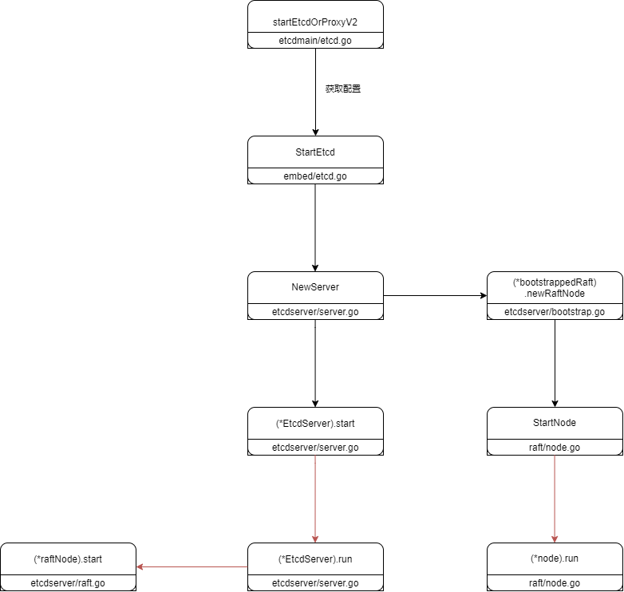
</div>
<div class="comment">图2-1：etcd服务器运行基本流程</div>
</div>

实际上etcd还有很多工作的goroutine完成其它附加功能，但基本的共识算法就通过这三个goroutine来完成。下图列出了它们当中应用到的通道，工作协程间就通过这些通道进行交流。etcd中raft的实现，不像我们之前通过并发的RPC来完成，而是通过raft把需要发送的消息通过`readyc`通道发送给etcd服务器再通过传输层发送给其他服务器，这样减少了之前我们raft状态需要进行的并行控制，大大提高了服务器的运行效率。
<div class="illustration">
<div class="picture">

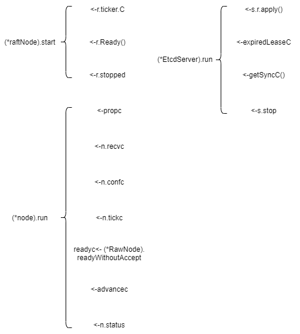
</div>
<div class="comment">图2-2：几个主要协程之间使用的通道</div>
</div>

etcd中的时钟，配置默认是100ms：
<div class="illustration">
<div class="picture">

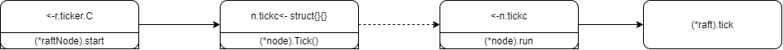
</div>
<div class="comment">图2-3：时钟流程</div>
</div>

下图显示了etcd处理raft产生的任务的流程，raft将需要处理的东西打包成一个`ready`结构，然后etcd接收这个结果进行处理，接收后会通过`advancec`通道通知已经接收让raft改变一些状态（减少未提交条目的大小、更改应用索引...），另一方面etcd接收到ready后会保存ready中的一些数据（服务器状态、日志、快照），同时会帮助raft发送消息给其它服务器，可应用的条目也从这里发送给状态机。
<div class="illustration">
<div class="picture">

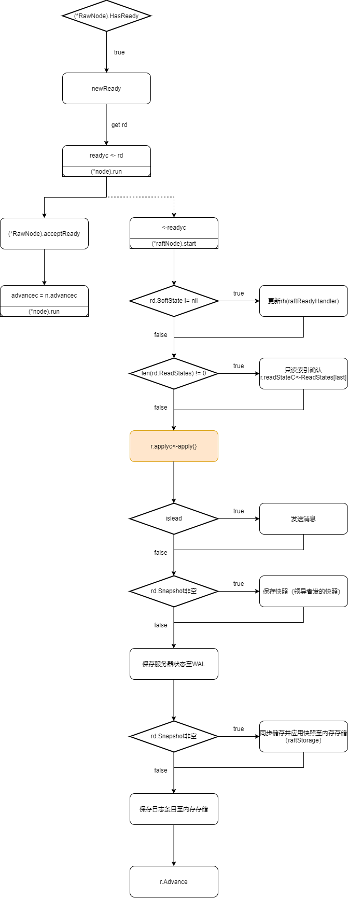
</div>
<div class="comment">图2-4：处理raft任务</div>
</div>

下面显示的是我们在控制台输入`etcdctl put key val`后会进行的流程，首先会通过客户端执行对应的命令，然后通过grpc调用对应的服务器命令，服务器会把客户端的该请求转到`processInternalRaftRequestOnce`，在该方法中会给客户端命令附加一个UID发送给raft进行处理，然后等待对应UID的通道收到结果。etcd在收到raft可应用条目时如果包含了这个条目，在应用完状态机后会从UID对应的条目中发送结果，接着就可以返回给客户端了。
<div class="illustration">
<div class="picture">

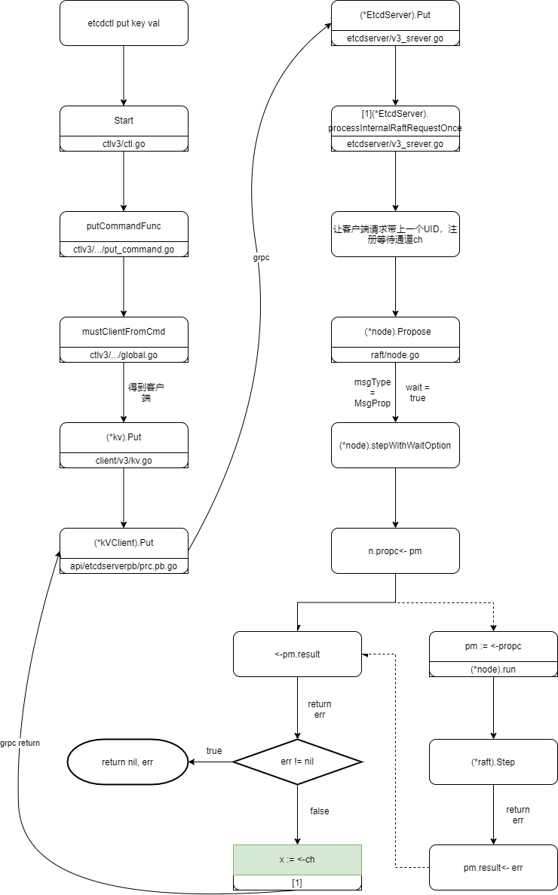
</div>
<div class="comment">图2-5：</div>
</div>

最后我们来看下etcd在收到raft发送的应用条目后的流程。raft发送的`apply`结构中包含了快照和条目，所以要分别应用，应用条目时又分为通常条目和配置更改条目，应用正常条目时会将条目中的数据解包装为V2请求或者V3请求然后应用到对应的状态机，通过数据中的UID获取通道发送响应。etcd在应用后还会尝试拍快照并尝试截取一个发送快照的消息，发送快照的消息并不走通常的路径，而是经过这里单独的处理，另外注意这里是非阻塞的方式，通道的缓存被设置为1。
<div class="illustration">
<div class="picture">

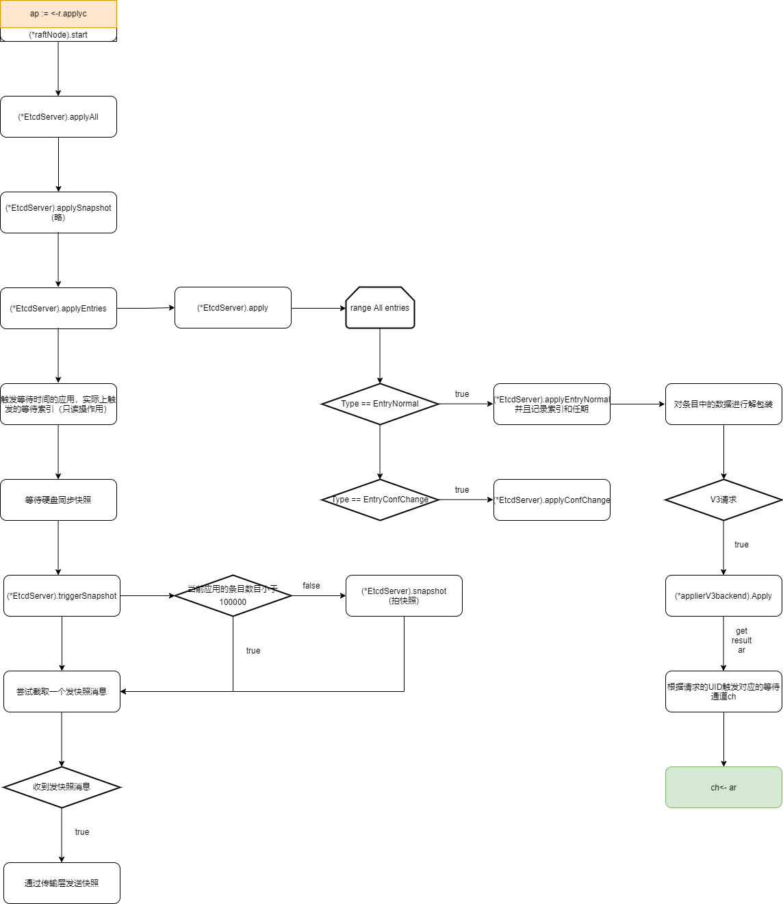
</div>
<div class="comment">图2-6：</div>
</div>

### 预选举
我们之前提到过，一个服务器在与大多数断开连接后再经过一个最小选举超时时间后会递增自己的任期号然后开始选举，这会导致其它与之通信的服务器增长任期号然后领导者在收到了一个任期号比自己大的消息后就会失效，之后整个集群就会等待下个领导者产生，在这段时间内集群无法正常工作，而在之后仍可能会重复上面的步骤。为了解决这一问题，有两种有效的方式，一个是之前我们应用到的，即一台服务器在明确知道存在领导者（即最小选举超时时间内通信过）会拒绝投票请求。还有一种办法就是“预选举”了，预选举就是进行两伦次的选举，在第一次选举时服务器不会真正的递增自己的任期号，仅仅在发送消息的时候才增加任期号，在选举成功后进入到第二次选举这时才会递增自己的任期号。这种做法使得服务器在没有明确知道自己能与大多数通信时不会自己递增任期号而打扰到整个集群。

下面我们来看看具体的步骤，首先是从机和候选者的心跳函数：
```Go
func (r *raft) tickElection() {
	r.electionElapsed++

	if r.promotable() && r.pastElectionTimeout() {
		r.electionElapsed = 0
		if err := r.Step(pb.Message{From: r.id, Type: pb.MsgHup}); err != nil {
			r.logger.Debugf("error occurred during election: %v", err)
		}
	}
}
```
当超过了选举超时时间仍然没有收到从领导者发来的消息就通过`Step`进行一个`MsgHup`步骤，其中会根据配置是否开启了预选举传递给`hup`方法不同的选举类型，`hup`会检查下服务器是否能进行选举，如果能最终会调用到`campaign`方法：
```Go
func (r *raft) campaign(t CampaignType) {
	// 有别的路径进入这个函数所以这里再检查一次
	if !r.promotable() {
		r.logger.Warningf("%x is unpromotable; campaign() should have been called", r.id)
	}
	var term uint64
	var voteMsg pb.MessageType
	if t == campaignPreElection {
		// 成为预候选者
		r.becomePreCandidate()
		voteMsg = pb.MsgPreVote
		// 预选举先递增其任期号
		term = r.Term + 1
	} else {
		// 成为候选者(campaignElection或者campaignTransfer)
		r.becomeCandidate()
		voteMsg = pb.MsgVote
		term = r.Term
	}
	// 自己给自己投票
	if _, _, res := r.poll(r.id, voteRespMsgType(voteMsg), true); res == quorum.VoteWon {
		if t == campaignPreElection {
			// 如果预选举成功就进入选举阶段
			r.campaign(campaignElection)
		} else {
			// 如果选举成功就成为领导者
			r.becomeLeader()
		}
		return
	}
	var ids []uint64
	{
		idMap := r.prs.Voters.IDs()
		ids = make([]uint64, 0, len(idMap))
		for id := range idMap {
			ids = append(ids, id)
		}
		sort.Slice(ids, func(i, j int) bool { return ids[i] < ids[j] })
	}
	for _, id := range ids {
		if id == r.id {
			continue
		}
		r.logger.Infof("%x [logterm: %d, index: %d] sent %s request to %x at term %d",
			r.id, r.raftLog.lastTerm(), r.raftLog.lastIndex(), voteMsg, id, r.Term)

		var ctx []byte
		if t == campaignTransfer {
			// 如果是领导关系转接就设置下上下文
			ctx = []byte(t)
		}

		// 对集群中其它的机器发送投票消息
		r.send(pb.Message{Term: term, To: id, Type: voteMsg, Index: r.raftLog.lastIndex(), LogTerm: r.raftLog.lastTerm(), Context: ctx})
	}
}
```
根据选举类型不同服务器会进入到不同状态，在`becomePreCandidate`中服务器的任期号是没有+1的，而在`becomeCandidate`中才增加了服务器的任期号。投票开始，服务器会先给自己投一票，因为有可能有单机存在的服务器这里还需要使用`poll`方法来进行计票，如果已经是获取大多数了就进入下一阶段，预选举就进行正式选举，而选举成功就称为领导者。如果服务器存在与集群中就会发送给集群中其它服务器一个投票消息。

在`stepCandidate`中会收到其它服务器发回来的响应：
```Go
func stepCandidate(r *raft, m pb.Message) error {
	var myVoteRespType pb.MessageType
	if r.state == StatePreCandidate {
		myVoteRespType = pb.MsgPreVoteResp
	} else {
		myVoteRespType = pb.MsgVoteResp
	}
	switch m.Type {
	...
	case myVoteRespType: // 收到投票或者预投票回复
		// 计票
		gr, rj, res := r.poll(m.From, m.Type, !m.Reject)
		r.logger.Infof("%x has received %d %s votes and %d vote rejections", r.id, gr, m.Type, rj)
		switch res {
		case quorum.VoteWon:
			// 赢得投票 
			if r.state == StatePreCandidate {
				// 是预选举就进行选举
				r.campaign(campaignElection)
			} else {
				// 选举的话就可以称为领机了
				r.becomeLeader()
				r.bcastAppend()
			}
		case quorum.VoteLost:
			// pb.MsgPreVoteResp contains future term of pre-candidate
			// m.Term > r.Term; reuse r.Term
			r.becomeFollower(r.Term, None)
		}
	}
	return nil
}
```
对于投票响应首先会进行计票，根据计票结果，如果选举已经失败就成为从机，另外成功的话在预选举状态就进行选举，选举状态就可以称为领导者，同时广播一个心跳消息。

### 配置变更
在客户端使用了一个配置变更的命令后，经过grpc和一些转调后，会来到etcd服务器中几个对应的方法，例如：
```Go
func (s *EtcdServer) AddMember(ctx context.Context, memb membership.Member) ([]*membership.Member, error) {
	if err := s.checkMembershipOperationPermission(ctx); err != nil {
		return nil, err
	}

	b, err := json.Marshal(memb)
	if err != nil {
		return nil, err
	}

	// by default StrictReconfigCheck is enabled; reject new members if unhealthy.
	if err := s.mayAddMember(memb); err != nil {
		return nil, err
	}

	cc := raftpb.ConfChange{
		Type:    raftpb.ConfChangeAddNode,
		NodeID:  uint64(memb.ID),
		Context: b,
	}

	if memb.IsLearner {
		cc.Type = raftpb.ConfChangeAddLearnerNode
	}

	return s.configure(ctx, cc)
}
```
在该方法中会生成一个类型为`raftpb.ConfChangeAddNode`的`raftpb.ConfChange`结构体，然后发送给`configure`方法完成下一步。
```Go
func (s *EtcdServer) configure(ctx context.Context, cc raftpb.ConfChange) ([]*membership.Member, error) {
	lg := s.Logger()
	cc.ID = s.reqIDGen.Next()
	ch := s.w.Register(cc.ID)

	start := time.Now()
	if err := s.r.ProposeConfChange(ctx, cc); err != nil {
		s.w.Trigger(cc.ID, nil)
		return nil, err
	}

	select {
	case x := <-ch:
		if x == nil {
			lg.Panic("failed to configure")
		}
		resp := x.(*confChangeResponse)
		// lg.Info(...)
		return resp.membs, resp.err

	case <-ctx.Done():
		s.w.Trigger(cc.ID, nil) // GC wait
		return nil, s.parseProposeCtxErr(ctx.Err(), start)

	case <-s.stopping:
		return nil, ErrStopped
	}
}
```
与附加条目类似的操作，这里不再重复说明。配置`cc`通过`ProposeConfChange`发给raft进行处理
```Go
func confChangeToMsg(c pb.ConfChangeI) (pb.Message, error) {
	typ, data, err := pb.MarshalConfChange(c)
	if err != nil {
		return pb.Message{}, err
	}
	return pb.Message{Type: pb.MsgProp, Entries: []pb.Entry{{Type: typ, Data: data}}}, nil
}

// 配置更改：提出一个配置更改
func (n *node) ProposeConfChange(ctx context.Context, cc pb.ConfChangeI) error {
	msg, err := confChangeToMsg(cc)
	if err != nil {
		return err
	}
	return n.Step(ctx, msg)
}
```
`confChangeToMsg`将配置包装成raft的附加条目消息，然后`ProposeConfChange`将这个消息通过`Step`执行。下面是领导者中附加条目部分的处理：
```Go
func stepLeader(r *raft, m pb.Message) error {
	switch m.Type {	
	...
	case pb.MsgProp:	
		if len(m.Entries) == 0 {
			r.logger.Panicf("%x stepped empty MsgProp", r.id)
		}
		if r.prs.Progress[r.id] == nil {
			// If we are not currently a member of the range (i.e. this node
			// was removed from the configuration while serving as leader),
			// drop any new proposals.
			return ErrProposalDropped
		}
		if r.leadTransferee != None {
			// 如果当前领机准备移交领机关系就不接受新的条目了
			r.logger.Debugf("%x [term %d] transfer leadership to %x is in progress; dropping proposal", r.id, r.Term, r.leadTransferee)
			return ErrProposalDropped
		}

		for i := range m.Entries {
			e := &m.Entries[i]
			var cc pb.ConfChangeI
			if e.Type == pb.EntryConfChange {
				var ccc pb.ConfChange
				if err := ccc.Unmarshal(e.Data); err != nil {
					panic(err)
				}
				cc = ccc
			} else if e.Type == pb.EntryConfChangeV2 {
				var ccc pb.ConfChangeV2
				if err := ccc.Unmarshal(e.Data); err != nil {
					panic(err)
				}
				cc = ccc
			}
			if cc != nil {
				alreadyPending := r.pendingConfIndex > r.raftLog.applied
				alreadyJoint := len(r.prs.Config.Voters[1]) > 0
				wantsLeaveJoint := len(cc.AsV2().Changes) == 0

				var refused string
				// 配置更改已经被阻塞了
				if alreadyPending {
					refused = fmt.Sprintf("possible unapplied conf change at index %d (applied to %d)", r.pendingConfIndex, r.raftLog.applied)
				// 配置处于联结状态
				} else if alreadyJoint && !wantsLeaveJoint {
					refused = "must transition out of joint config first"
				// 新的配置没有任何变化
				} else if !alreadyJoint && wantsLeaveJoint {
					refused = "not in joint state; refusing empty conf change"
				}

				if refused != "" {
					r.logger.Infof("%x ignoring conf change %v at config %s: %s", r.id, cc, r.prs.Config, refused)
					// 用一个通常条目替换配置变更条目
					m.Entries[i] = pb.Entry{Type: pb.EntryNormal}
				} else {
					// 设置阻塞索引
					r.pendingConfIndex = r.raftLog.lastIndex() + uint64(i) + 1
				}
			}
		}
		if !r.appendEntry(m.Entries...) {
			return ErrProposalDropped
		}
		r.bcastAppend()
		return nil
	...
	}
	...
}
```
raft会检查所有的配置变更条目是否能够正常应该，对于能正常应用的条目，之后会正常发送给etcd进行处理，我们在流程图2-6哪里可以看到，配置变更的条目最后会到`applyConfChange`：
```Go
func (s *EtcdServer) applyConfChange(cc raftpb.ConfChange, confState *raftpb.ConfState, shouldApplyV3 membership.ShouldApplyV3) (bool, error) {
	if err := s.cluster.ValidateConfigurationChange(cc); err != nil {
		cc.NodeID = raft.None
		s.r.ApplyConfChange(cc)
		return false, err
	}

	lg := s.Logger()
	*confState = *s.r.ApplyConfChange(cc)
	s.beHooks.SetConfState(confState)
	switch cc.Type {
	case raftpb.ConfChangeAddNode, raftpb.ConfChangeAddLearnerNode:
		confChangeContext := new(membership.ConfigChangeContext)
		if err := json.Unmarshal(cc.Context, confChangeContext); err != nil {
			lg.Panic("failed to unmarshal member", zap.Error(err))
		}
		if cc.NodeID != uint64(confChangeContext.Member.ID) {
			//lg.Panic(...)
		}
		if confChangeContext.IsPromote {
			s.cluster.PromoteMember(confChangeContext.Member.ID, shouldApplyV3)
		} else {
			s.cluster.AddMember(&confChangeContext.Member, shouldApplyV3)

			if confChangeContext.Member.ID != s.id {
				s.r.transport.AddPeer(confChangeContext.Member.ID, confChangeContext.PeerURLs)
			}
		}

		// update the isLearner metric when this server id is equal to the id in raft member confChange
		if confChangeContext.Member.ID == s.id {
			if cc.Type == raftpb.ConfChangeAddLearnerNode {
				isLearner.Set(1)
			} else {
				isLearner.Set(0)
			}
		}

	case raftpb.ConfChangeRemoveNode:
		id := types.ID(cc.NodeID)
		s.cluster.RemoveMember(id, shouldApplyV3)
		if id == s.id {
			return true, nil
		}
		s.r.transport.RemovePeer(id)

	case raftpb.ConfChangeUpdateNode:
		m := new(membership.Member)
		if err := json.Unmarshal(cc.Context, m); err != nil {
			lg.Panic("failed to unmarshal member", zap.Error(err))
		}
		if cc.NodeID != uint64(m.ID) {
			//lg.Panic(...)
		}
		s.cluster.UpdateRaftAttributes(m.ID, m.RaftAttributes, shouldApplyV3)
		if m.ID != s.id {
			s.r.transport.UpdatePeer(m.ID, m.PeerURLs)
		}
	}
	return false, nil
}
```
在验证完是有效的配置更改后会调用到`(*node)ApplyConfChange`:
```Go
func (n *node) ApplyConfChange(cc pb.ConfChangeI) *pb.ConfState {
	var cs pb.ConfState
	select {
	case n.confc <- cc.AsV2():
	case <-n.done:
	}
	select {
	case cs = <-n.confstatec:
	case <-n.done:
	}
	return &cs
}
```
这里会将配置结构都改为V2结构，对于一般的`ConfChange`类型，会通过`Type`和`NodeID`生成一个`ConfChangeSingle`结构即一个配置变更操作，让这个操作结构体又作为`Changes`字段组成一个`ConfChangeV2`结构。在`(*node).run`中会接收这个配置变更操作，并且会调用到`(*raft).applyConfChange`：
```Go
func (r *raft) applyConfChange(cc pb.ConfChangeV2) pb.ConfState {
	cfg, prs, err := func() (tracker.Config, tracker.ProgressMap, error) {
		changer := confchange.Changer{
			Tracker:   r.prs,
			LastIndex: r.raftLog.lastIndex(),
		}
		if cc.LeaveJoint() {
			return changer.LeaveJoint()
		} else if autoLeave, ok := cc.EnterJoint(); ok {
			return changer.EnterJoint(autoLeave, cc.Changes...)
		}
		return changer.Simple(cc.Changes...)
	}()

	if err != nil {
		panic(err)
	}

	return r.switchToConfig(cfg, prs)
}
```
如果是配置是离开联结状态（$C_{old,new}$状态）由`advance`中发出的一个空配置，那就调用`(Changer).LeaveJoint()`，若配置的`Transition`类型不等于`ConfChangeTransitionAuto`或者是配置变更操作数量大于1就进入联结状态调用`(Changer).EnterJoint`，其它情况会调用`(Changer).Simple`应用配置。我们在后面详细看看这三个方法。通过配置变更的操作，我们会获取到一个新的追踪器配置和一个新的进展追踪器集合，配置用来记录当前集群中投票的服务器有哪些，学习（只复制条目不投票）的机器有哪些，进展追踪器则记录对应服务器当前
附加日志条目情况、当前正在发送的消息情况等的状态，通过这两个数据可以调用`(*raft).switchToConfig`来切换配置。

下面我们来看看配置更改的三个方法，首先是(Changer).Simple：
```Go
func (c Changer) Simple(ccs ...pb.ConfChangeSingle) (tracker.Config, tracker.ProgressMap, error) {
	cfg, prs, err := c.checkAndCopy()
	if err != nil {
		return c.err(err)
	}
	// 如果已经是联合配置就不能应用更改
	if joint(cfg) {
		err := errors.New("can't apply simple config change in joint config")
		return c.err(err)
	}
	if err := c.apply(&cfg, prs, ccs...); err != nil {
		return c.err(err)
	}

	// 检查是否在旧的配置与新的配置之间超过一个更改
	if n := symdiff(incoming(c.Tracker.Voters), incoming(cfg.Voters)); n > 1 {
		return tracker.Config{}, nil, errors.New("more than one voter changed without entering joint config")
	}

	return checkAndReturn(cfg, prs)
}
```
首先对变更操作做下检查，另外如果当前已经是联合配置的状态是不能应该新的更改操作的，可以的话会简单的调用下`(Changer).apply`方法：
```Go
func (c Changer) apply(cfg *tracker.Config, prs tracker.ProgressMap, ccs ...pb.ConfChangeSingle) error {
	for _, cc := range ccs {
		if cc.NodeID == 0 {
			continue
		}
		// 根据单条操作的类型执行对应方法
		switch cc.Type {
		case pb.ConfChangeAddNode:
			c.makeVoter(cfg, prs, cc.NodeID)
		case pb.ConfChangeAddLearnerNode:
			c.makeLearner(cfg, prs, cc.NodeID)
		case pb.ConfChangeRemoveNode:
			c.remove(cfg, prs, cc.NodeID)
		case pb.ConfChangeUpdateNode:
		default:
			return fmt.Errorf("unexpected conf type %d", cc.Type)
		}
	}
	if len(incoming(cfg.Voters)) == 0 {
		return errors.New("removed all voters")
	}
	return nil
}
```
在该方法中会根据配置变更的类型来做具体的操作，例如`pb.ConfChangeAddNode`会执行到`(Changer).makeVoter`：
```Go
func (c Changer) makeVoter(cfg *tracker.Config, prs tracker.ProgressMap, id uint64) {
	pr := prs[id]
	// 新的节点
	if pr == nil {
		// 初始化追踪
		c.initProgress(cfg, prs, id, false /* isLearner */)
		return
	}

	pr.IsLearner = false
	// 从学习机中把节点删除
	nilAwareDelete(&cfg.Learners, id)
	nilAwareDelete(&cfg.LearnersNext, id)
	// 加入到投票机中
	incoming(cfg.Voters)[id] = struct{}{}
}
```
接下来看看`EnterJoint`:
```Go
func (c Changer) EnterJoint(autoLeave bool, ccs ...pb.ConfChangeSingle) (tracker.Config, tracker.ProgressMap, error) {
	// 复制旧的配置
	cfg, prs, err := c.checkAndCopy()
	if err != nil {
		return c.err(err)
	}
	if joint(cfg) {
		err := errors.New("config is already joint")
		return c.err(err)
	}
	if len(incoming(cfg.Voters)) == 0 {
		// 为了方便(测试和引导)，允许在空配置中添加节点，但不能进入联合状态。
		err := errors.New("can't make a zero-voter config joint")
		return c.err(err)
	}
	// 因为outgoing一定为nil实际上这里应该叫初始化
	*outgoingPtr(&cfg.Voters) = quorum.MajorityConfig{}
	// 把旧的配置复制到outgoing中去
	for id := range incoming(cfg.Voters) {
		outgoing(cfg.Voters)[id] = struct{}{}
	}

	// 应用单条命令
	if err := c.apply(&cfg, prs, ccs...); err != nil {
		return c.err(err)
	}
	// 进入联合状态
	cfg.AutoLeave = autoLeave
	return checkAndReturn(cfg, prs)
}
```
在该方法中会将旧的配置中的投票机器的信息复制到`outgoing(cfg.Voters)[id]`中，`Voters`是`JointConfig`类型的数据，定义如下：
```Go
type JointConfig [2]MajorityConfig
type MajorityConfig map[uint64]struct{}
```
`incoming`和`outgoning`操作定义如下：
```GO
func incoming(voters quorum.JointConfig) quorum.MajorityConfig      { return voters[0] }
func outgoing(voters quorum.JointConfig) quorum.MajorityConfig      { return voters[1] }
```
所以实际上是将`voters[0]`中的数据复制到`voters[1]`去了，复制完后会调用`(Changer).apply`应用配置到`voters[0]`中去。

最后是`(Changer).LeaveJoint`:
```Go
func (c Changer) LeaveJoint() (tracker.Config, tracker.ProgressMap, error) {
	cfg, prs, err := c.checkAndCopy()
	if err != nil {
		return c.err(err)
	}
	if !joint(cfg) {
		err := errors.New("can't leave a non-joint config")
		return c.err(err)
	}
	if len(outgoing(cfg.Voters)) == 0 {
		err := fmt.Errorf("configuration is not joint: %v", cfg)
		return c.err(err)
	}
	// 把LearnersNext中的节点放到Learners中
	for id := range cfg.LearnersNext {
		nilAwareAdd(&cfg.Learners, id)
		// LearnersNext中的节点还不是学习机这里设置下 
		prs[id].IsLearner = true
	}
	cfg.LearnersNext = nil

	for id := range outgoing(cfg.Voters) {
		_, isVoter := incoming(cfg.Voters)[id]
		_, isLearner := cfg.Learners[id]

		// 如果旧配置中的节点既不是新配置中的节点也不是学习机就可以删除追踪了
		if !isVoter && !isLearner {
			delete(prs, id)
		}
	}
	*outgoingPtr(&cfg.Voters) = nil
	cfg.AutoLeave = false

	return checkAndReturn(cfg, prs)
}
```
在方法中会将`LearnersNext`中的服务器搬到`Learners`，`LearnersNext`是之前是投票机的服务器，因为在旧的配置中服务器仍然可能是投票机所以不能直接成为学习机，离开联结状态后就可以加入到`Learners`中了。最后把旧配置中不在新配置的服务器的追踪给删除就完成了。

### 储存

### 只读