本文为算法导论中红黑树章节相关内容，并使用Go语言进行实现
<!--more-->
## 普通二叉搜索树存在的问题
二叉搜索树是这样一颗树，如下图所示其中每个结点有两个孩子，并且左孩子包括其后代结点的键值都小于该结点的键值，右孩子及其后代结点的键值都不小于该结点的键值。
<div style="text-align: center">

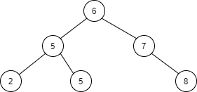
</div>
当二叉搜索树每个结点的左右子树高度相差不大时，对有n个结点的树，树的期望高度为O($\lg{n}$)，对这样一颗树进行基本操作的平均运行时间是$\Theta$($\lg{n}$)。但是有些情况下，树会退化成一个n个结点组成的线性链，比如当我们以数据[1,2,3,4,5]按顺序构建一颗二叉树的时候，会产生如下图所示的二叉树：
<div style="text-align: center">

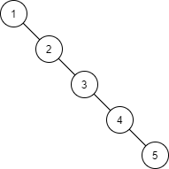
</div>
为了让树在插入结点的过程中动态的保持左右子树高度平衡，有很多种设计方案，比如AVL树或者红黑树，AVL树确保了每个结点左子树与右子树的高度差不会大于1，而红黑树没有这种保证，但是红黑树保证当内部有n个结点时，红黑树的高度至多为$2\lg{(n+1)}$。

## 红黑树的性质
红黑树相比与普通二叉搜索树多了个表示颜色的字段，并且对结点颜色有以下要求：
1. 每个结点或是红色的，或者是黑色的
2. 根结点是黑色的
3. 每个叶节点(NIL)是黑色的
4. 如果一个结点是红色的，则它的两个子结点都是黑色的。
5. 对每个结点，从该结点到其所有后代叶结点的简单路径上，均包含相同数目的黑色结点。
一颗简单的红黑树如下所示：
<div style="text-align: center">

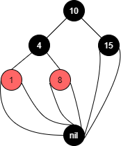
</div>
从图中可以看出，为了便于处理红黑树中的边界条件，我们使用一个哨兵结点来代表nil，其颜色为黑色，通常我们让这个哨兵结点作为根节点的父节点方便查找。从某个结点x出发（不含该结点）到达一个叶结点的任何一条简单路径上的黑色结点个数称为该结点的黑高，红黑树的黑高即其根结点的黑高。  
为了证明一颗有n个结点的红黑树其树的高度至多为$2\lg{(n+1)}$，首先设以结点x作为根结点的子树其黑高为bh，其子结点的树高要么为bh要么为bh-1，这取决于x的颜色，根据性质5在只考虑黑色结点的情况下，这就是一颗完全二叉树，于是有x的子树内部至少有$2^{bh-1}-1$个内部结点，那么以x为根的子树至少含有($2^{bh-1}-1$) + ($2^{bh-1}-1$) + 1 = $2^{bh}-1$个结点，现在我们设树的高度为h，根据性质4，树的黑高至少为h/2，于是有：$n \ge 2^{h/2} - 1$，把1移到不等式左边，再对两边取对数，可得：$h \le 2\lg{n+1}$

## 旋转
旋转是一种能够在不影响二叉搜索树的性质的情况下改变某结点左右树高的操作，如下图所示：
<div style="text-align: center">

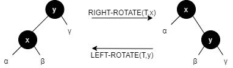
</div>
左旋会使得结点左子树高度加1，右子树高度减1，而右旋则相反。这使得旋转操作在平衡二叉树高度时有很大的作用。

## 插入结点
假设树T是一颗标准的红黑树，那么我们往这个红黑树里插入一个节点，为了不破坏红黑树的性质5，就要求插入的新节点必须是红色的，如果插入节点的父结点是黑色结点那就没有任何问题，但如果是红色结点这时就破坏了性质4，于是我们必须要做一些操作来恢复红黑树的性质。  
我们可以将新结点插入的情况分为三类：
1. 伯父结点为红  
<div style="text-align: center">

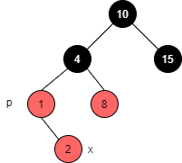
</div>
这种情况下我们可以把父结点和伯父结点的颜色改为黑色，并把祖父结点的颜色改为红色，然后把祖父结点作为新插入的结点继续调整。这里说明下，如果一个结点x是黑色的，并且两个子结点是红色的，这个时候将父结点颜色与子结点交换是不影响红黑树性质的，因为交换后经过结点x到叶结点的所有路径的黑色结点数量没有变化。需要注意的是如果结点x是根结点在子结点变为黑色后自身仍然需要保持黑色。

2. 伯父结点为黑，结点插入在父节点的外侧
<div style="text-align: center">

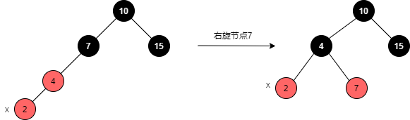
</div>
插入在外侧，即当父结点是祖父的左儿子，新结点插入在父结点的左侧，当父结点是祖父的右儿子，新结点插入在父结点的右侧。这种情况我们直接右旋祖父节点，然后把祖父节点的颜色改为红色，父节点改为黑色。

3. 伯父节点为黑，结点插入在父结点内侧
<div style="text-align: center">

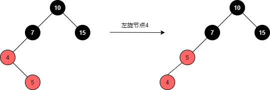
</div>
这种情况我们先左旋父节点，然后让父结点作为新插入的结点，这样情况3就变成情况2了。

## 删除结点
如果删除的结点没有子结点，那么我们可以直接删除掉该结点，另外如果只有左儿子或者只有右儿子，我们就用这单边的结点去替换要删除的结点，如果左右子结点都有，那么我们需要找到右子树中最小的结点来替换删除的结点同时用这个最小结点的右节点（一定没有没有左结点）去替换这个最小结点的位置。以上是删除普通二叉搜索树的某个结点的一般步骤，对于红黑树我们还需要根据被删除结点的颜色来进行调整。如果被删除的结点是红色的没啥事，如果是黑色我们就需要做出调整，因为删除了黑色结点可能会使得红黑树的性质5失效。需要注意的是，当删除结点是左右子结点都存在的情况，我们找到右子树的最小结点来替换这个删除的结点，然后把删除结点的颜色赋予给替换的结点，只考虑颜色的话这相当于删除的结点实际上是这个替换的结点。  
删除结点是黑色可能会出现以下五种情况：  
1. 替换的结点是红色
这种情况下我们直接把这个替换的结点变为黑色就好了

2. 删除结点的兄弟结点是红色
<div style="text-align: center">

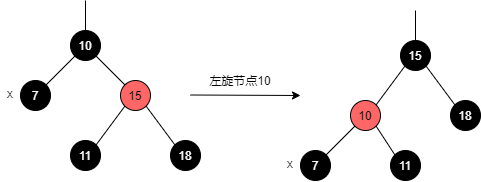
</div>
这种情况下我们左旋父结点，然后父结点变为红色，而原先的兄弟节点变为黑色，因为兄弟节点原来是红色，所以侄子节点一定是黑色的，这样变化后删除节点的兄弟节点一定是黑色的，情况2就变成其他情况

3. 删除节点的兄弟节点是黑色，且兄弟节点的左右子节点都是黑色
<div style="text-align: center">

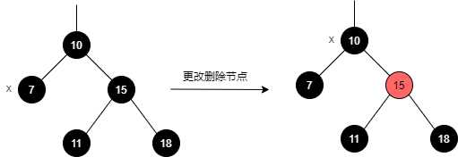
</div>
我们直接把兄弟节点变为红色，这样右子树也亏了一个黑色，我们就可以把父节点当作删除节点来看待，如果父节点是红色那么直接变成黑色结束（情况1），如果父结点是黑色就继续往上看情况

4. 删除节点的兄弟节点是黑色，且兄弟节点的外侧是红色
<div style="text-align: center">

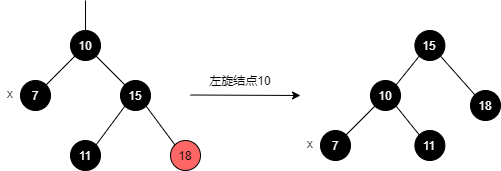
</div>
这种情况下，我们左旋父结点，然后让父结点变为黑色（父结点原先也有可能是黑色），让原兄弟结点变为父结点的颜色，这样相当于删除结点所在的子树缺少的黑高被补齐了，然后兄弟结点所在的子树又少了一个黑色，所以我们把兄弟结点的外侧红色结点变为黑色。

5. 删除节点的兄弟节点是黑色，且兄弟节点的内侧是红色
<div style="text-align: center">

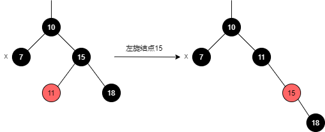
</div>
这种情况我们右旋兄弟结点，然后让兄弟结点变为红色，内侧结点变为黑色，这样就变为情况4了。

注意当修复完结点颜色后要确保根结点为黑色。

## 设计与实现
### 数据结构
```Go
type TreeNode struct {
	key			interface{}
	value		interface{}
	l			*TreeNode
	r			*TreeNode
	p			*TreeNode
	color		colorT
	isNil		bool
}

type RBTree struct {
	header		*TreeNode
	cmp 		cmpFuncT
	count		int
}
```
每个结点除了一些基本字段外还多了个isNil用来区分是一般结点还是Nil结点，在红黑树中我们只需要一个头部结点作为Nil结点，然后把根结点挂在这个Nil结点的父结点上，为了方便获取最小元素和最大元素，我们维护Nil结点的左孩子指向最小结点，Nil结点的右孩子指向最大结点，简单的一个数据结构如下图所示：
<div style="text-align: center">

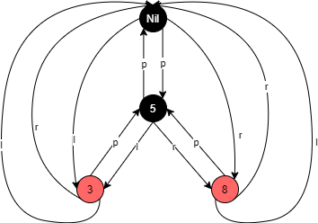
</div>
由结点到Nil结点的线看起来过于繁多，我们省去这一部分的连线，只要记住结点的Nil孩子都连接到Nil结点就行。去掉Nil连线后：
<div style="text-align: center">

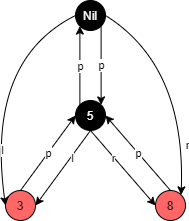
</div>

cmp是一个比较函数，其类型`cmpFuncT`声明如下：
```Go
type cmpFuncT func(interface{}, interface{}) bool
```
表示两个参数进行比较，如果结果为true那么在红黑树中我们认为左键值的结点在右键值的结点的左边，否则在右边。  
count简单用来记录当前数中的结点数目。  

新建一个红黑树要求传入一个比较函数：
```Go
func NewRBTree(cmp cmpFuncT) *RBTree {
	res := &RBTree{
		cmp: cmp,
		header: &TreeNode{ 
			color: black,
			isNil: true,
		},
	}
	res.header.l = res.header
	res.header.r = res.header
	res.header.p = res.header

	return res
}
```
### 迭代
在一些操作中，我们可能需要找到一个结点的下一个结点或者前一个结点，这里的下一个指的是按照排列顺序的下一个，前一个也一样。于是我们为结点定义两个方法`Next`和`Pre`分别进行迭代的递增和递减操作。  
```Go
func (n *TreeNode) Next() (*TreeNode, error) {
	if n.isNil {
		return n, errors.New("can't increase nil node")
	}

	if !n.r.isNil {
		return treeMinimum(n.r), nil
	}

	y := n.p
	for !y.isNil && n == y.r {
		n = y
		y = n.p
	}

	return y, nil
}

func (n *TreeNode) Pre() (*TreeNode, error) {
	if n.isNil {
		return n.r, nil
	}

	if !n.l.isNil {
		return treeMaximum(n.l), nil
	}

	/*
	if n.l.l == n {
		return n, errors.New("can't decrease begin node")
	}
	*/

	y := n.p
	for !y.isNil && n == y.l {
		n = y
		y = n.p
	}

	return y, nil
}
```
首先要求递增的结点不能是Nil结点，如果该结点的右孩子不为Nil，那么我们要找的后继就在右子树的最左边，于是我们调用帮助函数`treeMinimum`来查找右子树的最小值：
```Go
func treeMinimum(x *TreeNode) *TreeNode {
	if x == nil {
		return x
	}
	for !x.l.isNil {
		x = x.l
	}
	return x
}
```
其它情况，我们需要往上遍历，直到该结点所处的子树在父节点的左侧，这时父结点就是我们要找的答案。  
对于`Pre`方法，首先我们要判断结点是否是Nil结点，如果是直接返回最大值，另外如果该结点的左孩子不为空，就找到左子树的最大值，其帮助函数`treeMaximum`如下：
```Go
func treeMaximum(x *TreeNode) *TreeNode {
	if x == nil {
		return x
	}
	for !x.r.isNil {
		x = x.r
	}
	return x
}
```
其它情况我们需要往上遍历，直到该结点所处的子树在父结点的右侧，这时父结点就是该结点的前一个结点。

### 旋转
左旋操作如下：
```Go
func (n *TreeNode) leftRotate() error {
	y := n.r
	if y.isNil {
		return errors.New("leftRotate: right node is nil")
	}
	n.r = y.l
	if !y.l.isNil {
		y.l.p = n
	}
	y.p = n.p
	if y.p.isNil {
		// root
		y.p.p = y
	} else if y.p.l == n {
		y.p.l = y
	} else {
		y.p.r = y
	}
	y.l = n
	n.p = y

	return nil
}
```
首先我们判断下要旋转的结点的右孩子y是否为Nil，如果为Nil则不能左旋，接着把y的左子树移交到旋转结点n的右孩子，然后让y的父结点变为n的父结点，根据n相对于其父结点所处的位置更改父结点对应的字段，如果n是根结点，就设置父结点的父结点为y，如果n是父结点的左孩子就改父结点的左孩子为y，右孩子同理。最后一步就是设置y的左孩子为旋转结点n，而n的父结点变为y。  
右旋操作如下，其情况与左旋操作类似：
```Go
func (n *TreeNode) rightRotate() error {
	y := n.l
	if y.isNil {
		return errors.New("rightRotate: left node is nil")
	}
	n.l = y.r
	if !y.r.isNil {
		y.r.p = n
	}
	y.p = n.p
	if y.p.isNil {
		y.p.p = y
	} else if y.p.l == n {
		y.p.l = y
	} else {
		y.p.r = y
	}
	y.r = n
	n.p = y

	return nil
}
```
### 插入结点
首先我们按照正常插入一颗普通二叉搜索树的方法插入一个结点：
```Go
func (t *RBTree) Insert(key, value interface{}) {
	y := t.header
	x := t.Root()
	newNode := &TreeNode{key: key, value: value, isNil: false }

	for !x.isNil {
		y = x
		if t.cmp(key, x.key) {
			x = x.l
		} else {
			x = x.r
		}
	}
	newNode.p = y

	if y.isNil {
		// root
		y.p = newNode
		y.l = newNode
		y.r = newNode
		newNode.color = black
	} else {
		if t.cmp(key, y.key) {
			y.l = newNode
			if y == t.Min() {
				t.header.l = newNode
			}
		} else {
			y.r = newNode
			if y == t.Max() {
				t.header.r = newNode
			}
		}
		newNode.color = red
	}

	newNode.l = t.header
	newNode.r = t.header

	t.count++
	t.insertFixup(newNode)
}
```
我们从根结点开始找，通过一个循环找到一个适合插入的位置，如果插入位置的父结点是Nil结点那说明我们插入的是一个根结点，修改Nil结点对应的字段并且设置新结点的颜色为黑色，另外我们分别根据插入在父结点的左侧还是右侧修改父结点字段并设置其颜色为红色。通过这种方式插入结点允许我们插入重复的元素，但是如果红黑树作为集合使用要求只能插入不重复的元素，我们还需要做一些额外的判断，`InsertUni`中与`Insert`相同部分的操作我们省略：
```Go
func (t *RBTree) InsertUni(key, value interface{}) bool {
  ...
	if y.isNil {
    ...
	} else {
		if t.cmp(key, y.key) {
			gp, _ := y.Pre()
			if !gp.isNil && !t.cmp(gp.key, key) {
				return false
			}
			y.l = newNode
			if y == t.Min() {
				t.header.l = newNode
			}
		} else {
			if !t.cmp(y.key, key) {
				return false
			}
			y.r = newNode
			if y == t.Max() {
				t.header.r = newNode
			}
		}
		newNode.color = red
	}
...
}
```
当插入结点位于父结点的左侧时，我们需要通过`Pre`方法找到其父结点的前一个结点，如果`cmp(gp.key, key)`为false说明我们插入了一个重复的元素，这个时候直接返回false，当插入结点位于父结点的右侧，我们反过来比较插入的键值与其父结点，也就是`cmp(y.key, key)`如果为false说明我们插入了一个重复的元素，返回。  
插入完结点后我们还需要对红黑树的颜色做出修改以维护红黑树的性质，其修改函数如下：
```Go
func (t *RBTree) insertFixup(x *TreeNode) {
	for x.p.color == red {
		if x.p == x.p.p.l {
			y := x.p.p.r

			if y.color == red {
				y.color = black
				x.p.color = black
				x.p.p.color = red
				x = x.p.p
			} else {
				if x == x.p.r {
					x = x.p
					x.leftRotate()
				}
				x.p.color = black
				x.p.p.color = red
				x.p.p.rightRotate()
			}
		} else {
			y := x.p.p.l

			if y.color == red {
				y.color = black
				x.p.color = black
				x.p.p.color = red
				x = x.p.p
			} else {
				if x == x.p.l {
					x = x.p
					x.rightRotate()
				}
				x.p.color = black
				x.p.p.color = red
				x.p.p.leftRotate()
			}
		}
	}
	t.Root().color = black
}
```
### 删除结点
我们先按照正常删除一个二叉搜索树中的结点的步骤来，其中还需要记录一些信息。
```Go
func (t *RBTree) Delete(x *TreeNode) {
	if x.isNil {
		return
	}

	d := x
	dOriginColor := d.color
	var y *TreeNode
	p := d.p

	if x == t.Min() {
		t.header.l, _ = x.Next()
	}
	if x == t.Max() {
		t.header.r, _ = x.Pre()
	}

	if x.l.isNil {
		y = x.r
		x.transplant(x.r)
	} else if x.r.isNil {
		y = x.l
		x.transplant(x.l)
	} else {
		d = treeMinimum(x.r)
		dOriginColor = d.color
		y = d.r

		if d.p != x {
			d.transplant(d.r)
			d.r = x.r
			d.r.p = d
			p = d.p
		} else {
			p = d
		}
		x.transplant(d)
		d.l = x.l
		d.l.p = d
		d.color = x.color
	}

	if dOriginColor == black {
		t.deleteFixup(y, p)
	}
	t.count--
}
```
删除一个结点，我们通常用它的子节点代替它的位置，其帮助函数`transplant`用来移植结点：
```Go
func (n *TreeNode) transplant(x *TreeNode) {
	if n.p.isNil {
		n.p.p = x
	} else if n.p.l == n {
		n.p.l = x
	} else {
		n.p.r = x
	}
	if !x.isNil {
		x.p = n.p
	}
}
```
如果删除节点的左侧是Nil节点，那么我们移植右侧的结点到删除结点的位置，如果右侧为空同理，但是如果两边都不为空，我们需要找到右子树中最小的结点替换该节点的位置。以上操作都需要记录删除节点的父结点的位置，以及新的替换结点，最后如果被删除的结点是黑色我们需要对红黑树做出调整来维护红黑树的性质，其调整函数如下：
```Go
func (t *RBTree) deleteFixup(x *TreeNode, p *TreeNode) {
	for x != t.Root() && x.color == black {
		if x == p.l {
			w := p.r
			if w.color == red {
				p.color = red
				w.color = black
				p.leftRotate()
			} else {
				if w.l.color == black && w.r.color == black {
					w.color = red
					x = p
					p = x.p
				} else {
					if w.r.color == black {
						w.l.color = black
						w.color = red
						w.rightRotate()
						w = p.r
					}
					w.color = p.color
					p.color = black
					w.r.color = black
					p.leftRotate()
					x = t.Root()
				}
			}
		} else {
			w := p.l
			if w.color == red {
				p.color = red
				w.color = black
				p.rightRotate()
			} else {
				if w.l.color == black && w.r.color == black {
					w.color = red
					x = p
					p = x.p
				} else {
					if w.l.color == black {
						w.r.color = black
						w.color = red
						w.leftRotate()
						w = p.l
					}
					w.color = p.color
					p.color = black
					w.l.color = black
					p.rightRotate()
					x = t.Root()
				}
			}
		}
	}

	x.color = black
}
```
其中的情况如同上一章我们讨论的一样。
### 测试
我们在测试文件中编写一些测试函数来测试下该数据结构的正确性：
```Go
func checkBinaryTree(n *TreeNode, cmp cmpFuncT) bool {
	if n == nil || n.isNil {
		return true
	}

	if !n.l.isNil && cmp(n.key, n.l.key) {
		// fmt.Println("l:", n.l.key, "key:", n.key)
		return false
	}
	if !n.r.isNil && cmp(n.r.key, n.key) {
		// fmt.Println("r:", n.r.key, "key:", n.key)
		return false
	}

	return checkBinaryTree(n.l, cmp) && checkBinaryTree(n.r, cmp)
}

func checkBlackHeight(n *TreeNode) (int, bool) {
	if n == nil || n.isNil {
		return 1, true
	}

	var nbs int

	if n.color == black {
		nbs = 1
	}

	nl, bl := checkBlackHeight(n.l)
	nr, br := checkBlackHeight(n.r)

	if !bl || !br || nl != nr {
		return nbs, false
	}
	return nbs + nr, true
}

func checkRedNode(n *TreeNode) bool {
	if n == nil || n.isNil {
		return true
	}

	if n.color == red {
		if n.l.color == red {
			return false
		}
		if n.r.color == red {
			return false
		}
	}
	return true
}

func checkColor(tree *RBTree) error {
	if tree.Root().color != black {
		return errors.New("the root node must be black")
	}
	if _, ok := checkBlackHeight(tree.Root()); !ok {
		return errors.New("black-height error")
	}
	if ok := checkRedNode(tree.Root()); !ok {
		return errors.New("the red node has a red child")
	}
	return nil
}

func commonCheck(tree *RBTree) error {
	if checkBinaryTree(tree.Root(), tree.cmp) == false {
		return errors.New("not a binary tree")
	}
	if err := checkColor(tree); err != nil {
		return err
	}

	return nil	
}
```
其中`checkBinaryTree`检查下二叉搜索树的性质, `checkBlackHeight`检查红黑树的性质5，`checkRedNode`检查红黑树的性质4，我们可以用这些函数简单地对导出的方法测试下：
```Go
func TestTreeInsert(t *testing.T) {
	for _, d := range dup_data {
		tree := NewRBTree(intCmp)
		for _, key := range d {
			tree.Insert(key, 0)
			err := commonCheck(tree)
			if err != nil {
				t.Errorf("%v", err)
			}
		}
		if tree.Length() != len(d) {
			t.Errorf("missing element, tree len:%v, len:%v", tree.Length(), len(d))
		}

		for _, key := range d {
			n := tree.Find(key)
			if n.isNil {
				t.Errorf("missing key:%v", key)
			}
			if n.key.(int) != key {
				t.Errorf("find key:%v, get:%v", key, n.key)
			}
		}
	}	
}

func TestTreeFind(t *testing.T) {
	for _, d := range data {
		tree := NewRBTree(intCmp)
		for _, key := range d {
			tree.Insert(key, 0)
			err := commonCheck(tree)
			if err != nil {
				t.Errorf("%v", err)
			}
		}

		for _, key := range d {
			n := tree.Find(key)

			if n == tree.End() {
				t.Errorf("not found, key:%v", key)
			} else if n.key.(int) != key {
				t.Errorf("found, but node:%v != key:%v", n.key.(int), key)
			}
		}

		nn := tree.Find(-1)
		if nn != tree.End() {
			t.Errorf("'nil' node should be returned when no lookup element exists")
		}
	}	
}

func TestTreeDelete(t *testing.T) {
	rand.Seed(time.Now().Unix())

	for _, d := range data {
		tree := NewRBTree(intCmp)
		m := map[int]int{}
		for _, key := range d {
			m[key] = 0
			tree.Insert(key, 0)
			//printTree(tree.Root(), "tree")
			err := commonCheck(tree)
			if err != nil {
				t.Errorf("%v", err)
			}
		}

		n := tree.Length()
		cnt := len(m)
		for i := 0; i < n; i++ {
			r := rand.Intn(n - i)
			cur := tree.Min()
			for j := 0; j < r; j++ {
				cur, _ = cur.Next()
			}
			if cur == tree.End() {
				t.Errorf("delete node don't exist, tree len:%v, rand:%v", tree.Length(), r)
			}
			tree.Delete(cur)
			err := commonCheck(tree)
			if err != nil {
				t.Errorf("%v", err)
			}
			delete(m, cur.key.(int))
			min := findMapMin(m)
			max := findMapMax(m)
			tmin := tree.Min()
			tmax := tree.Max()
			cnt--

			if min != math.MaxInt64 && min != tmin.key.(int) {
				t.Errorf("delete key: %v, min:%v != real min:%v", cur.key, tmin.key.(int), min)
			}
			if max != math.MinInt64 && max != tmax.key.(int) {
				t.Errorf("delete key: %v, max:%v != real max:%v", cur.key, tmax.key.(int), max)
			}
			if tree.Length() != cnt {
				t.Errorf("delete key: %v, len:%v != real len:%v", cur.key, tree.Length(), cnt)
			}

			for k, _ := range m {
				ni := tree.Find(k)
				if ni == tree.End() || ni.key.(int) != k {
					t.Errorf("delete key: %v, but key: %v not found", cur.key, k)
				}
			}
			nn := tree.Find(cur.key)
			if nn != tree.End() {
				t.Errorf("delete key: %v, but still exists in the tree", cur.key)
			}
		}
	}	
}
```