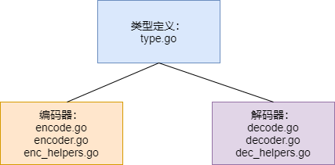

gob是Go语言类型编码的一种，在rpc中发挥着很重要的作用，本文简单的分析了Go语言gob库的代码实现。
<!--more-->
## 简述
gob库总的来说可以分成3个部分组成：“类型定义”：“编码器”、“解码器”，如下图所示
<div style="text-align:center">


</div>

## 类型定义
### userTypeInfo
```Go
type userTypeInfo struct {
	user        reflect.Type 	// 用户递交的类型
	base        reflect.Type 	// 解引用后的类型
	indir       int         	// 由user到base需要解引用的次数
	externalEnc int          // 使用的外部编码器 Gob、Binary、Text
	externalDec int          // 使用的外部解码器
	encIndir    int8         // 由user到实现编码器类型需要解引用的次数，-1代表取地址
	decIndir    int8         // 由user到实现解码器类型需要解引用的次数
}
```
userTypeInfo结构体表示的是用户类型的一些信息，包括类型本身的反射类型、基础类型（非引用类型）的反射类型、还有是否实现了外部的编解码器等。  
可以通过`validUserType`来从反射类型中获取userTypeInfo
```Go
// 代码有省略
func validUserType(rt reflect.Type) (*userTypeInfo, error) {
	ut := new(userTypeInfo)
	ut.base = rt
	ut.user = rt

	// 快慢指针检查是否存在循环引用
	slowpoke := ut.base
	for {
		pt := ut.base
		if pt.Kind() != reflect.Ptr { // 如果pt的类型不是指针就可以直接退出了
			break
		}
		ut.base = pt.Elem() // 解引用一次
		if ut.base == slowpoke {
			// 循环引用返回错误
			return nil, errors.New("can't represent recursive pointer type " + ut.base.String())
		}
		// ut.base每解引用两次，slowpoke解引用一次
		if ut.indir%2 == 0 {
			slowpoke = slowpoke.Elem()
		}
		ut.indir++
	}

	// 判断类型是否有实现编码接口
	if ok, indir := implementsInterface(ut.user, gobEncoderInterfaceType); ok {
		ut.externalEnc, ut.encIndir = xGob, indir
	} 

	if ok, indir := implementsInterface(ut.user, gobDecoderInterfaceType); ok {
		ut.externalDec, ut.decIndir = xGob, indir
	} 

	// 如果rt存在就返回rt，不存在就保存ut并返回ut
	ui, _ := userTypeCache.LoadOrStore(rt, ut)
	return ui.(*userTypeInfo), nil
}
```
validUserType会新建一个userTypeInfo然后反射类型的Elem方法来解引用获取基本类型，其中使用了快慢指针来避免出现指针的互相引用，原理就是快指针移动速度是慢指针的两倍如果出现闭环那么快指针将会在某一时刻与慢指针相等。另外该函数还会检查用户类型是否实现了某个编解码器的接口。

### gobType 
```Go
// 表示gob类型的id
type typeId int32

// gob类型接口
type gobType interface {
	id() typeId
	setId(id typeId)
	name() string
	string() string
	safeString(seen map[typeId]bool) string
}
```
typeId是int32的别名，实际作用是用来索引一个gob类型，用户自定义的类型id从64开始。gobType表示的是一个gob内部类型的接口定义，在文件内通过实现该接口定义了Go类型，例如：
```Go
type CommonType struct {
	Name string
	Id   typeId
}

func (t *CommonType) id() typeId { return t.Id }

func (t *CommonType) setId(id typeId) { t.Id = id }

func (t *CommonType) string() string { return t.Name }

func (t *CommonType) safeString(seen map[typeId]bool) string {
	return t.Name
}

func (t *CommonType) name() string { return t.Name }
```
这个CommonType是通用的接口实现，基础类型会直接在文件内会通过调用`bootstrapType`函数生成一个gob类型，并且在函数内部调用`setTypeId`给该类型设置一个typeId，不同类型之间的区别是名称和typeId。
除此之外还有几个特殊的结构体也会通过以`CommondType`匿名成员的方式实现gobType
```Go
type arrayType struct {
	CommonType
	// 数组元素的类型id
	Elem typeId
	Len  int
}

// 编码器类型
type gobEncoderType struct {
	CommonType
}

type mapType struct {
	CommonType
	Key  typeId
	Elem typeId
}

type sliceType struct {
	CommonType
	Elem typeId
}

// 结构体类型
type fieldType struct {
	Name string
	Id   typeId
}
type structType struct {
	CommonType
	Field []*fieldType
}
```
其它的所有类型（包括用户自定义）都可以通过以上gobType来构建一个新的gobType，例如在初始化过程中会通过`mustGetTypeInfo`->`buildTypeInfo`->`getBaseType`->`getType`->`newTypeObject`的流程生成内部使用的类型对应的gob类型及typeId。
其中newTypeObject函数定义如下，这里我们省略了很多类型，重点分析下slice和结构体：
```Go
func newTypeObject(name string, ut *userTypeInfo, rt reflect.Type) (gobType, error) {
if ut.externalEnc != 0 {
		return newGobEncoderType(name), nil
	}
	var err error
	var type0, type1 gobType

	switch t := rt; t.Kind() {
  case reflect.Bool:
		return tBool.gobType(), nil
  // 省略...
	case reflect.Slice:
		if t.Elem().Kind() == reflect.Uint8 {
			return tBytes.gobType(), nil
		}
		st := newSliceType(name)
		types[rt] = st
		type0, err = getBaseType(t.Elem().Name(), t.Elem())
		if err != nil {
			return nil, err
		}
		st.init(type0)
		return st, nil

	case reflect.Struct:
		st := newStructType(name)
		types[rt] = st
		idToType[st.id()] = st
		for i := 0; i < t.NumField(); i++ {
			f := t.Field(i)
			if !isSent(&f) {
				continue
			}
			typ := userType(f.Type).base
			tname := typ.Name()
			// Name只会返回reflect包内定义的类型名称，其它类型会返回空字符串
			if tname == "" {
				t := userType(f.Type).base
				tname = t.String()
			}
			gt, err := getBaseType(tname, f.Type)
			if err != nil {
				return nil, err
			}

			if gt.id() == 0 {
				setTypeId(gt)
			}
			st.Field = append(st.Field, &fieldType{f.Name, gt.id()})
		}
		return st, nil

	default:
		return nil, errors.New("gob NewTypeObject can't handle type: " + rt.String())
	}
}
```
可以看到该函数首先会判断是否实现了外部编码器如果实现了就转交给`newGobEncoderType`函数实现，其它情况会对用户类类型进行反射，根据不同类型种类来创建gobType，如果是基本类型就直接返回预定义的gobType，比如bool类型就返回`tBytes.gobType()`。如果类型种类是slice首先会判断是否是`reflect.Uint8`，因为`[]uint8`就相当于`[]byte`，而`[]byte`是作为基本类型实现的所以，可以直接返回`tBytes.gobType()`，其他slice会调用`newSliceType`来创建一个新的`sliceType`,然后递归调用了`getbaseType`来获取slice元素的gobType，最后再调用sliceType的init方法，该方法设置了sliceType类型的typeId并设置了Elem成员的TypeId。  
结构体也与slice类似，首先调用`newStructType`新建一个`structType`，然后通过反射的方法遍历结构体字段，`isSend`函数判断该字段是否导出且有效的，如果有效就通过`GetBaseType`得到每个字段的gobType，将获得的gobType的typeId附加到`structType`的Field成员上

### wireType & typeInfo
```Go
type wireType struct {
	ArrayT           *arrayType
	SliceT           *sliceType
	StructT          *structType
	MapT             *mapType
	GobEncoderT      *gobEncoderType
	BinaryMarshalerT *gobEncoderType
	TextMarshalerT   *gobEncoderType
}

type typeInfo struct {
	id      typeId
	encInit sync.Mutex    // 编码时在buildEncEngine中使用保护encoder
	encoder atomic.Value  // 储存*encEngine 
	wire    *wireType
}
```
wireType是一种特殊的gobType，用来表示我们发送或接收某个类型的信息。我们编码一个值时，会先发送一个(-id，wireType)对。wireType会将对应类型的结构体字段初始化，其它字段仍为空。  
typeInfo用来作为类型的信息，主要是保存了类型对应的wireType以及encEngine（编码引擎），encEngine保存了如何把类型编码的操作，具体可以看[编码器](#编码器)。typeInfo通过函数`buildTypeInfo`来创建：
```Go
func buildTypeInfo(ut *userTypeInfo, rt reflect.Type) (*typeInfo, error) {
	typeLock.Lock()
	defer typeLock.Unlock()

	// 锁住后进行二次检查，如果存在就直接返回
	if info := lookupTypeInfo(rt); info != nil {
		return info, nil
	}

	gt, err := getBaseType(rt.Name(), rt)
	if err != nil {
		return nil, err
	}
	info := &typeInfo{id: gt.id()}

	if ut.externalEnc != 0 {
		// 如果存在外部编码器
		// 得到rt的类型信息，会调用newGobEncoderType创建一个编码器类型
		userType, err := getType(rt.Name(), ut, rt)
		if err != nil {
			return nil, err
		}
		gt := userType.id().gobType().(*gobEncoderType)
		switch ut.externalEnc {
			// 选择编码器类型
		case xGob:
			info.wire = &wireType{GobEncoderT: gt}
		case xBinary:
			info.wire = &wireType{BinaryMarshalerT: gt}
		case xText:
			info.wire = &wireType{TextMarshalerT: gt}
		}
		rt = ut.user
	} else {
		t := info.id.gobType()
		switch typ := rt; typ.Kind() {
		case reflect.Array:
			info.wire = &wireType{ArrayT: t.(*arrayType)}
		case reflect.Map:
			info.wire = &wireType{MapT: t.(*mapType)}
		case reflect.Slice:
			if typ.Elem().Kind() != reflect.Uint8 {
				info.wire = &wireType{SliceT: t.(*sliceType)}
			}
		case reflect.Struct:
			info.wire = &wireType{StructT: t.(*structType)}
		}
	}

	newm := make(map[reflect.Type]*typeInfo)
	// 加载旧的map到m中
	m, _ := typeInfoMap.Load().(map[reflect.Type]*typeInfo)
	for k, v := range m {
		// 复制oldm到newm中
		newm[k] = v
	}
  // 新增一条类型信息
	newm[rt] = info
	// 保存回去
	typeInfoMap.Store(newm)
	return info, nil
}
```
buildTypeInfo在上锁后首先进行二次检查，如果发现类型信息已经存在就直接返回，另外会通过反射类型获得对应的gob类型并创建一个新的typeInfo给id赋值。如果存在外部编码器，那么这个类型信息的wireType就根据编码器类型来决定，因为要找到实现编码器的类型需要从用户给的类型开始，所以重新调用`getType`取得用户给的类型对应的gobType，将这个gobType赋值给wireType对应的字段。其他类型就根据其反射类型来设置wireType。最后需要把把这个类型加入到类型信息缓存中。

### 缓存
type文件中有很多缓存数据方便数据查找
```GO
var userTypeCache sync.Map  // map[reflect.Type]*userTypeInfo

var types = make(map[reflect.Type]gobType) // 普通类型到gobType的映射

var idToType = make(map[typeId]gobType) // typeId到gobType的映射

var builtinIdToType map[typeId]gobType // 内建的typeId到gob类型的映射

var typeInfoMap atomic.Value // 反射类型到typeInfo 原子值是一个指向map[reflect.Type]*typeInfo.的指针

// 解码用，类型名到反射类型的映射
var nameToConcreteType sync.Map // map[string]reflect.Type
// 编码用，反射类型到类型名的映射
var concreteTypeToName sync.Map // map[reflect.Type]string
```
userTypeCache主要用在`validUserType`中，缓存了反射类型到userTypeInfo的信息。

types用于`getType`以及`newTypeObject`中，缓存了普通类型到gobType的信息

idToType在`setTypeId`储存，typeId的`gobType`方法通过该缓存查找id对应的gobType，解码器`typeString`获取类型名时也会用到

builtinIdToType在初始化了内建类型后直接从idToType复制而来。在解码器编译解码指令时，用来根据typeId获取gobType。

typeInfoMap在`buildTypeInfo`中储存，`lookupTypeInfo`使用缓存通过反射类型查找类型信息

nameToConcreteType和concreteTypeToName前者是类型名到反射类型的缓存后者相反，通过函数`Register`或者`RegisterName`可以把类型的信息添加进缓存，在type.go文件中会为所有的内建类型调用`Register`注册信息。nameToConcreteType在解码接口时用来根据编码的名字得到类型，如果你发送的接口不是内建类型需要主动调用`Register`函数来进行注册。concreteTypeToName的作用就是在编码接口时根据反射类型获取类型名字，然后把这个名字作为字符串编码。

## 编码器

## 解码器