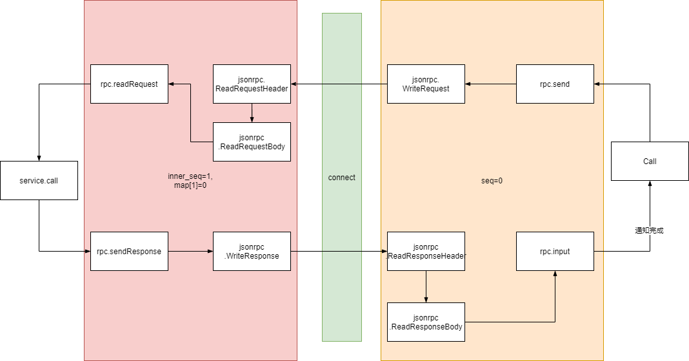

其实Go语言自带的rpc实现是比较简单的，不过看过源码后也能学到如何实现一个简单的rpc系统。
<!--more-->
## rpc
### 简介
go语言rpc库由`server.go`、`client.go`两个文件构成，分别是rpc服务端实现和rpc客户端实现，内部默认的编码方式是[gob](https://oshirisu.site/posts/%E8%A7%A3%E6%9E%90go%E8%AF%AD%E8%A8%80gob%E5%BA%93/)。通过服务端对类型方法的反射，获取方法名和方法类型的信息，然后使得客户端能够通过服务名和方法的字符串来调用远程主机上的一个函数。

**简单的使用**
我们创建一个可以回复hello的rpc服务，首先定义下客户端和服务端通用的内容
```Go
const HelloServiceName = "local/rpc/HelloService"

type HelloServiceInterface interface {
	Hello(request string, reply *string) error
}
```
接着我们在服务端实现一个`Hello`服务
```Go
type HelloService struct {}

func (h *HelloService) Hello(request string, reply *string) error {
	*reply = "Hello," + request
	return nil
}

func main() {
  // 注册rpc服务
  err := rpc.RegisterName(HelloServiceName, new(HelloService))
  if err != nil {
    log.Fatal("ReigsterHelloService:", err)
  }

  // 监听tcp的1234端口
  lis, err := net.Listen("tcp", ":1234")
  if err != nil {
    log.Fatal("Listen:", err)
  }

	for {
		conn, err := lis.Accept()
		if err != nil {
			log.Fatal("Accept:", err)
		}

    // 为每个连接提供rpc服务
		go rpc.ServeConn(conn)
	}
}
```
客户端使用远程的rpc服务：
```GO
func main() {
  client, err := rpc.Dial("tcp", ":1234")
  if err != nil {
    log.Fatal("Dial rpc server:", err)
  }

  method := HelloServiceName + ".Hello"
  request := "RPC"
  var reply string

  err = client.Call(method, request, reply)
  if err != nil {
    log.Fatal("Call Hello:", err)
  }
  fmt.Println("recv:", reply)   // ""Hello,RPC"
  client.Close()
}
```

流程大致如下图所示：
<div style="text-align: center">


</div>

### 服务端实现
#### 注册服务
相关数据结构如下：
```GO
type methodType struct {
	// 保护计数器
	sync.Mutex // protects counters
	// 方法的反射结构
	method     reflect.Method
	// 参数类型
	ArgType    reflect.Type
	// 响应类型
	ReplyType  reflect.Type
	// 调用次数
	numCalls   uint
}

type service struct {
	// 服务名称
	name   string                
	// 方法的接收者
	rcvr   reflect.Value         
	// 接收者的类型
	typ    reflect.Type         
	// 注册的方法表
	method map[string]*methodType 
}

type Server struct {
	// 服务表
	serviceMap sync.Map   

  // ....
}
```
methodType表示我们提供rpc的接收者的方法，service表示一个rpc服务，Server表示一个rpc服务器。在包内会创建一个默认的rpc服务器`var DefaultServer = NewServer()`，当我们使用包的导出函数`Register`或者`RegisterName`会在这个默认的服务器上注册服务，以上两个函数其实都调用了server的`register`方法，该方法如下所示：
```GO
func (server *Server) register(rcvr interface{}, name string, useName bool) error {
	s := new(service)
	s.typ = reflect.TypeOf(rcvr)
	s.rcvr = reflect.ValueOf(rcvr)
	// 取得类型名称
	sname := reflect.Indirect(s.rcvr).Type().Name()
	if useName {
		sname = name
	}
	if sname == "" {
		s := "rpc.Register: no service name for type " + s.typ.String()
		log.Print(s)
		return errors.New(s)
	}

	// 如果没有使用自定义名称并且，类型名称是未导出的返回错误 
	if !token.IsExported(sname) && !useName {
		s := "rpc.Register: type " + sname + " is not exported"
		log.Print(s)
		return errors.New(s)
	}
	s.name = sname

	s.method = suitableMethods(s.typ, true)

	if len(s.method) == 0 {
		str := ""
		// 测试下该类型的指针类型是否有实现方法，如果有提醒一下用户
		method := suitableMethods(reflect.PtrTo(s.typ), false)
		if len(method) != 0 {
			str = "rpc.Register: type " + sname + " has no exported methods of suitable type (hint: pass a pointer to value of that type)"
		} else {
			str = "rpc.Register: type " + sname + " has no exported methods of suitable type"
		}
		log.Print(str)
		return errors.New(str)
	}

	// 把该服务存放在该服务器的服务表上，如果已经存在报错
	if _, dup := server.serviceMap.LoadOrStore(sname, s); dup {
		return errors.New("rpc: service already defined: " + sname)
	}
	return nil
}
```
 该函数首先会获取接收者rcvr的反射类型以及反射值，然后通过获取反射值的基本类型名称，`Indirect`的作用是如果是指针会解引用。如果`useName`为true，那么该服务的名称会等于我们设置的名称，否则服务的名称就为上一步获取的接收者的基本类型名称。另外如果没有使用自定义名称要求，接收者是导出的，即首字母大写。接着该函数会借助`suitableMethods`函数获取接收者类型的所有方法，函数内容如下，所有错误的处理省略：
 ```Go
// 根据类型typ返回合适的rpc方法表
func suitableMethods(typ reflect.Type, reportErr bool) map[string]*methodType {
	methods := make(map[string]*methodType)

	for m := 0; m < typ.NumMethod(); m++ {
		method := typ.Method(m)
		mtype := method.Type
		mname := method.Name
		// PkgPahth 限定小写(未导出)方法名的包路径。对于大写(导出)的方法名，它是空的
		if method.PkgPath != "" {
			continue
		}
		// 输入参数要求要3个：receiver， *args， *reply
		if mtype.NumIn() != 3 {
			// 错误输出，省略
			continue
		}
		// First arg need not be a pointer.
		// 第一个参数不需要是一个指针
		argType := mtype.In(1)
		// 如果不是导出类型或者内建类型就记录错误然后继续
		if !isExportedOrBuiltinType(argType) {
			// 错误输出，省略
			continue
		}
		// 第二个参数必需要是一个指针
		replyType := mtype.In(2)
		if replyType.Kind() != reflect.Ptr {
			// 错误输出，省略
			continue
		}
		if !isExportedOrBuiltinType(replyType) {
			// 错误输出，省略
			continue
		}
		// 方法需要一个输出
		if mtype.NumOut() != 1 {
			// 错误输出，省略
			continue
		}
		// 返回类型要求是一个错误类型
		if returnType := mtype.Out(0); returnType != typeOfError {
			// 错误输出，省略
			continue
		}
		// 记录方法
		methods[mname] = &methodType{method: method, ArgType: argType, ReplyType: replyType}
	}
	return methods
}
```
该函数会遍历传入类型`typ`的所有方法分别获取方法的类型信息、参数信息，找到所有符合要求的方法保存到一个`map[string]*methodType`中，然后返回，不难看出，对于方法有以下要求：
* 方法是导出的
* 输入参数要有3个：receiver，*args，*reply
* 第一个参数不需要是指针但是要求是导出类型或者内建类型
* 第二个参数必需是一个指针并且是导出类型或者内建类型
* 方法需要一个输出并且是一个错误类型  
回到`register`函数，如果在调用完`suitableMethods`函数后发现没有合适的方法，会尝试找该类型的指针类型有没有实现合适的方法，如果有会提醒用户。正常获取完方法类型后将注册的rpc服务保存到服务器的`serviceMap`上，如果已经存在就报错。

#### 数据编解码
服务端与客户端进行通信时，需要采用一定的编码手段，把程序中的数据转换为能够在网络连接中传输的数据，并能从网络数据再转换回程序数据，于是服务器要求用户提供一个编解码器。在服务器端定义了一个服务端编码接口如下：
```GO
type ServerCodec interface {
	// 从连接中读取请求
	ReadRequestHeader(*Request) error
	// ReadRequestBody可能被调用时带有一个nil参数来强制读取和丢弃请求体
	ReadRequestBody(interface{}) error

	// 写入响应
	WriteResponse(*Response, interface{}) error

	// 关闭连接，要求是幂等的
	Close() error
}
```
其中`ReadRequestHeader`和`ReadRequestBody`是成对调用的，另外注意`Close`要求是幂等的，即多次调用不影响结果。另外我们可以从接口的定义上看出要编解码的数据，一个是请求消息头`Request`，一个是响应消息头`Response`，两个消息头后都可以带一个自定义的数据体。
```GO
type Request struct {
	// 服务的方法名
	ServiceMethod string 
	// 客户端选择的序列号
	Seq           uint64  
	// 空闲列表使用
	next          *Request
}

type Response struct {
	ServiceMethod string   
	Seq           uint64    
	Error         string    
	next          *Response
}
```
这两个数据结构都有一个next字段，方便在使用后加入空闲列表避免频繁的新建数据。客户端请求头`Request`可以得到用户需要调用的方法名称，以及一个客户端自定义的序列号，后面通常跟着一个调用参数，回复响应时需要在响应头把请求时的方法名和序列号返回给客户端以便客户端确认是那个调用完成了，如果在服务的调用方法时出现错误，将设置`Error`字段，另外响应头后一波跟着调用结果。


在包内默认实现了一个gob编解码器：
```Go
type gobServerCodec struct {
	rwc    io.ReadWriteCloser
	dec    *gob.Decoder
	enc    *gob.Encoder
	encBuf *bufio.Writer
	closed bool
}

func (c *gobServerCodec) ReadRequestHeader(r *Request) error {
	// 解码到请求到r中
	return c.dec.Decode(r)
}

func (c *gobServerCodec) ReadRequestBody(body interface{}) error {
	// 解码数据到body中
	return c.dec.Decode(body)
}

func (c *gobServerCodec) WriteResponse(r *Response, body interface{}) (err error) {
	// 先编码响应头
	if err = c.enc.Encode(r); err != nil {
		// 如果编码时发生了错误，就尝试刷新缓存，如果缓冲区没错误，说明是gob编码时发生的错误
		if c.encBuf.Flush() == nil {
			log.Println("rpc: gob error encoding response:", err)
			c.Close()
		}
		return
	}
	// 编码响应消息体
	if err = c.enc.Encode(body); err != nil {
		if c.encBuf.Flush() == nil {
			log.Println("rpc: gob error encoding body:", err)
			c.Close()
		}
		return
	}
	// 刷新缓冲区
	return c.encBuf.Flush()
}

func (c *gobServerCodec) Close() error {
	// 只关闭一次
	if c.closed {
		return nil
	}
	c.closed = true
	return c.rwc.Close()
}
```

#### 提供服务
我们有5种途径提供一个rpc服务，我们一个一个来看:
* ServeCodec：包内的导出函数ServeCodec调用了默认服务的`ServeCodec`方法，要求用户传入一个编解码器，方法定义如下：
```GO
func (server *Server) ServeCodec(codec ServerCodec) {
	sending := new(sync.Mutex)
	wg := new(sync.WaitGroup)
	for {
		service, mtype, req, argv, replyv, keepReading, err := server.readRequest(codec)
		if err != nil {
			if debugLog && err != io.EOF {
				log.Println("rpc:", err)
			}
			if !keepReading {
				break
			}
			// 如果读取到了请求消息头就发送一个包含错误消息的响应
			if req != nil {
				server.sendResponse(sending, req, invalidRequest, codec, err.Error())
				server.freeRequest(req)
			}
			continue
		}
		wg.Add(1)
		// 调用请求的方法
		go service.call(server, sending, wg, mtype, req, argv, replyv, codec)
	}
	wg.Wait()
	codec.Close()
}
```
函数中定义了两个关键的变量，sending用来确保同一时刻只有一个goroutine发送响应，wg用来在服务结束时确保所有的调用都完成。函数整体是一个无限循环，每次循环首先调用`readRequest`获取一个用户请求的信息，该函数定义如下：
```Go
func (server *Server) readRequestHeader(codec ServerCodec) (svc *service, mtype *methodType, req *Request, keepReading bool, err error) {
	// 获取一个请求结构体
	req = server.getRequest()
	// 解码请求头
	err = codec.ReadRequestHeader(req)
	if err != nil {
		req = nil
		// EOF就直接退出
		if err == io.EOF || err == io.ErrUnexpectedEOF {
			return
		}
		// 其他错误报告
		err = errors.New("rpc: server cannot decode request: " + err.Error())
		return
	}

	keepReading = true

	// 找到最后一个点符号
	dot := strings.LastIndex(req.ServiceMethod, ".")
	if dot < 0 {
		err = errors.New("rpc: service/method request ill-formed: " + req.ServiceMethod)
		return
	}
	// 分别获取服务名，和方法名
	serviceName := req.ServiceMethod[:dot]
	methodName := req.ServiceMethod[dot+1:]

	// 根据服务名查找服务
	svci, ok := server.serviceMap.Load(serviceName)
	if !ok {
		err = errors.New("rpc: can't find service " + req.ServiceMethod)
		return
	}
	svc = svci.(*service)
	// 根据方法名查找方法
	mtype = svc.method[methodName]
	if mtype == nil {
		err = errors.New("rpc: can't find method " + req.ServiceMethod)
	}
	return
}

func (server *Server) readRequest(codec ServerCodec) (service *service, mtype *methodType, req *Request, argv, replyv reflect.Value, keepReading bool, err error) {
	service, mtype, req, keepReading, err = server.readRequestHeader(codec)
	if err != nil {
		if !keepReading {
			return
		}
		// 抛弃数据体
		codec.ReadRequestBody(nil)
		return
	}

	argIsValue := false
	if mtype.ArgType.Kind() == reflect.Ptr {
		// 如果参数是指针类型，需要对参数类型解引用，然后创建新值
		argv = reflect.New(mtype.ArgType.Elem())
	} else {
		argv = reflect.New(mtype.ArgType)
		argIsValue = true
	}
	// argv现在一定是个指针，然后从消息体中读取argv
	if err = codec.ReadRequestBody(argv.Interface()); err != nil {
		return
	}
	// 如果argv原本类型是非指针的，这里要解引用
	if argIsValue {
		argv = argv.Elem()
	}

	// 响应类型一定是指针，在这里给响应创建新值，注意new创建的值是零值
	replyv = reflect.New(mtype.ReplyType.Elem())

	switch mtype.ReplyType.Elem().Kind() {
	case reflect.Map:
		// 如果响应类型是map，使用MakeMap初始化
		replyv.Elem().Set(reflect.MakeMap(mtype.ReplyType.Elem()))
	case reflect.Slice:
		// 如果响应类型是slice，使用MakeSlice初始化
		replyv.Elem().Set(reflect.MakeSlice(mtype.ReplyType.Elem(), 0, 0))
	}
	return
}
```
`readRequest`首先会调用`readRequestHeader`来获取请求头的信息，在`readRequestHeader`函数内首先调用编解码器来解码一个请求头，当解码成功时设置keepReading为true表示即使出现错误也要把剩余的数据体读取出来。接着调用`strings.LastIndex`来分隔请求发来的服务方法名称，获取到服务名和方法名，先从`server.serviceMap`根据服务名查找服务，然后根据方法名在服务的`method`表中查找对应的方法类型后返回到`readRequest`中，如果出现错误，根据keepReading来判断是否要抛弃消息体后再结束。接下来会检查获取到的方法的`ArgType`类型来创建一个参数值argv，如果是指针类型，需要对参数类型解引用后在通过`reflect.New`创建新值，否则就记录下`argIsValue`，因为使用`reflect.New`返回的是指针值，这里方便后面通过`Elem`方法获取指针指向的值。我们现在可以通过`codec.ReadRequestBody`来解码数据到argv中，最后根据方法的`ReplyType`创建一个新的响应值，这里使用了`Elem`方法是因为我们要求方法的第二个参数得是指针，如果响应类型是map或者slice我们还要分别调用`MakeMap`和`MakeSlice`来初始化，因为这两个类型的零值是nil。

读取完请求后，如果出错，我们需要调用`sendReponse`方法来发送一个包含错误消息的响应，正常情况下我们会让`wg.Add(1)`然后开启一个goroutine调用`service.call`方法完成方法的调用，该函数定义如下：
```Go
func (s *service) call(server *Server, sending *sync.Mutex, wg *sync.WaitGroup, mtype *methodType, req *Request, argv, replyv reflect.Value, codec ServerCodec) {
	if wg != nil {
		defer wg.Done()
	}
	mtype.Lock()
	mtype.numCalls++
	mtype.Unlock()
	// 将接收者作为第一个参数的函数
	function := mtype.method.Func
	returnValues := function.Call([]reflect.Value{s.rcvr, argv, replyv})
	// 返回参数只有一个error
	errInter := returnValues[0].Interface()
	errmsg := ""
	if errInter != nil {
		errmsg = errInter.(error).Error()
	}
	server.sendResponse(sending, req, replyv.Interface(), codec, errmsg)
	server.freeRequest(req)
}
```
函数内会记录调用次数，并通过方法的反射类型获取到函数值，接着调用该值的`Call`方法调用函数获取到返回值，返回值是一个error类型的值，之后调用`sendReponse`方法发送响应。
```Go
func (server *Server) sendResponse(sending *sync.Mutex, req *Request, reply interface{}, codec ServerCodec, errmsg string) {
	resp := server.getResponse()
	// 响应方法名等于请求方法名
	resp.ServiceMethod = req.ServiceMethod
	if errmsg != "" {
		resp.Error = errmsg
		reply = invalidRequest
	}
	// 响应序列号等于请求序列号
	resp.Seq = req.Seq
	sending.Lock()
	// 使用编解码器发送响应
	err := codec.WriteResponse(resp, reply)
	if debugLog && err != nil {
		log.Println("rpc: writing response:", err)
	}
	sending.Unlock()
	server.freeResponse(resp)
}
```

* ServeConn：调用了默认服务器的`ServeConn`方法，然后通过传入的`io.ReadWriteCloser`来初始化gob编解码器，最后再转调`ServeCodec`方法。
```Go
func (server *Server) ServeConn(conn io.ReadWriteCloser) {
	buf := bufio.NewWriter(conn)
	srv := &gobServerCodec{
		rwc:    conn,
		dec:    gob.NewDecoder(conn),
		enc:    gob.NewEncoder(buf),
		encBuf: buf,
	}
	server.ServeCodec(srv)
}
```

* ServeRequest：调用了默认服务器的`ServeRequest`方法，该方法同`ServeConn`差不多，只不过不会循环获取用户请求，也就是说调用一次只提供一次服务。另外注意，这个方法不会关闭编解码器。
```Go
func (server *Server) ServeRequest(codec ServerCodec) error {
	sending := new(sync.Mutex)
	service, mtype, req, argv, replyv, keepReading, err := server.readRequest(codec)
	if err != nil {
		if !keepReading {
			return err
		}
		if req != nil {
			server.sendResponse(sending, req, invalidRequest, codec, err.Error())
			server.freeRequest(req)
		}
		return err
	}
	service.call(server, sending, nil, mtype, req, argv, replyv, codec)
	return nil
}
```

* Accept：调用了默认服务器的`Accept`方法，该方法的参数是一个网络监听器，会创建一个循环去接受连接，然后为每个连接提供服务
```GO
func (server *Server) Accept(lis net.Listener) {
	for {
		conn, err := lis.Accept()
		if err != nil {
			log.Print("rpc.Serve: accept:", err.Error())
			return
		}
		go server.ServeConn(conn)
	}
}
```

* HandleHttp：该函数会让默认服务器调用`HandleHttp`方法使用默认的路径注册http处理函数，rpc的服务器实现了`http.Handler`接口
```Go
const (
	DefaultRPCPath   = "/_goRPC_"
	DefaultDebugPath = "/debug/rpc"
)

func (server *Server) HandleHTTP(rpcPath, debugPath string) {
	http.Handle(rpcPath, server)
	http.Handle(debugPath, debugHTTP{server})
}

// 实现http.Handler接口
func (server *Server) ServeHTTP(w http.ResponseWriter, req *http.Request) {
	if req.Method != "CONNECT" {
		w.Header().Set("Content-Type", "text/plain; charset=utf-8")
		w.WriteHeader(http.StatusMethodNotAllowed)
		io.WriteString(w, "405 must CONNECT\n")
		return
	}
	// Hijack能够让处理程序直接接管网络连接
	conn, _, err := w.(http.Hijacker).Hijack()
	if err != nil {
		log.Print("rpc hijacking ", req.RemoteAddr, ": ", err.Error())
		return
	}
	io.WriteString(conn, "HTTP/1.0 "+connected+"\n\n")
	server.ServeConn(conn)
}
```
在`ServeHTTP`方法实现中会尝试使用类型断言将`http.ResponseWriter`接口的值转换为`http.Hijacker`接口，然后调用`Hijack`方法，该方法会劫持一个http连接，让处理程序能够接管底层的网络连接，最后将这个连接转交给`ServeConn`方法进行处理。

### 客户端实现
#### 数据编解码
与服务端对应，客户端也需要对数据进行编解码，客户端的编解码器的接口定义如下：
```GO
type ClientCodec interface {
	WriteRequest(*Request, interface{}) error
	ReadResponseHeader(*Response) error
	ReadResponseBody(interface{}) error

	Close() error
}
```
其中Request、Response和服务端的数据结构一样  

默认实现了gob的编解码器：
```Go
type gobClientCodec struct {
	rwc    io.ReadWriteCloser
	dec    *gob.Decoder
	enc    *gob.Encoder
	encBuf *bufio.Writer
}

func (c *gobClientCodec) WriteRequest(r *Request, body interface{}) (err error) {
	if err = c.enc.Encode(r); err != nil {
		return
	}
	if err = c.enc.Encode(body); err != nil {
		return
	}
	return c.encBuf.Flush()
}

func (c *gobClientCodec) ReadResponseHeader(r *Response) error {
	return c.dec.Decode(r)
}

func (c *gobClientCodec) ReadResponseBody(body interface{}) error {
	return c.dec.Decode(body)
}

func (c *gobClientCodec) Close() error {
	return c.rwc.Close()
}
```
写请求使用了一个缓冲的`*bufio.Writer`，所以发送时要主动调用`Flush`方法。
#### 创建客户端
* NewClientWithCodec：该函数会使用用户自定义的编解码器新建一个客户端，并且会开启一个goroutine并发地调用客户端的`input`方法：
```Go
func NewClientWithCodec(codec ClientCodec) *Client {
	client := &Client{
		codec:   codec,
		pending: make(map[uint64]*Call),
	}
	go client.input()
	return client
}
```

* NewClient：该函数根据用户传入的连接，初始化一个gobClientCodec，然后转调`NewClientWithCodec`
```GO
func NewClient(conn io.ReadWriteCloser) *Client {
	encBuf := bufio.NewWriter(conn)
	client := &gobClientCodec{conn, gob.NewDecoder(conn), gob.NewEncoder(encBuf), encBuf}
	return NewClientWithCodec(client)
}
```

* Dial：根据用户给定的网络类型和地址，建立网络连接然后使用了`NewClient`生成一个新的rpc客户端。
```Go
func Dial(network, address string) (*Client, error) {
	conn, err := net.Dial(network, address)
	if err != nil {
		return nil, err
	}
	return NewClient(conn), nil
}
```

* DialHTTP & DialHTTPPath：`DialHttpPath`会先根据网络类型和地址建立网络连接，然后直接通过`io.WriteString`方法发送一个"CONNECT"方法的请求，"CONNECT"：表示要求用隧道协议连接代理，之后会使用`http.ReadResponse`读取"CONNECT"请求的响应，如果响应的状态码是"connected"，那么之后就可以切换为rpc协议，于是可以通过`NewClient`来生成一个新的rpc客户端。`DialHTTP`使用默认的rpc路径来调用`DialHTTPPath`。
```Go
func DialHTTPPath(network, address, path string) (*Client, error) {
	var err error
	conn, err := net.Dial(network, address)
	if err != nil {
		return nil, err
	}
	io.WriteString(conn, "CONNECT "+path+" HTTP/1.0\n\n")

	resp, err := http.ReadResponse(bufio.NewReader(conn), &http.Request{Method: "CONNECT"})
	if err == nil && resp.Status == connected {
		// 连接成功
		return NewClient(conn), nil
	}
	if err == nil {
		err = errors.New("unexpected HTTP response: " + resp.Status)
	}
	conn.Close()
	return nil, &net.OpError{
		Op:   "dial-http",
		Net:  network + " " + address,
		Addr: nil,
		Err:  err,
	}
}

func DialHTTP(network, address string) (*Client, error) {
	return DialHTTPPath(network, address, DefaultRPCPath)
}
```

#### 使用RPC服务

**发送数据**

在得到rpc客户端后我们可以使用`Go`或`Call`方法调用远程函数，我们先从`Go`方法说起，函数如下：
```GO
func (client *Client) Go(serviceMethod string, args interface{}, reply interface{}, done chan *Call) *Call {
	call := new(Call)
	call.ServiceMethod = serviceMethod
	call.Args = args
	call.Reply = reply
	if done == nil {
		done = make(chan *Call, 10)
	} else {
		// 要求完成通道是缓冲通道
		if cap(done) == 0 {
			log.Panic("rpc: done channel is unbuffered")
		}
	}
	call.Done = done
	client.send(call)
	return call
}
```
该函数要求输入服务方法名称，参数，响应，一个`*Call`的通道用来作为调用结束消息的传递通道，其中Call是客户端表示一次调用的结构体，定义如下：
```GO
type Call struct {
	// 服务方法名
	ServiceMethod string      
	// 参数
	Args          interface{} 
	// 响应
	Reply         interface{} 
	Error         error       
	// 是否调用完成
	Done          chan *Call  
}
```
进入函数后首先会创建一个Call，然后用输入参数进行初始化，这里要注意的是，要求通道是缓存的，要是你不自己定义，默认会帮你生成一个容量为10的通道，需要缓冲的原因在后面详细说明。之后会调用`send`方法来发送请求到服务器上，该方法如下：
```Go
func (client *Client) send(call *Call) {
	client.reqMutex.Lock()
	defer client.reqMutex.Unlock()

	client.mutex.Lock()
	if client.shutdown || client.closing {
		client.mutex.Unlock()
		call.Error = ErrShutdown
		call.done()
		return
	}
	seq := client.seq
	client.seq++
	// 根据序列号记录调用
	client.pending[seq] = call
	client.mutex.Unlock()

	client.request.Seq = seq
	client.request.ServiceMethod = call.ServiceMethod
	err := client.codec.WriteRequest(&client.request, call.Args)
	if err != nil {
		client.mutex.Lock()
		call = client.pending[seq]
		delete(client.pending, seq)
		client.mutex.Unlock()
		if call != nil {
			call.Error = err
			call.done()
		}
	}
}
```
该函数首先会获取序列号，这个序列号是在本地单调递增的，然后用这个序列号去记录这次的调用，接着重设客户端的`request`字段，将该字段用编解码器的`WriteRequest`方法发送出去，如果发送出现错误，需要把调用记录从`pending`缓存中删去。

**接收数据**  
我们知道在`NewClientWithCodec`函数创建客户端时会开启一个goroutine来运行`input`方法，实际上这个方法就是在接收从服务器发回的结果并给对应的通道发送完成通知，其函数如下：
```Go
func (client *Client) input() {
	var err error
	var response Response
	for err == nil {
		response = Response{}
		err = client.codec.ReadResponseHeader(&response)
		if err != nil {
			break
		}
		// 取得响应的序列号
		seq := response.Seq
		client.mutex.Lock()
		// 从等待序列取得序列号对应的调用
		call := client.pending[seq]
		delete(client.pending, seq)
		client.mutex.Unlock()

		switch {
		case call == nil:
			// 等待序列上没有序列对应的调用，这通常意味着写请求部分失败，调用
			// 已经被删除了，响应是服务端告诉我们关于一个读请求数据体的错误。
			// 我们应该尝试读错误消息体，
			err = client.codec.ReadResponseBody(nil)
			if err != nil {
				err = errors.New("reading error body: " + err.Error())
			}
		case response.Error != "":
			// 得到一个错误响应。把这个错误给请求者；
			call.Error = ServerError(response.Error)
			err = client.codec.ReadResponseBody(nil)
			if err != nil {
				err = errors.New("reading error body: " + err.Error())
			}
			call.done()
		default:
			err = client.codec.ReadResponseBody(call.Reply)
			if err != nil {
				call.Error = errors.New("reading body " + err.Error())
			}
			call.done()
		}
	}
	// 清理所有等待中的调用
	client.reqMutex.Lock()
	client.mutex.Lock()
	client.shutdown = true
	closing := client.closing
	if err == io.EOF {
		if closing {
			err = ErrShutdown
		} else {
			err = io.ErrUnexpectedEOF
		}
	}
	for _, call := range client.pending {
		call.Error = err
		call.done()
	}
	client.mutex.Unlock()
	client.reqMutex.Unlock()
	if debugLog && err != io.EOF && !closing {
		log.Println("rpc: client protocol error:", err)
	}
}
```
可以看到这个函数主体是一个循环，当没有错误发生时，这个函数会一直运行，首先会使用编解码器来读取一个响应头，取得一个响应的序列号，根据该序列号从客户端的`pending`缓存中取出对应的调用（*Call），接着有一个选择分支有以下三种情况：
1. 如果缓存中不存在序列号对应的调用（call == nil），这通常意味着我们在`send`方法调用`client.codec.WriteRequest`时出现错误然后该调用从缓存中删除了，响应是服务端告诉客户端关于一个读请求数据体的错误，我们应该把这个消息体读出来。
2. 如果响应错误不为空，我们应该把这个错误发送给请求者，所以读取出请求体，然后调用对应的`call.done`方法发送调用结束消息。
3. 正常情况下会把消息体解码到`call.Reply`中，然后调用`call.done`通知调用结束。


`call.done`这个方法如下所示：
```Go
func (call *Call) done() {
	select {
	case call.Done <- call:
	default:
		if debugLog {
			log.Println("rpc: discarding Call reply due to insufficient Done chan capacity")
		}
	}
}
```
该函数非阻塞地尝试将`call`本身从通道发送出去，这也是前面我们说要求通道为缓冲通道的原因，如果采用阻塞通道，那么我们就不能使用非阻塞的select方法发送消息了，如果采用阻塞的方法发消息又会造成其它调用不能及时完成。

当发送错误时循环退出，接着会执行退出逻辑，首先会设置退出标志`client.shutdown`为true，另外还有一个关键地处理是要对所有还在阻塞中的调用发送完成消息，避免goroutine泄露。

**关闭连接**  
注意客户端在不再使用rpc连接时需要调用Close方法，否则`input`方法会一直阻塞造成goroutine泄露。
```Go
func (client *Client) Close() error {
	client.mutex.Lock()
	if client.closing {
		client.mutex.Unlock()
		return ErrShutdown
	}
	client.closing = true
	client.mutex.Unlock()
	return client.codec.Close()
}
```

## jsonrpc
### 简介
我们知道rpc库的实现要求一个编解码器，其默认使用的是gob，在jsonrpc库中实现了对json格式的编解码器。
### 服务端实现
服务端编码器定义如下：
```Go
type serverCodec struct {
	dec *json.Decoder 
	enc *json.Encoder 
	c   io.Closer

	// 服务端接收的请求
	req serverRequest

	mutex   sync.Mutex
	seq     uint64
	pending map[uint64]*json.RawMessage
}
```
其中dec、enc分别是json编码器和json解码器，c是连接关闭的接口，req用来保存最新接收的请求，seq是jsonrpc库中递增的序列号，pending用来储存jsonrpc序列号与rpc序列号的关系。为什么不直接使用rpc的序列号呢，这里我认为应该是避免多余的json编解码，直接用`json.RawMessage`来保存收到的序列号，发送响应时，直接把原始数据发送回去。

我们回顾下服务器编码接口：
```Go
type ServerCodec interface {
	ReadRequestHeader(*Request) error
	ReadRequestBody(interface{}) error
	WriteResponse(*Response, interface{}) error
	// 关闭连接，要求是幂等的
	Close() error
}
```
该接口需要实现4个方法，我们分别来看`serverCodec`是如何实现的
* ReadRequestHeader方法实现如下
```Go
func (c *serverCodec) ReadRequestHeader(r *rpc.Request) error {
	c.req.reset()
	if err := c.dec.Decode(&c.req); err != nil {
		return err
	}
	r.ServiceMethod = c.req.Method

	c.mutex.Lock()

	// 自己生成一个id序列
	c.seq++
	c.pending[c.seq] = c.req.Id
	c.req.Id = nil
	r.Seq = c.seq
	c.mutex.Unlock()

	return nil
}
```
该方法首先调用json解码器，从流中解码数据到服务器编解码器的`req`字段中，`req`是一个`serverRequest`类型的值，`serverRequest`定义如下：
```Go
type serverRequest struct {
	Method string           `json:"method"`
	Params *json.RawMessage `json:"params"`
	Id     *json.RawMessage `json:"id"`
}
```
我们可以看出，该结构体包括了调用的方法，参数以及一个Id，其中参数和Id都采用的是`json.RawMessage`类型，使用了这种类型的字段会保留json的编码值，我们前面已经提到Id保存编码值的原因了，而参数值保存编码的原因是这个字段会在`ReadRequestBody`中在进行解码，这里避免多余的解码操作。回到方法的实现中，我们需要把jsonrpc的请求用来设置rpc的请求，这里服务方法名直接通过赋值完成，序列号这里多了几个步骤，首先jsonrpc会自己生成一个内部序列号，然后用这个内部序列号作为键值映射到jsonrpc请求收到的序列号，接着会用内部的序列设置rpc请求的序列号。  

序列号变化如下图所示：
<div style="text-align: center">


</div>

* ReadRequestBody方法实现如下：
```Go
func (c *serverCodec) ReadRequestBody(x interface{}) error {
	if x == nil {
		return nil
	}
	if c.req.Params == nil {
		return errMissingParams
	}

	// JSON params是一个数组值
	// RPC params是一个结构体
	// Unmarshal进包含结构体的数组
	var params [1]interface{}
	params[0] = x
	return json.Unmarshal(*c.req.Params, &params)
}
```
我们需要从jsonrpc的请求参数转换为rpc的请求参数，需要注意的是jsonrpc的参数是一个数组值，这在客户端的实现中定义，rpc请求参数是一个结构体，所以在解码前我们需要用数组来包装rpc请求参数。

* WriteResponse方法实现如下：
```Go
func (c *serverCodec) WriteResponse(r *rpc.Response, x interface{}) error {
	c.mutex.Lock()
	// 找到之前的序列号
	b, ok := c.pending[r.Seq]
	if !ok {
		c.mutex.Unlock()
		return errors.New("invalid sequence number in response")
	}
	delete(c.pending, r.Seq)
	c.mutex.Unlock()

	if b == nil {
		b = &null
	}
	// 构建jsonrpc response，实际上只要编码结果，或者错误
	// id是rawMessage，serviceName在客户端保存着
	resp := serverResponse{Id: b}
	if r.Error == "" {
		resp.Result = x
	} else {
		resp.Error = r.Error
	}
	return c.enc.Encode(resp)
}
```
实现该方法我们需要把rpc的响应头，和响应值编码为jsonrpc的响应，首先通过rpc响应中的序列号（内部序列号）找到之前序列号（实际上是一个json编码值），然后创建一个`serverResponse`类型的新值，该类型的定义如下：
```Go
type serverResponse struct {
	Id     *json.RawMessage `json:"id"`
	Result interface{}      `json:"result"`
	Error  interface{}      `json:"error"`
}
```
与rpc的响应结构体对比起来，我们会发现少了个方法名，多了个结果字段。少了个方法名是因为方法的名称在jsonrpc的客户端保存了，多了个结果字段实际上就是原来的响应消息体。回到函数中，我们为创建的新的jsonrpc响应值根据rpc响应设置结果或者错误，之后我们只需要使用json编码器编码jsonrpc响应到连接中。

* Close：
```GO
func (c *serverCodec) Close() error {
	return c.c.Close()
}
```

整个服务端实现就是这么多了，最后实现了一个`ServeConn`，就是新建一个jsonrpc编解码器然后调用`rpc.ServCodec`方法进行服务。

### 客户端实现
客户端同服务器对应也实现了一个`ClientCodec`接口，其编解码器结构体如下：
```Go
type clientCodec struct {
	dec *json.Decoder 
	enc *json.Encoder 
	c   io.Closer

	// 客户端要写的请求
	req  clientRequest
	// 服务端的响应
	resp clientResponse

	mutex   sync.Mutex        
	// 请求id到方法名称的map
	pending map[uint64]string 
}
```
其中dec，enc分别是json的解码器和json编码器，c是关闭连接的接口实现，req保存了jsonrpc客户端将要写的请求，resp是客户端接收的服务器响应，pending用来保存序列号到服务方法名的映射。  

回顾下rpc编解码器的接口要求：
```Go
type ClientCodec interface {
	WriteRequest(*Request, interface{}) error
	ReadResponseHeader(*Response) error
	ReadResponseBody(interface{}) error

	Close() error
}
```
同样需要实现四个方法，我们一一来看
* WriteRequest:
```Go
func (c *clientCodec) WriteRequest(r *rpc.Request, param interface{}) error {
	c.mutex.Lock()
	c.pending[r.Seq] = r.ServiceMethod
	c.mutex.Unlock()
	c.req.Method = r.ServiceMethod
	c.req.Params[0] = param
	c.req.Id = r.Seq
	return c.enc.Encode(&c.req)
}
```
该函数首先会保存序列号到方法名的映射，这样可以使得响应发回来时少编码一个数据，另外会根据rpc请求来设置jsonrpc的客户端请求，`req`是一个`clientRequet`类型的值，该类型定义如下：
```Go
type clientRequest struct {
	Method string         `json:"method"`
	Params [1]interface{} `json:"params"`
	Id     uint64         `json:"id"`
}
```
我们可以看出来其实是与服务端请求是一样的，只不过这里的`Params`和`Id`是原本类型的值而不是json编码值。函数在设置完jsonrpc的请求后就会使用json编码器来进行编码。

* ReadResponseHeader:
```Go
func (c *clientCodec) ReadResponseHeader(r *rpc.Response) error {
	c.resp.reset()
	if err := c.dec.Decode(&c.resp); err != nil {
		return err
	}

	c.mutex.Lock()
	r.ServiceMethod = c.pending[c.resp.Id]
	delete(c.pending, c.resp.Id)
	c.mutex.Unlock()

	r.Error = ""
	r.Seq = c.resp.Id
	if c.resp.Error != nil || c.resp.Result == nil {
		x, ok := c.resp.Error.(string)
		if !ok {
			return fmt.Errorf("invalid error %v", c.resp.Error)
		}
		if x == "" {
			x = "unspecified error"
		}
		r.Error = x
	}
	return nil
}
```
该函数需要将jsonrpc的响应恢复成rpc的响应，首先先调用json解码器解码数据到jsonrpc的响应中，也就是`c.resp`，该值的类型是`clientResponse`定义如下：
```Go
type clientResponse struct {
	Id     uint64           `json:"id"`
	Result *json.RawMessage `json:"result"`
	Error  interface{}      `json:"error"`
}
```
Result字段留着到`ReadResponseBody`方法再进行解码。获取到jsonrpc响应头后，首先会根据序列号查找之前调用的服务方法的名称，另外会设置id并检查错误。

* ReadResponseBody：
```Go
func (c *clientCodec) ReadResponseBody(x interface{}) error {
	if x == nil {
		return nil
	}
	// 从jsonrpc响应结构体的Result字段解码到x
	return json.Unmarshal(*c.resp.Result, x)
}
```
该函数简单地使用json解码器，将jsonrpc的响应中的结果字段解码为rpc中的消息体。

* Close：
```Go
func (c *clientCodec) Close() error {
	return c.c.Close()
}
```